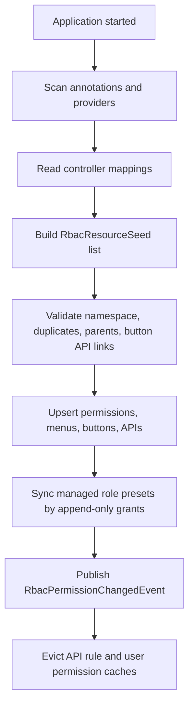

# RBAC Resource Synchronization Design

## Background

当前 RBAC 权限模型已经把菜单、按钮、接口统一放在 `sys_permission` 中，并通过
`sys_menu`、`sys_button`、`sys_api`、`sys_button_api` 保存不同类型资源的细节。
前端角色授权页面也已经按统一权限列表维护角色权限，并支持在选择按钮权限时同步按钮
关联的 API 权限。

目前的问题是资源数据主要依赖手工维护或模块自己的 bootstrap：

- RBAC 核心 bootstrap 只维护管理员、超级管理员角色和少量通配 API 权限。
- RAG 模块有自己的 `RagRbacBootstrap` 和静态 catalog，会写入 RAG 菜单、按钮、API。
- RBAC 管理台自己的菜单、按钮、接口权限没有完整后端 catalog。
- 如果后续功能和项目越来越多，中心 RBAC 无法手工知道所有业务模块的菜单、按钮和接口。
- 如果让业务模块直接引入并调用现有 bootstrap，容易扩大写库权限，带来安全风险。

本方案的目标是把资源发现和资源入库做成 RBAC 核心能力，让业务模块只声明资源，不直接写
RBAC 权限表。

## Goals

- 菜单、按钮、接口权限可以由代码声明并自动同步到 DB。
- 业务模块不直接调用 RBAC bootstrap，不直接写 RBAC 权限表。
- 系统声明的资源字段可以自动更新，避免后台手工维护。
- 角色授权仍然由管理员显式维护，避免启动时悄悄改变普通角色权限。
- 系统预设角色可以在受控范围内追加缺失权限。
- 支持单体多模块和多项目/多服务场景。
- 多项目上报资源时必须有 namespace 和服务身份校验，避免越权写入其他项目权限。

## Non-Goals

- 不在第一阶段自动删除已经不存在的权限资源。
- 不让业务模块声明或覆盖 `SUPER_ADMIN`。
- 不让普通角色被启动同步自动追加或删除权限。
- 不把接口首次调用作为资源入库时机。
- 不要求前端成为资源真实来源；菜单和按钮声明仍以后端资源声明为准。

## Current Role Permission Flow

当前前端角色授权流程可以保留：

1. 前端调用 `/api/admin/permissions` 获取统一权限列表。
2. 角色授权抽屉展示 `MENU`、`BUTTON`、`API` 三类权限。
3. 用户勾选权限后调用 `/api/admin/roles/{id}/permissions` 保存。
4. 保存时可带 `syncButtonApis`，由后端把按钮关联 API 一并补入角色权限。

新方案重点不是重做角色授权模型，而是让 `/api/admin/permissions` 背后的资源数据自动、
准确、可追踪地进入 DB。

## Design Overview

整体拆成五层：

1. 资源声明层：业务模块通过注解或 provider 声明菜单、按钮、接口。
2. 资源发现层：RBAC 核心扫描 Spring Bean、Controller mapping、provider 或远程 manifest。
3. 资源标准化层：所有来源转换成统一的 `RbacResourceSeed`。
4. 资源同步层：RBAC 核心唯一负责 upsert RBAC 权限表。
5. 角色预设层：系统预设角色可受控同步，但普通角色只由管理员维护。

推荐同步流程：



## Annotation Design

注解只描述资源，不负责写 DB。写 DB 只能由 RBAC 核心 synchronizer 完成。

### Module Marker

模块级标记用于声明资源所属应用和允许的权限码 namespace。

```java
@RbacResourceModule(
        appCode = "rag",
        name = "RAG",
        codePrefixes = {"menu:rag:", "btn:rag:", "api:rag:"}
)
```

字段含义：

- `appCode`：资源归属应用，例如 `rbac`、`rag`、`finance`。
- `name`：应用展示名称。
- `codePrefixes`：该模块允许声明的权限码前缀。

### Menu Annotation

```java
@RbacMenu(
        code = "menu:rag:documents",
        name = "文档管理",
        parent = "menu:rag",
        path = "/rag/documents",
        routeName = "rag-documents",
        icon = "FileTextOutlined",
        sort = 23
)
```

字段含义：

- `code`：菜单权限码。
- `name`：菜单名称。
- `parent`：父菜单权限码，可为空。
- `path`：前端路由路径。
- `routeName`：前端路由名。
- `icon`：前端图标名。
- `sort`：排序号。
- `hidden`：是否隐藏，默认 `false`。
- `cacheable`：是否缓存，默认 `true`。

### Button Annotation

```java
@RbacButton(
        code = "btn:rag:doc:upload",
        name = "上传文档",
        menu = "menu:rag:documents",
        action = "upload",
        apiCodes = {"api:rag:document:collection", "api:rag:document:*"},
        sort = 1
)
```

字段含义：

- `code`：按钮权限码。
- `name`：按钮名称。
- `menu`：所属菜单权限码。
- `action`：前端动作 key。
- `apiCodes`：按钮关联的 API 权限码。
- `sort`：排序号。
- `styleHint`：前端样式提示，可选。

### API Annotation

接口注解优先放在 Controller 方法上。

```java
@RbacApi(
        code = "api:rag:document:*",
        name = "RAG 文档管理",
        method = "ANY",
        pattern = "/api/rag/documents/**",
        matcher = ApiMatcherType.ANT,
        risk = ApiRiskLevel.HIGH
)
```

如果方法上已经有 `@GetMapping`、`@PostMapping`、`@RequestMapping`，可以允许省略
`method` 和 `pattern`，由 scanner 从 Spring mapping 中推导。

字段含义：

- `code`：API 权限码。
- `name`：API 权限名称。
- `method`：HTTP method，支持 `ANY`。
- `pattern`：URL pattern。
- `matcher`：匹配类型，例如 `EXACT`、`ANT`、`MVC`、`REGEX`。
- `risk`：风险等级。
- `publicFlag`：是否公开接口，默认 `false`。
- `serviceTag`：服务标识，默认使用模块 `appCode`。

### Aggregated Resource Definition

菜单和按钮不一定天然存在于 Controller 方法上，建议支持资源声明类：

```java
@RbacResourceModule(appCode = "rag", name = "RAG", codePrefixes = {"menu:rag:", "btn:rag:", "api:rag:"})
@RbacMenus({
        @RbacMenu(code = "menu:rag", name = "RAG 管理", path = "", routeName = "rag", sort = 20),
        @RbacMenu(code = "menu:rag:documents", name = "文档管理", parent = "menu:rag", path = "/rag/documents", routeName = "rag-documents", sort = 23)
})
@RbacButtons({
        @RbacButton(code = "btn:rag:doc:upload", name = "上传文档", menu = "menu:rag:documents", action = "upload", apiCodes = {"api:rag:document:*"}, sort = 1)
})
@Configuration
public class RagRbacResourceDefinition {
}
```

## Provider Design

除了注解，还应支持 Java provider。provider 适合复杂资源、批量生成资源、或者从配置构造资源。

```java
public interface RbacResourceProvider {

    String appCode();

    List<RbacResourceSeed> resources();

    default List<RbacRolePresetSeed> rolePresets() {
        return List.of();
    }
}
```

现有 `RagPermissionCatalog` 可以迁移成 `RagRbacResourceProvider`，不再由
`RagRbacBootstrap` 自己写 DB。

## Resource Seed Model

所有注解、provider、远程 manifest 最终转换成统一模型。

```java
public record RbacResourceSeed(
        String appCode,
        String serviceTag,
        String code,
        PermissionType type,
        String name,
        String parentCode,
        PermissionStatus status,
        int sortNo,
        String description,
        RbacMenuSeed menu,
        RbacButtonSeed button,
        RbacApiSeed api,
        List<String> buttonApiCodes,
        RbacResourceSource source
) {
}
```

细节模型：

```java
public record RbacMenuSeed(
        String routeName,
        String routePath,
        String component,
        String redirect,
        String icon,
        boolean hidden,
        boolean cacheable,
        String externalLink
) {
}

public record RbacButtonSeed(
        String buttonKey,
        String frontendAction,
        String styleHint
) {
}

public record RbacApiSeed(
        String httpMethod,
        String urlPattern,
        ApiMatcherType matcherType,
        boolean publicFlag,
        ApiRiskLevel riskLevel
) {
}
```

## Database Metadata

建议给 `sys_permission` 增加同步元数据，区分系统管理资源和人工资源。

```sql
ALTER TABLE sys_permission ADD COLUMN managed BOOLEAN NOT NULL DEFAULT FALSE;
ALTER TABLE sys_permission ADD COLUMN owner_app VARCHAR(64);
ALTER TABLE sys_permission ADD COLUMN source_type VARCHAR(32);
ALTER TABLE sys_permission ADD COLUMN source_key VARCHAR(256);
ALTER TABLE sys_permission ADD COLUMN sync_hash VARCHAR(64);
ALTER TABLE sys_permission ADD COLUMN last_synced_at TIMESTAMP WITH TIME ZONE;
ALTER TABLE sys_permission ADD COLUMN last_seen_at TIMESTAMP WITH TIME ZONE;
```

建议给 `sys_role` 增加类似元数据：

```sql
ALTER TABLE sys_role ADD COLUMN managed BOOLEAN NOT NULL DEFAULT FALSE;
ALTER TABLE sys_role ADD COLUMN owner_app VARCHAR(64);
ALTER TABLE sys_role ADD COLUMN source_type VARCHAR(32);
ALTER TABLE sys_role ADD COLUMN source_key VARCHAR(256);
ALTER TABLE sys_role ADD COLUMN sync_hash VARCHAR(64);
ALTER TABLE sys_role ADD COLUMN last_synced_at TIMESTAMP WITH TIME ZONE;
```

字段含义：

- `managed`：是否由 RBAC 资源同步器管理。
- `owner_app`：资源归属应用。
- `source_type`：来源类型，例如 `ANNOTATION`、`PROVIDER`、`REMOTE`、`MANUAL`。
- `source_key`：来源唯一键，通常是 `ownerApp + permCode`。
- `sync_hash`：声明内容 hash，用于判断是否有字段变化。
- `last_synced_at`：最近一次完成同步的时间。
- `last_seen_at`：最近一次扫描或上报看到该资源的时间。

## Synchronization Rules

### Resource Synchronization

推荐默认策略：`RESOURCE_FORCE_SYNC`。

规则：

- 如果权限码不存在，则创建 `sys_permission` 和对应细节表记录。
- 如果权限码存在且 `managed=true`，则覆盖系统声明字段。
- 如果权限码存在且 `managed=false`：
    - 若权限码前缀属于当前 app，可选择接管为 managed。
    - 若权限码前缀不属于当前 app，直接报错，避免跨模块覆盖。
- 不自动删除已经不再声明的权限。
- 对本轮未被扫描到但 DB 中 `managed=true` 的权限，只更新告警或健康检查结果。
- 删除策略通过配置控制，默认 `NONE`。

可选配置：

```yaml
mario:
  rbac:
    resource-sync:
      enabled: true
      mode: FORCE_SYNC
      missing-policy: NONE
      allowed-apps:
        - rbac
        - rag
```

`missing-policy`：

- `NONE`：不处理缺失资源，只记录日志，推荐默认。
- `DISABLE`：将缺失资源状态改为 `DISABLED`。
- `DELETE`：逻辑删除缺失资源，只允许开发或明确启用。

### Role Preset Synchronization

角色预设同步必须和资源同步分开。

规则：

- `FORCE_SYNC` 只能作用于 `managed=true` 的系统预设角色。
- 系统预设角色同步只追加缺失权限，不删除已有权限。
- 普通角色永远不被启动同步自动修改。
- 业务模块不能声明 `SUPER_ADMIN`。
- 业务模块不能声明 `api:rbac:admin:*` 这类核心 RBAC 管理权限。
- 远程上报的角色预设默认禁用，除非中心 RBAC 显式允许该 app 同步角色。

推荐配置：

```yaml
mario:
  rbac:
    role-presets:
      enabled: true
      sync-mode: CREATE_ONLY
      managed-only: true
      forbid-super-admin: true
```

如果需要自动补权限，可设置：

```yaml
mario:
  rbac:
    role-presets:
      sync-mode: FORCE_SYNC
```

该模式仍然只追加缺失权限，不删除任何已授权权限。

## Synchronizer Write Order

同步器必须按依赖顺序写库：

1. 校验所有 seed。
2. 同步 API 权限。
3. 同步菜单权限，父菜单先于子菜单。
4. 同步按钮权限。
5. 同步按钮和 API 绑定关系。
6. 同步系统预设角色。
7. bump 受影响角色的 permission version。
8. 发布 `RbacPermissionChangedEvent`。
9. 触发 API rule cache 和用户权限缓存失效。

## Validation Rules

同步前必须验证：

- `code` 全局唯一。
- `code` 必须匹配 `owner_app` 允许的前缀。
- 菜单 parent 必须存在于本次 seed 或 DB 中。
- 按钮所属 menu 必须存在且类型为 `MENU`。
- 按钮关联的 API 必须存在于本次 seed 或 DB 中，且类型为 `API`。
- API 的 `method + pattern + matcher` 不能和其他 API 权限冲突。
- `publicFlag=true` 的 API 必须通过 public API 白名单策略。
- 远程上报不能写核心 RBAC namespace。
- 系统预设角色不能声明 `SUPER_ADMIN`。

校验失败时应让应用启动失败或让本次同步失败，不能部分写入一半资源。

## Multi-Project Mode

多项目场景下，中心 RBAC 不可能扫描所有业务项目代码。推荐引入资源 manifest 上报机制。

业务服务启动时：

1. 扫描本服务注解和 provider。
2. 生成 `RbacResourceManifest`。
3. 调用中心 RBAC 内部接口上报。

```http
POST /internal/rbac/resource-sync
```

请求体结构：

```json
{
  "appCode": "rag",
  "serviceTag": "rag-service",
  "version": "2026.06.13",
  "resources": [],
  "rolePresets": []
}
```

中心 RBAC 校验：

- 服务身份可信。
- `appCode` 已登记。
- 上报资源全部落在允许前缀内。
- 不能声明核心 RBAC 权限。
- 不能声明 `SUPER_ADMIN`。
- 不能修改其他 app 的 managed 资源。

认证方式可选：

- mTLS。
- 内网服务 token。
- HMAC 签名。
- 网关注入服务身份。

第一阶段可以先不做远程上报，但本地 synchronizer 的模型要为 manifest 留好接口。

## Frontend Role Permission UX

当前角色授权 UI 可以继续使用。权限资源变多后建议增强：

- 按 `ownerApp/serviceTag` 分组。
- 菜单按树结构展示。
- 菜单下展示按钮。
- API 单独分组展示，并标注被哪些按钮关联。
- 支持按权限名、权限码、接口路径、按钮 action 搜索。
- 勾选按钮时，默认勾选关联 API。
- 显示系统 managed 标识，区分系统资源和人工资源。
- 预设角色页面显示缺失权限，提供一键补齐。

这些是 UI 增强，不影响第一阶段后端同步方案。

## Relationship With Existing Bootstrap

### RbacAdminBootstrap

保留最小职责：

- 创建本地管理员用户。
- 创建 `SUPER_ADMIN`。
- 创建核心 RBAC 管理 API 权限。
- 授权超级管理员。

不允许业务模块引入或调用该 bootstrap。

### RbacRolePresetBootstrap

保留角色预设同步职责，但改造成只消费统一 role preset seed。

策略：

- 默认 `CREATE_ONLY`。
- `FORCE_SYNC` 只处理 `managed=true` 的系统预设角色。
- 只追加缺失权限，不删除已有权限。

### RagRbacBootstrap

建议迁移：

- `RagPermissionCatalog` 改为 `RagRbacResourceProvider`。
- 删除或停用 `RagRbacBootstrap` 直接写库逻辑。
- RAG 权限资源由统一 `RbacResourceSynchronizer` 写入。

## Security Boundaries

必须坚持这些边界：

- 业务模块只能声明资源，不能写 RBAC 表。
- 资源同步器是唯一 DB 写入口。
- 远程 app 只能写自己的 namespace。
- 普通角色不会被资源同步自动修改。
- 系统预设角色同步只追加权限。
- `SUPER_ADMIN` 和核心 RBAC 权限只能由 RBAC 核心维护。
- public API 必须受白名单约束。
- 删除权限默认需要人工确认。

## Recommended Implementation Phases

### Phase 1: Local Resource Synchronization

- 新增资源注解。
- 新增 `RbacResourceSeed` 模型。
- 新增 `RbacResourceProvider`。
- 新增 `RbacResourceSynchronizer`。
- 增加 DB 同步元数据字段。
- 将 RBAC 管理台自己的菜单、按钮、API 接入自动同步。
- 补充单元测试和启动集成测试。

### Phase 2: Migrate Existing RAG Bootstrap

- 将 `RagPermissionCatalog` 迁移为 provider。
- 停用 `RagRbacBootstrap` 直接写库。
- 保持 RAG 现有权限码不变。
- 验证 RAG 菜单、按钮、API、按钮-API 关系同步结果一致。

### Phase 3: Role Preset Hardening

- 给角色增加 managed 元数据。
- 改造角色预设同步为 managed-only。
- 确保 `FORCE_SYNC` 只追加系统预设角色缺失权限。
- 增加禁止声明 `SUPER_ADMIN` 的测试。

### Phase 4: Frontend Permission Management Enhancements

- 角色授权按应用和资源类型分组。
- 增加权限搜索。
- 展示 managed/manual 标识。
- 展示按钮关联 API。

### Phase 5: Multi-Project Manifest Sync

- 定义 `RbacResourceManifest`。
- 新增中心 RBAC 内部同步接口。
- 新增 app allowlist 和 namespace 校验。
- 增加服务认证。
- 支持远程服务启动上报资源。

## Testing Plan

后端测试：

- 注解扫描可以发现 Controller 方法上的 API 权限。
- provider 可以提供菜单、按钮、API 资源。
- 同步器可以创建新资源。
- 同步器可以更新 managed 资源字段。
- 同步器不会覆盖其他 app 的资源。
- 同步器不会删除缺失资源。
- 按钮 API 关系可以同步新增和更新。
- public API 不在白名单时拒绝同步。
- 角色 `FORCE_SYNC` 只追加 managed 预设角色权限。
- 普通角色不被同步修改。
- `SUPER_ADMIN` 不能由业务模块声明。

前端测试：

- 角色授权可以看到自动同步的新菜单、按钮、API。
- 勾选按钮并启用 `syncButtonApis` 后，关联 API 自动加入角色权限。
- 权限列表能区分 managed 和 manual 资源。

集成测试：

- 启动应用后，RBAC 管理台资源自动进入 DB。
- RAG 资源迁移到 provider 后同步结果和旧 bootstrap 一致。
- 权限变更事件发布后 API rule cache 刷新。

## Final Recommendation

推荐最终规则：

- 系统声明的菜单、按钮、接口资源启动时自动强制同步字段到 DB。
- 角色授权只对系统预设角色追加缺失权限，普通角色完全由管理员维护。
- 业务模块只能通过注解、provider 或 manifest 声明资源，不能直接调用 RBAC bootstrap。
- 多项目场景下，业务服务只能上报自己 namespace 下的资源。
- 权限删除默认不自动执行，只记录缺失或由管理员显式禁用。

