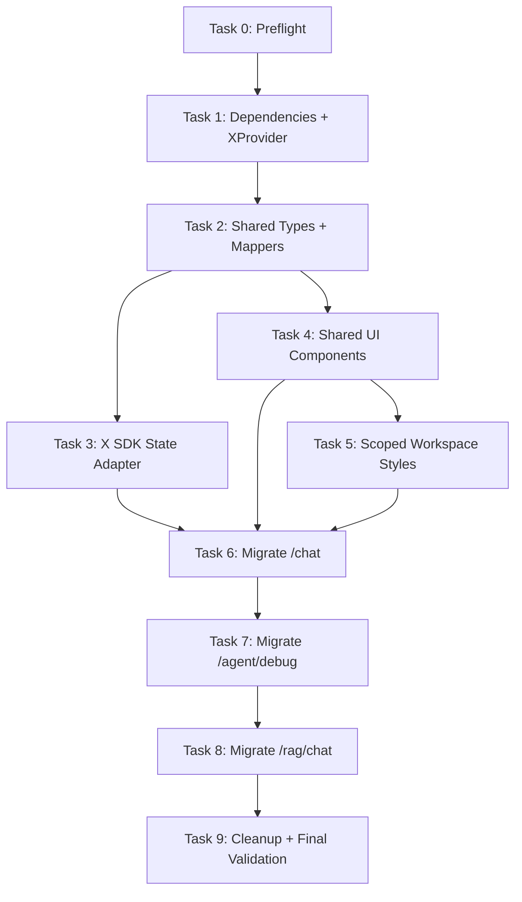

# Chat Workspace X Implementation Plan

> **For agentic workers:** REQUIRED SUB-SKILL: Use superpowers:subagent-driven-development (recommended) or superpowers:executing-plans to implement this plan task-by-task. Steps use checkbox (`- [ ]`) syntax for tracking.

**Goal:** Turn `/chat`, `/agent/debug`, and `/rag/chat` into a shared embedded chat workspace inside the existing admin layout, using `@ant-design/x` and `@ant-design/x-sdk`.

**Architecture:** Keep `AdminLayout` unchanged. Add one shared `fe/src/components/chat-workspace` module for reusable chat UI, message/session mapping, and X SDK stream state, then migrate the three route pages one by one. Each migrated page owns only its business data and passes props into the shared workspace.

**Execution rule:** after Task 6 starts, `/chat`, `/agent/debug`, and `/rag/chat` must read and mutate chat messages through `useXChatWorkspace`. The existing page-level `useState(messages)` arrays must be removed from migrated pages. Existing backend stream service functions stay in the route pages and are called from the `useXChatWorkspace.onRequest` callback because these streams already exist and do not use OpenAI-compatible provider URLs.

**Tech Stack:** React 19, TypeScript 6, Vite 8, Bun, Ant Design 6.4.4, `@ant-design/x@^2.8.0`, `@ant-design/x-sdk@^2.8.0`, Vitest, `react-markdown`, `remark-gfm`.

---

## Task Graph



## Task Summary

| Task | Owner Scope | Depends On | Main Output | Validation |
| --- | --- | --- | --- | --- |
| 0 | Read-only preflight | none | Confirm repo state, docs, package manager, X APIs | `git status`, package/type inspection |
| 1 | Dependency/provider setup | 0 | `@ant-design/x`, `@ant-design/x-sdk`, root `XProvider` | `bun run typecheck` |
| 2 | Shared data model | 1 | Workspace types, mapping helpers, unit tests | mapper Vitest |
| 3 | X SDK state adapter | 2 | `useXChatWorkspace` message adapter used by migrated pages, unit tests | adapter Vitest + typecheck |
| 4 | Shared UI components | 2 | Sidebar/header/message/sender/settings/source/action components | typecheck |
| 5 | Scoped styles | 4 | `.chat-workspace-x` layout styles | `git diff --check` |
| 6 | `/chat` migration | 3, 4, 5 | Agent Chat uses shared workspace | chat tests + typecheck |
| 7 | `/agent/debug` migration | 6 | Agent Debug uses shared workspace, settings modal keeps preset form | agent tests + typecheck |
| 8 | `/rag/chat` migration | 7 | RAG Chat uses shared workspace, keeps sources/feedback | rag tests + typecheck |
| 9 | Cleanup/final verification | 8 | Remove old duplicated chat UI usage and validate | lint, test, build |

## File Ownership

Create:

- `fe/src/components/chat-workspace/chatWorkspaceTypes.ts`: shared workspace types.
- `fe/src/components/chat-workspace/chatWorkspaceMappers.ts`: pure mapping helpers.
- `fe/src/components/chat-workspace/chatWorkspaceMappers.test.ts`: mapper tests.
- `fe/src/components/chat-workspace/useXChatWorkspace.ts`: X SDK wrapper and exported stream helpers.
- `fe/src/components/chat-workspace/useXChatWorkspace.test.ts`: adapter helper tests.
- `fe/src/components/chat-workspace/ChatWorkspace.tsx`: shell composition.
- `fe/src/components/chat-workspace/ChatConversationSidebar.tsx`: `Conversations` wrapper.
- `fe/src/components/chat-workspace/ChatWorkspaceHeader.tsx`: title/status/actions.
- `fe/src/components/chat-workspace/ChatMessageList.tsx`: `Bubble.List` wrapper.
- `fe/src/components/chat-workspace/ChatSender.tsx`: `Sender` wrapper.
- `fe/src/components/chat-workspace/ChatSettingsModal.tsx`: shared settings modal.
- `fe/src/components/chat-workspace/ChatSourcesPanel.tsx`: `Sources` wrapper.
- `fe/src/components/chat-workspace/ChatThinkingBlock.tsx`: `Think` wrapper.
- `fe/src/components/chat-workspace/ChatMessageActions.tsx`: `Actions` wrapper.
- `fe/src/components/chat-workspace/index.ts`: shared exports.

Modify:

- `fe/package.json`
- `fe/bun.lock`
- `fe/src/app/providers.tsx`
- `fe/src/styles/global.css`
- `fe/src/modules/chat/pages/ChatPage.tsx`
- `fe/src/modules/agent/AgentDebugPage.tsx`
- `fe/src/modules/rag/RagChatPage.tsx`

Do not modify:

- `fe/src/layouts/AdminLayout/**`
- backend files under `be/**`
- Flyway migration files under `be/src/main/resources/db/**`

---

### Task 0: Preflight And API Confirmation

**Files:**
- Read: `docs/superpowers/specs/2026-06-18-chat-workspace-x-design.md`
- Read: `fe/package.json`
- Read: `fe/src/app/providers.tsx`
- Read: `fe/src/modules/chat/pages/ChatPage.tsx`
- Read: `fe/src/modules/agent/AgentDebugPage.tsx`
- Read: `fe/src/modules/rag/RagChatPage.tsx`

- [ ] **Step 1: Confirm clean task baseline**

Run:

```bash
git status --short
```

Expected: Only user-owned unrelated files may appear. Do not touch unrelated paths.

- [ ] **Step 2: Confirm package manager and current versions**

Run:

```bash
cd fe
test -f bun.lock && node -e "const p=require('./package.json'); console.log({antd:p.dependencies.antd, react:p.dependencies.react, reactDom:p.dependencies['react-dom']})"
```

Expected output includes `antd: '^6.4.4'`, `react: '^19.2.6'`, and `reactDom: '^19.2.6'`.

- [ ] **Step 3: Confirm current provider location**

Run:

```bash
sed -n '1,120p' fe/src/app/providers.tsx
```

Expected: `ConfigProvider` and antd `App` are both configured in this file.

- [ ] **Step 4: Confirm route page boundaries**

Run:

```bash
rg -n "function ChatPage|function AgentDebugPage|function RagChatPage" fe/src/modules
```

Expected:

```text
fe/src/modules/chat/pages/ChatPage.tsx
fe/src/modules/agent/AgentDebugPage.tsx
fe/src/modules/rag/RagChatPage.tsx
```

- [ ] **Step 5: Commit**

No commit for this read-only task.

---

### Task 1: Install Ant Design X And Add Root Provider

**Files:**
- Modify: `fe/package.json`
- Modify: `fe/bun.lock`
- Modify: `fe/src/app/providers.tsx`

- [ ] **Step 1: Install dependencies**

Run:

```bash
cd fe
bun add @ant-design/x@^2.8.0 @ant-design/x-sdk@^2.8.0
```

Expected: `fe/package.json` and `fe/bun.lock` change. No peer dependency conflict appears.

- [ ] **Step 2: Confirm installed X provider API**

Run:

```bash
cd fe
sed -n '1,160p' node_modules/@ant-design/x/es/x-provider/context.d.ts
sed -n '1,60p' node_modules/@ant-design/x/es/locale/zh_CN.d.ts
```

Expected: `XProviderProps` supports `theme` and `locale`.

- [ ] **Step 3: Modify provider imports**

In `fe/src/app/providers.tsx`, add:

```tsx
import {XProvider} from '@ant-design/x'
import zhCNX from '@ant-design/x/locale/zh_CN'
```

- [ ] **Step 4: Share the existing theme object between `ConfigProvider` and `XProvider`**

Change `AppProviders` to:

```tsx
export function AppProviders({children}: AppProvidersProps) {
    const theme = {
        token: {
            borderRadius: 8,
            colorBgContainer: '#ffffff',
            colorBgElevated: '#ffffff',
            colorBgLayout: '#eef7f3',
            colorBorder: '#c8ddd6',
            colorError: '#de496c',
            colorInfo: '#2574d8',
            colorPrimary: '#0f766e',
            colorSuccess: '#16a06f',
            colorText: '#163032',
            colorTextSecondary: '#607477',
            colorWarning: '#d9822b',
            controlHeight: 36,
            fontFamily: "Inter, ui-sans-serif, system-ui, -apple-system, BlinkMacSystemFont, 'Segoe UI', sans-serif",
        },
    }

    return (
        <ConfigProvider locale={zhCN} theme={theme}>
            <XProvider locale={zhCNX} theme={theme}>
                <App>
                    <AsyncErrorReporter>
                        <AuthProvider>{children}</AuthProvider>
                    </AsyncErrorReporter>
                </App>
            </XProvider>
        </ConfigProvider>
    )
}
```

- [ ] **Step 5: Validate provider setup**

Run:

```bash
cd fe
bun run typecheck
```

Expected: PASS.

- [ ] **Step 6: Commit**

```bash
git add fe/package.json fe/bun.lock fe/src/app/providers.tsx
git commit -m "feat(chat): add ant design x provider"
```

---

### Task 2: Create Shared Workspace Types And Mapping Tests

**Files:**
- Create: `fe/src/components/chat-workspace/chatWorkspaceTypes.ts`
- Create: `fe/src/components/chat-workspace/chatWorkspaceMappers.ts`
- Create: `fe/src/components/chat-workspace/chatWorkspaceMappers.test.ts`

- [ ] **Step 1: Write failing mapper tests**

Create `fe/src/components/chat-workspace/chatWorkspaceMappers.test.ts`:

```ts
import {describe, expect, test} from 'vitest'
import {
    applyAgentChunkToMessage,
    applyRagEventToMessage,
    mapSessionToConversation,
    mapWorkspaceMessageToBubbleItem,
} from './chatWorkspaceMappers'
import type {ChatWorkspaceMessage} from './chatWorkspaceTypes'
import type {AgentMemorySessionResponse} from '../../modules/agent/agentTypes'
import type {RagStreamEvent} from '../../modules/rag/ragTypes'

describe('chatWorkspaceMappers', () => {
    test('maps memory session to conversation entry', () => {
        const session: AgentMemorySessionResponse = {
            sessionId: 'session-1234567890',
            entryType: 'AGENT_CHAT',
            status: 'ACTIVE',
            memoryEnabled: true,
            longTermExtractionEnabled: true,
            shortTermWindowTurns: 10,
            title: 'Planning chat',
            updatedAt: '2026-06-18T08:00:00Z',
        }

        expect(mapSessionToConversation(session)).toEqual({
            key: 'session-1234567890',
            label: 'Planning chat',
            description: 'AGENT_CHAT',
            group: 'ACTIVE',
            updatedAt: '2026-06-18T08:00:00Z',
            session,
        })
    })

    test('falls back to short session id when title is missing', () => {
        const session: AgentMemorySessionResponse = {
            sessionId: 'abcdef1234567890',
            entryType: 'RAG_CHAT',
            status: 'ACTIVE',
            memoryEnabled: true,
            longTermExtractionEnabled: false,
            shortTermWindowTurns: 10,
        }

        expect(mapSessionToConversation(session).label).toBe('abcdef12')
    })

    test('maps assistant message to ai bubble item', () => {
        const message: ChatWorkspaceMessage = {
            id: 'assistant-1',
            role: 'assistant',
            content: 'Hello',
            status: 'updating',
            thinkContent: 'Thinking',
        }

        const item = mapWorkspaceMessageToBubbleItem(message)

        expect(item.key).toBe('assistant-1')
        expect(item.role).toBe('ai')
        expect(item.content).toBe('Hello')
        expect(item.status).toBe('updating')
        expect(item.extraInfo).toEqual({workspaceMessage: message})
    })

    test('keeps thinking chunks separate from answer content', () => {
        const message: ChatWorkspaceMessage = {
            id: 'assistant-1',
            role: 'assistant',
            content: '',
            status: 'loading',
        }

        const updated = applyAgentChunkToMessage(message, {
            threadId: 'thread-1',
            type: 'think',
            message: '分析问题',
        })

        expect(updated.content).toBe('')
        expect(updated.thinkContent).toBe('分析问题')
        expect(updated.status).toBe('updating')
    })

    test('applies RAG retrieval and delta events', () => {
        const message: ChatWorkspaceMessage = {
            id: 'assistant-1',
            role: 'assistant',
            content: '',
            status: 'loading',
        }
        const retrievalEvent: RagStreamEvent = {
            type: 'retrieval',
            data: {
                topK: 1,
                sources: [{
                    sourceId: 'source-1',
                    knowledgeBaseId: 1,
                    knowledgeBaseName: 'KB',
                    documentId: 2,
                    documentName: 'Doc',
                    chunkId: 3,
                    chunkIndex: 4,
                    score: 0.9,
                    content: 'Source content',
                    metadata: {},
                }],
            },
        }
        const deltaEvent: RagStreamEvent = {
            type: 'delta',
            data: {content: 'Answer'},
        }

        const withSources = applyRagEventToMessage(message, retrievalEvent)
        const withContent = applyRagEventToMessage(withSources, deltaEvent)

        expect(withContent.sources).toHaveLength(1)
        expect(withContent.content).toBe('Answer')
        expect(withContent.status).toBe('updating')
    })
})
```

- [ ] **Step 2: Run failing mapper tests**

Run:

```bash
cd fe
bun test src/components/chat-workspace/chatWorkspaceMappers.test.ts
```

Expected: FAIL because implementation files do not exist.

- [ ] **Step 3: Add shared types**

Create `fe/src/components/chat-workspace/chatWorkspaceTypes.ts`:

```ts
import type {ReactNode} from 'react'
import type {BubbleItemType} from '@ant-design/x'
import type {MessageInfo, MessageStatus} from '@ant-design/x-sdk'
import type {AgentMemoryEntryType, AgentMemorySessionResponse} from '../../modules/agent/agentTypes'
import type {ChatResponse} from '../../modules/chat/chatTypes'
import type {RagStreamEvent, SourceReferenceResponse} from '../../modules/rag/ragTypes'

export type ChatWorkspaceRole = 'assistant' | 'user' | 'system'

export type ChatWorkspaceStatus = MessageStatus

export type ChatWorkspaceConversation = {
    key: string
    label: ReactNode
    description?: ReactNode
    group?: string
    updatedAt?: string
    session?: AgentMemorySessionResponse
}

export type ChatWorkspaceMessage = {
    [key: string]: unknown
    id: string
    role: ChatWorkspaceRole
    content: string
    status: ChatWorkspaceStatus
    thinkContent?: string
    sources?: SourceReferenceResponse[]
    traceId?: string
    messageId?: string
    question?: string
    error?: string
}

export type ChatWorkspaceRequest = {
    message: string
    conversationKey?: string
    entryType: AgentMemoryEntryType
    extra?: Record<string, unknown>
}

export type ChatWorkspaceStreamEvent =
    | {kind: 'agent'; chunk: ChatResponse}
    | {kind: 'rag'; event: RagStreamEvent}
    | {kind: 'error'; message: string}
    | {kind: 'done'}
    | {kind: 'aborted'}

export type ChatWorkspaceMessageInfo = MessageInfo<ChatWorkspaceMessage>

export type ChatWorkspaceBubbleItem = BubbleItemType
```

- [ ] **Step 4: Add mapper implementation**

Create `fe/src/components/chat-workspace/chatWorkspaceMappers.ts`:

```ts
import type {BubbleItemType} from '@ant-design/x'
import type {AgentMemorySessionResponse} from '../../modules/agent/agentTypes'
import {appendChatChunk} from '../../modules/chat/chatMessageStream'
import type {ChatMessage, ChatResponse} from '../../modules/chat/chatTypes'
import type {RagStreamEvent} from '../../modules/rag/ragTypes'
import type {ChatWorkspaceConversation, ChatWorkspaceMessage} from './chatWorkspaceTypes'

export function mapSessionToConversation(session: AgentMemorySessionResponse): ChatWorkspaceConversation {
    return {
        key: session.sessionId,
        label: session.title || session.sessionId.slice(0, 8),
        description: session.entryType,
        group: session.status,
        updatedAt: session.updatedAt || session.lastActiveAt,
        session,
    }
}

export function mapWorkspaceMessageToBubbleItem(message: ChatWorkspaceMessage): BubbleItemType {
    return {
        key: message.id,
        role: message.role === 'assistant' ? 'ai' : message.role,
        content: message.content,
        status: message.status,
        extraInfo: {workspaceMessage: message},
    }
}

export function applyAgentChunkToMessage(
    message: ChatWorkspaceMessage,
    chunk: ChatResponse,
): ChatWorkspaceMessage {
    const chatMessage: ChatMessage = {
        id: message.id,
        role: message.role === 'user' ? 'user' : 'assistant',
        content: message.content,
        thinkContent: message.thinkContent,
    }
    const next = appendChatChunk(chatMessage, chunk)
    return {
        ...message,
        content: next.content,
        thinkContent: next.thinkContent,
        status: chunk.type === 'error' ? 'error' : 'updating',
        error: chunk.type === 'error' ? chunk.message : message.error,
    }
}

export function applyRagEventToMessage(
    message: ChatWorkspaceMessage,
    event: RagStreamEvent,
): ChatWorkspaceMessage {
    if (event.type === 'metadata') {
        return {
            ...message,
            messageId: event.data.messageId,
            traceId: event.data.traceId,
        }
    }
    if (event.type === 'retrieval') {
        return {
            ...message,
            sources: event.data.sources,
            status: 'updating',
        }
    }
    if (event.type === 'delta') {
        return {
            ...message,
            content: `${message.content}${event.data.content}`,
            status: 'updating',
        }
    }
    if (event.type === 'error') {
        return {
            ...message,
            content: event.data.message,
            traceId: event.data.traceId || message.traceId,
            status: 'error',
            error: event.data.message,
        }
    }
    return {
        ...message,
        status: 'success',
    }
}
```

- [ ] **Step 5: Run mapper tests**

Run:

```bash
cd fe
bun test src/components/chat-workspace/chatWorkspaceMappers.test.ts
```

Expected: PASS.

- [ ] **Step 6: Commit**

```bash
git add fe/src/components/chat-workspace/chatWorkspaceTypes.ts \
  fe/src/components/chat-workspace/chatWorkspaceMappers.ts \
  fe/src/components/chat-workspace/chatWorkspaceMappers.test.ts
git commit -m "feat(chat): add workspace mapping model"
```

---

### Task 3: Create X SDK Workspace State Adapter

**Files:**
- Create: `fe/src/components/chat-workspace/useXChatWorkspace.ts`
- Create: `fe/src/components/chat-workspace/useXChatWorkspace.test.ts`

- [ ] **Step 1: Write failing adapter helper tests**

Create `fe/src/components/chat-workspace/useXChatWorkspace.test.ts`:

```ts
import {describe, expect, test} from 'vitest'
import {
    createAssistantPlaceholder,
    markMessageAborted,
    markMessageSucceeded,
    toMessageInfo,
    updateAssistantMessage,
} from './useXChatWorkspace'
import type {ChatWorkspaceMessage} from './chatWorkspaceTypes'

describe('useXChatWorkspace helpers', () => {
    test('creates assistant placeholder with loading status', () => {
        expect(createAssistantPlaceholder('assistant-1', 'question')).toEqual({
            id: 'assistant-1',
            role: 'assistant',
            content: '',
            question: 'question',
            status: 'loading',
        })
    })

    test('converts workspace messages to x sdk message info', () => {
        const message: ChatWorkspaceMessage = {
            id: 'assistant-1',
            role: 'assistant',
            content: 'hello',
            status: 'success',
        }

        expect(toMessageInfo(message)).toEqual({
            id: 'assistant-1',
            message,
            status: 'success',
        })
    })

    test('updates only the target assistant message', () => {
        const messages: ChatWorkspaceMessage[] = [
            {id: 'assistant-1', role: 'assistant', content: '', status: 'loading'},
            {id: 'assistant-2', role: 'assistant', content: 'keep', status: 'success'},
        ]

        const next = updateAssistantMessage(messages, 'assistant-1', (message) => ({
            ...message,
            content: 'changed',
            status: 'updating',
        }))

        expect(next[0].content).toBe('changed')
        expect(next[1].content).toBe('keep')
    })

    test('marks empty aborted assistant messages with stopped text', () => {
        const message: ChatWorkspaceMessage = {
            id: 'assistant-1',
            role: 'assistant',
            content: '',
            status: 'loading',
        }

        expect(markMessageAborted(message)).toEqual({
            ...message,
            content: 'Stopped.',
            status: 'abort',
        })
    })

    test('marks updating messages as success', () => {
        const message: ChatWorkspaceMessage = {
            id: 'assistant-1',
            role: 'assistant',
            content: 'done',
            status: 'updating',
        }

        expect(markMessageSucceeded(message).status).toBe('success')
    })
})
```

- [ ] **Step 2: Run failing adapter tests**

Run:

```bash
cd fe
bun test src/components/chat-workspace/useXChatWorkspace.test.ts
```

Expected: FAIL because the adapter file does not exist.

- [ ] **Step 3: Add adapter implementation**

Create `fe/src/components/chat-workspace/useXChatWorkspace.ts`. The hook must use `useXChat` as the shared message store, but it must not call `chat.onRequest()` or `chat.abort()` without an SDK provider. Existing backend stream functions remain in route pages and are invoked through `options.onRequest`.

```ts
import {useCallback, useMemo, useState} from 'react'
import {useXChat} from '@ant-design/x-sdk'
import type {MessageInfo} from '@ant-design/x-sdk'
import type {ChatWorkspaceMessage, ChatWorkspaceRequest} from './chatWorkspaceTypes'

export function toMessageInfo(message: ChatWorkspaceMessage): MessageInfo<ChatWorkspaceMessage> {
    return {
        id: message.id,
        message,
        status: message.status,
    }
}

export function createAssistantPlaceholder(id: string, question?: string): ChatWorkspaceMessage {
    return {
        id,
        role: 'assistant',
        content: '',
        question,
        status: 'loading',
    }
}

export function updateAssistantMessage(
    messages: ChatWorkspaceMessage[],
    assistantId: string,
    updater: (message: ChatWorkspaceMessage) => ChatWorkspaceMessage,
): ChatWorkspaceMessage[] {
    return messages.map((message) => message.id === assistantId ? updater(message) : message)
}

export function markMessageAborted(message: ChatWorkspaceMessage): ChatWorkspaceMessage {
    return {
        ...message,
        content: message.content || 'Stopped.',
        status: 'abort',
    }
}

export function markMessageSucceeded(message: ChatWorkspaceMessage): ChatWorkspaceMessage {
    return {
        ...message,
        status: message.status === 'error' || message.status === 'abort' ? message.status : 'success',
    }
}

type UseXChatWorkspaceOptions = {
    conversationKey?: string
    defaultMessages: ChatWorkspaceMessage[]
    onRequest: (request: ChatWorkspaceRequest, assistantId: string) => Promise<void>
    onAbort: () => void
}

export function useXChatWorkspace(options: UseXChatWorkspaceOptions) {
    const [isRequesting, setIsRequesting] = useState(false)
    const defaultMessages = useMemo(
        () => options.defaultMessages.map(toMessageInfo),
        [options.defaultMessages],
    )

    const chat = useXChat<ChatWorkspaceMessage, ChatWorkspaceMessage, ChatWorkspaceRequest>({
        conversationKey: options.conversationKey || 'new-conversation',
        defaultMessages,
        parser: (message) => message,
    })

    const messages = useMemo(
        () => chat.messages.map((info) => ({...info.message, status: info.status})),
        [chat.messages],
    )

    const setMessages = useCallback((
        nextMessages: ChatWorkspaceMessage[] | ((messages: ChatWorkspaceMessage[]) => ChatWorkspaceMessage[]),
    ) => {
        chat.setMessages((current) => {
            const currentMessages = current.map((info) => info.message)
            const next = typeof nextMessages === 'function' ? nextMessages(currentMessages) : nextMessages
            return next.map(toMessageInfo)
        })
    }, [chat])

    const updateAssistant = useCallback((
        assistantId: string,
        updater: (message: ChatWorkspaceMessage) => ChatWorkspaceMessage,
    ) => {
        chat.setMessage(assistantId, (info) => {
            const message = updater(info.message)
            return {
                message,
                status: message.status,
            }
        })
    }, [chat])

    const request = useCallback((requestParams: ChatWorkspaceRequest) => {
        if (!requestParams.message.trim() || isRequesting) {
            return
        }
        const userId = crypto.randomUUID()
        const assistantId = crypto.randomUUID()
        chat.setMessages((current) => [
            ...current,
            toMessageInfo({
                id: userId,
                role: 'user',
                content: requestParams.message,
                status: 'local',
            }),
            toMessageInfo(createAssistantPlaceholder(assistantId, requestParams.message)),
        ])
        setIsRequesting(true)
        void options.onRequest(requestParams, assistantId).finally(() => setIsRequesting(false))
    }, [chat, isRequesting, options])

    const abort = useCallback(() => {
        options.onAbort()
        setIsRequesting(false)
    }, [options])

    return {
        ...chat,
        messages,
        setMessages,
        updateAssistantMessage: updateAssistant,
        request,
        abort,
        isRequesting,
    }
}
```

- [ ] **Step 4: Validate adapter**

Run:

```bash
cd fe
bun test src/components/chat-workspace/useXChatWorkspace.test.ts
bun run typecheck
```

Expected: both PASS.

- [ ] **Step 5: Commit**

```bash
git add fe/src/components/chat-workspace/useXChatWorkspace.ts \
  fe/src/components/chat-workspace/useXChatWorkspace.test.ts
git commit -m "feat(chat): add x chat workspace adapter"
```

---

### Task 4: Build Shared Chat Workspace UI Components

**Files:**
- Create: `fe/src/components/chat-workspace/ChatConversationSidebar.tsx`
- Create: `fe/src/components/chat-workspace/ChatWorkspaceHeader.tsx`
- Create: `fe/src/components/chat-workspace/ChatThinkingBlock.tsx`
- Create: `fe/src/components/chat-workspace/ChatSourcesPanel.tsx`
- Create: `fe/src/components/chat-workspace/ChatMessageActions.tsx`
- Create: `fe/src/components/chat-workspace/ChatMessageList.tsx`
- Create: `fe/src/components/chat-workspace/ChatSender.tsx`
- Create: `fe/src/components/chat-workspace/ChatSettingsModal.tsx`
- Create: `fe/src/components/chat-workspace/ChatWorkspace.tsx`
- Create: `fe/src/components/chat-workspace/index.ts`

- [ ] **Step 1: Inspect installed X component APIs**

Run:

```bash
cd fe
sed -n '1,160p' node_modules/@ant-design/x/es/conversations/index.d.ts
sed -n '1,180p' node_modules/@ant-design/x/es/bubble/interface.d.ts
sed -n '1,160p' node_modules/@ant-design/x/es/sender/interface.d.ts
sed -n '1,120p' node_modules/@ant-design/x/es/sources/Sources.d.ts
sed -n '1,100p' node_modules/@ant-design/x/es/think/Think.d.ts
```

Expected: the inspected props match the component usage in this task.

- [ ] **Step 2: Create sidebar component**

Create `fe/src/components/chat-workspace/ChatConversationSidebar.tsx`:

```tsx
import {InboxOutlined, PlusOutlined, ReloadOutlined} from '@ant-design/icons'
import {Button, Space, Typography} from 'antd'
import {Conversations} from '@ant-design/x'
import type {ChatWorkspaceConversation} from './chatWorkspaceTypes'

type ChatConversationSidebarProps = {
    brandTitle: string
    brandDescription?: string
    conversations: ChatWorkspaceConversation[]
    activeKey?: string
    loading?: boolean
    onActiveChange: (key: string) => void
    onNewConversation: () => void
    onReload?: () => void
    onArchive?: () => void
}

export function ChatConversationSidebar(props: ChatConversationSidebarProps) {
    return (
        <aside className="chat-workspace-x-sidebar">
            <div className="chat-workspace-x-brand">
                <span className="chat-workspace-x-logo">C</span>
                <div>
                    <Typography.Text strong>{props.brandTitle}</Typography.Text>
                    {props.brandDescription && (
                        <Typography.Text type="secondary">{props.brandDescription}</Typography.Text>
                    )}
                </div>
            </div>
            <Space className="chat-workspace-x-sidebar-actions" wrap>
                <Button icon={<PlusOutlined/>} onClick={props.onNewConversation}>New Chat</Button>
                {props.onReload && (
                    <Button aria-label="Refresh conversations" icon={<ReloadOutlined/>} loading={props.loading}
                            onClick={props.onReload}/>
                )}
                {props.onArchive && (
                    <Button disabled={!props.activeKey} icon={<InboxOutlined/>} onClick={props.onArchive}/>
                )}
            </Space>
            <Conversations
                activeKey={props.activeKey}
                className="chat-workspace-x-conversations"
                items={props.conversations.map((item) => ({
                    key: item.key,
                    label: item.label,
                    group: item.group,
                }))}
                onActiveChange={props.onActiveChange}
            />
        </aside>
    )
}
```

- [ ] **Step 3: Create header component**

Create `fe/src/components/chat-workspace/ChatWorkspaceHeader.tsx`:

```tsx
import {ReloadOutlined, SettingOutlined} from '@ant-design/icons'
import {Button, Space, Tag, Typography} from 'antd'
import type {ReactNode} from 'react'

type ChatWorkspaceHeaderProps = {
    title: string
    subtitle?: string
    messageCount: number
    status?: ReactNode
    actions?: ReactNode
    onReload?: () => void
    onOpenSettings?: () => void
}

export function ChatWorkspaceHeader(props: ChatWorkspaceHeaderProps) {
    return (
        <header className="chat-workspace-x-header">
            <div>
                <Typography.Title level={4}>{props.title}</Typography.Title>
                <Typography.Text type="secondary">
                    {props.subtitle || `${props.messageCount} messages`}
                </Typography.Text>
            </div>
            <Space wrap>
                {props.status || <Tag color="success">Ready</Tag>}
                {props.actions}
                {props.onReload && <Button icon={<ReloadOutlined/>} onClick={props.onReload}/>}
                {props.onOpenSettings && <Button icon={<SettingOutlined/>} onClick={props.onOpenSettings}/>}
            </Space>
        </header>
    )
}
```

- [ ] **Step 4: Create thinking and sources components**

Create `fe/src/components/chat-workspace/ChatThinkingBlock.tsx`:

```tsx
import {Think} from '@ant-design/x'
import ReactMarkdown from 'react-markdown'
import remarkGfm from 'remark-gfm'

const markdownPlugins = [remarkGfm]

type ChatThinkingBlockProps = {
    content?: string
    loading?: boolean
}

export function ChatThinkingBlock({content, loading}: ChatThinkingBlockProps) {
    if (!content) {
        return null
    }
    return (
        <Think defaultExpanded loading={loading} title={loading ? 'Thinking...' : '思考过程'}>
            <div className="chat-workspace-x-thinking-content">
                <ReactMarkdown remarkPlugins={markdownPlugins}>{content}</ReactMarkdown>
            </div>
        </Think>
    )
}
```

Create `fe/src/components/chat-workspace/ChatSourcesPanel.tsx`:

```tsx
import {Sources} from '@ant-design/x'
import type {SourceReferenceResponse} from '../../modules/rag/ragTypes'

type ChatSourcesPanelProps = {
    sources?: SourceReferenceResponse[]
    onSelect: (source: SourceReferenceResponse) => void
}

export function ChatSourcesPanel({sources = [], onSelect}: ChatSourcesPanelProps) {
    if (sources.length === 0) {
        return null
    }
    return (
        <Sources
            inline
            items={sources.map((source) => ({
                key: source.sourceId,
                title: source.documentName || `文档 ${source.documentId}`,
                description: `score=${source.score.toFixed(4)} chunk=${source.chunkIndex}`,
            }))}
            title={`引用来源（${sources.length}）`}
            onClick={(item) => {
                const source = sources.find((candidate) => candidate.sourceId === item.key)
                if (source) {
                    onSelect(source)
                }
            }}
        />
    )
}
```

- [ ] **Step 5: Create message action component**

Create `fe/src/components/chat-workspace/ChatMessageActions.tsx`:

```tsx
import {CopyOutlined, DislikeOutlined, LikeOutlined, ReloadOutlined, WarningOutlined} from '@ant-design/icons'
import {Actions} from '@ant-design/x'
import type {ReactNode} from 'react'
import type {ChatWorkspaceMessage} from './chatWorkspaceTypes'

type FeedbackType = 'HELPFUL' | 'NOT_HELPFUL' | 'BAD_SOURCE' | 'NO_ANSWER'

type ActionItem = {
    key: string
    icon: ReactNode
    label: string
}

type ChatMessageActionsProps = {
    message: ChatWorkspaceMessage
    canFeedback?: boolean
    onCopy?: (message: ChatWorkspaceMessage) => void
    onReload?: (message: ChatWorkspaceMessage) => void
    onFeedback?: (message: ChatWorkspaceMessage, type: FeedbackType) => void
}

export function ChatMessageActions(props: ChatMessageActionsProps) {
    const items: ActionItem[] = [
        ...(props.onCopy ? [{key: 'copy', icon: <CopyOutlined/>, label: '复制'}] : []),
        ...(props.onReload ? [{key: 'reload', icon: <ReloadOutlined/>, label: '重试'}] : []),
        ...(props.canFeedback ? [
            {key: 'helpful', icon: <LikeOutlined/>, label: '有帮助'},
            {key: 'not-helpful', icon: <DislikeOutlined/>, label: '没帮助'},
            {key: 'bad-source', icon: <WarningOutlined/>, label: '引用不准'},
        ] : []),
    ]

    if (items.length === 0) {
        return null
    }

    return (
        <Actions
            items={items}
            onClick={({key}) => {
                if (key === 'copy') props.onCopy?.(props.message)
                if (key === 'reload') props.onReload?.(props.message)
                if (key === 'helpful') props.onFeedback?.(props.message, 'HELPFUL')
                if (key === 'not-helpful') props.onFeedback?.(props.message, 'NOT_HELPFUL')
                if (key === 'bad-source') props.onFeedback?.(props.message, 'BAD_SOURCE')
            }}
        />
    )
}
```

- [ ] **Step 6: Create message list component**

Create `fe/src/components/chat-workspace/ChatMessageList.tsx`:

```tsx
import {Avatar, Typography} from 'antd'
import {Bubble} from '@ant-design/x'
import ReactMarkdown from 'react-markdown'
import remarkGfm from 'remark-gfm'
import type {SourceReferenceResponse} from '../../modules/rag/ragTypes'
import {mapWorkspaceMessageToBubbleItem} from './chatWorkspaceMappers'
import type {ChatWorkspaceMessage} from './chatWorkspaceTypes'
import {ChatMessageActions} from './ChatMessageActions'
import {ChatSourcesPanel} from './ChatSourcesPanel'
import {ChatThinkingBlock} from './ChatThinkingBlock'

const markdownPlugins = [remarkGfm]

type FeedbackType = 'HELPFUL' | 'NOT_HELPFUL' | 'BAD_SOURCE' | 'NO_ANSWER'

type ChatMessageListProps = {
    messages: ChatWorkspaceMessage[]
    canFeedback?: boolean
    onSourceSelect: (source: SourceReferenceResponse) => void
    onFeedback?: (message: ChatWorkspaceMessage, type: FeedbackType) => void
}

export function ChatMessageList(props: ChatMessageListProps) {
    return (
        <Bubble.List
            autoScroll
            className="chat-workspace-x-message-list"
            items={props.messages.map(mapWorkspaceMessageToBubbleItem)}
            role={{
                ai: (item) => {
                    const message = item.extraInfo?.workspaceMessage as ChatWorkspaceMessage
                    const isLoading = message.status === 'loading' || message.status === 'updating'
                    return {
                        placement: 'start',
                        avatar: <Avatar>A</Avatar>,
                        loading: message.status === 'loading' && !message.content && !message.thinkContent,
                        contentRender: () => (
                            <div className="chat-workspace-x-message-content">
                                <ChatThinkingBlock content={message.thinkContent} loading={isLoading && !message.content}/>
                                {message.content ? (
                                    <ReactMarkdown remarkPlugins={markdownPlugins}>{message.content}</ReactMarkdown>
                                ) : isLoading ? (
                                    <Typography.Text type="secondary">正在生成...</Typography.Text>
                                ) : null}
                                <ChatSourcesPanel sources={message.sources} onSelect={props.onSourceSelect}/>
                            </div>
                        ),
                        extra: (
                            <ChatMessageActions
                                canFeedback={props.canFeedback && message.id !== 'welcome'}
                                message={message}
                                onFeedback={props.onFeedback}
                            />
                        ),
                    }
                },
                user: {
                    placement: 'end',
                    avatar: <Avatar>你</Avatar>,
                },
                system: {
                    variant: 'borderless',
                },
            }}
        />
    )
}
```

- [ ] **Step 7: Create sender, settings modal, shell, and exports**

Create `fe/src/components/chat-workspace/ChatSender.tsx`:

```tsx
import type {ReactNode} from 'react'
import {Sender} from '@ant-design/x'

type ChatSenderProps = {
    value: string
    loading?: boolean
    placeholder: string
    prefix?: ReactNode
    footer?: ReactNode
    onChange: (value: string) => void
    onSubmit: (value: string) => void
    onCancel: () => void
}

export function ChatSender(props: ChatSenderProps) {
    return (
        <Sender
            autoSize={{minRows: 2, maxRows: 6}}
            className="chat-workspace-x-sender"
            footer={props.footer}
            loading={props.loading}
            placeholder={props.placeholder}
            prefix={props.prefix}
            submitType="enter"
            value={props.value}
            onCancel={props.onCancel}
            onChange={props.onChange}
            onSubmit={(message) => {
                const text = message.trim()
                if (text) props.onSubmit(text)
            }}
        />
    )
}
```

Create `fe/src/components/chat-workspace/ChatSettingsModal.tsx`:

```tsx
import type {ReactNode} from 'react'
import {Modal} from 'antd'

type ChatSettingsModalProps = {
    title: string
    open: boolean
    children: ReactNode
    footer?: ReactNode
    onClose: () => void
}

export function ChatSettingsModal(props: ChatSettingsModalProps) {
    return (
        <Modal
            centered
            className="chat-workspace-x-settings"
            footer={props.footer}
            open={props.open}
            title={props.title}
            width={900}
            onCancel={props.onClose}
        >
            {props.children}
        </Modal>
    )
}
```

Create `fe/src/components/chat-workspace/ChatWorkspace.tsx`:

```tsx
import type {ReactNode} from 'react'
import type {SourceReferenceResponse} from '../../modules/rag/ragTypes'
import type {ChatWorkspaceConversation, ChatWorkspaceMessage} from './chatWorkspaceTypes'
import {ChatConversationSidebar} from './ChatConversationSidebar'
import {ChatMessageList} from './ChatMessageList'
import {ChatSender} from './ChatSender'
import {ChatWorkspaceHeader} from './ChatWorkspaceHeader'

type FeedbackType = 'HELPFUL' | 'NOT_HELPFUL' | 'BAD_SOURCE' | 'NO_ANSWER'

type ChatWorkspaceProps = {
    brandTitle: string
    brandDescription?: string
    title: string
    subtitle?: string
    conversations: ChatWorkspaceConversation[]
    activeConversationKey?: string
    messages: ChatWorkspaceMessage[]
    input: string
    sending?: boolean
    sidebarLoading?: boolean
    headerActions?: ReactNode
    senderPrefix?: ReactNode
    senderFooter?: ReactNode
    settings?: ReactNode
    canFeedback?: boolean
    onInputChange: (value: string) => void
    onSend: (message: string) => void
    onStop: () => void
    onConversationChange: (key: string) => void
    onNewConversation: () => void
    onReloadConversations?: () => void
    onArchiveConversation?: () => void
    onOpenSettings?: () => void
    onSourceSelect: (source: SourceReferenceResponse) => void
    onFeedback?: (message: ChatWorkspaceMessage, type: FeedbackType) => void
}

export function ChatWorkspace(props: ChatWorkspaceProps) {
    return (
        <section className="chat-workspace-x">
            <ChatConversationSidebar
                activeKey={props.activeConversationKey}
                brandDescription={props.brandDescription}
                brandTitle={props.brandTitle}
                conversations={props.conversations}
                loading={props.sidebarLoading}
                onActiveChange={props.onConversationChange}
                onArchive={props.onArchiveConversation}
                onNewConversation={props.onNewConversation}
                onReload={props.onReloadConversations}
            />
            <main className="chat-workspace-x-main">
                <ChatWorkspaceHeader
                    actions={props.headerActions}
                    messageCount={props.messages.length}
                    subtitle={props.subtitle}
                    title={props.title}
                    onOpenSettings={props.onOpenSettings}
                    onReload={props.onReloadConversations}
                />
                <div className="chat-workspace-x-scroll">
                    <ChatMessageList
                        canFeedback={props.canFeedback}
                        messages={props.messages}
                        onFeedback={props.onFeedback}
                        onSourceSelect={props.onSourceSelect}
                    />
                </div>
                <ChatSender
                    footer={props.senderFooter}
                    loading={props.sending}
                    placeholder="Enter to send, Shift + Enter to wrap"
                    prefix={props.senderPrefix}
                    value={props.input}
                    onCancel={props.onStop}
                    onChange={props.onInputChange}
                    onSubmit={props.onSend}
                />
                {props.settings}
            </main>
        </section>
    )
}
```

Create `fe/src/components/chat-workspace/index.ts`:

```ts
export * from './chatWorkspaceTypes'
export * from './chatWorkspaceMappers'
export * from './useXChatWorkspace'
export * from './ChatWorkspace'
export * from './ChatConversationSidebar'
export * from './ChatWorkspaceHeader'
export * from './ChatMessageList'
export * from './ChatSender'
export * from './ChatSettingsModal'
export * from './ChatSourcesPanel'
export * from './ChatThinkingBlock'
export * from './ChatMessageActions'
```

- [ ] **Step 8: Validate shared components**

Run:

```bash
cd fe
bun run typecheck
```

Expected: PASS.

- [ ] **Step 9: Commit**

```bash
git add fe/src/components/chat-workspace
git commit -m "feat(chat): add shared x workspace components"
```

---

### Task 5: Add Workspace Styling

**Files:**
- Modify: `fe/src/styles/global.css`

- [ ] **Step 1: Add scoped workspace CSS**

Append near the existing chat styles in `fe/src/styles/global.css`:

```css
.chat-workspace-x {
    min-height: calc(100svh - 104px);
    display: grid;
    grid-template-columns: minmax(260px, 300px) minmax(0, 1fr);
    overflow: hidden;
    border: 1px solid rgba(200, 205, 214, 0.9);
    border-radius: 8px;
    background: #ffffff;
    box-shadow: 0 18px 44px rgba(35, 44, 63, 0.12);
}

.chat-workspace-x-sidebar {
    min-width: 0;
    display: flex;
    flex-direction: column;
    gap: 18px;
    padding: 28px 20px;
    border-right: 1px solid #e1e4ea;
    background: #f4f5f8;
}

.chat-workspace-x-brand {
    display: flex;
    align-items: center;
    gap: 12px;
}

.chat-workspace-x-brand > div {
    min-width: 0;
    display: grid;
}

.chat-workspace-x-logo {
    width: 42px;
    height: 42px;
    display: inline-flex;
    align-items: center;
    justify-content: center;
    flex: 0 0 auto;
    border-radius: 50%;
    color: #ffffff;
    font-weight: 800;
    background: linear-gradient(135deg, #345dff, #1f8bff);
    box-shadow: 0 10px 24px rgba(52, 93, 255, 0.28);
}

.chat-workspace-x-sidebar-actions {
    width: 100%;
}

.chat-workspace-x-conversations {
    min-height: 0;
    flex: 1;
    overflow-y: auto;
}

.chat-workspace-x-main {
    min-width: 0;
    min-height: 0;
    display: grid;
    grid-template-rows: auto minmax(0, 1fr) auto;
    background: #ffffff;
}

.chat-workspace-x-header {
    min-height: 72px;
    display: flex;
    align-items: center;
    justify-content: space-between;
    gap: 16px;
    padding: 16px 20px;
    border-bottom: 1px solid #e6e8ee;
}

.chat-workspace-x-header h4.ant-typography {
    margin: 0 0 2px;
    font-size: 20px;
    line-height: 1.25;
}

.chat-workspace-x-scroll {
    min-height: 0;
    overflow-y: auto;
    padding: 20px;
    background: #ffffff;
}

.chat-workspace-x-message-content {
    max-width: min(760px, 100%);
    overflow-wrap: anywhere;
}

.chat-workspace-x-message-content p {
    margin: 0;
}

.chat-workspace-x-message-content p + p,
.chat-workspace-x-message-content ul,
.chat-workspace-x-message-content ol,
.chat-workspace-x-message-content pre,
.chat-workspace-x-message-content blockquote,
.chat-workspace-x-message-content table {
    margin-top: 10px;
}

.chat-workspace-x-message-content pre {
    max-width: 100%;
    overflow-x: auto;
    border-radius: 7px;
    padding: 12px;
    color: #ffffff;
    background: #111827;
}

.chat-workspace-x-thinking-content {
    font-size: 13px;
    line-height: 1.65;
}

.chat-workspace-x-sender {
    margin: 0 20px 20px;
    border-radius: 8px;
}

.chat-workspace-x-settings .ant-modal-content {
    border-radius: 8px;
}

@media (max-width: 960px) {
    .chat-workspace-x {
        grid-template-columns: 1fr;
    }

    .chat-workspace-x-sidebar {
        border-right: 0;
        border-bottom: 1px solid #e1e4ea;
    }
}
```

- [ ] **Step 2: Validate CSS diff**

Run:

```bash
git diff --check -- fe/src/styles/global.css
```

Expected: PASS.

- [ ] **Step 3: Commit**

```bash
git add fe/src/styles/global.css
git commit -m "style(chat): add workspace x layout styles"
```

---

### Task 6: Migrate `/chat`

**Files:**
- Modify: `fe/src/modules/chat/pages/ChatPage.tsx`
- Test: `fe/src/modules/chat/chatMessageStream.test.ts`

- [ ] **Step 1: Run baseline chat test**

Run:

```bash
cd fe
bun test src/modules/chat/chatMessageStream.test.ts
```

Expected: PASS.

- [ ] **Step 2: Replace chat page UI imports**

In `fe/src/modules/chat/pages/ChatPage.tsx`, replace the old UI imports with:

```tsx
import {App, Switch, Tag} from 'antd'
import {useEffect, useMemo, useRef, useState} from 'react'
import {
    applyAgentChunkToMessage,
    ChatSettingsModal,
    ChatWorkspace,
    markMessageAborted,
    useXChatWorkspace,
} from '../../../components/chat-workspace'
import type {ChatWorkspaceConversation, ChatWorkspaceMessage, ChatWorkspaceRequest} from '../../../components/chat-workspace'
```

Keep existing service imports:

```tsx
import {resolveErrorMessage} from '../../../services/request'
import {
    archiveAgentMemorySession,
    createAgentMemorySession,
    getAgentMemorySessions,
} from '../../agent/agentService'
import type {AgentMemorySessionResponse} from '../../agent/agentTypes'
import {streamChatResponse} from '../chatService'
import type {ChatMessage} from '../chatTypes'
```

- [ ] **Step 3: Add conversion helpers**

Add below `initialMessages`:

```tsx
function toWorkspaceMessage(message: ChatMessage): ChatWorkspaceMessage {
    return {
        id: message.id,
        role: message.role,
        content: message.content,
        thinkContent: message.thinkContent,
        status: message.id === 'welcome' ? 'success' : 'local',
    }
}

function toConversation(session: AgentMemorySessionResponse): ChatWorkspaceConversation {
    return {
        key: session.sessionId,
        label: session.title || session.sessionId.slice(0, 8),
        description: session.entryType,
        group: session.status,
        updatedAt: session.updatedAt || session.lastActiveAt,
        session,
    }
}
```

- [ ] **Step 4: Replace page message state with `useXChatWorkspace`**

Remove:

```tsx
const [messages, setMessages] = useState<ChatMessage[]>(initialMessages)
```

Add a stable default message conversion:

```tsx
const defaultWorkspaceMessages = useMemo(
    () => initialMessages.map(toWorkspaceMessage),
    [],
)
```

Add the workspace hook inside `ChatPage`:

```tsx
const chat = useXChatWorkspace({
    conversationKey: sessionId || 'agent-chat-new',
    defaultMessages: defaultWorkspaceMessages,
    onAbort: handleStop,
    onRequest: submitMessage,
})
const messages = chat.messages
```

When `handleNewConversation()` and `archiveCurrentSession()` reset the conversation, replace `setMessages(initialMessages)` with `chat.setMessages(defaultWorkspaceMessages)`.

- [ ] **Step 5: Change `submitMessage` to receive workspace request data**

Replace the current form-event based function with:

```tsx
async function submitMessage(request: ChatWorkspaceRequest, assistantMessageId: string) {
    const message = request.message.trim()
    if (!message || isSending) {
        return
    }
    setInput('')
    setError('')
    setIsSending(true)

    const abortController = new AbortController()
    abortControllerRef.current = abortController

    try {
        await streamChatResponse(
            {
                message,
                sessionId,
                memoryEnabled,
                signal: abortController.signal,
            },
            (chunk) => {
                if (chunk.threadId) {
                    setSessionId(chunk.threadId)
                }
                chat.updateAssistantMessage(assistantMessageId, (current) =>
                    applyAgentChunkToMessage(current, chunk),
                )
            },
        )
    } catch (requestError) {
        if (abortController.signal.aborted) {
            chat.updateAssistantMessage(assistantMessageId, markMessageAborted)
        } else {
            setError(resolveErrorMessage(requestError))
            chat.updateAssistantMessage(assistantMessageId, (current) => ({
                ...current,
                content: current.content || '这次请求没有成功，请检查后端服务和 API Key 后重试。',
                error: resolveErrorMessage(requestError),
                status: 'error',
            }))
        }
    } finally {
        abortControllerRef.current = null
        setIsSending(false)
    }
}
```

- [ ] **Step 6: Add settings state and replace JSX**

Inside `ChatPage`, add:

```tsx
const [settingsOpen, setSettingsOpen] = useState(false)
```

Replace the returned JSX with:

```tsx
return (
    <ChatWorkspace
        activeConversationKey={sessionId || undefined}
        brandDescription="Light & Fast AI Assistant."
        brandTitle="CyberMario"
        conversations={sessions.map(toConversation)}
        headerActions={(
            <>
                <Tag color={isSending ? 'processing' : 'success'}>{isSending ? '响应中' : '就绪'}</Tag>
                <Tag>{threadLabel}</Tag>
            </>
        )}
        input={input}
        messages={messages}
        sending={isSending}
        settings={(
            <ChatSettingsModal
                open={settingsOpen}
                title="Current Chat Settings"
                onClose={() => setSettingsOpen(false)}
            >
                <Switch
                    checked={memoryEnabled}
                    checkedChildren="Memory"
                    unCheckedChildren="Memory"
                    onChange={setMemoryEnabled}
                />
                {error && <p className="chat-workspace-x-error">{error}</p>}
            </ChatSettingsModal>
        )}
        sidebarLoading={sessionLoading}
        subtitle={`${messages.length} messages`}
        title={threadLabel}
        onArchiveConversation={() => void archiveCurrentSession()}
        onConversationChange={setSessionId}
        onInputChange={setInput}
        onNewConversation={() => void handleNewConversation()}
        onOpenSettings={() => setSettingsOpen(true)}
        onReloadConversations={() => void loadSessions()}
        onSend={(message) => chat.request({message, entryType: 'AGENT_CHAT', conversationKey: sessionId || undefined})}
        onSourceSelect={() => undefined}
        onStop={handleStop}
    />
)
```

- [ ] **Step 7: Validate `/chat` migration**

Run:

```bash
cd fe
bun run typecheck
bun test src/modules/chat/chatMessageStream.test.ts \
  src/components/chat-workspace/chatWorkspaceMappers.test.ts \
  src/components/chat-workspace/useXChatWorkspace.test.ts
```

Expected: PASS.

- [ ] **Step 8: Commit**

```bash
git add fe/src/modules/chat/pages/ChatPage.tsx
git commit -m "feat(chat): migrate agent chat to workspace"
```

---

### Task 7: Migrate `/agent/debug`

**Files:**
- Modify: `fe/src/modules/agent/AgentDebugPage.tsx`
- Test: `fe/src/modules/agent/agentService.test.ts`

- [ ] **Step 1: Run baseline agent service test**

Run:

```bash
cd fe
bun test src/modules/agent/agentService.test.ts
```

Expected: PASS.

- [ ] **Step 2: Add workspace imports**

Add to `fe/src/modules/agent/AgentDebugPage.tsx`:

```tsx
import {
    applyAgentChunkToMessage,
    ChatSettingsModal,
    ChatWorkspace,
    markMessageAborted,
    useXChatWorkspace,
} from '../../components/chat-workspace'
import type {ChatWorkspaceConversation, ChatWorkspaceMessage, ChatWorkspaceRequest} from '../../components/chat-workspace'
```

Remove old duplicated chat-only imports after JSX replacement reports them unused.

- [ ] **Step 3: Add conversion helpers**

Add below `initialMessages`:

```tsx
function toWorkspaceMessage(message: ChatMessage): ChatWorkspaceMessage {
    return {
        id: message.id,
        role: message.role,
        content: message.content,
        thinkContent: message.thinkContent,
        status: message.id === 'welcome' ? 'success' : 'local',
    }
}

function toConversation(session: AgentMemorySessionResponse): ChatWorkspaceConversation {
    return {
        key: session.sessionId,
        label: session.title || session.sessionId.slice(0, 8),
        description: session.entryType,
        group: session.status,
        updatedAt: session.updatedAt || session.lastActiveAt,
        session,
    }
}
```

- [ ] **Step 4: Replace page message state with `useXChatWorkspace`**

Remove:

```tsx
const [messages, setMessages] = useState<ChatMessage[]>(initialMessages)
```

Add:

```tsx
const defaultWorkspaceMessages = useMemo(
    () => initialMessages.map(toWorkspaceMessage),
    [],
)

const chat = useXChatWorkspace({
    conversationKey: sessionId || 'agent-debug-new',
    defaultMessages: defaultWorkspaceMessages,
    onAbort: () => abortControllerRef.current?.abort(),
    onRequest: submitMessageText,
})
const messages = chat.messages
```

When `newConversation()` and `archiveCurrentSession()` reset the conversation, replace `setMessages(initialMessages)` with `chat.setMessages(defaultWorkspaceMessages)`.

- [ ] **Step 5: Convert submit to workspace request input**

Change `submitMessage` to:

```tsx
async function submitMessageText(request: ChatWorkspaceRequest, assistantMessageId: string) {
    const messageText = request.message.trim()
    if (!messageText || isSending) {
        return
    }
    const values = form.getFieldsValue()
    setInput('')
    setError('')
    setIsSending(true)
    const abortController = new AbortController()
    abortControllerRef.current = abortController
    try {
        await streamAgentDebugChat({
            message: messageText,
            sessionId,
            memoryEnabled,
            longTermExtractionEnabled,
            presetId: values.presetId,
            overrides: toConfig(values),
        }, abortController.signal, (chunk) => {
            if (chunk.threadId) {
                setSessionId(chunk.threadId)
            }
            chat.updateAssistantMessage(assistantMessageId, (current) =>
                applyAgentChunkToMessage(current, chunk),
            )
        })
    } catch (requestError) {
        if (abortController.signal.aborted) {
            chat.updateAssistantMessage(assistantMessageId, markMessageAborted)
        } else {
            setError(resolveErrorMessage(requestError))
            chat.updateAssistantMessage(assistantMessageId, (current) => ({
                ...current,
                content: current.content || '调试请求失败，请检查参数后重试。',
                error: resolveErrorMessage(requestError),
                status: 'error',
            }))
        }
    } finally {
        abortControllerRef.current = null
        setIsSending(false)
    }
}
```

- [ ] **Step 6: Move preset form into settings modal**

Add `const [settingsOpen, setSettingsOpen] = useState(false)`. Then define `settingsContent` as the exact current vertical `Form` from the `Card title="预设与参数"` block. Move all existing `Form.Item`, `Row`, `Col`, `Space`, `Button`, and `Popconfirm` children into that constant. Do not leave a placeholder and do not change field names, validation rules, `onChange` handlers, `Select` options, save/delete buttons, `Popconfirm`, or `disabled/loading` conditions.

The field names must stay unchanged: `presetId`, `name`, `description`, `enabled`, `systemPrompt`, `temperature`, `maxTokens`, `topP`, `topK`, `enableThinking`, `thinkingBudget`, `enableSearch`, `multiModel`, `enabledToolNames`, `parallelToolExecution`, `maxParallelTools`, `toolExecutionTimeoutSeconds`.

- [ ] **Step 7: Replace page JSX with workspace**

Return:

```tsx
return (
    <ChatWorkspace
        activeConversationKey={sessionId || undefined}
        brandDescription="Preset driven Agent debugging."
        brandTitle="Agent Debug"
        conversations={sessions.map(toConversation)}
        headerActions={(
            <>
                <Tag color={isSending ? 'processing' : 'success'}>{isSending ? '响应中' : '就绪'}</Tag>
                <Tag>{selectedPreset?.name || '未选择预设'}</Tag>
                <Tag>{sessionId || 'New Session'}</Tag>
            </>
        )}
        input={input}
        messages={messages}
        sending={isSending}
        settings={(
            <ChatSettingsModal
                open={settingsOpen}
                title="Current Agent Debug Settings"
                onClose={() => setSettingsOpen(false)}
            >
                {settingsContent}
            </ChatSettingsModal>
        )}
        sidebarLoading={sessionLoading}
        subtitle={`${messages.length} messages`}
        title="调试对话"
        onArchiveConversation={() => void archiveCurrentSession()}
        onConversationChange={setSessionId}
        onInputChange={setInput}
        onNewConversation={() => void newConversation()}
        onOpenSettings={() => setSettingsOpen(true)}
        onReloadConversations={() => void loadSessions()}
        onSend={(message) => chat.request({message, entryType: 'AGENT_DEBUG', conversationKey: sessionId || undefined})}
        onSourceSelect={() => undefined}
        onStop={() => abortControllerRef.current?.abort()}
    />
)
```

- [ ] **Step 8: Validate Agent Debug migration**

Run:

```bash
cd fe
bun run typecheck
bun test src/modules/agent/agentService.test.ts
```

Expected: PASS.

- [ ] **Step 9: Commit**

```bash
git add fe/src/modules/agent/AgentDebugPage.tsx
git commit -m "feat(chat): migrate agent debug to workspace"
```

---

### Task 8: Migrate `/rag/chat`

**Files:**
- Modify: `fe/src/modules/rag/RagChatPage.tsx`
- Test: `fe/src/modules/rag/ragService.test.ts`

- [ ] **Step 1: Run baseline RAG service test**

Run:

```bash
cd fe
bun test src/modules/rag/ragService.test.ts
```

Expected: PASS.

- [ ] **Step 2: Add workspace imports**

Add to `fe/src/modules/rag/RagChatPage.tsx`:

```tsx
import {
    applyRagEventToMessage,
    ChatSettingsModal,
    ChatWorkspace,
    markMessageAborted,
    useXChatWorkspace,
} from '../../components/chat-workspace'
import type {ChatWorkspaceConversation, ChatWorkspaceMessage, ChatWorkspaceRequest} from '../../components/chat-workspace'
```

- [ ] **Step 3: Add conversion helpers**

Add below the local `type ChatMessage`:

```tsx
function toWorkspaceMessage(message: ChatMessage): ChatWorkspaceMessage {
    return {
        id: message.id,
        role: message.role,
        content: message.content,
        sources: message.sources,
        traceId: message.traceId,
        messageId: message.messageId,
        question: message.question,
        status: message.id === 'welcome' ? 'success' : 'local',
    }
}

function toConversation(session: AgentMemorySessionResponse): ChatWorkspaceConversation {
    return {
        key: session.sessionId,
        label: session.title || session.sessionId.slice(0, 8),
        description: session.entryType,
        group: session.status,
        updatedAt: session.updatedAt || session.lastActiveAt,
        session,
    }
}
```

- [ ] **Step 4: Add a reusable initial message and replace page message state**

Move the inline initial assistant message into a module-level constant:

```tsx
const initialMessages: ChatMessage[] = [
    {id: 'welcome', role: 'assistant', content: '我是 CyberMario RAG 问答助手，请先选择知识库再提问。'},
]
```

Remove the page-level `useState<ChatMessage[]>(...)` for `messages`. Add:

```tsx
const defaultWorkspaceMessages = useMemo(
    () => initialMessages.map(toWorkspaceMessage),
    [],
)

const chat = useXChatWorkspace({
    conversationKey: sessionId || 'rag-chat-new',
    defaultMessages: defaultWorkspaceMessages,
    onAbort: () => abortRef.current?.abort(),
    onRequest: send,
})
const messages = chat.messages
```

When `reset()` and `archiveCurrentSession()` reset the conversation, replace the old inline initial-message `setMessages` calls with `chat.setMessages(defaultWorkspaceMessages)`.

- [ ] **Step 5: Change `send` to accept workspace request data**

Change function signature and first lines to:

```tsx
async function send(request: ChatWorkspaceRequest, assistantId: string) {
    const values = await form.validateFields()
    const question = request.message.trim()
    if (!question) {
        message.warning('请输入问题')
        return
    }
```

Remove the user/assistant `setMessages` append from `send`; `useXChatWorkspace.request()` already appends those messages. Replace the stream callback with:

```tsx
(event) => {
    if (event.type === 'metadata' && event.data.sessionId) {
        setSessionId(event.data.sessionId)
    }
    chat.updateAssistantMessage(assistantId, (current) =>
        applyRagEventToMessage(current, event),
    )
}
```

On request error, if the abort signal is aborted, call `chat.updateAssistantMessage(assistantId, markMessageAborted)`. Otherwise update that assistant message to `status: 'error'` and `content: resolveErrorMessage(error)`.

- [ ] **Step 6: Move RAG controls into settings modal**

Add:

```tsx
const [settingsOpen, setSettingsOpen] = useState(false)
```

Move the existing inline RAG `Form` from the top `Card size="small"` into `settingsContent`. Do not leave a placeholder. Field names, initial values, rules, options, and controls must remain `knowledgeBaseIds`, `topK`, `candidateTopK`, `similarityThreshold`, `searchMode`, and `rerankEnabled`.

- [ ] **Step 7: Replace page JSX with workspace and keep source drawer**

Use `ChatWorkspace` for the main page. Keep the existing `Drawer` source detail UI after `ChatWorkspace`.

```tsx
<ChatWorkspace
    activeConversationKey={sessionId || undefined}
    brandDescription="Knowledge grounded assistant."
    brandTitle="RAG Chat"
    canFeedback={canCreateFeedback}
    conversations={sessions.map(toConversation)}
    headerActions={(
        <>
            <Tag color={loading ? 'processing' : 'success'}>{loading ? '响应中' : '就绪'}</Tag>
            <Tag>{sessionId || 'New Session'}</Tag>
        </>
    )}
    input={input}
    messages={messages}
    sending={loading}
    settings={(
        <ChatSettingsModal
            open={settingsOpen}
            title="Current RAG Chat Settings"
            onClose={() => setSettingsOpen(false)}
        >
            {settingsContent}
        </ChatSettingsModal>
    )}
    sidebarLoading={sessionLoading}
    subtitle={`${messages.length} messages`}
    title="RAG 问答"
    onArchiveConversation={() => void archiveCurrentSession()}
    onConversationChange={setSessionId}
    onFeedback={(item, feedbackType) => {
        void submitFeedback({
            id: item.id,
            role: item.role === 'user' ? 'user' : 'assistant',
            content: item.content,
            sources: item.sources,
            traceId: item.traceId,
            messageId: item.messageId,
            question: item.question,
        }, feedbackType)
    }}
    onInputChange={setInput}
    onNewConversation={() => void reset()}
    onOpenSettings={() => setSettingsOpen(true)}
    onReloadConversations={() => void loadSessions()}
    onSend={(message) => chat.request({message, entryType: 'RAG_CHAT', conversationKey: sessionId || undefined})}
    onSourceSelect={(source) => {
        setSources([source])
        setSourceOpen(true)
    }}
    onStop={stop}
/>
```

- [ ] **Step 8: Validate RAG migration**

Run:

```bash
cd fe
bun run typecheck
bun test src/modules/rag/ragService.test.ts
```

Expected: PASS.

- [ ] **Step 9: Commit**

```bash
git add fe/src/modules/rag/RagChatPage.tsx
git commit -m "feat(chat): migrate rag chat to workspace"
```

---

### Task 9: Cleanup And Final Validation

**Files:**
- Modify if unused: `fe/src/styles/global.css`
- Inspect: `fe/src/modules/chat/pages/ChatPage.tsx`
- Inspect: `fe/src/modules/agent/AgentDebugPage.tsx`
- Inspect: `fe/src/modules/rag/RagChatPage.tsx`

- [ ] **Step 1: Search old duplicated chat classes**

Run:

```bash
rg -n "chat-card|antd-message-list|antd-message-row|antd-composer|composer-actions|think-block" fe/src
```

Expected: No target page should reference these old classes after Tasks 6-8.

- [ ] **Step 2: Remove unused old CSS blocks**

If Step 1 shows the old classes only in `fe/src/styles/global.css`, remove the old blocks for:

```text
.chat-card .ant-card-body
.antd-message-list
.antd-message-row
.antd-message-row.user
.antd-message-avatar
.antd-message-bubble
.think-block
.think-summary
.think-content
.antd-composer
.composer-actions
@keyframes message-enter
```

Do not remove markdown code/table styling still used by `.chat-workspace-x-message-content`.

- [ ] **Step 3: Run targeted validation**

Run:

```bash
cd fe
bun run typecheck
bun run lint
bun test src/components/chat-workspace/chatWorkspaceMappers.test.ts \
  src/components/chat-workspace/useXChatWorkspace.test.ts \
  src/modules/chat/chatMessageStream.test.ts \
  src/modules/agent/agentService.test.ts \
  src/modules/rag/ragService.test.ts
```

Expected: all commands PASS.

- [ ] **Step 4: Run full validation**

Run:

```bash
cd fe
bun run test
bun run build
```

Expected: both commands PASS.

- [ ] **Step 5: Commit cleanup**

If cleanup changed files:

```bash
git add fe/src/styles/global.css \
  fe/src/modules/chat/pages/ChatPage.tsx \
  fe/src/modules/agent/AgentDebugPage.tsx \
  fe/src/modules/rag/RagChatPage.tsx
git commit -m "refactor(chat): remove old duplicated chat ui"
```

If cleanup changed no files, do not create an empty commit.

---

## Final Completion Checklist

- [ ] `/chat` uses `ChatWorkspace`.
- [ ] `/agent/debug` uses `ChatWorkspace`.
- [ ] `/rag/chat` uses `ChatWorkspace`.
- [ ] Shared components live under `fe/src/components/chat-workspace`.
- [ ] `@ant-design/x` and `@ant-design/x-sdk` are installed.
- [ ] Existing backend APIs and RBAC routes are unchanged.
- [ ] Existing chat, agent, and RAG service tests pass.
- [ ] `bun run typecheck` passes.
- [ ] `bun run lint` passes.
- [ ] `bun run test` passes.
- [ ] `bun run build` passes.
- [ ] The project is not started automatically.

## Self-Review

Spec coverage:

- Shared workspace: Tasks 2-5.
- X and X SDK dependency/provider: Task 1.
- `/chat`: Task 6.
- `/agent/debug`: Task 7.
- `/rag/chat`: Task 8.
- Cleanup and validation: Task 9.
- No backend/database/AdminLayout changes: File ownership and task scopes.

No unfinished-marker words remain in this plan.

Type names are consistent across tasks: `ChatWorkspaceMessage`, `ChatWorkspaceConversation`, `ChatWorkspaceStatus`, `ChatWorkspaceRequest`, `ChatWorkspace`, `ChatSettingsModal`.
