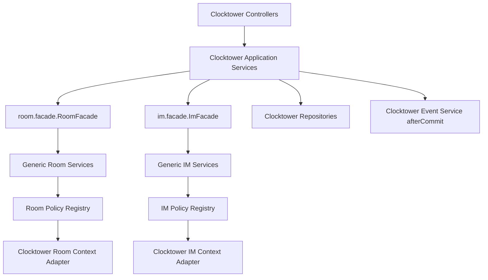
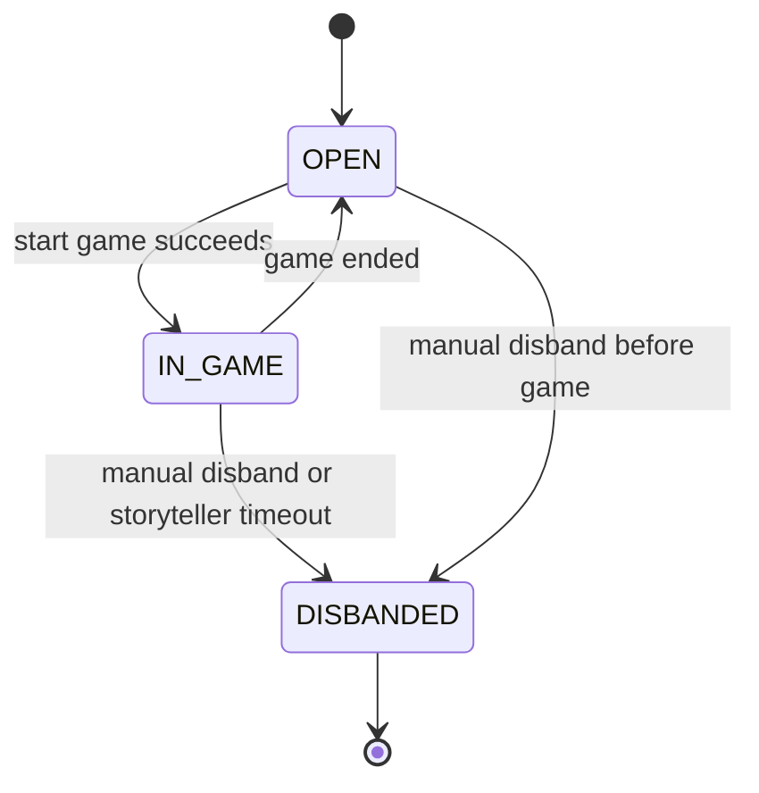
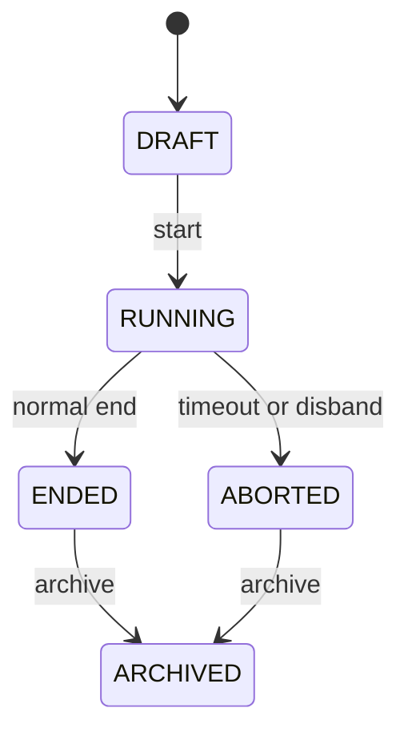

# Clocktower Room IM Game Refactor Implementation Plan

> **For agentic workers:** REQUIRED SUB-SKILL: Use superpowers:subagent-driven-development (recommended) or superpowers:executing-plans to implement this plan task-by-task. Steps use checkbox (`- [ ]`) syntax for tracking.

**Goal:** Refactor Clocktower so rooms are long-lived spaces, games are per-round snapshots, and chat uses a reusable IM core exposed only through Clocktower-scoped APIs and RBAC permissions.

**Architecture:** Build a modular monolith: generic `room` and `im` packages provide reusable core capabilities, while `clocktower.room`, `clocktower.game`, `clocktower.chat`, `clocktower.view`, and `clocktower.replay` adapt those capabilities to Clocktower rules. RBAC remains API-level and module-level; instance access is enforced by Room, IM, and Clocktower policies inside application services. Frontend pages use existing shared helpers and Ant Design components, not custom visual frameworks.

**Tech Stack:** Java 21, Spring Boot 3.5, WebFlux controllers, Spring Data JPA, PostgreSQL/Flyway, JUnit 5, AssertJ, Mockito, H2 PostgreSQL mode, React 19, TypeScript 6, Ant Design 6, Ant Design icons, Bun, Vite, Vitest.

---

## Scope Check

This spec spans backend schema, generic Room, generic IM, Clocktower game lifecycle, Clocktower chat, RBAC resources, frontend pages, and replay/audit. It is large, but the pieces are tightly coupled by one user-visible workflow: create a room, enter as spectator, claim or receive a seat, start one game, chat, end or abort, and view eligible history. Keep this as one plan with independently committable tasks so every task leaves the project in a reviewable state.

The plan intentionally does not build platform-level IM APIs, non-Clocktower chat permissions, a separate `CLOCKTOWER_SPECTATOR` role, WebSocket/STOMP, full role ability automation, or public replay for unrelated users.

Per user instruction, this plan uses detailed pseudocode, UML, DTO/field tables, and test case definitions rather than full Java or TypeScript implementation snippets.

## Existing Context

- Spec: `docs/superpowers/specs/2026-06-23-clocktower-room-im-game-refactor-design.md`
- Current backend Clocktower package: `be/src/main/java/top/egon/mario/clocktower`
- Current frontend Clocktower package: `fe/src/modules/clocktower`
- Current RBAC provider: `be/src/main/java/top/egon/mario/clocktower/resource/ClocktowerRbacResourceProvider.java`
- Current migration sequence ends at `be/src/main/resources/db/migration/V25__add_agent_soulmd.sql`; use `V26__create_room_im_clocktower_refactor_schema.sql`.
- Existing room/game data is development data and does not require compatibility.
- Existing Flyway migrations must not be edited.
- Do not start the backend or frontend dev server after implementation; the user will initiate runtime testing.

## Detailed Design

### Backend Module Map

```text
top.egon.mario.room
  facade              Public room entry points for business modules
  service             Room, member, invitation, ban, heartbeat orchestration
  policy              Reusable policy interfaces plus default/simple policies
  context             Context type, adapter contract, policy registry
  po                  Generic room tables
  repository          JPA repositories
  dto                 Generic room command/result records where useful

top.egon.mario.im
  facade              Public IM entry points for business modules
  service             Channel, group, conversation, message, read-state orchestration
  policy              Send, visibility, and conversation policy interfaces
  context             Context type, adapter contract, policy registry
  factory             Channel/conversation factory helpers
  po                  Generic IM tables
  repository          JPA repositories
  dto                 Generic IM commands/results

top.egon.mario.clocktower.room
  Clocktower room profile, seat draft, invitations, board switching, heartbeat

top.egon.mario.clocktower.game
  Game lifecycle, state machine, immutable game seat snapshot, timeout abort

top.egon.mario.clocktower.chat
  Clocktower chat policies, chat controllers, replay/audit integration

top.egon.mario.clocktower.view
  Viewer resolution and role-specific page aggregates

top.egon.mario.clocktower.replay
  Game replay and history access
```

### Dependency Direction



Rules:

- `top.egon.mario.room` and `top.egon.mario.im` never import `top.egon.mario.clocktower`.
- Clocktower adapters implement generic interfaces and are registered by `contextType=CLOCKTOWER`.
- Cross-module workflows are transaction-owned by Clocktower application services.
- Policies do not write database state.

### Transaction And Lock Order

```text
room -> game -> room seat/invitation/member -> im channel/group/conversation -> message/event
```

Pseudocode for every state-changing workflow:

```text
BEGIN TRANSACTION
  lock room_space by roomId
  load Clocktower profile and current game if needed
  run RBAC-authenticated principal extraction outside policy
  run domain policy with loaded context
  mutate generic Room / Clocktower / IM tables
  append game event or room audit row
  register afterCommit SSE/publication
COMMIT
```

### Status Model





### Data Shape Summary

Use one new migration:

- `room_space`, `room_member`, `room_invitation`, `room_ban`
- `im_channel`, `im_group`, `im_conversation`, `im_conversation_member`, `im_message`, `im_read_state`
- `clocktower_room_profile`, `clocktower_room_seat`, `clocktower_game`, `clocktower_game_seat`
- Add `game_id` and game scoping to new Clocktower event/replay path through `clocktower_game_event`. Existing `clocktower_event` can remain for old development records but new gameplay writes use game-scoped events.

Important uniqueness:

- `room_member(room_id, user_id, active_status)`
- `clocktower_room_seat(room_id, seat_no)`
- `clocktower_game(room_id, game_no)`
- `clocktower_game_seat(game_id, seat_no)`
- `im_conversation(group_id, scope_type, scope_id, conversation_type, participant_key)`
- `im_message(conversation_id, message_seq)`
- `im_read_state(conversation_id, user_id)`

### API Surface Summary

Use Clocktower-scoped APIs:

- `/api/clocktower/rooms/**`
- `/api/clocktower/games/**`
- `/api/clocktower/chat/**`
- `/api/admin/clocktower/**`

Do not expose `/api/im/**`.

### Frontend Design Rules

- Use existing `requestJson`, `streamServerSentEvents`, `PageToolbar`, `EventTimeline`, `NightChecklist`, `RoleTypeTag`, and `RoleSummaryTags`.
- Use Ant Design components for UI composition: `Table`, `List`, `Tabs`, `Card`, `Descriptions`, `Tag`, `Badge`, `Form`, `Select`, `Input`, `InputNumber`, `Switch`, `Button`, `Dropdown`, `Modal`, `Drawer`, `Popconfirm`, `Alert`, `Empty`, `Spin`, `Timeline`, `Segmented`, `Space`, `Flex`, `Row`, `Col`.
- Do not create a new visual component library or handcrafted controls.
- Keep custom Clocktower components as thin domain wrappers around Ant Design, only when a view repeats in multiple pages.
- Avoid nested cards. Existing page cards can remain, but new nested panels should use `Tabs`, `Descriptions`, `List`, `Alert`, or `Flex` inside the current card.

## File Structure

### Backend Files To Create

- `be/src/main/resources/db/migration/V26__create_room_im_clocktower_refactor_schema.sql`
- `be/src/main/java/top/egon/mario/room/**`
- `be/src/main/java/top/egon/mario/im/**`
- `be/src/main/java/top/egon/mario/clocktower/game/**`
- `be/src/main/java/top/egon/mario/clocktower/chat/**`
- `be/src/main/java/top/egon/mario/clocktower/admin/**`
- `be/src/test/java/top/egon/mario/room/**`
- `be/src/test/java/top/egon/mario/im/**`
- `be/src/test/java/top/egon/mario/clocktower/game/**`
- `be/src/test/java/top/egon/mario/clocktower/chat/**`
- `be/src/test/java/top/egon/mario/clocktower/admin/**`

### Backend Files To Modify

- `be/src/main/java/top/egon/mario/clocktower/room/**`
- `be/src/main/java/top/egon/mario/clocktower/view/**`
- `be/src/main/java/top/egon/mario/clocktower/replay/**`
- `be/src/main/java/top/egon/mario/clocktower/event/**`
- `be/src/main/java/top/egon/mario/clocktower/flow/**`
- `be/src/main/java/top/egon/mario/clocktower/grimoire/**`
- `be/src/main/java/top/egon/mario/clocktower/ruling/**`
- `be/src/main/java/top/egon/mario/clocktower/action/**`
- `be/src/main/java/top/egon/mario/clocktower/resource/ClocktowerRbacResourceProvider.java`
- `be/src/test/java/top/egon/mario/clocktower/**`

### Frontend Files To Create

- `fe/src/modules/clocktower/ClocktowerRoomPlayPage.tsx`
- `fe/src/modules/clocktower/ClocktowerAdminAuditPage.tsx`
- `fe/src/modules/clocktower/components/ClocktowerChatPanel.tsx`
- `fe/src/modules/clocktower/components/ClocktowerConversationList.tsx`
- `fe/src/modules/clocktower/components/ClocktowerMessageList.tsx`
- `fe/src/modules/clocktower/components/ClocktowerSeatGrid.tsx`
- `fe/src/modules/clocktower/components/ClocktowerInvitationDrawer.tsx`
- `fe/src/modules/clocktower/components/ClocktowerMemberDrawer.tsx`
- Matching `.test.tsx` files for each reusable component and page-level workflow.

### Frontend Files To Modify

- `fe/src/modules/clocktower/clocktowerTypes.ts`
- `fe/src/modules/clocktower/clocktowerService.ts`
- `fe/src/modules/clocktower/clocktowerService.test.ts`
- `fe/src/modules/clocktower/RoomListPage.tsx`
- `fe/src/modules/clocktower/RoomLobbyPage.tsx`
- `fe/src/modules/clocktower/GameRoomPage.tsx`
- `fe/src/modules/clocktower/StorytellerGrimoirePage.tsx`
- `fe/src/modules/clocktower/ReplayListPage.tsx`
- `fe/src/modules/clocktower/ReplayPage.tsx`
- `fe/src/app/routes.tsx`
- `fe/src/layouts/AdminLayout/menu.tsx`

## Validation Commands

Backend targeted commands:

```bash
cd /Users/mario/SelfProject/CyberMario/be
./mvnw -Dtest=ClocktowerSchemaMigrationTests test
./mvnw -Dtest='Room*Tests,Im*Tests' test
./mvnw -Dtest='ClocktowerRoom*Tests,ClocktowerGame*Tests,ClocktowerChat*Tests,ClocktowerView*Tests,ClocktowerReplay*Tests,ClocktowerRbacResourceProviderTests' test
./mvnw -DskipTests compile
```

Frontend targeted commands:

```bash
cd /Users/mario/SelfProject/CyberMario/fe
bun test src/modules/clocktower/clocktowerService.test.ts
bun test src/modules/clocktower/RoomListPage.test.tsx src/modules/clocktower/RoomLobbyPage.test.tsx src/modules/clocktower/GameRoomPage.test.tsx src/modules/clocktower/StorytellerGrimoirePage.test.tsx
bun run typecheck
bun run lint
```

Ant Design verification after frontend code changes:

```bash
cd /Users/mario/SelfProject/CyberMario/fe
antd lint src/modules/clocktower --format json
```

If `antd` CLI is not available in the local shell, record the missing CLI as a validation limitation and still run `bun run lint` and `bun run typecheck`.

---

### Task 1: Schema Migration And JPA Mapping Foundation

**Files:**
- Create: `be/src/main/resources/db/migration/V26__create_room_im_clocktower_refactor_schema.sql`
- Create: `be/src/main/java/top/egon/mario/room/po/*.java`
- Create: `be/src/main/java/top/egon/mario/im/po/*.java`
- Create: `be/src/main/java/top/egon/mario/clocktower/game/po/*.java`
- Modify: `be/src/test/java/top/egon/mario/clocktower/ClocktowerSchemaMigrationTests.java`
- Modify: `be/src/test/java/top/egon/mario/clocktower/ClocktowerJpaMappingTests.java`

- [ ] **Step 1: Add failing migration coverage**

Test cases to add:

| Test method | Assertions |
|---|---|
| `roomImGameRefactorMigrationCreatesGenericRoomTables` | V26 file exists; contains `CREATE TABLE room_space`, `room_member`, `room_invitation`, `room_ban`; contains unique/index names for member and seat reservation |
| `roomImGameRefactorMigrationCreatesGenericImTables` | V26 contains `im_channel`, `im_group`, `im_conversation`, `im_conversation_member`, `im_message`, `im_read_state`; contains `message_seq` and unique conversation/message/read-state constraints |
| `roomImGameRefactorMigrationCreatesClocktowerGameTables` | V26 contains `clocktower_room_profile`, `clocktower_room_seat`, `clocktower_game`, `clocktower_game_seat`, `clocktower_game_event`; contains `game_no`, `current_game_id`, `board_snapshot_json` |

- [ ] **Step 2: Run migration tests and confirm failure**

Run:

```bash
cd /Users/mario/SelfProject/CyberMario/be
./mvnw -Dtest=ClocktowerSchemaMigrationTests test
```

Expected: FAIL because `V26__create_room_im_clocktower_refactor_schema.sql` does not exist.

- [ ] **Step 3: Add V26 migration**

Migration content requirements:

```text
Create room tables with BaseAuditablePo columns.
Create IM tables with BaseAuditablePo columns.
Create new Clocktower profile, room seat, game, game seat, and game event tables.
Use jsonb for board_snapshot_json, payload_json, visible_game_seat_ids_json, and metadata_json.
Use explicit status columns for active rows.
Add indexes for all lookups used in policies and list pages.
Do not alter or drop existing V18-V25 tables.
```

- [ ] **Step 4: Add JPA entities**

Create PO classes extending `BaseAuditablePo`:

| Class | Table |
|---|---|
| `RoomSpacePo` | `room_space` |
| `RoomMemberPo` | `room_member` |
| `RoomInvitationPo` | `room_invitation` |
| `RoomBanPo` | `room_ban` |
| `ImChannelPo` | `im_channel` |
| `ImGroupPo` | `im_group` |
| `ImConversationPo` | `im_conversation` |
| `ImConversationMemberPo` | `im_conversation_member` |
| `ImMessagePo` | `im_message` |
| `ImReadStatePo` | `im_read_state` |
| `ClocktowerRoomProfilePo` | `clocktower_room_profile` |
| `ClocktowerRoomSeatPo` | `clocktower_room_seat` |
| `ClocktowerGamePo` | `clocktower_game` |
| `ClocktowerGameSeatPo` | `clocktower_game_seat` |
| `ClocktowerGameEventPo` | `clocktower_game_event` |

Entity field names must match Java naming used in later tasks: `roomId`, `gameId`, `conversationId`, `messageSeq`, `contextType`, `contextId`, `scopeType`, `scopeId`, `participantKey`, `currentGameId`, `lastActiveAt`.

- [ ] **Step 5: Add JPA mapping tests**

Add mapping assertions:

```text
Room and IM PO classes are managed by the JPA context.
Clocktower game PO classes are managed by the JPA context.
JSON columns can round-trip minimal `{}` or `[]` strings.
Enum/string status fields persist and reload.
```

- [ ] **Step 6: Run schema and mapping tests**

Run:

```bash
cd /Users/mario/SelfProject/CyberMario/be
./mvnw -Dtest=ClocktowerSchemaMigrationTests,ClocktowerJpaMappingTests test
```

Expected: PASS.

- [ ] **Step 7: Commit**

```bash
git add be/src/main/resources/db/migration/V26__create_room_im_clocktower_refactor_schema.sql \
  be/src/main/java/top/egon/mario/room \
  be/src/main/java/top/egon/mario/im \
  be/src/main/java/top/egon/mario/clocktower/game/po \
  be/src/test/java/top/egon/mario/clocktower/ClocktowerSchemaMigrationTests.java \
  be/src/test/java/top/egon/mario/clocktower/ClocktowerJpaMappingTests.java
git commit -m "feat(clocktower): add room im game schema foundation"
```

---

### Task 2: Generic Room Core

**Files:**
- Create: `be/src/main/java/top/egon/mario/room/repository/*.java`
- Create: `be/src/main/java/top/egon/mario/room/context/*.java`
- Create: `be/src/main/java/top/egon/mario/room/policy/*.java`
- Create: `be/src/main/java/top/egon/mario/room/facade/RoomFacade.java`
- Create: `be/src/main/java/top/egon/mario/room/service/*.java`
- Create: `be/src/test/java/top/egon/mario/room/*.java`

- [ ] **Step 1: Write failing Room service tests**

Test class: `be/src/test/java/top/egon/mario/room/RoomFacadeTests.java`

Test cases:

| Test method | Scenario |
|---|---|
| `enterRoomCreatesSpectatorMemberWhenAllowed` | Logged-in user enters public room and becomes active member with role `SPECTATOR` |
| `enterRoomRejectsActiveBan` | Active `room_ban` blocks room entry |
| `seatInvitationReservesTargetUntilAcceptedDeclinedCancelledOrExpired` | Seat-level invitation exposes reserved target and releases it on terminal status |
| `kickRemovesMemberButDoesNotDeleteAuditTrail` | Kicked member status changes; record remains |
| `heartbeatUpdatesRoomLocalLastActiveAt` | Heartbeat changes only the member row for that room |

- [ ] **Step 2: Run Room tests and confirm failure**

Run:

```bash
cd /Users/mario/SelfProject/CyberMario/be
./mvnw -Dtest=RoomFacadeTests test
```

Expected: FAIL because Room facade and repositories do not exist.

- [ ] **Step 3: Implement Room repositories**

Repository requirements:

```text
RoomSpaceRepository: findByIdAndDeletedFalse, findLockedByIdAndDeletedFalse, visible list support
RoomMemberRepository: active member by room/user, members by room, lastActive update target
RoomInvitationRepository: active invitation by id, active invitations by room, active target seat reservations
RoomBanRepository: active ban lookup by room/user/time
```

- [ ] **Step 4: Implement Room context and policy registry**

Pseudocode:

```text
RoomPolicyRegistry.resolve(contextType, policyClass):
  find bean registered for contextType
  if missing, return default deny policy for mutations and default public-read policy for list queries

RoomContext:
  contextType
  contextId
  roomId
  ownerUserId
  viewerUserId
  memberRole
  roomStatus
  requestedSeatNo
```

- [ ] **Step 5: Implement Room facade and services**

Facade operations:

```text
createRoom(contextType, contextId, ownerUserId, visibility)
enterRoom(roomId, principal)
invite(roomId, inviteeUserId, invitationType, targetSeatNo, expiresAt)
acceptInvitation(roomId, invitationId, principal)
declineInvitation(roomId, invitationId, principal)
kick(roomId, targetUserId, reason)
ban(roomId, targetUserId, duration, reason)
heartbeat(roomId, principal)
activeReservations(roomId)
```

All mutating methods use `@Transactional`; methods that change membership or reservation lock the room first.

- [ ] **Step 6: Run Room tests**

Run:

```bash
cd /Users/mario/SelfProject/CyberMario/be
./mvnw -Dtest=RoomFacadeTests test
```

Expected: PASS.

- [ ] **Step 7: Commit**

```bash
git add be/src/main/java/top/egon/mario/room be/src/test/java/top/egon/mario/room
git commit -m "feat(room): add generic room core"
```

---

### Task 3: Generic IM Core

**Files:**
- Create: `be/src/main/java/top/egon/mario/im/repository/*.java`
- Create: `be/src/main/java/top/egon/mario/im/context/*.java`
- Create: `be/src/main/java/top/egon/mario/im/policy/*.java`
- Create: `be/src/main/java/top/egon/mario/im/factory/*.java`
- Create: `be/src/main/java/top/egon/mario/im/facade/ImFacade.java`
- Create: `be/src/main/java/top/egon/mario/im/service/*.java`
- Create: `be/src/test/java/top/egon/mario/im/*.java`

- [ ] **Step 1: Write failing IM tests**

Test class: `be/src/test/java/top/egon/mario/im/ImFacadeTests.java`

Test cases:

| Test method | Scenario |
|---|---|
| `createChannelIsIdempotentByContext` | Same context creates one channel |
| `createPrivateConversationUsesStableParticipantKey` | Same two users produce same one-to-one conversation |
| `sendMessageEvaluatesPolicyBeforePersisting` | Denied send creates no `im_message` |
| `sendMessageAllocatesConversationLocalSequence` | Message sequences are `1, 2, 3` in one conversation |
| `markReadIsIdempotentAndNeverMovesBackward` | Marking read to older sequence keeps the higher sequence |
| `historyAppliesVisibilityPolicy` | Non-member cannot read private conversation history |

- [ ] **Step 2: Run IM tests and confirm failure**

Run:

```bash
cd /Users/mario/SelfProject/CyberMario/be
./mvnw -Dtest=ImFacadeTests test
```

Expected: FAIL because IM facade and policies do not exist.

- [ ] **Step 3: Implement IM repositories**

Repository requirements:

```text
ImChannelRepository: by contextType/contextId/channelType
ImGroupRepository: by channel/groupType
ImConversationRepository: by group/scope/conversationType/participantKey, lock by id
ImConversationMemberRepository: by conversation/user
ImMessageRepository: top message sequence by conversation, messages page by conversation
ImReadStateRepository: by conversation/user
```

- [ ] **Step 4: Implement IM policy registry**

Pseudocode:

```text
ImPolicyRegistry.resolve(contextType, policyClass):
  select matching policy bean
  fallback send policy denies
  fallback visibility policy allows explicit conversation members only
```

- [ ] **Step 5: Implement IM factories and facade**

Facade operations:

```text
ensureChannel(contextType, contextId, channelType)
ensureGroup(channelId, groupType)
ensureConversation(groupId, scopeType, scopeId, type, participantUserIds)
sendMessage(conversationId, sender, content, metadata)
history(conversationId, viewer, pageRequest)
markRead(conversationId, viewer, messageSeq)
```

Sequence allocation pseudocode:

```text
lock conversation
nextSeq = max(messageSeq for conversation) + 1
insert message with nextSeq
if unique conflict:
  retry up to 3
```

- [ ] **Step 6: Run IM tests**

Run:

```bash
cd /Users/mario/SelfProject/CyberMario/be
./mvnw -Dtest=ImFacadeTests test
```

Expected: PASS.

- [ ] **Step 7: Commit**

```bash
git add be/src/main/java/top/egon/mario/im be/src/test/java/top/egon/mario/im
git commit -m "feat(im): add generic conversation core"
```

---

### Task 4: Clocktower Room Adapter And Lobby Workflow

**Files:**
- Create/Modify: `be/src/main/java/top/egon/mario/clocktower/room/**`
- Create: `be/src/main/java/top/egon/mario/clocktower/room/policy/*.java`
- Create: `be/src/main/java/top/egon/mario/clocktower/room/dto/request/*.java`
- Create: `be/src/main/java/top/egon/mario/clocktower/room/dto/response/*.java`
- Modify: `be/src/test/java/top/egon/mario/clocktower/room/*.java`

- [ ] **Step 1: Write failing Clocktower room tests**

Test class: `be/src/test/java/top/egon/mario/clocktower/room/ClocktowerRoomRefactorServiceTests.java`

Test cases:

| Test method | Scenario |
|---|---|
| `createRoomCreatesGenericRoomProfileSeatDraftAndRoomPublicConversation` | Room creation writes `room_space`, `clocktower_room_profile`, seat draft rows, and room public chat |
| `enterRoomDefaultsToSpectator` | Entering a room creates member role `SPECTATOR` without claiming a seat |
| `claimSeatUsesConfiguredSeatingPolicy` | `APPROVAL_REQUIRED` creates request/reservation rather than direct assignment |
| `acceptSeatInvitationAssignsSeatAndClearsReservationConflict` | Accepted invitation assigns target seat to real user |
| `switchBoardRejectsSmallerPlayerCountWhenSeatsReserved` | Board switch checks occupied and reserved seats |
| `releaseSeatLeavesUserAsSpectatorAndClearsReady` | Seat release does not remove room member |

- [ ] **Step 2: Run tests and confirm failure**

Run:

```bash
cd /Users/mario/SelfProject/CyberMario/be
./mvnw -Dtest=ClocktowerRoomRefactorServiceTests test
```

Expected: FAIL because new Clocktower room service contract is not implemented.

- [ ] **Step 3: Implement room profile and seat draft repositories**

Repository requirements:

```text
ClocktowerRoomProfileRepository: by roomId, locked by roomId, visible list projection
ClocktowerRoomSeatRepository: by roomId order seatNo, target seat lock, user seat lookup
```

- [ ] **Step 4: Implement Clocktower room policies**

Pseudocode:

```text
ClocktowerRoomAccessPolicy.canEnter:
  reject DISBANDED
  reject active ban
  allow public room
  allow owner, member, active invited user for private room

ClocktowerSeatAssignmentPolicy.claim:
  reject IN_GAME and DISBANDED
  reject active ban
  reject occupied seat
  if OPEN_SEATING -> assign immediately
  if APPROVAL_REQUIRED -> create seat request or pending invitation
  if INVITE_ONLY -> require active seat invitation
```

- [ ] **Step 5: Implement new room service and controller endpoints**

Endpoint mapping:

| Method | Path | Service action |
|---|---|---|
| `POST` | `/api/clocktower/rooms` | create room |
| `GET` | `/api/clocktower/rooms` | list visible rooms |
| `GET` | `/api/clocktower/rooms/{roomId}` | lobby aggregate |
| `PATCH` | `/api/clocktower/rooms/{roomId}/board` | switch board |
| `POST` | `/api/clocktower/rooms/{roomId}/enter` | enter as spectator |
| `POST` | `/api/clocktower/rooms/{roomId}/heartbeat` | room heartbeat |
| `POST` | `/api/clocktower/rooms/{roomId}/seats/{seatNo}/claim` | claim/request seat |
| `POST` | `/api/clocktower/rooms/{roomId}/seats/{seatNo}/release` | release/kick seat |
| `POST` | `/api/clocktower/rooms/{roomId}/invitations` | create invitation |
| `POST` | `/api/clocktower/rooms/{roomId}/invitations/{id}/accept` | accept invitation |
| `POST` | `/api/clocktower/rooms/{roomId}/invitations/{id}/decline` | decline invitation |
| `POST` | `/api/clocktower/rooms/{roomId}/members/{userId}/kick` | kick or ban member |

- [ ] **Step 6: Run room tests**

Run:

```bash
cd /Users/mario/SelfProject/CyberMario/be
./mvnw -Dtest=ClocktowerRoomRefactorServiceTests test
```

Expected: PASS.

- [ ] **Step 7: Commit**

```bash
git add be/src/main/java/top/egon/mario/clocktower/room be/src/test/java/top/egon/mario/clocktower/room
git commit -m "feat(clocktower): refactor room lobby model"
```

---

### Task 5: Clocktower Game Lifecycle And Immutable Seat Snapshot

**Files:**
- Create: `be/src/main/java/top/egon/mario/clocktower/game/*.java`
- Create: `be/src/main/java/top/egon/mario/clocktower/game/dto/*.java`
- Create: `be/src/main/java/top/egon/mario/clocktower/game/repository/*.java`
- Create: `be/src/main/java/top/egon/mario/clocktower/game/service/*.java`
- Create: `be/src/main/java/top/egon/mario/clocktower/game/web/ClocktowerGameController.java`
- Modify: existing Clocktower flow, grimoire, action, ruling services to resolve `gameId`
- Test: `be/src/test/java/top/egon/mario/clocktower/game/*.java`

- [ ] **Step 1: Write failing lifecycle tests**

Test class: `be/src/test/java/top/egon/mario/clocktower/game/ClocktowerGameLifecycleServiceTests.java`

Test cases:

| Test method | Scenario |
|---|---|
| `startGameRejectsWhenSeatsNotAcceptedReadyOrRealUsers` | Start fails if any seat is empty, fake, unready, or pending invitation |
| `startGameCreatesGameAndImmutableSeatSnapshot` | Game row and game seat rows copy current room seat draft |
| `startGameActivatesGameConversations` | Public, private container, spectator, and system conversations exist for game scope |
| `startGameLocksRoomAgainstDoubleStart` | Two start attempts create one running game |
| `endGameReturnsRoomToOpen` | Normal end sets game `ENDED`, room `OPEN`, current game cleared |
| `timeoutAbortDisbandsRoomOnlyWhenRunning` | Heartbeat timeout aborts running game and disbands room |

- [ ] **Step 2: Run lifecycle tests and confirm failure**

Run:

```bash
cd /Users/mario/SelfProject/CyberMario/be
./mvnw -Dtest=ClocktowerGameLifecycleServiceTests test
```

Expected: FAIL because game lifecycle package is missing.

- [ ] **Step 3: Implement game state machine**

Pseudocode:

```text
transition(gameStatus, command):
  DRAFT + START -> RUNNING
  RUNNING + END -> ENDED
  RUNNING + ABORT -> ABORTED
  ENDED + ARCHIVE -> ARCHIVED
  ABORTED + ARCHIVE -> ARCHIVED
  otherwise -> CLOCKTOWER_GAME_TRANSITION_INVALID
```

- [ ] **Step 4: Implement `ClocktowerGameLifecycleService`**

Start flow pseudocode:

```text
lock room_space
load profile and room seats
reject if profile.currentGameId exists
validate board snapshot and seat count
validate all seats have userId, accepted assignment, ready=true
create game with next gameNo
copy room seat draft to game seats
set profile.currentGameId and room status IN_GAME
activate game conversations through ClocktowerChatSetupService
append GAME_STARTED game event
publish afterCommit
```

- [ ] **Step 5: Adapt existing game-state services to game id**

Update flow/grimoire/action/ruling/replay services so new calls use `gameId` and game seat ids. Keep old development room-id paths only as compatibility wrappers when they are still referenced by frontend tests in the same task.

- [ ] **Step 6: Run lifecycle tests**

Run:

```bash
cd /Users/mario/SelfProject/CyberMario/be
./mvnw -Dtest=ClocktowerGameLifecycleServiceTests test
```

Expected: PASS.

- [ ] **Step 7: Commit**

```bash
git add be/src/main/java/top/egon/mario/clocktower/game \
  be/src/main/java/top/egon/mario/clocktower/flow \
  be/src/main/java/top/egon/mario/clocktower/grimoire \
  be/src/main/java/top/egon/mario/clocktower/action \
  be/src/main/java/top/egon/mario/clocktower/ruling \
  be/src/main/java/top/egon/mario/clocktower/replay \
  be/src/test/java/top/egon/mario/clocktower/game \
  be/src/test/java/top/egon/mario/clocktower
git commit -m "feat(clocktower): add game lifecycle snapshot"
```

---

### Task 6: Clocktower Chat Adapter, Policies, And APIs

**Files:**
- Create: `be/src/main/java/top/egon/mario/clocktower/chat/*.java`
- Create: `be/src/main/java/top/egon/mario/clocktower/chat/dto/*.java`
- Create: `be/src/main/java/top/egon/mario/clocktower/chat/service/*.java`
- Create: `be/src/main/java/top/egon/mario/clocktower/chat/web/ClocktowerChatController.java`
- Test: `be/src/test/java/top/egon/mario/clocktower/chat/*.java`

- [ ] **Step 1: Write failing chat policy tests**

Test class: `be/src/test/java/top/egon/mario/clocktower/chat/ClocktowerChatPolicyTests.java`

Test cases:

| Test method | Scenario |
|---|---|
| `playerPublicChatAllowedOnlyDuringDayLikePhases` | DAY/NOMINATION/EXECUTION allow, FIRST_NIGHT/NIGHT deny |
| `storytellerAnnouncementBypassesNightRestriction` | Storyteller can send public/system announcement at night |
| `spectatorCanOnlySendSpectatorChannel` | Spectator send to player public/private is denied |
| `storytellerCannotReadSpectatorChannelInNormalRoomPage` | Normal storyteller visibility excludes spectator channel |
| `managementAuditCanReadAllConversations` | Admin audit context includes spectator and private chats |
| `privateChatWindowDefaultsToFirstTwoDays` | Player private chat denied after configured window |

- [ ] **Step 2: Run chat policy tests and confirm failure**

Run:

```bash
cd /Users/mario/SelfProject/CyberMario/be
./mvnw -Dtest=ClocktowerChatPolicyTests test
```

Expected: FAIL because chat adapter policies do not exist.

- [ ] **Step 3: Implement Clocktower IM context adapter**

Context fields:

```text
roomId
gameId
viewerUserId
viewerMode: STORYTELLER | PLAYER | SPECTATOR | ADMIN_AUDIT
viewerGameSeatId
phase
dayNo
nightNo
conversationGroupType
conversationScopeType
privateChatDayLimit
```

- [ ] **Step 4: Implement chat setup service**

Setup pseudocode:

```text
on room created:
  ensure room channel
  ensure ROOM_PUBLIC group and room-scoped main conversation

on game started:
  ensure game public conversation
  ensure private group
  ensure spectator group and spectator conversation
  ensure system group and system conversation
```

- [ ] **Step 5: Implement Clocktower chat APIs**

Endpoint mapping:

| Method | Path | Service action |
|---|---|---|
| `GET` | `/api/clocktower/rooms/{roomId}/chat/conversations` | visible conversations |
| `GET` | `/api/clocktower/chat/conversations/{conversationId}/messages` | visible message page |
| `POST` | `/api/clocktower/chat/conversations` | create or resolve private conversation |
| `POST` | `/api/clocktower/chat/conversations/{conversationId}/messages` | send message |
| `POST` | `/api/clocktower/chat/conversations/{conversationId}/read` | mark read |

- [ ] **Step 6: Run chat tests**

Run:

```bash
cd /Users/mario/SelfProject/CyberMario/be
./mvnw -Dtest=ClocktowerChatPolicyTests,ClocktowerChatControllerTests test
```

Expected: PASS.

- [ ] **Step 7: Commit**

```bash
git add be/src/main/java/top/egon/mario/clocktower/chat be/src/test/java/top/egon/mario/clocktower/chat
git commit -m "feat(clocktower): add scoped chat adapter"
```

---

### Task 7: Viewer, Replay, And Management Audit Projections

**Files:**
- Modify: `be/src/main/java/top/egon/mario/clocktower/view/**`
- Modify: `be/src/main/java/top/egon/mario/clocktower/replay/**`
- Create: `be/src/main/java/top/egon/mario/clocktower/admin/**`
- Modify: `be/src/test/java/top/egon/mario/clocktower/view/**`
- Modify: `be/src/test/java/top/egon/mario/clocktower/replay/**`
- Create: `be/src/test/java/top/egon/mario/clocktower/admin/**`

- [ ] **Step 1: Write failing viewer matrix tests**

Test class: `be/src/test/java/top/egon/mario/clocktower/view/ClocktowerViewerMatrixTests.java`

Test cases:

| Test method | Scenario |
|---|---|
| `storytellerViewIncludesGrimoireAndPrivatePlayerChatsButNotSpectatorChannel` | Normal storyteller page follows spec |
| `playerViewIncludesOwnRolePublicSeatsAndOwnPrivateChats` | Player page hides other roles and spectator channel |
| `spectatorViewIncludesPublicSeatsPublicEventsPublicChatAndSpectatorChannel` | Spectator page has no role/private/action data |
| `superAdminNormalRoomPageDoesNotBecomeOmniscient` | Admin in normal route follows resolved room identity |

- [ ] **Step 2: Write failing replay/audit tests**

Test class: `be/src/test/java/top/egon/mario/clocktower/replay/ClocktowerGameReplayAccessTests.java`

Test cases:

```text
Game player sees only own visible replay.
Storyteller sees full game replay.
Spectator does not see game replay.
Admin audit sees full room/game/chat/governance data only through admin API.
Disbanded room is absent from normal room list but history remains eligible.
```

- [ ] **Step 3: Run viewer/replay tests and confirm failure**

Run:

```bash
cd /Users/mario/SelfProject/CyberMario/be
./mvnw -Dtest=ClocktowerViewerMatrixTests,ClocktowerGameReplayAccessTests test
```

Expected: FAIL until projections are implemented.

- [ ] **Step 4: Implement viewer resolver**

Pseudocode:

```text
resolveViewer(roomId, gameId, principal):
  if principal is room owner -> STORYTELLER
  else if principal has active game seat -> PLAYER
  else if principal has active room member -> SPECTATOR
  else if invited and room visible -> INVITED
  else reject
```

- [ ] **Step 5: Implement replay and admin audit services**

API mapping:

```text
GET /api/clocktower/games/{gameId}/view
GET /api/clocktower/games/{gameId}/replay
GET /api/clocktower/games/history
GET /api/admin/clocktower/rooms/{roomId}/audit
GET /api/admin/clocktower/games/{gameId}/audit
GET /api/admin/clocktower/chat/conversations/{conversationId}/messages
```

- [ ] **Step 6: Run viewer/replay/audit tests**

Run:

```bash
cd /Users/mario/SelfProject/CyberMario/be
./mvnw -Dtest=ClocktowerViewerMatrixTests,ClocktowerGameReplayAccessTests test
```

Expected: PASS.

- [ ] **Step 7: Commit**

```bash
git add be/src/main/java/top/egon/mario/clocktower/view \
  be/src/main/java/top/egon/mario/clocktower/replay \
  be/src/main/java/top/egon/mario/clocktower/admin \
  be/src/test/java/top/egon/mario/clocktower/view \
  be/src/test/java/top/egon/mario/clocktower/replay \
  be/src/test/java/top/egon/mario/clocktower/admin
git commit -m "feat(clocktower): add viewer replay audit projections"
```

---

### Task 8: RBAC Resource Provider Update

**Files:**
- Modify: `be/src/main/java/top/egon/mario/clocktower/resource/ClocktowerRbacResourceProvider.java`
- Modify: `be/src/test/java/top/egon/mario/clocktower/resource/ClocktowerRbacResourceProviderTests.java`
- Modify: `be/src/test/java/top/egon/mario/rbac/service/security/DynamicAuthorizationManagerTests.java`

- [ ] **Step 1: Write failing RBAC provider assertions**

Expected resources:

```text
api:clocktower:script:read
api:clocktower:board:*
api:clocktower:room:read
api:clocktower:room:create
api:clocktower:room:membership
api:clocktower:room:seat
api:clocktower:room:governance
api:clocktower:game:read
api:clocktower:game:lifecycle
api:clocktower:game:action
api:clocktower:game:storyteller
api:clocktower:game:event-stream
api:clocktower:game:replay
api:clocktower:chat:read
api:clocktower:chat:send
api:clocktower:chat:conversation
api:clocktower:chat:read-state
api:admin:clocktower:audit
api:admin:clocktower:rule-data
```

Negative assertions:

```text
No api:im:* resources.
No /api/im/** patterns.
No CLOCKTOWER_SPECTATOR preset role.
CLOCKTOWER_PLAYER has room/chat/game participant grants and no storyteller/admin grants.
```

- [ ] **Step 2: Run RBAC tests and confirm failure**

Run:

```bash
cd /Users/mario/SelfProject/CyberMario/be
./mvnw -Dtest=ClocktowerRbacResourceProviderTests,DynamicAuthorizationManagerTests test
```

Expected: FAIL until provider is updated.

- [ ] **Step 3: Update resource provider**

Pattern mapping:

```text
GET /api/clocktower/scripts/** -> api:clocktower:script:read
ANY /api/clocktower/boards/** -> api:clocktower:board:*
GET /api/clocktower/rooms and GET /api/clocktower/rooms/* -> api:clocktower:room:read
POST /api/clocktower/rooms -> api:clocktower:room:create
POST /api/clocktower/rooms/*/enter, heartbeat, invitations accept/decline -> api:clocktower:room:membership
POST /api/clocktower/rooms/*/seats/** -> api:clocktower:room:seat
PATCH /api/clocktower/rooms/*/board, POST invitations, kick/ban -> api:clocktower:room:governance
GET /api/clocktower/games/*/view -> api:clocktower:game:read
POST /api/clocktower/rooms/*/games/start, POST /api/clocktower/games/*/end -> api:clocktower:game:lifecycle
POST /api/clocktower/games/*/actions -> api:clocktower:game:action
ANY storyteller/flow/grimoire/ruling paths -> api:clocktower:game:storyteller
GET /api/clocktower/games/*/events/stream -> api:clocktower:game:event-stream
GET /api/clocktower/games/*/replay, GET /api/clocktower/games/history -> api:clocktower:game:replay
Clocktower chat paths -> api:clocktower:chat:*
Admin audit paths -> api:admin:clocktower:audit
```

- [ ] **Step 4: Run RBAC tests**

Run:

```bash
cd /Users/mario/SelfProject/CyberMario/be
./mvnw -Dtest=ClocktowerRbacResourceProviderTests,DynamicAuthorizationManagerTests test
```

Expected: PASS.

- [ ] **Step 5: Commit**

```bash
git add be/src/main/java/top/egon/mario/clocktower/resource/ClocktowerRbacResourceProvider.java \
  be/src/test/java/top/egon/mario/clocktower/resource/ClocktowerRbacResourceProviderTests.java \
  be/src/test/java/top/egon/mario/rbac/service/security/DynamicAuthorizationManagerTests.java
git commit -m "feat(clocktower): align rbac resources with room game chat APIs"
```

---

### Task 9: Backend Integration Sweep And Full Clocktower Tests

**Files:**
- Modify: affected files under `be/src/main/java/top/egon/mario/clocktower/**`
- Modify: affected tests under `be/src/test/java/top/egon/mario/clocktower/**`

- [ ] **Step 1: Run full Clocktower backend tests**

Run:

```bash
cd /Users/mario/SelfProject/CyberMario/be
./mvnw -Dtest='*Clocktower*Tests' test
```

Expected: FAIL only where old room/game assumptions remain.

- [ ] **Step 2: Fix old room-id assumptions**

Update references according to this mapping:

| Old concept | New concept |
|---|---|
| `clocktower_room` as game | `room_space` + `clocktower_room_profile` + current `clocktower_game` |
| `clocktower_seat` as live seat | `clocktower_room_seat` before start; `clocktower_game_seat` after start |
| `/rooms/{roomId}/view` | `/games/{gameId}/view` plus room entry routing |
| room event replay | game event replay by `gameId` |

- [ ] **Step 3: Run compile**

Run:

```bash
cd /Users/mario/SelfProject/CyberMario/be
./mvnw -DskipTests compile
```

Expected: PASS.

- [ ] **Step 4: Run targeted backend tests**

Run:

```bash
cd /Users/mario/SelfProject/CyberMario/be
./mvnw -Dtest='Room*Tests,Im*Tests,Clocktower*Tests' test
```

Expected: PASS.

- [ ] **Step 5: Commit**

```bash
git add be/src/main/java/top/egon/mario be/src/test/java/top/egon/mario
git commit -m "test(clocktower): stabilize room im game integration"
```

---

### Task 10: Frontend Type And Service Contracts

**Files:**
- Modify: `fe/src/modules/clocktower/clocktowerTypes.ts`
- Modify: `fe/src/modules/clocktower/clocktowerService.ts`
- Modify: `fe/src/modules/clocktower/clocktowerService.test.ts`

- [ ] **Step 1: Write failing service endpoint tests**

Test expectations:

| Function | Expected path |
|---|---|
| `enterClocktowerRoom(roomId)` | `POST /api/clocktower/rooms/{roomId}/enter` |
| `heartbeatClocktowerRoom(roomId)` | `POST /api/clocktower/rooms/{roomId}/heartbeat` |
| `claimClocktowerSeat(roomId, seatNo, request)` | `POST /api/clocktower/rooms/{roomId}/seats/{seatNo}/claim` |
| `startClocktowerGame(roomId, request)` | `POST /api/clocktower/rooms/{roomId}/games/start` |
| `getClocktowerGameView(gameId)` | `GET /api/clocktower/games/{gameId}/view` |
| `listClocktowerChatConversations(roomId)` | `GET /api/clocktower/rooms/{roomId}/chat/conversations` |
| `sendClocktowerChatMessage(conversationId, request)` | `POST /api/clocktower/chat/conversations/{conversationId}/messages` |
| `markClocktowerChatRead(conversationId, request)` | `POST /api/clocktower/chat/conversations/{conversationId}/read` |

- [ ] **Step 2: Run service tests and confirm failure**

Run:

```bash
cd /Users/mario/SelfProject/CyberMario/fe
bun test src/modules/clocktower/clocktowerService.test.ts
```

Expected: FAIL until service functions and types are updated.

- [ ] **Step 3: Update frontend type contracts**

Type groups to add or replace:

```text
Room: ClocktowerRoomProfileResponse, ClocktowerRoomMemberResponse, ClocktowerInvitationResponse, ClocktowerRoomSeatResponse
Game: ClocktowerGameResponse, ClocktowerGameSeatResponse, ClocktowerViewerMode, ClocktowerGameViewResponse
Chat: ClocktowerConversationResponse, ClocktowerMessageResponse, ClocktowerSendMessageRequest, ClocktowerReadStateRequest
Replay: ClocktowerGameHistoryResponse, ClocktowerGameReplayResponse
Admin: ClocktowerAuditQuery, ClocktowerAuditResponse
```

Keep old names only when tests or pages still use them during migration; prefer new names in new page work.

- [ ] **Step 4: Update service functions**

Service pseudocode:

```text
export function enterClocktowerRoom(roomId): requestJson('/api/clocktower/rooms/' + roomId + '/enter', POST)
export function getClocktowerGameView(gameId): requestJson('/api/clocktower/games/' + gameId + '/view')
export function streamClocktowerGameEvents(gameId): streamServerSentEvents('/api/clocktower/games/' + gameId + '/events/stream')
export function listClocktowerChatConversations(roomId): requestJson('/api/clocktower/rooms/' + roomId + '/chat/conversations')
```

- [ ] **Step 5: Run service tests**

Run:

```bash
cd /Users/mario/SelfProject/CyberMario/fe
bun test src/modules/clocktower/clocktowerService.test.ts
```

Expected: PASS.

- [ ] **Step 6: Commit**

```bash
git add fe/src/modules/clocktower/clocktowerTypes.ts \
  fe/src/modules/clocktower/clocktowerService.ts \
  fe/src/modules/clocktower/clocktowerService.test.ts
git commit -m "feat(clocktower-fe): update room game chat service contracts"
```

---

### Task 11: Frontend Room List And Lobby

**Files:**
- Modify: `fe/src/modules/clocktower/RoomListPage.tsx`
- Modify: `fe/src/modules/clocktower/RoomLobbyPage.tsx`
- Create: `fe/src/modules/clocktower/components/ClocktowerSeatGrid.tsx`
- Create: `fe/src/modules/clocktower/components/ClocktowerInvitationDrawer.tsx`
- Create: `fe/src/modules/clocktower/components/ClocktowerMemberDrawer.tsx`
- Modify/Create tests for these files

- [ ] **Step 1: Write failing room UI tests**

Test expectations:

```text
Room list displays script, required player count, occupied/reserved count, status, and visibility.
Create room modal uses Ant Design Form, Select, InputNumber, Switch, and board selector.
Lobby loads user as spectator before seat claim.
Lobby shows seat draft with occupied, reserved, ready, and open states.
Lobby exposes invitation drawer only when storyteller permissions are present.
Lobby start button remains disabled until backend start readiness fields pass.
```

- [ ] **Step 2: Run room UI tests and confirm failure**

Run:

```bash
cd /Users/mario/SelfProject/CyberMario/fe
bun test src/modules/clocktower/RoomListPage.test.tsx src/modules/clocktower/RoomLobbyPage.test.tsx
```

Expected: FAIL until UI is updated.

- [ ] **Step 3: Update room list design**

Ant Design component plan:

```text
PageToolbar actions: Refresh button, Create Room button
Table columns: room, script, visibility, status, players, reserved, storyteller, actions
Create Modal: Form + Select board + Input room name + Switch private + Select seating policy
No custom table component; use antd Table with stable rowKey=roomId
```

- [ ] **Step 4: Update lobby design**

Ant Design component plan:

```text
PageToolbar actions: Refresh, Heartbeat status, Invite, Members, Start Game
Tabs: Seats, Room Public Chat, Invitations, Members
SeatGrid: use antd List or Table cards with Tag/Badge; do not draw custom board geometry
InvitationDrawer: antd Drawer + Form + Select invitation type + Select target seat
MemberDrawer: antd Drawer + Table + Dropdown actions for kick/ban
```

- [ ] **Step 5: Run room UI tests**

Run:

```bash
cd /Users/mario/SelfProject/CyberMario/fe
bun test src/modules/clocktower/RoomListPage.test.tsx src/modules/clocktower/RoomLobbyPage.test.tsx
```

Expected: PASS.

- [ ] **Step 6: Run Ant Design lint for changed Clocktower files**

Run:

```bash
cd /Users/mario/SelfProject/CyberMario/fe
antd lint src/modules/clocktower --format json
```

Expected: PASS or documented unavailable CLI limitation.

- [ ] **Step 7: Commit**

```bash
git add fe/src/modules/clocktower/RoomListPage.tsx \
  fe/src/modules/clocktower/RoomLobbyPage.tsx \
  fe/src/modules/clocktower/components/ClocktowerSeatGrid.tsx \
  fe/src/modules/clocktower/components/ClocktowerInvitationDrawer.tsx \
  fe/src/modules/clocktower/components/ClocktowerMemberDrawer.tsx \
  fe/src/modules/clocktower/*.test.tsx \
  fe/src/modules/clocktower/components/*.test.tsx
git commit -m "feat(clocktower-fe): rebuild room lobby workflow"
```

---

### Task 12: Frontend Game, Storyteller, Spectator, And Chat Views

**Files:**
- Create: `fe/src/modules/clocktower/ClocktowerRoomPlayPage.tsx`
- Modify: `fe/src/modules/clocktower/GameRoomPage.tsx`
- Modify: `fe/src/modules/clocktower/StorytellerGrimoirePage.tsx`
- Create: `fe/src/modules/clocktower/components/ClocktowerChatPanel.tsx`
- Create: `fe/src/modules/clocktower/components/ClocktowerConversationList.tsx`
- Create: `fe/src/modules/clocktower/components/ClocktowerMessageList.tsx`
- Modify/Create tests

- [ ] **Step 1: Write failing game/chat UI tests**

Test expectations:

```text
Room play route resolves viewer mode and renders player, storyteller, or spectator surface.
Player view displays own role, public seats, public events, actions, and private chats.
Spectator view displays public seats, public events, read-only player public chat, and writable spectator channel.
Storyteller view displays grimoire/flow/rulings and player chat monitor but not spectator channel in normal page.
Chat panel uses Ant Design Tabs/List/Input/Button/Badge and disables composer when policy says read-only.
Night phase disables player public/private composer but allows storyteller announcement.
```

- [ ] **Step 2: Run game/chat UI tests and confirm failure**

Run:

```bash
cd /Users/mario/SelfProject/CyberMario/fe
bun test src/modules/clocktower/GameRoomPage.test.tsx src/modules/clocktower/StorytellerGrimoirePage.test.tsx
```

Expected: FAIL until game/chat views are updated.

- [ ] **Step 3: Add route-level play resolver**

Route behavior:

```text
/clocktower/rooms/:roomId/play:
  call room aggregate
  if currentGameId exists, call game view
  render:
    STORYTELLER -> StorytellerGrimoirePage or embedded storyteller surface
    PLAYER -> GameRoomPage player mode
    SPECTATOR -> GameRoomPage spectator mode
    INVITED/no game -> RoomLobbyPage style entry
```

- [ ] **Step 4: Build chat panel with Ant Design components**

Component composition:

```text
ClocktowerChatPanel:
  Tabs for conversation groups
  ConversationList uses antd List + Badge unread
  MessageList uses antd List + Typography + Tag sender role
  Composer uses Input.TextArea + Button
  Read-only state uses Alert and disabled composer
```

- [ ] **Step 5: Update player and spectator views**

Player/spectator differences:

```text
PLAYER: own role panel visible, actions visible, own private conversations visible
SPECTATOR: own role panel hidden, actions hidden, spectator channel visible, player public chat read-only
```

- [ ] **Step 6: Update storyteller page**

Storyteller page changes:

```text
Add chat monitor tab for player public/private conversations.
Keep spectator channel absent in normal storyteller page.
Use existing flow, night checklist, ruling UI.
Use antd Tabs and Table/List; no custom low-level controls.
```

- [ ] **Step 7: Run game/chat UI tests**

Run:

```bash
cd /Users/mario/SelfProject/CyberMario/fe
bun test src/modules/clocktower/GameRoomPage.test.tsx src/modules/clocktower/StorytellerGrimoirePage.test.tsx
```

Expected: PASS.

- [ ] **Step 8: Commit**

```bash
git add fe/src/modules/clocktower/ClocktowerRoomPlayPage.tsx \
  fe/src/modules/clocktower/GameRoomPage.tsx \
  fe/src/modules/clocktower/StorytellerGrimoirePage.tsx \
  fe/src/modules/clocktower/components/ClocktowerChatPanel.tsx \
  fe/src/modules/clocktower/components/ClocktowerConversationList.tsx \
  fe/src/modules/clocktower/components/ClocktowerMessageList.tsx \
  fe/src/modules/clocktower/*.test.tsx \
  fe/src/modules/clocktower/components/*.test.tsx
git commit -m "feat(clocktower-fe): add game chat viewer surfaces"
```

---

### Task 13: Frontend Replay, History, Admin Audit, Routes, And Menus

**Files:**
- Modify: `fe/src/modules/clocktower/ReplayListPage.tsx`
- Modify: `fe/src/modules/clocktower/ReplayPage.tsx`
- Create: `fe/src/modules/clocktower/ClocktowerAdminAuditPage.tsx`
- Modify: `fe/src/app/routes.tsx`
- Modify: `fe/src/layouts/AdminLayout/menu.tsx`
- Modify/Create tests

- [ ] **Step 1: Write failing route/menu/replay tests**

Test expectations:

```text
Routes include game history by game id and admin audit path.
Clocktower menu includes normal room/replay entries and admin audit only when backend menu permission exists.
Replay list calls /api/clocktower/games/history.
Replay page calls /api/clocktower/games/{gameId}/replay.
Admin audit page calls /api/admin/clocktower/** and displays chat/governance sections with Ant Design Tabs and Tables.
```

- [ ] **Step 2: Run route/replay tests and confirm failure**

Run:

```bash
cd /Users/mario/SelfProject/CyberMario/fe
bun test src/layouts/AdminLayout/menu.test.tsx src/modules/clocktower/ReplayListPage.test.tsx src/modules/clocktower/ReplayPage.test.tsx
```

Expected: FAIL until routes and replay services are updated.

- [ ] **Step 3: Update routes**

Route mapping:

```text
clocktower/rooms/:roomId/play -> ClocktowerRoomPlayPage
clocktower/games/:gameId/replay -> ReplayPage
clocktower/replays -> ReplayListPage
clocktower/admin/audit -> ClocktowerAdminAuditPage
```

Keep redirects from old replay route only if existing tests or user bookmarks require them.

- [ ] **Step 4: Update replay pages**

Ant Design component plan:

```text
ReplayListPage: Table with gameNo, roomName, status, startedAt, endedAt, role in game, action link
ReplayPage: Timeline/List for events, Tabs for public/private visible sections, Descriptions for game metadata
```

- [ ] **Step 5: Add admin audit page**

Ant Design component plan:

```text
PageToolbar filter form
Tabs: Rooms, Games, Chat, Invitations, Members, Bans
Tables use rowKey and pagination
Drawer shows selected audit detail as Descriptions + Timeline
```

- [ ] **Step 6: Run route/replay tests**

Run:

```bash
cd /Users/mario/SelfProject/CyberMario/fe
bun test src/layouts/AdminLayout/menu.test.tsx src/modules/clocktower/ReplayListPage.test.tsx src/modules/clocktower/ReplayPage.test.tsx
```

Expected: PASS.

- [ ] **Step 7: Commit**

```bash
git add fe/src/modules/clocktower/ReplayListPage.tsx \
  fe/src/modules/clocktower/ReplayPage.tsx \
  fe/src/modules/clocktower/ClocktowerAdminAuditPage.tsx \
  fe/src/app/routes.tsx \
  fe/src/layouts/AdminLayout/menu.tsx \
  fe/src/modules/clocktower/*.test.tsx \
  fe/src/layouts/AdminLayout/*.test.tsx
git commit -m "feat(clocktower-fe): add replay history audit routes"
```

---

### Task 14: Final Verification And Documentation Alignment

**Files:**
- Modify if needed: `docs/superpowers/specs/2026-06-23-clocktower-room-im-game-refactor-design.md`
- Modify if needed: `FEATURE_CHECKLIST.md`
- No runtime server start.

- [ ] **Step 1: Run full backend validation**

Run:

```bash
cd /Users/mario/SelfProject/CyberMario/be
./mvnw test
```

Expected: PASS. If unrelated tests fail, record exact failing tests and confirm whether failures touch changed Clocktower/Room/IM/RBAC files.

- [ ] **Step 2: Run full frontend validation**

Run:

```bash
cd /Users/mario/SelfProject/CyberMario/fe
bun test
bun run typecheck
bun run lint
```

Expected: PASS.

- [ ] **Step 3: Run Ant Design lint**

Run:

```bash
cd /Users/mario/SelfProject/CyberMario/fe
antd lint src/modules/clocktower --format json
```

Expected: PASS or documented unavailable CLI limitation.

- [ ] **Step 4: Check migration rule**

Verify:

```text
Exactly one new Flyway migration was added for this refactor.
No existing migration file under be/src/main/resources/db/migration was edited.
V26 filename follows project naming convention.
```

- [ ] **Step 5: Check API/RBAC rule**

Verify:

```text
No /api/im/** frontend or backend route exists.
No api:im:* permission exists.
Clocktower chat routes are under /api/clocktower/**.
CLOCKTOWER_PLAYER covers participant/spectator use and excludes storyteller/admin grants.
```

- [ ] **Step 6: Commit final documentation alignment**

If docs/checklists changed:

```bash
git add docs/superpowers/specs/2026-06-23-clocktower-room-im-game-refactor-design.md FEATURE_CHECKLIST.md
git commit -m "docs(clocktower): align room im game refactor checklist"
```

If no docs/checklists changed, skip this commit and record that no final documentation changes were needed.

## Self-Review

Spec coverage:

- Room long-lived space: Tasks 1, 2, 4, 11.
- Game per-round snapshot: Tasks 1, 5, 7, 12, 13.
- Generic IM core with Clocktower-scoped API: Tasks 1, 3, 6, 10, 12.
- RBAC integration: Task 8 and Task 14.
- Replay/audit: Task 7 and Task 13.
- Frontend Ant Design workflow: Tasks 10-13.
- Concurrency/transactions: Tasks 2-6 and Task 9.
- Migration rule: Task 1 and Task 14.

Language scan:

- No unresolved marker language is intended in this plan.
- The plan uses pseudocode and exact test expectations instead of implementation code per user request.

Type consistency:

- Backend names use `Room`, `Im`, and `ClocktowerGame` consistently.
- Frontend service names use `ClocktowerRoom`, `ClocktowerGame`, and `ClocktowerChat` consistently.
- RBAC uses `api:clocktower:chat:*`, not `api:im:*`.
