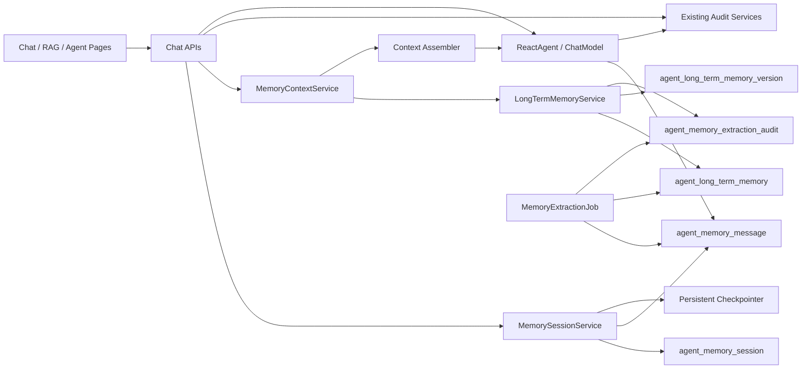

# Agent Memory Design

**日期:** 2026-06-16

**目标:** 为 CyberMario 增加可恢复、可审计、用户私有的 Agent Memory 能力，覆盖 Agent Chat、Agent Debug 和 RAG Chat。短期记忆按会话恢复，长期记忆按用户维护一份 Markdown 文档，由系统自动提取和合并，不开放用户手动编辑。

**当前背景:** 现有 Agent Chat/Debug 通过 `ReactAgentChatService` 调用 `ReactAgent#stream`，并用 `RunnableConfig.threadId(threadId)` 区分线程；`DefaultAgentRuntimeFactory` 当前仍使用 `MemorySaver`，重启后短期记忆不可恢复。RAG Chat 由 `RagChatServiceImpl` 直接组装 `Prompt(systemPrompt, userPrompt(...))`，请求 DTO 已有 `sessionId`。项目已有 Agent 对话审计、运行审计、RAG 权限服务和 RBAC resource provider，同类能力应接入这些边界。

---

## 1. 调研结论

### 1.1 Java2AI Memory 文档结论

Spring AI Alibaba / Java2AI 文档把 Memory 分成两类:

- 短期记忆: 通过 Agent checkpointer 保存 Graph state，使用 `threadId` 隔离不同会话；生产环境推荐使用 Redis 或数据库 backed checkpointer，而不是内存 `MemorySaver`。
- 长期记忆: 通过 `Store` 的 `namespace/key` 存储跨会话数据，可在工具或 `ModelHook` 中读取、写入、学习和注入。
- 上下文窗口治理: 长对话需要在模型调用前做消息修剪、删除或总结，避免无限增长。

这套机制适合 CyberMario 的短期记忆基础设施，但长期记忆不直接照搬 `Store` 搜索模型。CyberMario 一期长期记忆采用用户级 Markdown 文档，限制 20,000 字符，不做向量检索，避免把长期记忆做成第二套 RAG。

### 1.2 用户期望文档取舍

`/Users/mario/Downloads/multi_layer_memory_context_design_v2.md` 的核心思想是 L0/L1/L2/L3 分层、治理平面、lineage、生命周期、自动长期提取和 C7 多 Agent 记忆通信。一期实现保留以下思想:

- L1 会话级短期记忆: 最近对话、session note、可恢复 checkpoint。
- L3 用户级长期记忆: 用户偏好、稳定事实、可复用习惯，以 Markdown 文档形式保存。
- Governance Plane: 所有读取、写入、归档、删除、提取都要有用户归属、RBAC、审计和来源。
- Lifecycle: 会话和长期记忆都有 ACTIVE / ARCHIVED / DELETED 等可审计状态。
- C5 自动长期记忆提取: 从会话结束或后台任务中自动提取长期记忆。
- C7 只预留扩展点: 当前不做多 Agent 记忆总线，后续 Butler Agent 或子 Agent 协作时再启用。

一期明确不做 L2 任务级中期记忆、长期记忆向量检索、跨 Agent 主动通信和后台 Dream Consolidation 的复杂实现。

---

## 2. 需求范围

### 2.1 本次实现

- 覆盖 `AGENT_CHAT`、`AGENT_DEBUG`、`RAG_CHAT` 三类入口。
- Agent Chat 和 Agent Debug:
    - 每个 session 拥有独立短期记忆。
    - 同一用户下共享一份长期 Markdown 记忆。
    - 长期记忆可以从 Agent session 和被允许的 RAG session 中自动提取。
- RAG Chat:
    - 独立入口，继续作为 RAG 问答和检索调试入口。
    - 每个 session 拥有独立短期记忆。
    - 不拥有跨 session 的 RAG 长期记忆。
    - RAG session 可被用户开关控制是否作为 Agent 长期记忆的提取来源，默认开启。
- 短期记忆:
    - 默认保留最近 10 轮对话作为模型直接上下文窗口。
    - 重启后可恢复。
    - 非活跃会话不常驻内存。
    - Released session 可以再次恢复并继续聊。
- 长期记忆:
    - 每个用户一份 Markdown 文档。
    - 最大 20,000 字符。
    - 自动提取、自动合并，提取后直接 ACTIVE。
    - 用户可以查看和审计，不允许手动编辑。
    - 不做向量检索，不写入 RAG 知识库。
- 会话管理:
    - 会话支持 ACTIVE、RELEASED、ARCHIVED、DELETED 逻辑状态。
    - 前台默认不展示 archived session。
    - 归档会话进入归档页面。
    - archived session 可以逻辑删除。
    - deleted session 不参与上下文、恢复和长期记忆提取。
- 记忆管理页面:
    - 放在 Agent 菜单下。
    - 用户可查看自己的长期记忆、来源、版本、提取记录和 session 列表。
    - 用户可归档、恢复、逻辑删除自己的 session。
    - 用户可开关当前 session 的 memory 功能和 RAG session 的长期提取来源开关。
- RBAC:
    - 接入现有 RBAC resource provider / preset role / menu 裁剪 / API 权限体系。
    - `CHAT_BASIC` 默认拥有 Agent memory 基础权限。
    - `RAG_USER` 默认拥有 RAG Chat session memory 基础权限。
    - 普通用户只能访问自己的 memory 和 session。
    - 不允许跨用户读取记忆。
- Butler Agent:
    - 本次不实现。
    - 预留用户级全局 memory scope 和调用入口。
    - 后续 Butler Agent 默认拥有用户本人范围内全部记忆权限，不允许跨用户。

### 2.2 暂不实现

- 不做长期记忆向量检索、重排或 hybrid recall。
- 不把长期记忆写入 RAG 知识库。
- 不做组织级、项目级或跨用户共享长期记忆。
- 不开放用户手动编辑长期 Markdown。
- 不做用户手动合并长期记忆。
- 不做物理删除；删除均为逻辑删除。
- 不做多 Agent 记忆通信总线。
- 不做 Butler Agent 的平台全行为感知。
- 不新增外部队列。后台提取第一版使用 Spring 定时任务或事务后异步执行。
- 不启动项目。

---

## 3. 核心概念

### 3.1 Memory Entry Type

| 类型 | 入口 | 短期记忆范围 | 长期记忆范围 | 长期提取来源 |
|---|---|---|---|---|
| `AGENT_CHAT` | `/chat` | session | user | 是 |
| `AGENT_DEBUG` | `/agent/debug` | session | user | 是 |
| `RAG_CHAT` | `/rag/chat` | session | 无 | 可选，默认作为 Agent 长期记忆来源 |
| `BUTLER_AGENT` | 后续 | session / user global | user global | 后续 |

### 3.2 Session Status

| 状态 | 含义 | 前台默认列表 | 是否可恢复 | 是否可提取长期记忆 |
|---|---|---:|---:|---:|
| `ACTIVE` | 正在使用或最近使用 | 是 | 是 | 是 |
| `RELEASED` | 已释放运行态资源，不常驻内存 | 是 | 是 | 是 |
| `ARCHIVED` | 用户归档，进入归档页 | 否 | 是 | 否 |
| `DELETED` | 逻辑删除 | 否 | 否 | 否 |

释放不删除数据库数据，只释放运行态缓存和内存引用。恢复 released session 时，后端从持久化 checkpoint、session note 和 message event 中恢复必要上下文。

### 3.3 Memory Switch

需要两个层面的开关:

- `memoryEnabled`: 控制当前 session 是否使用短期记忆。默认开启。关闭后，本次请求不读历史，也不写入新的短期 memory event，但仍可写必要审计。
- `longTermExtractionEnabled`: 控制当前 session 是否允许作为长期记忆提取来源。Agent session 默认开启；RAG session 默认开启；用户可在前台关闭。

关闭 memory 不等于删除历史。已有 session 数据仍保留，可在用户重新开启或恢复 session 时继续使用，除非 session 已被逻辑删除。

---

## 4. 推荐架构



### 4.1 分层职责

| 组件 | 职责 |
|---|---|
| `MemorySessionService` | 创建、恢复、释放、归档、删除 session；校验 session 归属；保存 session 配置 |
| `MemoryContextService` | 为当前请求装配短期窗口、session note 和长期 Markdown 摘要 |
| `MemoryMessageService` | 持久化用户消息、assistant 消息、thinking、RAG sources 元数据 |
| `LongTermMemoryService` | 读取用户长期 Markdown，保存新版本，限制长度，提供审计 |
| `MemoryExtractionService` | 从会话消息中自动提取长期记忆，并合并进用户 Markdown |
| `MemoryCheckpointerProvider` | 提供生产可恢复 checkpointer，替换 `MemorySaver` |
| `AgentMemoryRbacResourceProvider` | 提供 Agent memory 菜单、按钮、API 权限和默认角色授权 |

### 4.2 与现有代码的接入点

- `DefaultAgentRuntimeFactory`
    - 将 `.saver(new MemorySaver())` 替换为注入式 checkpointer。
    - 增加 memory hook，用于在 `BEFORE_MODEL` 裁剪最近 10 轮并注入长期 Markdown。
    - 保持现有 `LoggingHook`、`ToolMonitorInterceptor`、MCP tool provider 和 runtime spec 逻辑。
- `ReactAgentChatService`
    - 在创建 `RunnableConfig` 前解析或创建 memory session。
    - 使用 sessionId 作为 `threadId`，并在 metadata 中写入 `userId`、`entryType`、`sessionId`。
    - 流式完成后写入 memory message，并触发长期提取。
    - 失败和取消时仍写入 session 状态与审计，不把失败 assistant 内容提取为长期记忆。
- `RagChatServiceImpl`
    - 在检索前解析或创建 RAG memory session。
    - 在 `userPrompt` 中加入当前 session 的最近 10 轮短期记忆。
    - RAG retrieval 仍只来自知识库；memory 只作为对话上下文，不作为事实来源。
    - 流式完成后保存 RAG session messages、sources 和提取资格。
- `RagChatRequest`
    - 复用现有 `sessionId`。
    - 增加 `memoryEnabled` 和 `longTermExtractionEnabled`。
- 前端 `ChatPage` / `AgentDebugPage` / `RagChatPage`
    - 从本地 state 持有 threadId/sessionId 改为以服务端 session 为准。
    - 页面增加 session 选择、归档入口和 memory 开关。

---

## 5. 短期记忆设计

### 5.1 持久化策略

短期记忆采用双轨:

1. ReactAgent checkpointer 保存框架需要的 Graph state，保证 Agent 能沿用工具调用和 messages 状态。
2. `agent_memory_message` 保存平台可审计、可展示、可提取的规范化消息事实源。

双轨的原因:

- checkpointer 是框架运行态恢复所需，适合 `ReactAgent`。
- message 表是产品能力事实源，适合页面列表、归档、审计、RAG Chat 和长期提取。
- 当 checkpointer 实现或框架版本变化时，message 表仍能作为兼容恢复来源。

### 5.2 最近 10 轮窗口

默认短期窗口为最近 10 轮。这里的 1 轮定义为一次 user message 和其后对应的 assistant response。对 Agent Debug 的 thinking、tool event 不单独计入轮数，但可以作为当前轮 assistant 附加内容保存。

窗口装配规则:

1. 当前用户消息永远保留。
2. 最近 10 轮 user / assistant message 直接进入上下文。
3. session note 可选注入，第一版只保存，不默认注入，避免和最近窗口重复。
4. archived / deleted session 不注入。
5. `memoryEnabled=false` 时不注入历史。

### 5.3 重启恢复

恢复顺序:

1. 校验 session 存在、未 deleted、属于当前用户。
2. 如果 session 为 `RELEASED`，将状态恢复为 `ACTIVE` 或更新 `last_active_at`。
3. 从 checkpointer 根据 `threadId=sessionId` 读取 Graph state。
4. 如果 checkpointer 为空或反序列化失败，使用 `agent_memory_message` 最近 10 轮构建降级上下文。
5. 继续写入同一个 session。

checkpointer 失败不得导致历史丢失。降级时只影响 Agent 内部 Graph state 的连续性，前台会话和长期提取仍以 message 表为准。

### 5.4 Released Session

Released 表示会话数据保留，但不再常驻运行态资源:

- 不保留任何 Java 内存中的 session 对象。
- 不保留 runtime cache 对 session 的强引用。
- 不删除 checkpointer 数据、message 数据和审计数据。
- 再次打开时按重启恢复流程恢复。

---

## 6. 长期 Markdown 记忆设计

### 6.1 存储形态

每个用户只有一份 active Markdown 文档:

```markdown
# User Memory

## Preferences
- ...

## Stable Facts
- ...

## Working Style
- ...

## Project And Tooling Notes
- ...

## RAG-Derived Notes
- ...

## Do Not Forget
- ...

## Source Index
- [M-20260616-0001] AGENT_CHAT session=... message=...
```

长期记忆只作为 Agent 个性化和上下文辅助，不作为事实检索系统。RAG 的事实依据仍来自知识库 sources。

### 6.2 字符限制

- `content_markdown` 最大 20,000 字符。
- 合并后超过限制时，先压缩低优先级和重复条目。
- 压缩后仍超过限制时，保留更高可信来源:
    - 用户明确表达优先。
    - 最近明确纠正优先。
    - 多次出现优先。
    - RAG 派生低于用户明确表达。
- 超限处理必须写入版本审计和提取审计。

### 6.3 自动提取与合并

触发时机:

- Agent Chat / Agent Debug 每轮完成后，异步判断是否需要提取。
- RAG Chat 每轮完成后，如果 `longTermExtractionEnabled=true`，异步判断是否需要作为 Agent 长期记忆来源。
- session 被 release 或 archive 前，补跑一次提取。

提取范围:

- 用户偏好。
- 稳定个人事实。
- 用户对平台、工具、回答风格的明确要求。
- 反复出现且对后续 Agent 行为有帮助的习惯。
- RAG 对话中用户表达出的需求、偏好、项目背景，不直接把知识库 chunk 写入长期记忆。

不提取:

- 一次性问题。
- RAG sources 原文。
- 模型不确定的猜测。
- 失败请求的半截输出。
- deleted 或 archived session 内容。

### 6.4 直接 ACTIVE

提取结果不进入人工审核队列，合并后直接成为 active Markdown 的新版本。为降低风险，系统必须保存:

- 提取前版本。
- 提取后版本。
- diff summary。
- 来源 session/message。
- 提取模型、traceId、requestId。
- 合并原因。

用户不能编辑 Markdown，但可以查看历史版本和来源。如果未来需要用户纠错，第一版建议提供“反馈/隐藏此条来源”的受控操作，而不是任意编辑 Markdown。

### 6.5 长期记忆注入

Agent Chat / Agent Debug 每次请求在 system prompt 后、最近短期窗口前注入长期 Markdown 的压缩视图:

```text
以下是当前用户的长期记忆，仅用于理解用户偏好和稳定背景。
不得把这些记忆当成外部事实来源；涉及知识库事实时必须以 RAG sources 为准。
...
```

注入策略:

- 长期 Markdown 总字符数不超过 20,000，但不一定全文注入。
- 第一版可注入全文，后续根据 token 压力增加分段摘要。
- RAG Chat 不读取用户级长期 Markdown，避免 RAG 调试入口被个性化长期记忆污染。
- Butler Agent 后续可读取用户全局长期 Markdown 和更多平台行为记忆。

---

## 7. RAG Chat 记忆边界

RAG Chat 仍然是 RAG，不变成 Agent Memory 检索。

### 7.1 RAG 请求上下文

RAG Chat prompt 装配顺序:

1. 固定 RAG system prompt。
2. 当前 RAG session 最近 10 轮短期记忆。
3. 本次检索得到的 sources。
4. 当前用户问题。

约束:

- sources 是事实依据。
- session memory 只用于追问、省略指代和本 session 对话连续性。
- 如果 memory 与 sources 冲突，回答必须以 sources 为准。
- 无 sources 时，仍按现有策略回答“知识库中没有找到明确依据”，不得用 memory 编造事实。

### 7.2 RAG 到 Agent 长期记忆

RAG session 自身没有长期记忆，但 Agent 长期记忆可以感知 RAG session:

- 仅当 session 属于同一用户。
- 仅当 `longTermExtractionEnabled=true`。
- 仅提取用户偏好、用户问题中透露的稳定背景、用户对平台行为的要求。
- 不提取知识库内容本身。
- 提取结果写入用户级 Agent Markdown 的 `RAG-Derived Notes` 或合适章节。

这样既保留了 RAG Chat 的独立调试属性，又能让 Agent Chat 后续理解用户在 RAG 中表达过的偏好和上下文。

---

## 8. 数据库设计

新增一个 Flyway migration，版本号按当前序列追加。当前 `db/migration` 最大版本为 `V16`，实现期应新增 `V17__create_agent_memory_schema.sql`，不要修改旧 migration。

### 8.1 `agent_memory_session`

```sql
CREATE TABLE agent_memory_session
(
    id                           BIGINT GENERATED BY DEFAULT AS IDENTITY PRIMARY KEY,
    session_id                   VARCHAR(128)             NOT NULL,
    entry_type                   VARCHAR(32)              NOT NULL,
    title                        VARCHAR(256),
    user_id                      BIGINT                   NOT NULL,
    username                     VARCHAR(128),
    status                       VARCHAR(32)              NOT NULL,
    memory_enabled               BOOLEAN                  NOT NULL DEFAULT TRUE,
    long_term_extraction_enabled BOOLEAN                  NOT NULL DEFAULT TRUE,
    short_term_window_turns      INTEGER                  NOT NULL DEFAULT 10,
    last_active_at               TIMESTAMP WITH TIME ZONE,
    released_at                  TIMESTAMP WITH TIME ZONE,
    archived_at                  TIMESTAMP WITH TIME ZONE,
    deleted_at                   TIMESTAMP WITH TIME ZONE,
    created_at                   TIMESTAMP WITH TIME ZONE NOT NULL,
    updated_at                   TIMESTAMP WITH TIME ZONE NOT NULL,
    version                      BIGINT                   NOT NULL DEFAULT 0,
    deleted                      BOOLEAN                  NOT NULL DEFAULT FALSE
);
```

索引:

- `uk_agent_memory_session_id(session_id)`
- `idx_agent_memory_session_user_status(user_id, status, updated_at)`
- `idx_agent_memory_session_entry_user(entry_type, user_id, updated_at)`

### 8.2 `agent_memory_message`

```sql
CREATE TABLE agent_memory_message
(
    id                    BIGINT GENERATED BY DEFAULT AS IDENTITY PRIMARY KEY,
    session_id            VARCHAR(128)             NOT NULL,
    user_id               BIGINT                   NOT NULL,
    entry_type            VARCHAR(32)              NOT NULL,
    seq_no                INTEGER                  NOT NULL,
    turn_no               INTEGER                  NOT NULL,
    role                  VARCHAR(32)              NOT NULL,
    message_type          VARCHAR(32)              NOT NULL,
    content               TEXT,
    content_chars         INTEGER,
    source_refs_json      TEXT,
    trace_id              VARCHAR(64),
    request_id            VARCHAR(64),
    created_at            TIMESTAMP WITH TIME ZONE NOT NULL,
    deleted               BOOLEAN                  NOT NULL DEFAULT FALSE
);
```

索引:

- `idx_agent_memory_message_session_seq(session_id, seq_no)`
- `idx_agent_memory_message_user_created(user_id, created_at)`
- `idx_agent_memory_message_entry_created(entry_type, created_at)`

### 8.3 `agent_long_term_memory`

```sql
CREATE TABLE agent_long_term_memory
(
    id                    BIGINT GENERATED BY DEFAULT AS IDENTITY PRIMARY KEY,
    user_id               BIGINT                   NOT NULL,
    username              VARCHAR(128),
    scope_type            VARCHAR(32)              NOT NULL,
    content_markdown      TEXT                     NOT NULL,
    content_chars         INTEGER                  NOT NULL,
    active_version_id     BIGINT,
    status                VARCHAR(32)              NOT NULL,
    created_at            TIMESTAMP WITH TIME ZONE NOT NULL,
    updated_at            TIMESTAMP WITH TIME ZONE NOT NULL,
    version               BIGINT                   NOT NULL DEFAULT 0,
    deleted               BOOLEAN                  NOT NULL DEFAULT FALSE
);
```

约束:

- 同一 `user_id + scope_type + deleted=false` 只能有一条 active 长期记忆。
- `scope_type` 一期使用 `USER_AGENT`，预留 `USER_BUTLER`。

### 8.4 `agent_long_term_memory_version`

```sql
CREATE TABLE agent_long_term_memory_version
(
    id                    BIGINT GENERATED BY DEFAULT AS IDENTITY PRIMARY KEY,
    memory_id             BIGINT                   NOT NULL,
    version_no            INTEGER                  NOT NULL,
    content_markdown      TEXT                     NOT NULL,
    content_chars         INTEGER                  NOT NULL,
    change_summary        TEXT,
    source_session_ids    TEXT,
    source_message_ids    TEXT,
    request_id            VARCHAR(64),
    trace_id              VARCHAR(64),
    created_at            TIMESTAMP WITH TIME ZONE NOT NULL
);
```

### 8.5 `agent_memory_extraction_audit`

```sql
CREATE TABLE agent_memory_extraction_audit
(
    id                    BIGINT GENERATED BY DEFAULT AS IDENTITY PRIMARY KEY,
    user_id               BIGINT                   NOT NULL,
    session_id            VARCHAR(128),
    entry_type            VARCHAR(32),
    source_message_ids    TEXT,
    status                VARCHAR(32)              NOT NULL,
    extracted_markdown    TEXT,
    merged_version_id     BIGINT,
    error_code            VARCHAR(256),
    error_message         TEXT,
    request_id            VARCHAR(64),
    trace_id              VARCHAR(64),
    started_at            TIMESTAMP WITH TIME ZONE NOT NULL,
    finished_at           TIMESTAMP WITH TIME ZONE,
    created_at            TIMESTAMP WITH TIME ZONE NOT NULL
);
```

用途:

- 用户可审计自己的提取记录。
- 管理员仍不能跨用户读取普通用户记忆内容，除非未来明确增加合规审计角色；本次不增加。

---

## 9. 后端 API 设计

### 9.1 Session API

放在 `/api/agent/memory/sessions`:

- `GET /api/agent/memory/sessions?entryType=&status=&archived=`
    - 查询当前用户 session。
    - 默认排除 `ARCHIVED` 和 `DELETED`。
- `POST /api/agent/memory/sessions`
    - 创建 session。
    - 请求包含 `entryType`、`title`、开关。
- `GET /api/agent/memory/sessions/{sessionId}`
    - 查询当前用户 session 详情。
- `PATCH /api/agent/memory/sessions/{sessionId}`
    - 修改 title、memory 开关、long-term extraction 开关。
- `POST /api/agent/memory/sessions/{sessionId}/release`
    - 释放 session 运行态资源，状态变为 `RELEASED`。
- `POST /api/agent/memory/sessions/{sessionId}/restore`
    - 恢复 released 或 archived session。
- `POST /api/agent/memory/sessions/{sessionId}/archive`
    - 归档 session。
- `DELETE /api/agent/memory/sessions/{sessionId}`
    - 逻辑删除 session，仅允许 archived session。

### 9.2 Message API

- `GET /api/agent/memory/sessions/{sessionId}/messages`
    - 查询当前用户 session messages。
    - 默认分页，按 seq_no 升序。
    - deleted session 不可查。

### 9.3 Long-Term Memory API

- `GET /api/agent/memory/long-term`
    - 查询当前用户 active Markdown 和元数据。
- `GET /api/agent/memory/long-term/versions`
    - 查询当前用户版本列表。
- `GET /api/agent/memory/long-term/versions/{versionId}`
    - 查询当前用户某版本内容。
- `GET /api/agent/memory/extractions`
    - 查询当前用户提取审计。

不提供 `PUT/PATCH long-term content`。用户不能手动编辑。

### 9.4 Chat API 调整

Agent Chat:

- 保留现有 `/api/chat/stream` 行为兼容。
- 请求支持 `sessionId`、`memoryEnabled`。
- 如果没有 sessionId，后端创建 `AGENT_CHAT` session 并在 stream metadata 返回。

Agent Debug:

- 调试请求支持 `sessionId`、`memoryEnabled`、`longTermExtractionEnabled`。
- `entryType=AGENT_DEBUG`。

RAG Chat:

- `RagChatRequest` 增加 `memoryEnabled`、`longTermExtractionEnabled`。
- 如果没有 sessionId，后端创建 `RAG_CHAT` session 并在 metadata 返回。
- metadata event 返回 `sessionId`、`memoryEnabled`、`longTermExtractionEnabled`。

---

## 10. RBAC 设计

### 10.1 Resource Provider

新增 `AgentMemoryRbacResourceProvider`，`APP_CODE = "agent"`，输出以下资源:

菜单:

- `menu:agent:memory` -> `/agent/memory`，名称 `记忆管理`。
- `menu:agent:memory-archive` -> `/agent/memory/archive`，名称 `归档会话`。

API:

- `api:agent:memory:session:collection` -> `GET/POST /api/agent/memory/sessions`
- `api:agent:memory:session:*` -> `ANY /api/agent/memory/sessions/**`
- `api:agent:memory:message:read` -> `GET /api/agent/memory/sessions/*/messages`
- `api:agent:memory:long-term:read` -> `GET /api/agent/memory/long-term`
- `api:agent:memory:long-term:version` -> `GET /api/agent/memory/long-term/versions/**`
- `api:agent:memory:extraction:read` -> `GET /api/agent/memory/extractions`

按钮:

- `btn:agent:memory:switch` -> session memory 开关。
- `btn:agent:memory:archive` -> 归档 session。
- `btn:agent:memory:restore` -> 恢复 session。
- `btn:agent:memory:delete` -> 逻辑删除 archived session。
- `btn:agent:memory:release` -> 释放 session。

### 10.2 Preset Roles

`CHAT_BASIC` 默认追加:

- `menu:agent:memory`
- `menu:agent:memory-archive`
- `api:agent:memory:session:collection`
- `api:agent:memory:session:*`
- `api:agent:memory:message:read`
- `api:agent:memory:long-term:read`
- `api:agent:memory:long-term:version`
- `api:agent:memory:extraction:read`
- 对应 memory buttons

`RAG_USER` 默认追加:

- `api:agent:memory:session:collection`
- `api:agent:memory:session:*`
- `api:agent:memory:message:read`
- `btn:agent:memory:switch`
- `btn:agent:memory:archive`
- `btn:agent:memory:restore`
- `btn:agent:memory:delete`

RAG 用户是否看到 Agent 菜单取决于是否同时拥有 `menu:agent:memory`。为了避免 RAG_USER 被强行带入 Agent 管理菜单，RAG 页面自己的 session 控件可以只依赖 API/button 权限，不要求显示 Agent 记忆管理页。

### 10.3 数据权限

RBAC 只决定能否调用 API。业务服务必须继续做数据归属校验:

- 所有 session 查询条件强制追加 `user_id = principal.userId()`。
- 所有 long-term memory 查询强制追加 `user_id = principal.userId()`。
- 所有 mutation 先按 `session_id + user_id + deleted=false` 取数。
- 不提供 super-admin 绕过读取用户 memory 的默认逻辑。
- 后续 Butler Agent 读取 memory 时也必须使用当前登录用户 userId 作为 scope，不接受请求体传入 userId。

---

## 11. 前端设计

### 11.1 Chat 页面

Agent Chat:

- 顶部增加 session 选择器，支持新建、切换、释放、归档。
- 增加 Memory 开关，默认开启。
- session label 显示当前状态和短期窗口。
- 新会话按钮调用后端创建 session，不只清空本地 state。

RAG Chat:

- 保留知识库、TopK、候选数、阈值、检索模式、Rerank 控件。
- 增加 session 选择器。
- 增加 Memory 开关，默认开启。
- 增加“允许提取到 Agent 长期记忆”开关，默认开启。
- 来源抽屉仍展示 RAG sources，不展示 memory 作为 sources。

Agent Debug:

- 复用 session 选择器和 Memory 开关。
- 调试预设和 memory session 独立，preset 影响 agent runtime，session 影响上下文。

### 11.2 记忆管理页

路径:

- `/agent/memory`
- `/agent/memory/archive`

`/agent/memory` 页面布局:

- 顶部: 用户长期记忆摘要、字符数、更新时间、状态。
- 主区左侧: Markdown 只读预览。
- 主区右侧: 版本列表、提取记录、来源 session。
- 下方: active/released session 列表，按 Agent Chat、Agent Debug、RAG Chat 过滤。

`/agent/memory/archive` 页面:

- archived session 列表。
- 支持恢复和逻辑删除。
- 删除前二次确认。

用户不能编辑 Markdown。页面上不出现任意文本编辑器。

---

## 12. Butler Agent 扩展点

Butler Agent 是后续用户级全局管家，不在本次实现。

本次预留:

- `entry_type = BUTLER_AGENT`
- `scope_type = USER_BUTLER`
- `MemoryContextService` 支持按 entry type 决定读取哪些 memory scope。
- session metadata 预留 `agent_id`。
- 提取审计预留 `extractor_type` 或 `entry_type`。

Butler Agent 后续权限模型:

- 默认可读取同一用户的 Agent Chat、Agent Debug、RAG Chat session 摘要和用户级长期记忆。
- 可感知平台操作、偏好和对话，但必须仍在当前用户 userId 范围内。
- 不允许通过管理员角色或请求参数读取其他用户记忆。

---

## 13. 错误处理与降级

| 场景 | 处理 |
|---|---|
| checkpointer 写入失败 | 本轮仍可继续流式输出；message 表写入成功则记录降级告警 |
| message 表写入失败 | 返回业务错误或在 stream error event 中暴露；不触发长期提取 |
| 长期提取失败 | 不影响主聊天；写 `agent_memory_extraction_audit` failed |
| 长期 Markdown 合并超限 | 自动压缩；仍超限则保留旧版本并记录 failed |
| session 不属于当前用户 | 返回 403/业务 forbidden |
| session 已 deleted | 返回 not found，不泄露存在性 |
| session archived 但用户继续发送 | 要求先 restore，避免归档会话被隐式激活 |
| RAG 无 sources | 不用 memory 编造事实，维持现有 no context 响应 |

---

## 14. 验证计划

### 14.1 后端

- `MemorySessionServiceTests`
    - 创建、释放、恢复、归档、逻辑删除。
    - 非本人 session 访问失败。
    - archived 默认不出现在普通列表。
- `MemoryContextServiceTests`
    - 默认最近 10 轮窗口。
    - `memoryEnabled=false` 不注入历史。
    - deleted/archived session 不参与上下文。
- `LongTermMemoryServiceTests`
    - 每用户一份 active Markdown。
    - 20,000 字符限制。
    - 版本记录和来源记录正确。
- `MemoryExtractionServiceTests`
    - Agent session 可提取。
    - RAG session 默认可提取。
    - RAG sources 不进入长期记忆。
    - extraction switch 关闭时不提取。
- `AgentMemoryRbacResourceProviderTests`
    - 资源 code、role preset、菜单 path、按钮/API 绑定稳定。
- RAG/Agent 集成测试:
    - 重启或重建 service 后可用 sessionId 恢复最近上下文。
    - RAG Chat session memory 不跨 session。
    - Agent Chat 长期记忆跨 session 生效。

### 14.2 前端

- `menu.test.tsx`
    - `CHAT_BASIC` 可见 `/agent/memory`。
    - 非授权用户不可见。
    - archived 页面按权限展示。
- Chat 页面测试:
    - 新建 session 后使用服务端返回 sessionId。
    - memory 开关随请求提交。
    - release/restore/archive/delete 按钮权限生效。
- RAG 页面测试:
    - sessionId、memoryEnabled、longTermExtractionEnabled 随请求提交。
    - sources 展示不混入 memory。

### 14.3 验证命令

实现期优先使用:

```bash
cd /Users/mario/SelfProject/CyberMario/be
mvn -Djava.version=21 -Dmaven.build.cache.enabled=false test
```

如果全量测试受无关模块影响，降级为 targeted tests，并明确报告未覆盖范围。

前端:

```bash
cd /Users/mario/SelfProject/CyberMario/fe
npm test -- --run
npm run build
```

---

## 15. 实施顺序

1. 新增 Flyway migration、PO、Repository 和 enum。
2. 实现 `MemorySessionService`、`MemoryMessageService`、`LongTermMemoryService`。
3. 实现 persistent checkpointer provider，并替换 `DefaultAgentRuntimeFactory` 中的 `MemorySaver`。
4. 实现 Agent Chat/Debug memory 接入。
5. 实现 RAG Chat memory 接入。
6. 实现自动提取与 Markdown 合并。
7. 新增 RBAC provider、permission code、前端菜单。
8. 实现 Agent 记忆管理页和归档页。
9. 补充后端和前端测试。

这个顺序保证数据层和权限边界先稳定，再接入聊天流，最后补页面。

---

## 16. 设计风险

- Spring AI Alibaba checkpointer 的数据库实现需要以当前依赖实际 API 为准。如果当前 jar 没有 PostgreSQL saver，可先实现项目内 JPA checkpointer adapter，保持 `MemoryCheckpointerProvider` 接口不变。
- ReactAgent 的 message hook 需要验证 `UpdatePolicy.REPLACE` 是否会影响工具调用状态。若风险较高，第一版只在项目层装配最近窗口，不改 Graph state 裁剪。
- 长期 Markdown 自动合并直接 ACTIVE，可能写入低质量记忆。通过来源审计、版本回滚能力和严格提取 prompt 降低风险。
- 不做向量检索会让长期记忆注入依赖 Markdown 组织质量。20,000 字符限制和章节化模板是第一版的控制手段。
- RAG session 作为 Agent 长期来源时，必须严格避免把知识库 chunk 原文提取为个人长期记忆。

---

## 17. 完成标准

- Agent Chat、Agent Debug、RAG Chat 都能创建和继续 session。
- 短期记忆默认 10 轮，服务重启后可恢复。
- Released session 不常驻内存，恢复后可继续聊。
- Archived session 不在默认列表展示，可在归档页恢复或逻辑删除。
- Agent 长期 Markdown 跨 Agent session 生效。
- RAG session memory 只在本 session 生效。
- RAG session 可作为 Agent 长期记忆提取来源，默认开启，可关闭。
- 用户可在 Agent 记忆管理页审计自己的长期记忆、版本、来源和提取记录。
- 用户不能手动编辑长期记忆。
- 所有 memory API 接入 RBAC，并在业务层强制 userId 自隔离。
- 不存在跨用户读取 memory 的路径。
