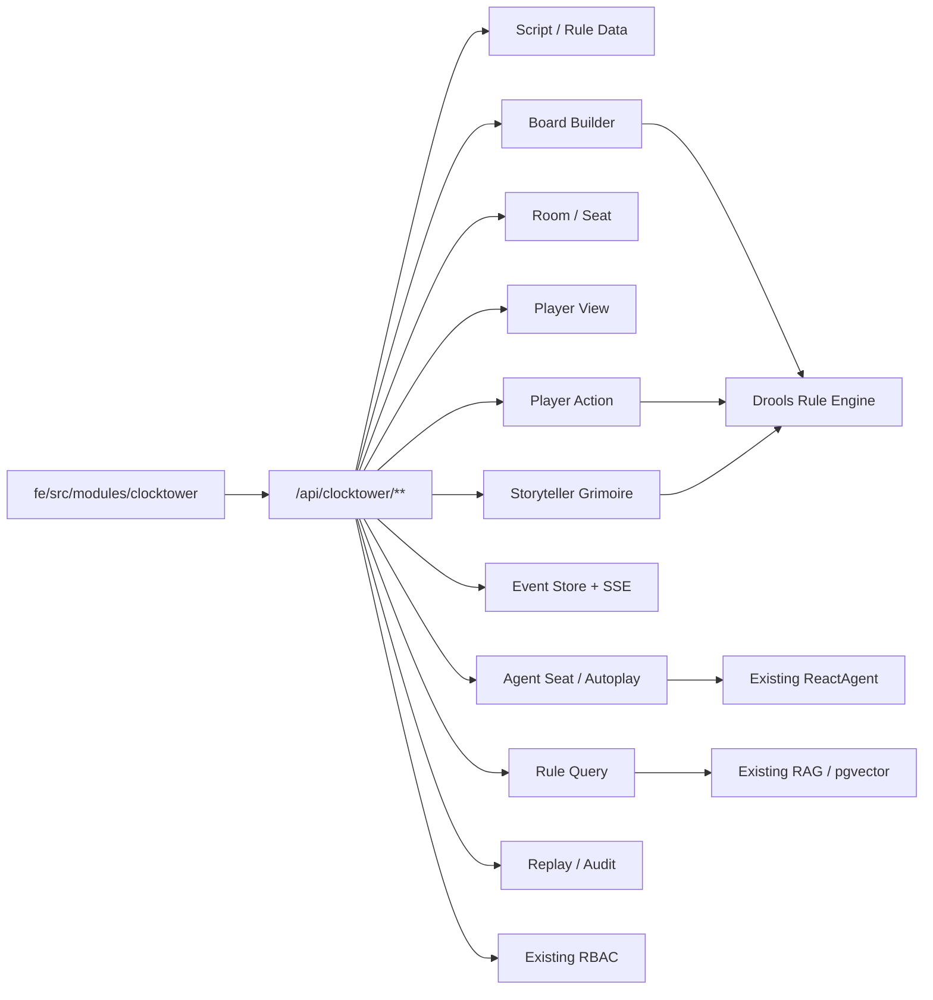

# Clocktower API and Module Detail Design

**日期:** 2026-06-17

**目标:** 在 Clocktower Agent Platform 概要设计和 Drools 规则引擎详细设计之外，补齐平台其余部分的接口级详细设计。本文覆盖规则数据、配板、房间、玩家视角、玩家动作、说书人魔典、实时事件、Agent 席位、自玩、规则查询、回放审计、管理维护、RBAC 和前端模块。

**边界:** 本文不重新展开 Drools 内部规则模型。规则引擎实现以 `docs/superpowers/specs/2026-06-17-clocktower-drools-rule-engine-detail-design.md` 为准。本文描述 Controller、Service、DTO、前端 service 和页面如何调用规则引擎、事件服务和现有 Agent/RAG/RBAC 能力。

---

## 1. 总体架构



Clocktower 作为独立领域模块接入现有系统:

- 后端新增 `top.egon.mario.clocktower`。
- 前端新增 `fe/src/modules/clocktower`。
- 普通业务接口使用 `/api/clocktower/**`。
- 管理维护和审计接口使用 `/api/admin/clocktower/**`。
- 所有对局行为最终写入 `ClocktowerEvent`，由投影服务更新当前状态。
- 前端页面、实时推送、玩家 Agent prompt 都必须经过同一个可见性过滤服务。

## 2. 技术栈和项目约定

| 层 | 技术和约定 |
|---|---|
| HTTP API | Spring Boot 3.5 + WebFlux `@RestController` |
| 请求体 | `@Valid @RequestBody Mono<Request>` |
| 当前用户 | `@AuthenticationPrincipal RbacPrincipal principal` |
| 持久化 | Spring Data JPA + PostgreSQL |
| 数据迁移 | Flyway；单次数据库变更新增一个版本文件，不修改既有 migration |
| 权限 | 现有 RBAC Resource Provider + service 内房间/席位校验 |
| 实时 | WebFlux SSE，路径 `/events/stream` |
| 规则 | Drools 混合规则引擎 |
| Agent | 现有 Spring AI Alibaba ReactAgent、Agent Run Audit、Agent Memory |
| RAG | 现有 RAG、pgvector、retrieval trace |
| 前端 | React 19、TypeScript、React Router、Ant Design 6、Axios、Vitest |
| 前端服务 | `requestJson`、`streamJsonLines`、`buildSearchParams` |

## 3. 后端模块结构

```text
top.egon.mario.clocktower
  script/
    web/
    service/
    repository/
    po/
    dto/
  board/
    web/
    service/
    repository/
    po/
    dto/
  room/
    web/
    service/
    repository/
    po/
    dto/
  view/
    web/
    service/
    dto/
  action/
    web/
    service/
    dto/
  grimoire/
    web/
    service/
    repository/
    po/
    dto/
  event/
    web/
    service/
    repository/
    po/
    dto/
  agent/
    web/
    service/
    repository/
    po/
    dto/
  rulequery/
    web/
    service/
    dto/
  replay/
    web/
    service/
    dto/
  admin/
    web/
    service/
  resource/
    ClocktowerRbacResourceProvider.java
```

模块职责:

| 模块 | 职责 |
|---|---|
| `script` | 剧本、角色、夜晚顺序、术语、相克规则、来源文档 |
| `board` | 配板生成、校验、保存、评分、候选配置 |
| `room` | 房间、座位、加入、离开、开始、归档 |
| `view` | 当前用户视角聚合 |
| `action` | 玩家动作统一入口 |
| `grimoire` | 说书人魔典、状态标记、夜晚 checklist、裁定任务 |
| `event` | 事件写入、投影、SSE、可见性过滤 |
| `agent` | Agent 席位、Agent step、自玩控制 |
| `rulequery` | 结构化规则 + RAG 问答 |
| `replay` | 公开/完整回放、投票历史、对局复盘 |
| `admin` | 规则数据维护和审计 |
| `resource` | RBAC 菜单、API、按钮和默认角色 |

## 4. 通用 DTO

### 4.1 Page Response

复用项目已有 `PageResult` 形态:

```ts
type ClocktowerPage<T> = {
  records: T[]
  page: number
  size: number
  total: number
}
```

### 4.2 Error Response

业务校验失败使用现有 `ApiResponse` 错误封装。规则引擎拒绝动作时，HTTP 仍可返回 200，并在响应体里标记 `accepted=false`，这样前端可以展示“动作被规则拒绝”而不是网络错误。

```ts
type ClocktowerActionResponse = {
  accepted: boolean
  eventIds: number[]
  rejectedReason?: string
  rejectedCode?: string
  newAvailableActions: AvailableActionResponse[]
}
```

### 4.3 Enums

```ts
type ClocktowerScriptCode = 'TROUBLE_BREWING' | 'BAD_MOON_RISING' | 'SECTS_AND_VIOLETS'
type ClocktowerRoleType = 'TOWNSFOLK' | 'OUTSIDER' | 'MINION' | 'DEMON' | 'TRAVELER' | 'FABLED'
type ClocktowerRoomStatus = 'LOBBY' | 'SETUP' | 'RUNNING' | 'ENDED' | 'ARCHIVED'
type ClocktowerPhase = 'DRAFT' | 'LOBBY' | 'SETUP' | 'FIRST_NIGHT' | 'DAY' | 'NOMINATION' | 'EXECUTION' | 'NIGHT' | 'ENDED'
type ClocktowerVisibility = 'PUBLIC' | 'PRIVATE' | 'STORYTELLER' | 'AUDIT'
type ClocktowerViewerMode = 'PLAYER' | 'STORYTELLER' | 'AGENT_PLAYER' | 'AGENT_STORYTELLER' | 'PUBLIC_REPLAY' | 'FULL_REPLAY'
type ClocktowerSeatController = 'HUMAN' | 'AGENT' | 'EMPTY'
```

## 5. 剧本与规则数据接口

Controller: `ClocktowerScriptController`  
Service: `ClocktowerScriptService`

### 5.1 List Scripts

`GET /api/clocktower/scripts`

用途: 获取启用的剧本列表，供配板器、建房、规则查询入口使用。

权限: 登录用户。

Response:

```ts
type ClocktowerScriptResponse = {
  scriptCode: ClocktowerScriptCode
  name: string
  edition: string
  minPlayers: number
  maxPlayers: number
  roleCount: number
  enabled: boolean
  sourceUrl?: string
}
```

实现:

- 从 `clocktower_script` 查询 `enabled=true` 的剧本。
- 按 `sortOrder` 返回。
- 不返回角色明细，避免首屏数据过重。

前端:

- `getClocktowerScripts()`
- `BoardBuilderPage`、`RoomLobbyPage`、`RuleQueryPage` 使用。

### 5.2 Script Detail

`GET /api/clocktower/scripts/{scriptCode}`

用途: 获取剧本详情。

Response:

```ts
type ClocktowerScriptDetailResponse = ClocktowerScriptResponse & {
  typeCounts: RoleTypeCountResponse
  sourceDocuments: SourceDocumentResponse[]
  nightOrderSummary: {
    firstNightCount: number
    otherNightCount: number
  }
}
```

实现:

- 聚合 `clocktower_script`、`clocktower_role`、`clocktower_night_order`、`clocktower_source_document`。
- 可缓存静态结果。

### 5.3 Script Roles

`GET /api/clocktower/scripts/{scriptCode}/roles`

Query:

```text
roleType?: TOWNSFOLK | OUTSIDER | MINION | DEMON | TRAVELER | FABLED
enabled?: boolean
```

Response:

```ts
type ClocktowerRoleResponse = {
  roleCode: string
  scriptCode: ClocktowerScriptCode
  name: string
  roleType: ClocktowerRoleType
  alignment: 'GOOD' | 'EVIL' | 'NEUTRAL'
  abilityText: string
  firstNight: boolean
  otherNight: boolean
  setupModifier: boolean
  complexity: number
  sourceUrl?: string
}
```

实现:

- 配板器角色池、魔典手动换角色、角色详情都使用。
- `abilityText` 是结构化摘要，不直接替代百科原文。

### 5.4 Night Order

`GET /api/clocktower/scripts/{scriptCode}/night-order`

Query:

```text
nightType=FIRST_NIGHT | OTHER_NIGHT
```

Response:

```ts
type ClocktowerNightOrderResponse = {
  roleCode: string
  roleName: string
  orderNo: number
  nightType: 'FIRST_NIGHT' | 'OTHER_NIGHT'
  wakeCondition?: string
}
```

实现:

- 查询静态夜晚顺序。
- 当前对局动态 checklist 不走这个接口，走 `/night-checklist`。

### 5.5 Terms

`GET /api/clocktower/terms`

Query:

```text
keyword?: string
page?: number
size?: number
```

Response:

```ts
type ClocktowerTermResponse = {
  termCode: string
  name: string
  aliases: string[]
  description: string
  sourceUrl?: string
}
```

实现:

- 术语结构化查询。
- 规则查询页自动补全使用。

### 5.6 Jinx Rules

`GET /api/clocktower/jinx-rules`

Query:

```text
scriptCode?: string
roleCode?: string
severity?: INFO | WARN | BLOCK
```

Response:

```ts
type ClocktowerJinxRuleResponse = {
  id: number
  roleACode: string
  roleBCode: string
  scope: 'SETUP' | 'RUNTIME' | 'BOTH'
  severity: 'INFO' | 'WARN' | 'BLOCK'
  effectType: string
  ruleText: string
  sourceUrl?: string
}
```

实现:

- 配板器和规则查询共用。
- Phase 1 主要作为 warning/block。
- Phase 2 与 Drools runtime jinx 规则联动。

## 6. 配板器接口

Controller: `ClocktowerBoardController`  
Service: `ClocktowerBoardService`

### 6.1 Generate Board

`POST /api/clocktower/boards/generate`

用途: 生成候选配板。

Request:

```ts
type ClocktowerBoardGenerateRequest = {
  scriptCode: ClocktowerScriptCode
  playerCount: number
  difficulty: number
  chaos: number
  evilPressure: number
  newbieFriendly: boolean
  candidateCount: number
  lockedRoleCodes?: string[]
  bannedRoleCodes?: string[]
  seed?: string
}
```

Response:

```ts
type ClocktowerBoardGenerateResponse = {
  requestId: string
  candidates: ClocktowerBoardCandidateResponse[]
}

type ClocktowerBoardCandidateResponse = {
  candidateId: string
  scriptCode: ClocktowerScriptCode
  playerCount: number
  roles: BoardRoleResponse[]
  typeCounts: RoleTypeCountResponse
  score: BoardScoreResponse
  validation: BoardValidationResponse
  storytellerNotes: string[]
}

type BoardRoleResponse = {
  roleCode: string
  roleName: string
  roleType: ClocktowerRoleType
  alignment: 'GOOD' | 'EVIL' | 'NEUTRAL'
  locked: boolean
}

type BoardScoreResponse = {
  balanceScore: number
  complexityScore: number
  chaosScore: number
  newbieScore: number
  evilPressureScore: number
  storytellerLoad: number
  explanations: string[]
}
```

实现流程:

1. Java 根据人数和剧本获取角色池。
2. 应用 locked / banned 约束。
3. 生成候选 role set。
4. Drools 校验角色数量、设置修正、相克风险。
5. Drools 和 Java scoring 输出评分与说明。
6. 不落库，返回临时候选。

框架:

- Java service 负责候选生成和随机种子。
- Drools 负责规则校验和评分。
- JPA 查询结构化规则数据。

前端:

- `generateClocktowerBoard(request)`
- `BoardBuilderPage` 点击生成或重 roll。

### 6.2 Validate Board

`POST /api/clocktower/boards/validate`

用途: 校验手动调整后的配板。

Request:

```ts
type ClocktowerBoardValidateRequest = {
  scriptCode: ClocktowerScriptCode
  playerCount: number
  roleCodes: string[]
}
```

Response:

```ts
type BoardValidationResponse = {
  valid: boolean
  issues: BoardValidationIssueResponse[]
  typeCounts: RoleTypeCountResponse
  jinxWarnings: JinxWarningResponse[]
}

type BoardValidationIssueResponse = {
  code: string
  severity: 'INFO' | 'WARN' | 'ERROR'
  message: string
  relatedRoleCodes?: string[]
}

type RoleTypeCountResponse = {
  townsfolk: number
  outsider: number
  minion: number
  demon: number
  traveler: number
  fabled: number
}
```

实现:

- 不生成新配置。
- 调用 Drools `BOARD_VALIDATION` 模式。
- 前端换角色后实时调用。

### 6.3 Save Board

`POST /api/clocktower/boards/save`

用途: 保存配板草稿。

Request:

```ts
type ClocktowerBoardSaveRequest = {
  name: string
  scriptCode: ClocktowerScriptCode
  playerCount: number
  roleCodes: string[]
  score: BoardScoreResponse
  validationSnapshot: BoardValidationResponse
}
```

Response: `ClocktowerBoardResponse`

实现:

- 保存 `clocktower_board_config`。
- 保存 `clocktower_board_role`。
- 保存 score 和 validation snapshot，后续建房仍重新校验一次。
- 只允许当前用户读取和删除自己的配板，管理员可查询全部。

### 6.4 List Boards

`GET /api/clocktower/boards`

Query:

```text
scriptCode?: string
playerCount?: number
page?: number
size?: number
```

Response: `ClocktowerPage<ClocktowerBoardResponse>`

实现:

- 当前用户自己的配板。
- 已被对局引用的配板也可删除草稿记录，但对局保留 snapshot。

### 6.5 Delete Board

`DELETE /api/clocktower/boards/{boardId}`

Response: empty

实现:

- 逻辑删除。
- 不影响已创建房间的 board snapshot。

## 7. 房间大厅接口

Controller: `ClocktowerRoomController`  
Service: `ClocktowerRoomService`

### 7.1 Create Room

`POST /api/clocktower/rooms`

Request:

```ts
type ClocktowerRoomCreateRequest = {
  name: string
  scriptCode: ClocktowerScriptCode
  playerCount: number
  boardCandidateId?: string
  boardId?: number
  roleCodes?: string[]
  storytellerMode: 'HUMAN' | 'AGENT'
  allowSpectators: boolean
  allowPrivateChat: boolean
  agentSeatCount: number
}
```

Response: `ClocktowerRoomResponse`

```ts
type ClocktowerRoomResponse = {
  roomId: number
  roomCode: string
  name: string
  scriptCode: ClocktowerScriptCode
  status: ClocktowerRoomStatus
  phase: ClocktowerPhase
  playerCount: number
  storytellerUserId?: number
  storytellerMode: 'HUMAN' | 'AGENT'
  allowSpectators: boolean
  allowPrivateChat: boolean
  seats: ClocktowerSeatResponse[]
  createdAt: string
  updatedAt: string
}
```

实现:

1. 校验创建权限。
2. 校验 script 和 playerCount。
3. 解析 boardId / roleCodes / candidate snapshot。
4. 生成 roomCode。
5. 创建 `clocktower_room`。
6. 创建固定数量 `clocktower_seat`。
7. 写 `ROOM_CREATED` 事件。

### 7.2 List Rooms

`GET /api/clocktower/rooms`

Query:

```text
status?: LOBBY | SETUP | RUNNING | ENDED | ARCHIVED
role?: STORYTELLER | PLAYER | SPECTATOR
page?: number
size?: number
```

Response: `ClocktowerPage<ClocktowerRoomSummaryResponse>`

实现:

- 普通用户只看自己参与的房间。
- 说书人看自己主持的房间。
- 管理员全量查询走 admin audit。

### 7.3 Room Detail

`GET /api/clocktower/rooms/{roomId}`

Response: `ClocktowerRoomResponse`

实现:

- 返回房间和公开座位信息。
- 不返回角色身份、魔典 marker。
- 私密信息走 player view 或 grimoire。

### 7.4 Join Room

`POST /api/clocktower/rooms/{roomId}/join`

Request:

```ts
type ClocktowerRoomJoinRequest = {
  seatNo?: number
  displayName?: string
  joinCode?: string
}
```

Response: `ClocktowerSeatResponse`

实现:

- 校验房间在 `LOBBY`。
- 校验座位空闲。
- 自动分配或绑定指定 seat。
- 写 `PLAYER_JOINED` 事件。
- SSE 推送大厅变化。

### 7.5 Leave Room

`POST /api/clocktower/rooms/{roomId}/leave`

Request:

```ts
type ClocktowerRoomLeaveRequest = {
  seatId?: number
}
```

Response: `ClocktowerRoomResponse`

实现:

- `LOBBY` 中释放 seat。
- `RUNNING` 中只标记 disconnected，不删除 seat。
- 写 `PLAYER_LEFT` 或 `PLAYER_DISCONNECTED`。

### 7.6 Update Seat

`PATCH /api/clocktower/rooms/{roomId}/seats/{seatId}`

Request:

```ts
type ClocktowerSeatUpdateRequest = {
  displayName?: string
  seatNo?: number
  userId?: number
}
```

Response: `ClocktowerSeatResponse`

实现:

- 仅说书人/房主在开始前可调整。
- seatNo 改变会影响左右邻居，开始后不可随意改变。
- 写 `SEAT_UPDATED` 事件。

### 7.7 Start Room

`POST /api/clocktower/rooms/{roomId}/start`

Request:

```ts
type ClocktowerRoomStartRequest = {
  roleAssignments?: Array<{ seatId: number; roleCode: string }>
  shuffleAssignments: boolean
}
```

Response:

```ts
type ClocktowerStartGameResponse = {
  roomId: number
  phase: ClocktowerPhase
  assigned: boolean
  eventsCreated: number
}
```

实现:

1. 校验座位满员。
2. 重新校验配板合法性。
3. 生成或接收身份分配。
4. 创建魔典 entry。
5. 写 `ROLE_ASSIGNED` 私密事件。
6. 写 `PHASE_CHANGED` 进入 `FIRST_NIGHT`。

## 8. 玩家视角接口

Controller: `ClocktowerViewController`  
Service: `ClocktowerViewService`

### 8.1 Player View

`GET /api/clocktower/rooms/{roomId}/view`

Query:

```text
seatId?: number
```

Response:

```ts
type ClocktowerPlayerViewResponse = {
  room: ClocktowerRoomSummaryResponse
  viewer: ViewerResponse
  mySeat?: PlayerSeatViewResponse
  publicSeats: PublicSeatResponse[]
  phase: GamePhaseResponse
  availableActions: AvailableActionResponse[]
  recentEvents: ClocktowerEventResponse[]
  privateThreads: PrivateThreadSummaryResponse[]
}
```

实现:

- 用 principal 解析当前用户在房间中的 seat。
- 所有事件走 `ClocktowerVisibilityFilter`。
- 玩家看不到其他人身份、魔典 marker 和说书人 task。
- Agent 玩家上下文也复用这个 service。

### 8.2 Event History

`GET /api/clocktower/rooms/{roomId}/events`

Query:

```text
afterSeq?: number
beforeSeq?: number
limit?: number
viewerMode?: PLAYER | STORYTELLER | PUBLIC_REPLAY
```

Response: `ClocktowerEventResponse[]`

实现:

- 用于首屏、断线补拉、回放切片。
- 服务端根据权限降级 viewerMode。
- 普通玩家不能请求 `STORYTELLER` 或 `FULL_REPLAY`。

### 8.3 Private Threads

`GET /api/clocktower/rooms/{roomId}/private-threads`

Response: `PrivateThreadResponse[]`

实现:

- 玩家只看到自己参与的私聊。
- 说书人是否可旁听由房间配置决定。
- 私聊仍作为事件保存，便于完整回放和审计。

## 9. 玩家动作接口

Controller: `ClocktowerPlayerActionController`  
Service: `ClocktowerActionService`

### 9.1 Submit Action

`POST /api/clocktower/rooms/{roomId}/actions`

Request:

```ts
type ClocktowerActionRequest = {
  seatId: number
  actionType:
    | 'PUBLIC_SPEECH'
    | 'PRIVATE_MESSAGE'
    | 'NIGHT_CHOICE'
    | 'NOMINATE'
    | 'VOTE'
    | 'DEFENSE'
    | 'PASS'
  targetSeatIds?: number[]
  privateThreadId?: number
  content?: string
  payload?: Record<string, unknown>
  clientActionId?: string
}
```

Response: `ClocktowerActionResponse`

实现流程:

1. Java 校验 seat 属于当前用户，或 seat 当前由 Agent 托管且调用者有 Agent 控制权。
2. Java 校验房间未结束。
3. Drools 校验阶段、状态、动作合法性。
4. `RuleOrchestrator` 输出事件和投影更新。
5. `ClocktowerEventService` 写事件并触发 SSE。

### 9.2 Action Type Mapping

| actionType | 请求字段 | 输出事件 | 可见性 |
|---|---|---|---|
| `PUBLIC_SPEECH` | `content` | `PUBLIC_MESSAGE_SENT` | `PUBLIC` |
| `PRIVATE_MESSAGE` | `content`, `targetSeatIds` 或 `privateThreadId` | `PRIVATE_MESSAGE_SENT` | `PRIVATE` |
| `NIGHT_CHOICE` | `targetSeatIds`, `payload.nightStepId` | `NIGHT_ACTION_SUBMITTED` | `STORYTELLER` + actor |
| `NOMINATE` | `targetSeatIds[0]`, `content` | `PLAYER_NOMINATED` | `PUBLIC` |
| `VOTE` | `payload.nominationId`, `payload.vote` | `VOTE_CAST` | `PUBLIC` |
| `DEFENSE` | `content` | `DEFENSE_SPEECH_SENT` | `PUBLIC` |
| `PASS` | `payload.reason` | `PLAYER_PASSED` | phase-specific |

## 10. 说书人魔典接口

Controller: `ClocktowerGrimoireController`  
Service: `ClocktowerGrimoireService`

### 10.1 Get Grimoire

`GET /api/clocktower/rooms/{roomId}/grimoire`

Response:

```ts
type ClocktowerGrimoireResponse = {
  roomId: number
  phase: GamePhaseResponse
  seats: GrimoireSeatResponse[]
  markers: StatusMarkerResponse[]
  reminders: ReminderTokenResponse[]
  pendingTasks: StorytellerTaskResponse[]
  nightChecklist?: NightChecklistResponse
  ruleTraceEnabled: boolean
}
```

实现:

- 权限: 说书人、管理员、完整回放权限。
- 查询魔典投影。
- pendingTasks 来自规则引擎或说书人手动任务。
- 不从事件临时拼 UI 状态，事件用于回放和审计。

### 10.2 Night Checklist

`GET /api/clocktower/rooms/{roomId}/night-checklist`

Response:

```ts
type NightChecklistResponse = {
  nightNo: number
  nightType: 'FIRST_NIGHT' | 'OTHER_NIGHT'
  steps: NightStepResponse[]
  completed: boolean
}
```

实现:

- 使用 Drools `NIGHT_CHECKLIST` 模式。
- 根据当前角色、死亡、醉酒、中毒、历史事件动态生成。
- 不等同于静态 night order。

### 10.3 Storyteller Actions

`POST /api/clocktower/rooms/{roomId}/storyteller/actions`

Request:

```ts
type StorytellerActionRequest = {
  actionType:
    | 'ADD_MARKER'
    | 'REMOVE_MARKER'
    | 'CHANGE_ROLE'
    | 'CHANGE_ALIGNMENT'
    | 'MARK_DEAD'
    | 'RESTORE_ALIVE'
    | 'RESOLVE_TASK'
    | 'PUBLIC_ANNOUNCEMENT'
    | 'PRIVATE_INFO'
    | 'ADVANCE_PHASE'
  targetSeatIds?: number[]
  content?: string
  payload?: Record<string, unknown>
}
```

Response:

```ts
type StorytellerActionResponse = {
  accepted: boolean
  eventIds: number[]
  createdTaskIds: number[]
  rejectedReason?: string
  grimoire: ClocktowerGrimoireResponse
}
```

实现:

- 统一说书人动作入口，便于审计。
- 魔典变更不静默 update，全部写事件。
- `ADVANCE_PHASE` 会调用 Drools 检查未完成 task、胜负、投票状态。

### 10.4 Storyteller Action Payloads

`ADD_MARKER`

```ts
{
  markerType: 'DRUNK' | 'POISONED' | 'MADNESS' | 'PROTECTED' | 'CUSTOM'
  sourceSeatId?: number
  expiresAt?: string
  note?: string
}
```

`CHANGE_ROLE`

```ts
{
  roleCode: string
  reason: string
}
```

`RESOLVE_TASK`

```ts
{
  taskId: number
  selectedOption: string
  resultPayload: Record<string, unknown>
}
```

`ADVANCE_PHASE`

```ts
{
  targetPhase?: ClocktowerPhase
  force?: boolean
}
```

## 11. 实时事件接口

Controller: `ClocktowerEventStreamController`  
Service: `ClocktowerEventStreamService`

### 11.1 SSE Room Stream

`GET /api/clocktower/rooms/{roomId}/events/stream`

Produces: `text/event-stream`

Query:

```text
seatId?: number
lastEventSeq?: number
viewerMode?: PLAYER | STORYTELLER
```

Response: `Flux<ServerSentEvent<ClocktowerEventResponse>>`

实现:

- 使用 WebFlux `Flux`。
- 订阅时按 principal 构造 viewer context。
- 若传 `lastEventSeq`，先补发历史缺口，再进入 live stream。
- 每条事件经过 `ClocktowerVisibilityFilter`。
- 心跳事件用于保持连接。

### 11.2 Event Response

```ts
type ClocktowerEventResponse = {
  eventId: number
  roomId: number
  seqNo: number
  eventType: ClocktowerEventType
  actorSeatId?: number
  targetSeatIds?: number[]
  visibility: ClocktowerVisibility
  payload: Record<string, unknown>
  phase: ClocktowerPhase
  dayNo: number
  nightNo: number
  createdAt: string
}
```

主要事件类型:

```text
ROOM_CREATED
ROOM_UPDATED
PLAYER_JOINED
PLAYER_LEFT
SEAT_UPDATED
AGENT_ASSIGNED
AGENT_RELEASED
ROLE_ASSIGNED
PHASE_CHANGED
PUBLIC_MESSAGE_SENT
PRIVATE_MESSAGE_SENT
NIGHT_STEP_UPDATED
NIGHT_ACTION_SUBMITTED
PLAYER_NOMINATED
VOTE_CAST
DEAD_VOTE_SPENT
PLAYER_EXECUTED
PLAYER_DIED
MARKER_ADDED
MARKER_REMOVED
STORYTELLER_TASK_CREATED
STORYTELLER_TASK_RESOLVED
STORYTELLER_RULING
GAME_ENDED
ACTION_REJECTED
```

## 12. Agent 与自玩接口

Controller: `ClocktowerAgentController`  
Service: `ClocktowerAgentSeatService`, `ClocktowerAgentOrchestrator`

### 12.1 Assign Agent

`POST /api/clocktower/rooms/{roomId}/seats/{seatId}/assign-agent`

Request:

```ts
type ClocktowerAssignAgentRequest = {
  presetId?: number
  persona: 'CAUTIOUS' | 'AGGRESSIVE' | 'CHAOTIC' | 'BEGINNER' | 'CUSTOM'
  customPrompt?: string
  memoryEnabled: boolean
  autoAct: boolean
}
```

Response: `AgentSeatResponse`

实现:

- 复用现有 Agent preset 和 runtime spec。
- 写 `clocktower_agent_seat`。
- 写 `AGENT_ASSIGNED` 事件。
- Agent 玩家只拿玩家视角快照。

### 12.2 Release Agent

`POST /api/clocktower/rooms/{roomId}/seats/{seatId}/release-agent`

Response: `ClocktowerSeatResponse`

实现:

- 停止 autoAct。
- seat controller 从 `AGENT` 改为 `HUMAN` 或 `EMPTY`。
- 历史事件和 Agent memory 保留。

### 12.3 Agent Step

`POST /api/clocktower/rooms/{roomId}/agent/step`

Request:

```ts
type ClocktowerAgentStepRequest = {
  seatIds?: number[]
  maxActions: number
  dryRun: boolean
}
```

Response:

```ts
type ClocktowerAgentStepResponse = {
  actions: AgentActionResultResponse[]
}
```

实现:

1. 为每个 seat 构造 `ClocktowerPlayerViewResponse`。
2. 组装 Agent prompt。
3. ReactAgent 输出 JSON intent。
4. dryRun 只返回建议。
5. 非 dryRun 提交到统一玩家动作 API。
6. 记录 Agent action log 和 run audit id。

### 12.4 Autoplay Start

`POST /api/clocktower/rooms/{roomId}/agent/autoplay/start`

Request:

```ts
type ClocktowerAutoplayStartRequest = {
  maxTurns?: number
  stopAtPhase?: ClocktowerPhase
  speed: 'SLOW' | 'NORMAL' | 'FAST'
}
```

Response: `AutoplaySessionResponse`

实现:

- 创建 autoplay session。
- 后台循环调用 `agent/step`。
- 每一步仍走统一 action API 和 Drools 校验。
- 不另建模拟器。

### 12.5 Autoplay Stop

`POST /api/clocktower/rooms/{roomId}/agent/autoplay/stop`

Response: `AutoplaySessionResponse`

实现:

- session 状态改为 stopping/stopped。
- 当前执行中的 action 完成后停止。

## 13. 规则查询接口

Controller: `ClocktowerRuleQueryController`  
Service: `ClocktowerRuleQueryService`

### 13.1 Rule Query

`POST /api/clocktower/rules/query`

Request:

```ts
type ClocktowerRuleQueryRequest = {
  question: string
  roomId?: number
  seatId?: number
  includePrivateContext: boolean
  sourceTypes?: Array<'STRUCTURED_RULE' | 'RAG_DOCUMENT' | 'JINX' | 'ROLE'>
}
```

Response:

```ts
type ClocktowerRuleQueryResponse = {
  answer: string
  citations: RuleCitationResponse[]
  structuredMatches: StructuredRuleMatchResponse[]
  visibilityNotice?: string
}
```

实现:

1. 先查结构化角色、术语、相克规则。
2. 再走现有 RAG 检索百科规则。
3. 如果传 roomId，只注入当前 viewer 允许看到的信息。
4. 玩家查询不注入魔典真相。

### 13.2 Role Rule Detail

`GET /api/clocktower/rules/roles/{roleCode}`

Response: `RoleRuleDetailResponse`

实现:

- 魔典点击角色、规则查询、角色详情页共用。
- 返回结构化能力、夜晚顺序、常见提示标记、来源。

## 14. 回放与审计接口

Controller: `ClocktowerReplayController`

### 14.1 Replay

`GET /api/clocktower/replays/{roomId}`

Query:

```text
mode=PUBLIC | FULL
fromSeq?: number
toSeq?: number
```

Response:

```ts
type ClocktowerReplayResponse = {
  room: ClocktowerRoomSummaryResponse
  mode: 'PUBLIC' | 'FULL'
  events: ClocktowerEventResponse[]
  finalState?: ClocktowerReplayStateResponse
}
```

实现:

- `PUBLIC`: 房间成员或允许旁观者可看。
- `FULL`: 说书人或管理员可看。
- 基于事件流读取，不直接暴露当前投影。

### 14.2 Replay Votes

`GET /api/clocktower/replays/{roomId}/votes`

Response: `NominationReplayResponse[]`

实现:

- 从投票事件聚合。
- 展示每轮提名、票数、死亡票消耗、处决候选变化。

### 14.3 Admin Audit

`GET /api/admin/clocktower/rooms/{roomId}/audit`

Response:

```ts
type AdminClocktowerAuditResponse = {
  room: ClocktowerRoomResponse
  events: ClocktowerEventResponse[]
  rulings: StorytellerRulingResponse[]
  agentActions: AgentActionLogResponse[]
  modelRunIds: number[]
}
```

实现:

- 管理员/审计权限。
- 关联现有 Agent Run Audit。
- 用于排查 Agent 自玩、规则错误、越权风险。

## 15. 管理维护接口

Controller: `AdminClocktowerRuleDataController`

Phase 1 只需要只读和初始化数据。完整维护页面放到后续阶段。

| Method | Path | 用途 |
|---|---|---|
| `GET` | `/api/admin/clocktower/scripts` | 管理剧本列表 |
| `POST` | `/api/admin/clocktower/scripts` | 新增剧本 |
| `PUT` | `/api/admin/clocktower/scripts/{scriptCode}` | 更新剧本元数据 |
| `GET` | `/api/admin/clocktower/roles` | 角色维护列表 |
| `PUT` | `/api/admin/clocktower/roles/{roleCode}` | 更新角色结构化信息 |
| `POST` | `/api/admin/clocktower/rule-documents/import` | 导入规则文档 |
| `POST` | `/api/admin/clocktower/rule-data/reindex` | 重建规则索引 |

实现:

- 管理端操作必须写 audit。
- 规则数据更新后触发缓存刷新。
- 文档导入可复用现有 RAG ingestion pipeline。

## 16. RBAC 资源设计

新增 `ClocktowerRbacResourceProvider`。

### 16.1 Menus

| Code | Path | 名称 |
|---|---|---|
| `menu:clocktower:boards` | `/clocktower/boards` | 钟楼配板 |
| `menu:clocktower:rooms` | `/clocktower/rooms` | 钟楼房间 |
| `menu:clocktower:rules` | `/clocktower/rules` | 钟楼规则 |
| `menu:clocktower:replays` | `/clocktower/replays` | 钟楼回放 |
| `menu:clocktower:admin` | `/clocktower/admin` | 钟楼管理 |

### 16.2 Preset Roles

| Role | 权限 |
|---|---|
| `CLOCKTOWER_PLAYER` | 剧本查询、加入房间、玩家视角、玩家动作、规则查询 |
| `CLOCKTOWER_STORYTELLER` | 创建房间、配板、魔典、说书人动作、完整回放 |
| `CLOCKTOWER_AGENT_OPERATOR` | 分配 Agent、Agent step、自玩 start/stop |
| `CLOCKTOWER_ADMIN` | 规则数据维护、审计、全部回放 |

### 16.3 API 权限模式

普通用户 API:

```text
api:clocktower:scripts:read
api:clocktower:boards:*
api:clocktower:rooms:*
api:clocktower:actions:*
api:clocktower:grimoire:*
api:clocktower:events:stream
api:clocktower:agents:*
api:clocktower:rules:query
api:clocktower:replays:read
```

管理 API:

```text
api:admin:clocktower:*
```

## 17. 前端模块设计

```text
fe/src/modules/clocktower
  clocktowerTypes.ts
  clocktowerService.ts
  clocktowerPermissionCodes.ts
  BoardBuilderPage.tsx
  RoomListPage.tsx
  RoomLobbyPage.tsx
  GameRoomPage.tsx
  StorytellerGrimoirePage.tsx
  RuleQueryPage.tsx
  ReplayPage.tsx
  components/
    SeatRing.tsx
    RoleTypeTag.tsx
    BoardCandidateTable.tsx
    GrimoireMarkerPanel.tsx
    NightChecklist.tsx
    EventTimeline.tsx
    VotePanel.tsx
    PrivateChatDrawer.tsx
    AgentSeatBadge.tsx
```

### 17.1 Service Functions

`clocktowerService.ts`:

```ts
getClocktowerScripts()
getClocktowerScript(scriptCode)
getClocktowerRoles(scriptCode, params)
getClocktowerNightOrder(scriptCode, nightType)
getClocktowerTerms(params)
getClocktowerJinxRules(params)

generateClocktowerBoard(request)
validateClocktowerBoard(request)
saveClocktowerBoard(request)
getClocktowerBoards(params)
deleteClocktowerBoard(boardId)

createClocktowerRoom(request)
getClocktowerRooms(params)
getClocktowerRoom(roomId)
joinClocktowerRoom(roomId, request)
leaveClocktowerRoom(roomId, request)
updateClocktowerSeat(roomId, seatId, request)
startClocktowerRoom(roomId, request)

getClocktowerPlayerView(roomId, params)
getClocktowerEvents(roomId, params)
streamClocktowerEvents(roomId, params, signal, onEvent)
getClocktowerPrivateThreads(roomId)

submitClocktowerAction(roomId, request)

getClocktowerGrimoire(roomId)
getClocktowerNightChecklist(roomId)
submitStorytellerAction(roomId, request)

assignClocktowerAgent(roomId, seatId, request)
releaseClocktowerAgent(roomId, seatId)
stepClocktowerAgents(roomId, request)
startClocktowerAutoplay(roomId, request)
stopClocktowerAutoplay(roomId)

queryClocktowerRules(request)
getClocktowerRoleRule(roleCode)

getClocktowerReplay(roomId, params)
getClocktowerReplayVotes(roomId)
getAdminClocktowerAudit(roomId)
```

### 17.2 Pages

| 页面 | 主要控件 | 主要接口 |
|---|---|---|
| `BoardBuilderPage` | Form、Slider、Select、Table、Alert、Drawer | scripts、roles、generate、validate、save |
| `RoomListPage` | Table、Status Tag、Create Modal | rooms list、create |
| `RoomLobbyPage` | seat list、agent badge、invite code、start button | room、join、leave、seat update、assign agent、start |
| `GameRoomPage` | identity panel、event stream、private chat、action buttons、vote panel | view、events stream、actions |
| `StorytellerGrimoirePage` | seat ring、marker panel、night checklist、decision tasks | grimoire、night-checklist、storyteller actions |
| `RuleQueryPage` | search input、answer markdown、citations | rules/query、role detail |
| `ReplayPage` | timeline、vote history、full/public toggle | replay、votes、admin audit |

## 18. 第一阶段接口闭环

第一阶段优先完成这些接口，足够跑通“人类说书人 + 人类玩家”的基础对局:

1. `GET /api/clocktower/scripts`
2. `GET /api/clocktower/scripts/{scriptCode}/roles`
3. `GET /api/clocktower/scripts/{scriptCode}/night-order`
4. `POST /api/clocktower/boards/generate`
5. `POST /api/clocktower/boards/validate`
6. `POST /api/clocktower/rooms`
7. `POST /api/clocktower/rooms/{roomId}/join`
8. `POST /api/clocktower/rooms/{roomId}/start`
9. `GET /api/clocktower/rooms/{roomId}/view`
10. `GET /api/clocktower/rooms/{roomId}/grimoire`
11. `GET /api/clocktower/rooms/{roomId}/night-checklist`
12. `POST /api/clocktower/rooms/{roomId}/actions`
13. `POST /api/clocktower/rooms/{roomId}/storyteller/actions`
14. `GET /api/clocktower/rooms/{roomId}/events/stream`
15. `GET /api/clocktower/replays/{roomId}`

第二阶段补齐:

1. Agent assign / step / autoplay。
2. rules query。
3. admin audit。
4. admin rule data maintenance。
5. 完整前端 Replay 和 Rule Query 页面。

## 19. 测试设计

### 19.1 Backend

| 测试 | 覆盖 |
|---|---|
| Script service tests | 剧本、角色、夜晚顺序查询 |
| Board service tests | 生成、校验、保存、删除 |
| Room service tests | 创建、加入、离开、开始 |
| Visibility tests | 玩家、说书人、Agent、回放视角 |
| Action service tests | 发言、私聊、夜晚选择、提名、投票 |
| Grimoire tests | marker、角色变更、裁定任务、阶段推进 |
| Event stream tests | lastEventSeq 补发和可见性过滤 |
| Agent service tests | JSON intent、dryRun、非法动作拒绝 |
| Replay tests | 公开回放和完整回放权限 |
| RBAC provider tests | 菜单、API、预设角色同步资源 |

### 19.2 Frontend

| 测试 | 覆盖 |
|---|---|
| `clocktowerService.test.ts` | URL、method、query params、body |
| `BoardBuilderPage.test.tsx` | 参数提交、候选展示、校验提示 |
| `RoomLobbyPage.test.tsx` | 加入、座位、Agent badge、开始按钮 |
| `GameRoomPage.test.tsx` | 可用动作、SSE 事件渲染、提名投票 |
| `StorytellerGrimoirePage.test.tsx` | marker、night checklist、裁定任务 |
| `RuleQueryPage.test.tsx` | citations 和结构化命中 |
| `ReplayPage.test.tsx` | timeline、投票历史、视角切换 |

## 20. 与现有系统的接入点

| 现有能力 | 接入方式 |
|---|---|
| RBAC | 新增 `ClocktowerRbacResourceProvider` |
| Agent Runtime | Agent seat 调用现有 `AgentRuntimeFactory` / `ReactAgent` |
| Agent Memory | 每个 Agent seat 使用独立 sessionId，玩家记忆不共享魔典真相 |
| Agent Run Audit | Agent step/autoplay 关联 run audit id |
| RAG | 规则查询和规则文档导入复用现有 RAG 服务 |
| Request utils | 前端复用 `requestJson` / `streamJsonLines` |
| PageData hook | 列表页复用 `usePageData` |

## 21. 不进入实现的边界

本文只定义接口与模块方案，不做以下动作:

- 不新增 Java 类。
- 不修改 Maven 依赖。
- 不新增 Flyway migration。
- 不启动项目。
- 不写前端页面。
- 不调用真实模型。

实现前需要在用户确认本文后，继续进入 implementation plan。

