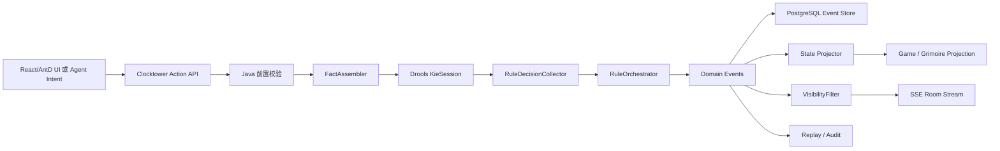

# Clocktower Drools Rule Engine Detail Design

**日期:** 2026-06-17

**目标:** 为 Clocktower Agent Platform 补充规则引擎详细设计。本文替代“纯 Java handler 规则引擎”的浅层方案，明确引入 Drools，并说明 Drools 与 Java 状态机、魔典、事件流、视角隔离、Agent 编排、RAG 规则查询之间的边界。

**结论:** 引入 Drools。Clocktower 的规则复杂度适合使用 Drools 做声明式规则推理，但不能把完整游戏运行交给 Drools。推荐架构是 **Java 事件状态机 + Drools 决策规则引擎 + 说书人裁定任务**。

---

## 1. 为什么规则引擎需要 Drools

钟楼规则不是简单 CRUD，也不是普通表驱动校验。它同时具备以下特征:

- 阶段规则: 设置、首夜、白天、提名、投票、处决、夜晚、结束。
- 多事实组合: 剧本、角色、座位、阵营、存活、醉酒、中毒、疯狂、提示标记、历史事件。
- 大量条件推导: 谁能行动、谁应该被唤醒、某个信息是否真实、某个死亡是否发生。
- 冲突优先级: 角色能力优先于核心规则，醉酒/中毒会让能力失效，相克规则可能覆盖普通能力。
- 说书人裁量: 有些能力不是唯一解，需要系统生成待确认项，而不是硬编码单一路径。
- 可审计和可回放: 对局结果必须能解释为“哪些规则触发了哪些事件”。

如果全部使用 Java `if/else` 或 handler 链，后续会出现三个问题:

1. 规则散落在 service 里，角色越多越难追踪。
2. 相克规则和状态组合会导致 handler 间耦合。
3. 配板、夜晚顺序、能力结算、胜负判断无法统一解释和测试。

Drools 的价值在于把“事实 -> 条件匹配 -> 决策输出”声明化。Drools 官方 DRL 文档描述了 `.drl` 规则文件的 `when/then` 条件与动作结构、rule unit、data source 和 query 机制；Drools rule engine 文档说明其支持由 working memory facts 触发规则的 forward chaining，也支持 backward chaining；KIE 文档说明 Drools 10 推荐使用 `drools-engine` 或 `drools-ruleunits-engine`，传统 `drools-engine-classic` / `drools-mvel` 已不推荐。Clocktower 的规则推导正好符合这些能力。

## 2. 为什么不能纯 Drools

Drools 适合推导，不适合负责整个游戏系统。

| 边界 | 原因 | 承担者 |
|---|---|---|
| 用户身份和权限 | 玩家是否能看魔典、是否能操作某席位是安全边界 | Java + Spring Security + RBAC |
| 数据库事务 | 事件、投票、状态标记、审计需要事务一致性 | Java service + JPA |
| 实时推送 | SSE/WebSocket 连接管理和可见事件推送不是规则推导 | Java WebFlux |
| 视角隔离 | Agent 和玩家不能绕过视角过滤读取 facts | Java VisibilityFilter |
| 事件回放 | 需要稳定事件模型，而不是依赖 Drools working memory | Event store + projector |
| 说书人裁量 | Drools 输出候选项，最终由说书人确认 | Java Orchestrator |
| Agent 输出 | Agent 动作必须重新走 API 和规则校验 | Java command pipeline |

因此，Drools 只做 **规则决策**，不直接改库、不直接推消息、不直接操作魔典、不直接向玩家泄露信息。

## 3. 总体架构



核心流程:

1. 前端或 Agent 提交 `GameCommand`。
2. Java 做安全和基础校验: 用户、房间、席位、阶段、权限、请求格式。
3. `FactAssembler` 从当前投影和事件历史装配 Drools facts。
4. Drools 根据 facts 和 DRL 规则输出 `RuleDecision`。
5. `RuleOrchestrator` 把 decision 转成领域事件或说书人待确认任务。
6. Java 在一个事务中落库事件并更新投影。
7. `VisibilityFilter` 按视角推送 SSE 事件。

## 4. 技术选型

### 4.1 后端框架

| 能力 | 技术 |
|---|---|
| HTTP API | Spring Boot 3.5 + WebFlux |
| 权限 | Spring Security + 现有 RBAC |
| 持久化 | Spring Data JPA + PostgreSQL |
| 迁移 | Flyway，单次数据库变更新增一个 migration |
| 实时事件 | WebFlux SSE，后续可扩展 WebSocket |
| 规则引擎 | Drools 10.x，优先 `drools-engine` |
| Agent | 现有 Spring AI Alibaba ReactAgent |
| RAG | 现有 pgvector / RAG 服务 |

### 4.2 Drools 依赖

首版建议引入:

```xml
<dependency>
    <groupId>org.drools</groupId>
    <artifactId>drools-engine</artifactId>
</dependency>
<dependency>
    <groupId>org.drools</groupId>
    <artifactId>drools-xml-support</artifactId>
</dependency>
```

如果配板评分、角色复杂度、推荐规则后续希望由类 Excel 表维护，再引入:

```xml
<dependency>
    <groupId>org.drools</groupId>
    <artifactId>drools-decisiontables</artifactId>
</dependency>
```

构建层建议使用 KIE Maven plugin，让规则在构建期编译，避免运行时才暴露 DRL 编译错误。实现计划阶段需要根据最终 Drools 版本校验 Maven plugin 配置和 Spring Boot 打包兼容性。

### 4.3 Stateless 与 Stateful

| 模式 | 用途 | 首版选择 |
|---|---|---|
| `StatelessKieSession` | 单次命令校验、配板评分、夜晚 checklist、投票结算 | 首版主路径 |
| `StatefulKieSession` | 长时间保留 working memory，适合复杂连续推导 | Phase 2+ 评估 |

首版优先 Stateless。原因:

- 事件库和投影是系统事实源。
- 每次命令从数据库投影重建 facts，易回放、易测试。
- 不需要管理房间级 Drools session 生命周期。
- 避免内存中的 working memory 与数据库状态漂移。

## 5. 包结构设计

```text
be/src/main/java/top/egon/mario/clocktower
  config/
    ClocktowerDroolsConfiguration.java
  engine/
    ClocktowerRuleEngine.java
    DroolsClocktowerRuleEngine.java
    RuleExecutionContext.java
    RuleExecutionMode.java
    RuleExecutionResult.java
    RuleDecisionCollector.java
    RuleOrchestrator.java
  engine/fact/
    GameFact.java
    SeatFact.java
    RoleFact.java
    StatusFact.java
    MarkerFact.java
    ActionFact.java
    NominationFact.java
    VoteFact.java
    EventFact.java
    ScriptRoleFact.java
    SetupRuleFact.java
    NightOrderFact.java
    JinxRuleFact.java
    BoardCandidateFact.java
    NeighborFact.java
  engine/decision/
    RuleViolationDecision.java
    CandidateEventDecision.java
    MarkerChangeDecision.java
    PrivateInfoDecision.java
    StorytellerTaskDecision.java
    ScoreDecision.java
  engine/assembler/
    FactAssembler.java
    BoardFactAssembler.java
    GameFactAssembler.java
    NightFactAssembler.java
    VoteFactAssembler.java
  event/
    ClocktowerEventService.java
    ClocktowerVisibilityFilter.java
    ClocktowerEventProjector.java
  ...
```

规则资源:

```text
be/src/main/resources/clocktower/rules
  kmodule.xml
  common/
    phase-transition.drl
    visibility-classification.drl
    victory.drl
  setup/
    player-count.drl
    role-count.drl
    setup-modifiers.drl
  board/
    board-validation.drl
    board-scoring.drl
  day/
    nomination.drl
    voting.drl
    execution.drl
  night/
    night-order.drl
    wakeup-eligibility.drl
    death-at-night.drl
  status/
    drunk-poisoned.drl
    death-ability-loss.drl
    madness.drl
  roles/
    trouble-brewing/
      washerwoman.drl
      librarian.drl
      investigator.drl
      chef.drl
      empath.drl
      fortune-teller.drl
      monk.drl
      ravenkeeper.drl
      imp.drl
    bad-moon-rising/
    sects-and-violets/
  jinx/
    jinx-validation.drl
    jinx-runtime.drl
```

## 6. 事实模型设计

Drools facts 不能直接使用 JPA entity。原因是 JPA entity 有懒加载、事务上下文、可变副作用，放进 Drools working memory 会让规则难测且难回放。所有 facts 都使用不可变 DTO 或 record。

### 6.1 核心事实

```java
public record GameFact(
        Long roomId,
        String scriptCode,
        String phase,
        int dayNo,
        int nightNo,
        boolean firstNight,
        int playerCount,
        int aliveCount,
        boolean nominationOpen,
        boolean executionPending
) {
}
```

```java
public record SeatFact(
        Long seatId,
        int seatNo,
        Long userId,
        boolean agentControlled,
        boolean storyteller,
        boolean alive,
        boolean deadVoteAvailable,
        boolean traveler
) {
}
```

```java
public record RoleFact(
        Long seatId,
        String roleCode,
        String roleType,
        String originalAlignment,
        String currentAlignment,
        boolean drunk,
        boolean poisoned,
        boolean abilityActive
) {
}
```

```java
public record StatusFact(
        Long seatId,
        String statusType,
        String sourceRoleCode,
        String sourceSeatId,
        String expiresAtPhase,
        boolean active
) {
}
```

```java
public record ActionFact(
        String actionType,
        Long actorSeatId,
        List<Long> targetSeatIds,
        Map<String, Object> payload
) {
}
```

### 6.2 对局历史事实

```java
public record EventFact(
        String eventType,
        Long actorSeatId,
        Long targetSeatId,
        String phase,
        int dayNo,
        int nightNo,
        Map<String, Object> payload
) {
}
```

```java
public record NominationFact(
        Long nominationId,
        int dayNo,
        Long nominatorSeatId,
        Long nomineeSeatId,
        boolean active,
        int voteCount,
        boolean executionCandidate
) {
}
```

```java
public record VoteFact(
        Long nominationId,
        Long voterSeatId,
        boolean vote,
        boolean deadVoteSpent
) {
}
```

### 6.3 剧本规则事实

```java
public record ScriptRoleFact(
        String scriptCode,
        String roleCode,
        String roleType,
        String alignment,
        int complexity,
        boolean firstNight,
        boolean otherNight,
        boolean setupModifier
) {
}
```

```java
public record NightOrderFact(
        String scriptCode,
        String roleCode,
        boolean firstNight,
        int orderNo,
        String wakeCondition
) {
}
```

```java
public record JinxRuleFact(
        String roleA,
        String roleB,
        String scope,
        String severity,
        String effectType,
        String ruleCode
) {
}
```

## 7. Drools 输出模型

Drools 不直接调用 repository，不直接改实体。所有结果写入 collector。

```java
public class RuleDecisionCollector {
    private final List<RuleViolationDecision> violations = new ArrayList<>();
    private final List<CandidateEventDecision> candidateEvents = new ArrayList<>();
    private final List<MarkerChangeDecision> markerChanges = new ArrayList<>();
    private final List<PrivateInfoDecision> privateInfos = new ArrayList<>();
    private final List<StorytellerTaskDecision> storytellerTasks = new ArrayList<>();
    private final List<ScoreDecision> scores = new ArrayList<>();

    public void reject(String code, String message, String severity) {}
    public void event(String eventType, Map<String, Object> payload) {}
    public void marker(Long seatId, String markerType, String operation, Map<String, Object> payload) {}
    public void privateInfo(Long recipientSeatId, String infoType, Map<String, Object> payload) {}
    public void storytellerTask(String taskType, String prompt, List<String> options, Map<String, Object> payload) {}
    public void score(String scoreType, int delta, String reason) {}
}
```

输出含义:

| 输出 | 用途 |
|---|---|
| `RuleViolationDecision` | 拒绝非法动作，返回给前端或 Agent |
| `CandidateEventDecision` | 生成候选领域事件，由 Java 编排层落库 |
| `MarkerChangeDecision` | 添加/移除状态标记 |
| `PrivateInfoDecision` | 给某玩家的私密信息，如数字、角色、阵营 |
| `StorytellerTaskDecision` | 需要说书人确认的裁定项 |
| `ScoreDecision` | 配板评分、风险评分、说书人负载评分 |

## 8. 规则执行上下文

```java
public record RuleExecutionContext(
        Long roomId,
        RuleExecutionMode mode,
        List<Object> facts,
        ActionFact action,
        RuleDecisionCollector decisions,
        String rulePackage
) {
}
```

执行模式:

| 模式 | 规则包 |
|---|---|
| `BOARD_GENERATION` | `setup`, `board`, `jinx` |
| `BOARD_VALIDATION` | `setup`, `board`, `jinx` |
| `NIGHT_CHECKLIST` | `night`, `status`, `roles` |
| `PLAYER_ACTION` | `day`, `night`, `roles`, `status` |
| `STORYTELLER_ACTION` | `common`, `roles`, `jinx` |
| `VICTORY_CHECK` | `common/victory`, `roles` |

Java service 根据模式选择 KieBase/KieSession，避免每次运行都加载全部规则。

## 9. Drools 与 Java 的执行边界

### 9.1 Java 前置校验

这些不进 Drools:

- JWT 是否有效。
- 用户是否是房间成员。
- 用户是否绑定该 seat。
- 用户是否拥有说书人权限。
- API 是否被 RBAC 授权。
- 房间是否已结束。
- 请求 DTO 格式是否有效。

### 9.2 Drools 规则校验

这些进入 Drools:

- 当前阶段是否允许该游戏动作。
- 玩家是否因死亡/状态不能做某动作。
- 提名和投票是否符合当天限制。
- 夜晚行动目标是否合法。
- 角色能力是否应该触发。
- 醉酒/中毒是否使能力无效或生成错误信息任务。
- 相克规则是否改变普通结算。
- 胜负条件是否满足。

### 9.3 Java 后置编排

这些回到 Java:

- 把 Drools decision 转成 `ClocktowerEvent`。
- 写数据库事务。
- 更新 `game_state`、`grimoire_entry`、`status_marker` 投影。
- 对事件做可见性过滤。
- 推送 SSE。
- 写审计和模型调用关联。

## 10. 规则包详细设计

### 10.1 设置规则

目标:

- 根据人数推导镇民/外来者/爪牙/恶魔数量。
- 校验三剧本最低人数。
- 处理设置类角色对角色数量的修正。
- 输出配板风险。

示例:

```drl
rule "TB requires at least 5 players"
when
    $b : BoardCandidateFact(scriptCode == "TROUBLE_BREWING", playerCount < 5)
then
    decisions.reject("BOARD_PLAYER_COUNT_TOO_LOW", "暗流涌动至少需要 5 名玩家。", "ERROR");
end
```

```drl
rule "Baron adds two outsiders"
when
    BoardCandidateFact($roles : roleCodes)
    eval($roles.contains("BARON"))
then
    decisions.event("SETUP_MODIFIER_REQUIRED", Map.of(
        "roleCode", "BARON",
        "outsiderDelta", 2,
        "townsfolkDelta", -2
    ));
end
```

### 10.2 配板评分规则

目标:

- 可解释地给出分数，而不是只随机抽角色。
- 输出说书人能看懂的理由。

评分事实:

```java
public record BoardCandidateFact(
        String scriptCode,
        int playerCount,
        List<String> roleCodes,
        int difficultyTarget,
        int chaosTarget,
        int evilPressureTarget,
        boolean newbieFriendly
) {
}
```

输出:

| 分数 | 来源 |
|---|---|
| `balanceScore` | 信息角色、保护角色、杀戮角色、邪恶误导能力比例 |
| `chaosScore` | 醉酒、中毒、错误信息、角色变更、疯狂 |
| `storytellerLoad` | 夜晚唤醒数量、裁量任务数量、复杂相克 |
| `newbieScore` | 角色文本直观程度、是否需要大量判例 |
| `evilPressure` | 恶魔杀伤、爪牙扰乱、伪装空间 |

### 10.3 阶段推进规则

Java 主状态机只维护合法阶段图:

```text
DRAFT -> LOBBY -> SETUP -> FIRST_NIGHT -> DAY -> NOMINATION -> EXECUTION -> NIGHT -> DAY -> ENDED
```

Drools 判断是否允许推进:

- 是否已发身份。
- 首夜 checklist 是否完成。
- 是否存在未处理裁定任务。
- 当前提名是否结束。
- 是否已有处决候选。
- 是否触发胜负。

### 10.4 夜晚 checklist 规则

输入:

- `GameFact`
- `RoleFact`
- `NightOrderFact`
- `StatusFact`
- `EventFact`

输出:

```java
public record NightStepDecision(
        int orderNo,
        Long seatId,
        String roleCode,
        boolean wakeRequired,
        String skipReason,
        String prompt,
        List<String> allowedActionTypes
) {
}
```

规则:

- 首夜只使用 first-night order。
- 其他夜使用 other-night order。
- 死亡且无“死亡后仍有效”能力的角色不唤醒。
- 醉酒/中毒不必阻止唤醒，但影响输出信息或效果。
- 即时触发类角色可以插入额外 task。

### 10.5 提名规则

命令:

```java
NominateCommand(roomId, dayNo, nominatorSeatId, nomineeSeatId)
```

Drools 校验:

- 当前为白天或提名阶段。
- 同一时间没有未完成投票。
- 提名者存活。
- 提名者今天未提名过。
- 被提名者今天未被提名过。

输出:

- `PLAYER_NOMINATED`
- 或 `NOMINATION_REJECTED`

### 10.6 投票规则

命令:

```java
VoteCommand(roomId, nominationId, voterSeatId, vote)
```

Drools 校验:

- 当前 nomination active。
- 玩家能投票。
- 死亡玩家有死亡投票 token。

投票结束后输出:

```java
VoteResultDecision(
    voteCount,
    requiredVotes,
    highestSoFar,
    tied,
    executionCandidateSeatId,
    clearPreviousCandidate
)
```

规则:

- 成功票数必须大于或等于存活人数一半。
- 必须严格高于当天其他提名票数。
- 平票清除当前处决候选。
- 死亡玩家投票后消耗死亡投票。

### 10.7 处决和死亡规则

Drools 负责判断:

- 是否有处决候选。
- 被处决者是否死亡。
- 死亡是否触发角色能力。
- 死亡后能力是否失效。
- 是否需要移除状态标记。

Java 负责:

- 写 `PLAYER_EXECUTED`。
- 写 `PLAYER_DIED` 或 `EXECUTED_BUT_SURVIVED`。
- 更新死亡投票。
- 推进夜晚。

### 10.8 醉酒和中毒规则

醉酒/中毒是最适合 Drools 的地方，因为它横切所有角色能力。

统一规则:

```drl
rule "Drunk or poisoned ability does not produce normal effect"
when
    $role : RoleFact(abilityActive == false)
    $action : ActionFact(actorSeatId == $role.seatId)
then
    decisions.storytellerTask("FALSE_OR_NO_EFFECT",
      "该角色醉酒/中毒，选择无效果或错误信息。",
      List.of("NO_EFFECT", "FALSE_INFO"),
      Map.of("seatId", $role.seatId, "roleCode", $role.roleCode()));
end
```

这样每个信息类角色不用重复写醉酒/中毒分支。

### 10.9 胜负规则

基础胜负 Drools 化:

- 所有恶魔死亡 -> 善良胜利。
- 存活玩家小于等于 2 且恶魔存活 -> 邪恶胜利。
- 某些角色覆盖胜负 -> 由角色规则优先级处理。

胜负输出:

```java
GameEndDecision(winningAlignment, reasonCode, reasonText)
```

## 11. 角色能力规则分级

三剧本角色不会一次性全部做到同等自动化。按复杂度分层。

| 级别 | 类型 | 处理方式 |
|---|---|---|
| L1 | 设置修正 | Drools 全自动，例如男爵类 |
| L2 | 固定信息 | Drools 自动计算或生成私密信息 |
| L3 | 选择目标并施加状态 | Drools 校验目标，输出 marker change |
| L4 | 死亡/保护/复活 | Drools 判断候选结果，Java 落事件 |
| L5 | 高裁量/复杂相克 | Drools 生成说书人任务 |

角色规则文件组织:

```text
roles/trouble-brewing/empath.drl
roles/trouble-brewing/fortune-teller.drl
roles/trouble-brewing/monk.drl
roles/trouble-brewing/imp.drl
```

示例: 共情者正常信息。

```drl
rule "Empath receives evil neighbor count"
when
    GameFact(phase in ("FIRST_NIGHT", "NIGHT"))
    $self : RoleFact(roleCode == "EMPATH", abilityActive == true)
    $n : NeighborCountFact(centerSeatId == $self.seatId, evilCount : evilAliveNeighborCount)
then
    decisions.privateInfo($self.seatId, "NUMBER", Map.of("value", evilCount));
end
```

示例: 共情者中毒。

```drl
rule "Empath poisoned false info task"
when
    GameFact(phase in ("FIRST_NIGHT", "NIGHT"))
    $self : RoleFact(roleCode == "EMPATH", poisoned == true)
then
    decisions.storytellerTask("FALSE_INFO_NUMBER",
      "共情者中毒，选择给他的数字。",
      List.of("0", "1", "2"),
      Map.of("seatId", $self.seatId, "roleCode", "EMPATH"));
end
```

## 12. 相克规则设计

相克规则不能只放在文本里。需要结构化并逐步 Drools 化。

表:

```text
clocktower_jinx_rule
  id
  role_a_code
  role_b_code
  scope SETUP/RUNTIME/BOTH
  severity INFO/WARN/BLOCK
  effect_type CONFIG_WARNING/ABILITY_OVERRIDE/WIN_CONDITION_OVERRIDE
  rule_text
  drools_rule_name
  source_url
```

Phase 1:

- 配板时输出 warning/block。
- 规则查询可引用相克说明。
- 复杂运行期相克生成说书人确认项。

Phase 2:

- 高频相克写入 `jinx-runtime.drl`。
- 对能力结算产生自动覆盖。

## 13. 事件溯源和投影

Clocktower 必须事件优先。

```text
ClocktowerEvent
  id
  room_id
  seq_no
  event_type
  actor_seat_id
  target_seat_id
  visibility
  recipients_json
  payload_json
  phase
  day_no
  night_no
  rule_trace_json
  created_at
```

投影表:

- `clocktower_game_state`
- `clocktower_grimoire_entry`
- `clocktower_status_marker`
- `clocktower_nomination`
- `clocktower_vote`

事件是事实源，投影是查询优化。Drools facts 从投影 + 必要历史事件装配。

## 14. Rule Trace 设计

为了审计和调试，每次 Drools 执行要保存 trace。

```json
{
  "mode": "PLAYER_ACTION",
  "rulePackage": "day.voting",
  "firedRules": [
    "Dead player may vote only with dead vote token",
    "Nomination passes with majority"
  ],
  "violations": [],
  "candidateEvents": ["VOTE_COUNTED", "EXECUTION_CANDIDATE_SET"],
  "decisionTasks": []
}
```

实现方式:

- Drools agenda listener 捕捉 fired rule name。
- `RuleDecisionCollector` 收集输出。
- Java 把 trace 写入 `ClocktowerEvent.rule_trace_json` 或独立审计表。

## 15. 视角隔离

视角隔离坚持 Java 实现，不能交给 Drools。

```java
List<ClocktowerEventResponse> visibleEvents(RoomId roomId, ViewerContext viewer)
```

视角:

| 视角 | 可见 |
|---|---|
| `PLAYER` | public + 自己 private + 自己私聊 |
| `STORYTELLER` | 全部游戏事件，不含系统安全审计 |
| `AGENT_PLAYER` | 与玩家完全一致 |
| `AGENT_STORYTELLER` | 与说书人一致 |
| `PUBLIC_REPLAY` | public only |
| `FULL_REPLAY` | 完整复盘，需要权限 |

Drools 可以给事件建议 visibility，但最终可见性由 Java filter 裁剪。

## 16. Agent 与规则引擎

Agent 不能直接调用 Drools，不能直接操作魔典。Agent 只输出 intent，走同一套 action API。

玩家 Agent 输入:

- 玩家身份。
- 玩家收到的私密信息。
- 公开事件摘要。
- 自己参与的私聊。
- 当前合法动作列表。
- 当前公开存活/死亡状态。

玩家 Agent 输出:

```json
{
  "actionType": "NOMINATE",
  "targetSeatIds": [5],
  "publicContent": "我提名 5 号。",
  "reasonSummary": "公开信息存在冲突。"
}
```

处理流程:

1. JSON schema 校验。
2. Java 前置安全校验。
3. Drools 动作合法性和规则结算。
4. 写事件。
5. SSE 推送。

非法动作写 `ACTION_REJECTED`，只对该 Agent/玩家和说书人可见。

## 17. API 详细设计

| API | 功能 |
|---|---|
| `GET /api/clocktower/scripts` | 剧本列表 |
| `GET /api/clocktower/scripts/{scriptCode}/roles` | 角色列表 |
| `GET /api/clocktower/scripts/{scriptCode}/night-order` | 夜晚顺序 |
| `POST /api/clocktower/boards/generate` | Drools 配板生成和评分 |
| `POST /api/clocktower/boards/validate` | Drools 配板校验 |
| `POST /api/clocktower/rooms` | 创建房间 |
| `POST /api/clocktower/rooms/{roomId}/join` | 加入房间 |
| `POST /api/clocktower/rooms/{roomId}/seats/{seatId}/assign-agent` | 绑定 Agent 席位 |
| `POST /api/clocktower/rooms/{roomId}/start` | 说书人确认并开始 |
| `GET /api/clocktower/rooms/{roomId}/view` | 当前用户可见房间状态 |
| `GET /api/clocktower/rooms/{roomId}/grimoire` | 说书人魔典 |
| `GET /api/clocktower/rooms/{roomId}/night-checklist` | 夜晚 checklist |
| `POST /api/clocktower/rooms/{roomId}/actions` | 玩家动作 |
| `POST /api/clocktower/rooms/{roomId}/storyteller/actions` | 说书人动作 |
| `GET /api/clocktower/rooms/{roomId}/events/stream` | SSE 事件流 |
| `POST /api/clocktower/rules/query` | 规则问答 |
| `GET /api/clocktower/replays/{roomId}` | 回放 |

## 18. 前端详细设计

### 18.1 配板器

组件:

- 剧本选择。
- 人数输入。
- 难度、混乱度、阵营压力、新手友好滑块。
- 候选配置列表。
- 角色类型计数。
- Drools 校验结果。
- 相克风险。
- 说书人负载。
- 重 roll 和锁定角色。

### 18.2 说书人魔典

组件:

- 座位环。
- 角色牌。
- 状态 marker 面板。
- 夜晚 checklist。
- 待裁定任务列表。
- 私密告知面板。
- 公开播报按钮。
- 规则 trace 抽屉。

### 18.3 玩家房间

组件:

- 当前身份。
- 公开聊天。
- 私聊抽屉。
- 阶段提示。
- 合法动作按钮。
- 提名和投票控件。
- 死亡投票 token 提示。
- 规则查询入口。

### 18.4 回放

组件:

- 事件时间线。
- 投票轮次。
- 夜晚步骤。
- 裁定任务。
- Rule trace。
- Agent 行动摘要。

## 19. 测试方案

| 测试 | 内容 |
|---|---|
| DRL 编译测试 | 所有 `.drl` 在构建/启动测试中可编译 |
| FactAssembler 测试 | 同一房间状态能装配预期 facts |
| 配板规则测试 | 人数、角色类型、设置修正、相克风险 |
| 夜晚 checklist 测试 | 首夜/其他夜、死亡、醉酒、中毒 |
| 提名测试 | 活人提名、每日一次、被提名一次 |
| 投票测试 | 半数、最高票、平票、死亡票 |
| 处决测试 | 死亡、未死亡、能力失效、阶段推进 |
| 胜负测试 | 基础胜负和角色覆盖 |
| 视角测试 | 玩家和 Agent 看不到魔典 |
| 回放测试 | 事件重放后投影一致 |
| Agent 测试 | 合法 intent 执行，非法 intent 拒绝 |

## 20. 落地阶段

### Phase 1: Drools 核心接入

- 引入 Drools 依赖和配置。
- 建 facts、decisions、collector、orchestrator。
- 配板校验、提名、投票、处决、夜晚 checklist Drools 化。
- 低复杂度角色先做少量样板。
- Rule trace 入事件。

### Phase 2: 三剧本角色能力

- 按 L1-L5 分批写 DRL。
- 中毒/醉酒横切规则完善。
- 相克规则从 warning 进入 runtime。
- 说书人裁定任务闭环。

### Phase 3: 高级规则运营

- 规则维护页。
- DRL/决策表热校验。
- 规则版本管理。
- 批量 Agent 自玩回放验证。
- 对局质量评分和配板推荐优化。

## 21. 对原概要设计的修正

原方案中的“Java handler 规则引擎”降级为 Java orchestration 层，不再承担主要复杂规则推导。

修正后的职责:

- Java handler: 命令入口、事务、事件、投影、权限、可见性。
- Drools: 配板、阶段动作合法性、夜晚 checklist、角色能力、相克、胜负、评分。
- Agent: 策略和表达，不做规则裁判。
- 说书人: 处理 Drools 无法唯一确定的裁量项。

这个边界更适合钟楼的复杂性，也更利于后续维护和测试。

