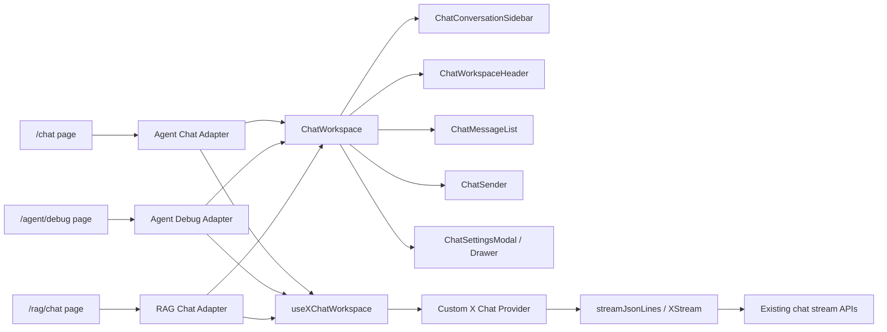

# Chat Workspace X Design

**日期:** 2026-06-18

**目标:** 在保留现有后台 `AdminLayout` 外壳的前提下，将 `/chat`、`/agent/debug`、`/rag/chat` 三个聊天入口统一改造成参考图风格的嵌入式聊天工作台。首期引入 `@ant-design/x` 和 `@ant-design/x-sdk`，接入现有聊天能力，抽取公共组件与公共数据适配层，避免三个页面继续复制消息列表、输入器、会话栏和流式状态逻辑。

**当前背景:** 前端是 React 19 + TypeScript + Vite，UI 使用 `antd@6.4.4`。现有三页都在 `AdminLayout` 内渲染，但页面结构不统一：

- `/chat` 位于 `fe/src/modules/chat/pages/ChatPage.tsx`，已有 Agent Chat、流式输出、短期/长期 memory session 控制。
- `/agent/debug` 位于 `fe/src/modules/agent/AgentDebugPage.tsx`，同时承担 Agent 预设编辑、参数覆盖和调试聊天。
- `/rag/chat` 位于 `fe/src/modules/rag/RagChatPage.tsx`，包含知识库选择、检索参数、RAG 流式回答、引用来源和反馈。

现有页面都手写了消息列表、输入区、streaming 状态、停止逻辑和部分 session 操作，样式也和参考图差异较大。当前全局后台视觉偏青绿色和发光背景，聊天工作台应改为更接近参考图的浅灰白、低饱和、工作台式布局。

---

## 1. 用户确认结论

- 保留现有后台壳，不隐藏 `AdminLayout` 的后台菜单和顶部用户栏。
- 三个聊天页面只在后台内容区内部改造成参考图样式。
- 首期只接入已有能力，不新增原型图里的未实现功能。
- 引入 `@ant-design/x`。
- 引入 `@ant-design/x-sdk`。
- 重复 UI、消息映射、请求编排必须抽成公共组件或公共 hook。
- 本阶段只产出设计文档，不启动项目，不进入代码实现。

---

## 2. 需求范围

### 2.1 本次实现

- 新增共享聊天工作台能力，覆盖 `/chat`、`/agent/debug`、`/rag/chat`。
- 引入 `@ant-design/x@^2.8.0` 和 `@ant-design/x-sdk@^2.8.0`。
- 通过 `XProvider` 接入 Ant Design X 的全局配置，并与现有 antd provider、locale、theme token 保持一致。
- 使用 Ant Design X 组件重建聊天核心交互：
    - `Conversations` 用于左侧会话列表。
    - `Bubble.List` 用于消息列表。
    - `Sender` 用于底部输入器、发送和停止。
    - `Actions` 用于消息操作、反馈、复制、重试等已有动作。
    - `Sources` 用于 RAG 引用来源入口。
    - `Think` 或 `ThoughtChain` 用于 thinking / 推理过程展示。
- 使用 Ant Design X SDK 统一三类聊天入口的数据请求和消息状态：
    - 优先通过自定义 Chat Provider 或请求适配器接入现有 NDJSON 流。
    - 复用现有 `streamJsonLines()` 的底层解析能力，避免重复实现流式协议解析。
    - 用统一状态表达 `local`、`loading`、`updating`、`success`、`error`、`abort`。
- 抽取公共组件，页面文件只保留业务数据加载、业务配置和回调。
- `/chat` 保留现有 Agent Chat 能力：
    - 发送消息。
    - 停止输出。
    - 新建会话。
    - 选择会话。
    - 归档会话。
    - memory 开关。
- `/agent/debug` 保留现有 Agent Debug 能力：
    - 选择预设。
    - 创建、更新、删除、启停预设。
    - 临时覆盖系统提示词、模型参数、工具参数和 Agent 参数。
    - 发送调试消息。
    - 停止输出。
    - 新建、选择、归档会话。
    - memory 和长期提取开关。
- `/rag/chat` 保留现有 RAG Chat 能力：
    - 选择知识库。
    - 设置 TopK、候选数、相似度阈值、检索模式、rerank。
    - 发送问题。
    - 停止输出。
    - 展示引用来源。
    - 提交已有反馈类型。
    - 新建、选择、归档会话。
    - memory 和长期提取开关。
- 适配桌面与窄屏布局，保证在后台内容区内不出现横向溢出。
- 保留现有鉴权、RBAC 菜单裁剪、按钮权限和接口权限行为。

### 2.2 暂不实现

- 不隐藏或替换后台 `AdminLayout`。
- 不新增后端 API。
- 不新增数据库迁移。
- 不实现参考图中未存在后端能力的功能，例如语音输入、文件上传、Artifacts、CodeFold、模型切换、工具市场、Prompt 库搜索。
- 不引入 `@ant-design/x-card`、`@ant-design/x-skill` 或其它 X 生态包。
- 不强制替换现有 `react-markdown`。首期可继续用 `react-markdown` 作为 `Bubble` 的内容渲染，除非实现阶段确认需要 `@ant-design/x-markdown`。
- 不重构后台菜单、RBAC、Agent/RAG 后端服务。
- 不启动项目。

---

## 3. 方案选择

### 3.1 方案 A: 三页分别按参考图改样式

优点:

- 改动少。
- 不新增依赖。

缺点:

- 三个页面继续复制消息列表、输入区、状态处理和 session 控制。
- 后续新增 chat 入口时仍会重复造页面。
- 很难统一 streaming、abort、error、sources、thinking 的表现。

结论: 不采用。

### 3.2 方案 B: `@ant-design/x` UI 组件 + 手写状态适配

优点:

- 能快速获得 X 的聊天 UI 组件。
- 保留现有流式服务和 state 逻辑。
- 风险低于完整接入 X SDK。

缺点:

- 数据流仍由各页面或自定义 hook 分散维护。
- 后续多入口请求队列、conversation key、重试和 fallback 容易再次分叉。

结论: 不作为最终方案，但其中的 UI 组件选择作为推荐方案的一部分。

### 3.3 方案 C: `@ant-design/x` + `@ant-design/x-sdk` + 共享工作台适配层

优点:

- UI 与数据流都沉淀为公共能力。
- `Conversations`、`Bubble.List`、`Sender`、`Sources` 等组件直接匹配聊天工作台场景。
- X SDK 的 `useXChat`、Chat Provider、消息状态、abort、request fallback 能统一三类聊天入口。
- 后续新增 chat 入口时只需要新增业务 adapter 和配置，不复制大段页面结构。

缺点:

- 首期需要新增依赖，并对现有 NDJSON 流做 provider 适配。
- 实现阶段必须严格核对 X / X SDK API，避免依赖未确认的 props 或类型。

结论: 采用。

---

## 4. 依赖与官方能力依据

当前项目版本:

- `react@19.2.6`
- `react-dom@19.2.6`
- `antd@6.4.4`

计划新增:

- `@ant-design/x@^2.8.0`
- `@ant-design/x-sdk@^2.8.0`

版本兼容性:

- `@ant-design/x@2.8.0` peer dependencies 为 `antd^6.1.1`、`react>=18.0.0`、`react-dom>=18.0.0`，与当前项目匹配。
- `@ant-design/x-sdk@2.8.0` peer dependencies 为 `react>=18.0.0`、`react-dom>=18.0.0`，与当前项目匹配。

官方能力参考:

- `XProvider` 扩展 antd `ConfigProvider`，并为 X 组件提供全局配置。
- `Conversations` 用于会话列表、新建会话和会话分组。
- `Bubble.List` 用于消息列表，并支持消息状态和 streaming。
- `Sender` 用于聊天输入，支持 loading、submit、cancel、prefix、header、footer 和 suffix。
- `Actions` 用于 AI 场景下的快捷动作、复制和反馈。
- `Sources` 用于展示引用来源。
- `Think` / `ThoughtChain` 用于 thinking 或 Agent 调用链展示。
- `useXChat` 用于单会话消息管理，支持 provider、conversationKey、request placeholder、request fallback、abort、reload、queueRequest 和 message status。
- X SDK Chat Provider 可以通过自定义 provider 适配非内置模型或 Agent 服务。
- `XStream` 可解析通用 ReadableStream；实现阶段应评估是否继续复用现有 `streamJsonLines()`，还是在 provider 内部使用 `XStream`。

实现阶段必须使用官方文档和本地 API 查询确认具体 props，不允许凭记忆使用未确认 API。

---

## 5. 推荐架构



架构分三层:

1. 公共聊天 UI 层只负责布局和交互外壳，不直接知道业务 API。
2. 公共聊天数据层负责把现有 NDJSON 流和业务消息转成 X SDK 消息状态。
3. 页面业务适配层负责每个入口的业务参数、权限和差异化面板。

---

## 6. 公共组件设计

### 6.1 `ChatWorkspace`

职责:

- 渲染内容区内部的工作台容器。
- 管理左侧会话栏、右侧主聊天区、顶部栏、消息区、底部输入区和设置弹窗槽位。
- 提供统一布局尺寸、滚动边界和 responsive 行为。

输入建议:

- `title`
- `subtitle`
- `brand`
- `messages`
- `conversations`
- `activeConversationKey`
- `status`
- `senderValue`
- `settings`
- `headerActions`
- `sidebarActions`
- `senderPrefix`
- `senderHeader`
- `senderFooter`
- `messageExtraRender`
- `onConversationChange`
- `onNewConversation`
- `onArchiveConversation`
- `onSend`
- `onStop`
- `onSenderChange`

约束:

- 不直接调用 `/demo/chat/stream`、`/api/agent/debug/chat/stream` 或 `/api/rag/chat/stream`。
- 不保存业务表单状态。
- 不写死 Agent、RAG、Debug 文案。

### 6.2 `ChatConversationSidebar`

职责:

- 使用 `Conversations` 展示当前入口的 session 列表。
- 支持当前会话高亮、新建会话、刷新会话、归档会话入口。
- 对齐参考图左侧浅灰背景、品牌区、操作按钮和会话卡片样式。

会话标题规则:

- 优先使用服务端 session title。
- 没有 title 时显示 sessionId 的短格式。
- 新会话显示 `New Conversation` 或页面传入文案。

### 6.3 `ChatWorkspaceHeader`

职责:

- 显示会话标题、消息数、当前状态。
- 承载刷新、设置、分享、全屏等视觉动作位。
- 首期只接入已有动作，未实现功能以禁用状态或不展示处理。

### 6.4 `ChatMessageList`

职责:

- 使用 `Bubble.List` 展示消息。
- 支持 assistant、user、system / welcome 消息角色。
- 支持 streaming、loading、error、abort 状态。
- 支持 markdown 内容渲染。
- 支持 thinking block、RAG sources、feedback、traceId 等扩展内容。

消息映射:

- 页面业务消息统一映射为 `ChatWorkspaceMessage`。
- `ChatWorkspaceMessage` 再映射为 `Bubble.List` items。
- mapping 逻辑必须在公共函数中维护，不散落在三个页面。

### 6.5 `ChatSender`

职责:

- 使用 `Sender` 实现输入、发送、停止。
- 统一处理 Enter / Shift+Enter 行为。
- 支持 loading 时展示停止动作。
- 支持 prefix/header/footer/suffix 插槽。

入口差异:

- `/chat` 可在 footer 或 prefix 展示 memory 开关。
- `/agent/debug` 可展示当前预设、工具数量或打开设置按钮。
- `/rag/chat` 可展示知识库、检索模式和引用开关提示。

### 6.6 `ChatSettingsModal`

职责:

- 统一设置弹窗或抽屉外观，参考图中的 `Current Chat Settings`。
- 提供标题、全屏、关闭、底部动作区。
- 内容通过页面传入。

首期内容:

- `/chat`: memory session 配置和现有 memory 开关。
- `/agent/debug`: 预设选择、预设编辑、系统提示词、模型参数、工具参数、保存/删除/启停。
- `/rag/chat`: 知识库、多选检索参数、rerank、memory 开关。

### 6.7 `ChatSourcesPanel`

职责:

- 使用 `Sources` 展示 RAG 引用来源摘要。
- 点击后打开 Drawer 或详情面板展示完整 chunk 内容、score、rerankScore、matchedBy、documentName、chunkIndex。
- 保留现有反馈能力。

### 6.8 `ChatThinkingBlock`

职责:

- 使用 `Think` 或 `ThoughtChain` 展示现有 `thinkContent`。
- 对普通 thinking 文本使用简洁可折叠展示。
- 若后续 Agent run event 能形成工具链，再升级为 `ThoughtChain`。

首期不新增后端工具链事件。

### 6.9 `ChatMessageActions`

职责:

- 使用 `Actions` 统一消息级操作。
- 支持复制、重试、RAG 反馈、查看引用、查看 traceId 等已有动作。

权限:

- RAG 反馈按钮继续遵守 `ragButtonCodes.feedback.create`。
- 没有权限时不展示反馈动作。

---

## 7. 公共数据层设计

### 7.1 类型模型

新增公共类型建议:

- `ChatWorkspaceEntry`
    - `key`
    - `title`
    - `description`
    - `group`
    - `updatedAt`
    - `metadata`
- `ChatWorkspaceMessage`
    - `id`
    - `role`
    - `content`
    - `thinkContent`
    - `status`
    - `sources`
    - `traceId`
    - `messageId`
    - `question`
    - `metadata`
- `ChatWorkspaceRequest`
    - `message`
    - `conversationKey`
    - `entryType`
    - `extra`
- `ChatWorkspaceAdapter`
    - `loadConversations`
    - `createConversation`
    - `archiveConversation`
    - `send`
    - `stop`
    - `mapEvent`
    - `buildSettings`

这些类型放在聊天公共模块，不放进某个业务页面目录。

### 7.2 X SDK 适配

新增 `useXChatWorkspace` 或同等 hook:

- 创建并持有自定义 X Chat Provider。
- 传入 `conversationKey`。
- 统一处理 `requestPlaceholder`。
- 统一处理 `requestFallback`。
- 暴露 `messages`、`parsedMessages`、`isRequesting`、`onRequest`、`abort`、`setMessages`。
- 将业务 adapter 的 stream event 转换为 X SDK message update。

Provider 设计:

- 自定义 provider 接收 `ChatWorkspaceRequest`。
- Provider 内部调用对应业务 adapter 的 `send`。
- `send` 复用现有:
    - `streamChatResponse`
    - `streamAgentDebugChat`
    - `streamRagChat`
- 这三者底层继续复用 `streamJsonLines()`。
- 如实现阶段发现 X SDK `XStream` 更适合 ReadableStream 解析，可在 provider 内部切换，但不改变页面接口。

消息状态:

| 场景 | X SDK status |
|---|---|
| 本地用户消息已加入 | `local` |
| assistant 占位等待首包 | `loading` |
| assistant 正在接收 delta | `updating` |
| assistant 正常完成 | `success` |
| 请求失败 | `error` |
| 用户停止 | `abort` |

### 7.3 与现有服务的兼容

- `/chat` 的 `appendChatChunk()` 可继续作为 Agent chunk 合并函数。
- `/agent/debug` 可复用同一个 chunk 合并逻辑。
- `/rag/chat` 的 `metadata`、`retrieval`、`delta`、`error` 事件需要转成统一消息更新。
- 不改变后端流式响应格式。

---

## 8. 三页接入设计

### 8.1 `/chat`

页面职责:

- 加载 `AGENT_CHAT` sessions。
- 管理 `memoryEnabled`。
- 提供 Agent Chat adapter。
- 提供欢迎文案和页面标题。

工作台配置:

- 左侧标题显示 `CyberMario` 或 `Agent Chat`。
- 会话列表来自 `getAgentMemorySessions({entryType: 'AGENT_CHAT'})`。
- 新建会话调用 `createAgentMemorySession({entryType: 'AGENT_CHAT', memoryEnabled})`。
- 归档会话调用 `archiveAgentMemorySession(sessionId)`。
- 发送调用 `streamChatResponse()`。

### 8.2 `/agent/debug`

页面职责:

- 加载 presets。
- 判断当前用户是否可编辑选中 preset。
- 保存、更新、删除、启停 preset。
- 管理调试参数表单。
- 提供 Agent Debug adapter。

布局变化:

- 现有左侧大表单不再占据主页面列。
- 预设与参数进入 `ChatSettingsModal` 或右侧 settings drawer。
- 主页面保持统一聊天工作台。
- 顶部或底部 chip 显示当前 preset 名称和工具数量。

工作台配置:

- 会话列表来自 `getAgentMemorySessions({entryType: 'AGENT_DEBUG'})`。
- 新建会话调用 `createAgentMemorySession({entryType: 'AGENT_DEBUG', memoryEnabled, longTermExtractionEnabled})`。
- 发送调用 `streamAgentDebugChat()`，请求中包含当前 presetId 和 overrides。
- 保存 preset 逻辑仍在页面业务层，不进入公共组件。

### 8.3 `/rag/chat`

页面职责:

- 加载知识库。
- 管理 RAG 检索参数表单。
- 管理 RAG sources、source drawer、feedback 权限。
- 提供 RAG Chat adapter。

布局变化:

- 知识库和检索参数从页面顶部普通 `Card` 收纳进设置弹窗或紧凑工具区。
- 消息中的引用来源使用 `Sources` 展示摘要。
- 完整引用详情继续用 Drawer 或统一详情面板。

工作台配置:

- 会话列表来自 `getAgentMemorySessions({entryType: 'RAG_CHAT'})`。
- 新建会话调用 `createAgentMemorySession({entryType: 'RAG_CHAT', memoryEnabled, longTermExtractionEnabled})`。
- 发送调用 `streamRagChat()`，请求中包含 `knowledgeBaseIds` 和 `retrievalOptions`。
- `metadata` 事件更新 sessionId、traceId、messageId。
- `retrieval` 事件更新 sources。
- `delta` 事件追加 content。
- `error` 事件转为 error 状态和错误消息。
- 反馈调用 `createRagFeedback()`，并继续遵守 RBAC 按钮权限。

---

## 9. 视觉与交互规范

### 9.1 布局

- 工作台位于 `AdminLayout` 的内容区内。
- 外层容器使用浅灰白背景、1px 边框、8px 圆角以内、轻量阴影。
- 左侧会话栏宽度建议 280-320px，窄屏可折叠或置顶。
- 右侧主区使用纵向 flex：
    - header 固定在顶部。
    - message list 占据剩余空间并内部滚动。
    - sender 固定在底部。
- 工作台高度应基于后台内容区计算，避免 body 二次滚动和横向溢出。

### 9.2 色彩

- 主体使用浅灰、白、蓝色重点色，接近参考图。
- 避免继续使用大面积青绿色发光背景作为聊天主体。
- 用户消息和主按钮可以使用品牌蓝。
- assistant 消息使用浅灰白气泡。

### 9.3 Ant Design 使用约束

- 优先使用 `ConfigProvider` / `XProvider` token、component config、`classNames` 和 `styles`。
- 不依赖内部 `.ant-*` DOM 结构。
- 不做全局大范围覆盖。
- 按钮使用图标时优先使用 `@ant-design/icons` 已有图标。
- 卡片圆角保持 8px 以内。
- 不做多层卡片嵌套。
- 文本和按钮在桌面、窄屏都不能溢出或互相遮挡。

### 9.4 设置弹窗

- 参考图的 settings modal 可以作为视觉基准。
- 首期只展示已有能力。
- 未实现的 Add Prompt、Bot Avatar、Artifacts、CodeFold、模型切换等不展示，或仅作为禁用状态且不影响主流程。

---

## 10. 错误处理与状态

- 请求错误统一通过 `resolveErrorMessage()` 转换。
- assistant fallback 文案保留各页面现有语义：
    - `/chat`: 后端服务或 API Key 失败提示。
    - `/agent/debug`: 调试请求失败提示。
    - `/rag/chat`: 使用后端错误消息或 RAG 专用错误提示。
- 用户停止时消息状态为 `abort`，空内容 fallback 为 `Stopped.` 或中文等价文案。
- streaming 期间禁用重复发送。
- conversation 切换时不能污染其他会话消息。
- `sessionId` 由后端 metadata / chunk 返回后更新为准。
- RAG sources 到达时不阻塞内容流式输出。

---

## 11. 文件组织建议

建议新增公共聊天模块:

```text
fe/src/components/chat-workspace/
|-- ChatWorkspace.tsx
|-- ChatConversationSidebar.tsx
|-- ChatWorkspaceHeader.tsx
|-- ChatMessageList.tsx
|-- ChatSender.tsx
|-- ChatSettingsModal.tsx
|-- ChatSourcesPanel.tsx
|-- ChatThinkingBlock.tsx
|-- ChatMessageActions.tsx
|-- chatWorkspaceTypes.ts
|-- chatWorkspaceAdapters.ts
|-- useXChatWorkspace.ts
`-- index.ts
```

页面保留位置:

- `fe/src/modules/chat/pages/ChatPage.tsx`
- `fe/src/modules/agent/AgentDebugPage.tsx`
- `fe/src/modules/rag/RagChatPage.tsx`

样式建议:

- 若项目继续使用全局 CSS，可在 `fe/src/styles/global.css` 中新增 scoped class，例如 `.chat-workspace-x`。
- 更推荐将聊天工作台样式集中在公共组件模块附近，具体取决于项目现有构建是否支持同目录 CSS。
- 不把 X 组件样式散落到三个页面。

---

## 12. 测试与验证

### 12.1 静态验证

- 安装依赖后确认 `@ant-design/x`、`@ant-design/x-sdk` 与当前 React/antd 无 peer conflict。
- 修改 antd / X 组件代码前，按 Ant Design 技能要求查询官方 API。若本地 `@ant-design/cli` 可用，使用 `antd info <Component> --format json`。
- 修改 antd / X 组件代码后，按 Ant Design 技能要求运行相关 lint。若 CLI 不可用，需要在实现记录中说明并使用项目现有 `bun run lint`、`bun run typecheck` 补充验证。

### 12.2 前端验证

- `cd fe && bun run typecheck`
- `cd fe && bun run lint`
- 相关 Vitest:
    - 现有 chat stream tests。
    - agent service tests。
    - rag service tests。
    - 新增公共 mapping / adapter tests。
- 如实现改动较大，再运行 `cd fe && bun run test`。

### 12.3 行为验收

- `/chat`
    - 可发送消息。
    - 可停止 streaming。
    - 可新建、选择、归档会话。
    - memory 开关仍生效。
    - thinking 和 markdown 渲染正常。
- `/agent/debug`
    - 可选择 preset。
    - 可保存、更新、删除、启停自己创建的 preset。
    - 临时参数覆盖参与请求。
    - 可发送和停止调试消息。
    - memory 和长期提取开关仍生效。
- `/rag/chat`
    - 未选择知识库时不能发送，并给出提示。
    - 检索参数参与请求。
    - sources 可展示摘要和详情。
    - 有权限用户可提交反馈。
    - streaming、停止、错误 fallback 正常。
- 三页:
    - 保留后台菜单和顶部栏。
    - 内容区内的聊天工作台风格一致。
    - 窄屏无横向溢出。
    - 切换页面或会话不串消息。

---

## 13. 风险与应对

### 13.1 X SDK 与现有 NDJSON 协议适配风险

风险: X SDK 示例多围绕通用 provider 或 SSE/OpenAI 格式，当前项目是自定义 NDJSON。

应对:

- 首期通过自定义 provider 包住现有 `streamJsonLines()`。
- 保持业务 adapter 输入输出稳定。
- 若后续迁移到 `XStream`，不影响页面组件。

### 13.2 `/agent/debug` 表单复杂度风险

风险: 把现有大表单收进设置弹窗后，可能影响高频调试效率。

应对:

- 常用信息在 header 或 sender footer 用 chip 显示。
- 设置弹窗支持足够宽度和内部滚动。
- 保存/删除/启停操作保留在弹窗底部固定动作区。

### 13.3 RAG 参数和 sources 过多风险

风险: RAG Chat 的知识库、检索参数、sources、feedback 都比较多，容易挤占聊天主区。

应对:

- 检索参数放设置弹窗或紧凑工具条。
- sources 在消息内只展示摘要和数量。
- 完整来源保持 Drawer 详情。

### 13.4 样式污染风险

风险: 当前全局 CSS 已有较多 `.chat-card`、`.antd-message-*` 样式，可能影响新 X 组件。

应对:

- 新组件使用新的作用域 class，例如 `.chat-workspace-x`。
- 逐步停用旧聊天 class，而不是复用同名 class。
- 不写针对 X 内部 DOM 的脆弱选择器。

---

## 14. 后续实施顺序建议

1. 安装 `@ant-design/x` 和 `@ant-design/x-sdk`，确认依赖解析。
2. 在应用根部接入 `XProvider`，保持现有 antd App / ConfigProvider 语义。
3. 新增公共聊天 workspace 类型、消息 mapping 和基础组件。
4. 新增 X SDK provider / hook 适配现有 NDJSON streaming。
5. 先迁移 `/chat`，验证最小 Agent Chat 闭环。
6. 迁移 `/agent/debug`，把预设与参数表单收进设置弹窗。
7. 迁移 `/rag/chat`，接入 RAG settings、sources 和 feedback。
8. 删除或收敛旧的重复消息列表和 composer 样式。
9. 补充公共 mapping / adapter 单元测试。
10. 运行前端 typecheck、lint 和相关测试。

---

## 15. 完成标准

- 三个入口视觉风格统一并接近参考图。
- 后台壳保留。
- 现有聊天能力无回归。
- 公共组件承担工作台、会话栏、消息列表、输入器、设置弹窗、sources、thinking、actions。
- 页面文件不再复制大段消息列表和输入器 JSX。
- X SDK 统一处理请求、停止、fallback、消息状态或通过公共 hook 封装为同等行为。
- 新增依赖有明确版本和兼容性说明。
- 验证命令运行并记录结果。
