# Agent Chat Session History Design

**日期:** 2026-06-22

**目标:** 修复所有带 chat session id 的 Agent Chat 入口在选中历史会话后不展示历史对话的问题。覆盖 `/chat`、`/agent/debug`、`/rag/chat` 三个入口。用户选中已有 memory session 后，前端应读取该 session 的持久化消息并恢复到聊天工作台，而不是只切换 `sessionId` 并显示欢迎语。

**当前背景:** Agent Memory 已经提供用户私有 session 和消息接口。`fe/src/modules/agent/agentService.ts` 中已有 `getAgentMemoryMessages(sessionId)`，后端 `/api/agent/memory/sessions/{sessionId}/messages` 会按 `seqNo` 返回当前用户拥有的 `AgentMemoryMessageResponse[]`。当前缺口在前端：`ChatPage`、`AgentDebugPage`、`RagChatPage` 的 `handleConversationChange` 只设置当前 `sessionId`、同步 session 开关，然后 `setMessages(initialMessages)`，没有查询和映射历史消息。

---

## 1. 用户确认结论

- 采用方案 1：前端新增共享历史消息 mapper，三个 chat 页面切换 session 时复用它加载历史。
- 历史恢复需要展示普通 `USER` / `ASSISTANT` 对话。
- `THINK` 合并到同一轮 assistant 气泡的 `thinkContent`。
- `RAG_SOURCES` 解析回同一轮 assistant 气泡的 `sources`，继续使用现有来源面板展示。
- 不新增后端 API，不新增数据库迁移，不启动项目。

---

## 2. 需求范围

### 2.1 本次实现

- 在 `fe/src/components/chat-workspace/chatWorkspaceMappers.ts` 增加 memory message 到 workspace message 的共享映射能力。
- 在 `/chat` 的 `ChatPage` 选中 `AGENT_CHAT` session 后读取并展示历史消息。
- 在 `/agent/debug` 的 `AgentDebugPage` 选中 `AGENT_DEBUG` session 后读取并展示历史消息。
- 在 `/rag/chat` 的 `RagChatPage` 选中 `RAG_CHAT` session 后读取并展示历史消息。
- 保留现有新建会话、归档会话、停止流式请求、memory 开关、长期提取开关、RAG 来源面板和消息操作能力。
- 历史为空时继续显示当前页面已有欢迎语。
- 历史加载失败时不破坏当前 session 选择，使用现有 `reportGlobalError` 报错，并回退到欢迎语。

### 2.2 暂不实现

- 不改后端 Agent Memory 服务。
- 不新增 session detail 聚合接口。
- 不修改现有 Flyway migration。
- 不重构 `useXChatWorkspace` 的 SDK conversation key 策略。
- 不新增分页加载历史消息；当前沿用后端 messages 接口一次返回该 session 全量消息。
- 不新增视觉设计或浏览器验证。

---

## 3. 推荐方案

采用共享 mapper + 页面切换时加载历史的方案。

```mermaid
flowchart LR
    Sidebar["Conversation Sidebar"] --> Page["Chat / Debug / RAG Page"]
    Page --> AgentService["getAgentMemoryMessages(sessionId)"]
    AgentService --> MemoryAPI["/api/agent/memory/sessions/{sessionId}/messages"]
    MemoryAPI --> Mapper["mapMemoryMessagesToWorkspaceMessages"]
    Mapper --> Workspace["ChatWorkspace messages"]
```



该方案只补齐前端恢复链路，复用已有后端权限、ownership 校验和消息事实源。三类聊天入口共享同一组映射规则，避免后续对 thinking、sources、error 的展示规则出现分叉。

---

## 4. 映射规则

新增函数建议命名为 `mapMemoryMessagesToWorkspaceMessages(messages)`，输入为 `AgentMemoryMessageResponse[]`，输出为 `ChatWorkspaceMessage[]`。

### 4.1 顺序和分组

- 输入先按 `seqNo` 升序处理，兼容调用方传入乱序数组。
- `turnNo` 用于合并同一轮的 assistant 附属内容，例如 `THINK`、`RAG_SOURCES`、`ERROR`。
- `MESSAGE` 类型是主气泡来源。
- 每个 workspace message 使用稳定 id，例如 `memory-${id}`；同一 assistant 气泡合并多行时优先使用主 `MESSAGE` 行 id。

### 4.2 普通消息

- `role=USER` 且 `messageType=MESSAGE` 映射为用户气泡。
- `role=ASSISTANT` 且 `messageType=MESSAGE` 映射为助手气泡。
- `role=SYSTEM` 且有内容时映射为 system 气泡，避免丢失未来可能持久化的系统消息。
- 成功恢复的普通消息状态为 `success`。

### 4.3 Thinking

- `messageType=THINK` 合并到同一 `turnNo` 的 assistant 气泡 `thinkContent`。
- 如果同一轮尚无 assistant 气泡，则先创建一个空内容 assistant 气泡，后续 `MESSAGE` 到达时补齐内容。
- 多条 thinking 内容按 `seqNo` 拼接，保持历史顺序。

### 4.4 RAG Sources

- `messageType=RAG_SOURCES` 读取 `sourceRefsJson`，解析为 `SourceReferenceResponse[]` 后写入同一 `turnNo` 的 assistant 气泡 `sources`。
- 为兼容后端可能保存的包装结构，解析时可接受直接数组，或包含 `sources` 数组的对象。
- JSON 为空或解析失败时忽略 sources，不阻断整段历史展示。

### 4.5 Error

- `messageType=ERROR` 合并到同一 `turnNo` 的 assistant 气泡。
- 如果 error 行有内容，则作为 `error` 字段；当该 assistant 气泡没有普通内容时，也用 error 内容作为展示内容。
- 对应 assistant 气泡状态设置为 `error`。

---

## 5. 页面数据流

三个页面的 `handleConversationChange(conversationKey)` 统一调整为异步流程。

1. 调用 `abort()` 停止当前流式请求。
2. 设置当前 `sessionId`。
3. 从 `sessions` 中找到对应 session，同步 `memoryEnabled` 和 `longTermExtractionEnabled` 等开关。
4. 清空输入和错误状态。
5. 先把消息区重置为页面自己的 `initialMessages`，避免展示上一个 session 的内容。
6. 调用 `getAgentMemoryMessages(conversationKey)`。
7. 使用共享 mapper 转成 `ChatWorkspaceMessage[]`。
8. 如果有历史消息，`setMessages(historyMessages)`；如果没有历史消息，保留 `initialMessages`。
9. 如果请求失败，调用 `reportGlobalError(requestError)`，消息区保持 `initialMessages`。

RAG 页面还需要在切换会话时继续关闭来源抽屉并清空临时 `sources`，保持现有行为。

---

## 6. 错误处理与竞态

- 历史加载失败不应清除已选中的 `sessionId`，因为 session 本身仍是用户选择的对象。
- 历史加载失败不应抛出到页面外层，继续使用现有全局错误提示。
- 快速连续切换 session 时，需要避免较慢的旧请求覆盖新 session 的消息。实现时可使用当前选中 key 的局部快照或 `useRef` 保存最后一次请求 key，只有响应对应当前 key 时才 `setMessages`。
- 如果用户在历史加载期间新发消息，发送逻辑仍以当前 `sessionId` 为准。实现应避免旧历史响应覆盖新发送产生的消息。

---

## 7. 测试设计

优先补充前端单元测试。

- 扩展 `fe/src/components/chat-workspace/chatWorkspaceMappers.test.ts`：
    - 普通 user / assistant message 按 `seqNo` 恢复。
    - assistant `THINK` 合并到同一轮 `thinkContent`。
    - `RAG_SOURCES` 解析为 `sources`。
    - invalid `sourceRefsJson` 不抛错。
    - `ERROR` 行设置 assistant 气泡 `status=error`。
    - 空消息返回空数组，页面层负责欢迎语兜底。
- 如现有测试结构允许，给页面 session 切换行为增加轻量测试：
    - 选择 conversation 后调用 `getAgentMemoryMessages(sessionId)`。
    - 加载成功后调用 `setMessages` 展示历史，而不是固定欢迎语。

验证命令优先使用前端 targeted 测试：

```bash
cd fe && bun test chatWorkspaceMappers.test.ts
```

如果 targeted 命令受测试 runner 限制，再运行：

```bash
cd fe && bun test
```

---

## 8. 风险与边界

- 当前后端 messages 接口返回全量历史，长会话可能带来一次性渲染压力；本次不扩展分页，保持最小修复。
- `RAG_SOURCES` 的 JSON 结构如果和 `SourceReferenceResponse[]` 不一致，只能尽力解析并忽略无法识别的数据；不能让历史对话整体失败。
- `useXChatWorkspace` 当前固定 SDK conversation key，页面通过 `setMessages` 切换内容。本次沿用该设计，不做 SDK 层重构。
- 工作区已有未提交的 Clocktower 相关改动，本任务只提交本 spec 和后续实现相关文件，不触碰无关改动。

---

## 9. 完成标准

- 三个 chat 入口选中已有 session 后会查询 `/api/agent/memory/sessions/{sessionId}/messages`。
- 有历史时消息区展示该 session 的历史 user / assistant 对话。
- Agent thinking 和 RAG sources 在历史恢复后仍展示在现有气泡结构中。
- 历史为空时仍显示页面欢迎语。
- 加载失败时有全局错误提示，页面不崩溃。
- 新增或更新的前端测试通过。
