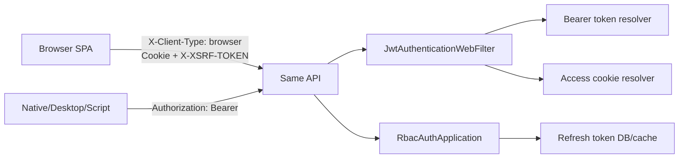

# Browser Cookie CSRF Auth Design

**日期:** 2026-06-23

**目标:** 第一阶段修复浏览器端 token 存储风险：Web/H5/管理后台不再把 access token 和 refresh token 存在 `localStorage`，改为 HttpOnly Cookie + CSRF 防护；原生 App、桌面客户端、脚本客户端继续共享同一套 API，并保留 `Authorization: Bearer` token 兼容能力。第二、第三阶段的 XSS/CSP/DPoP 等强化项只进入后续优化，不在本阶段实现。

**当前背景:** 前端 `fe/src/services/tokenStorage.ts` 将 access token、refresh token 和过期时间写入 `localStorage`，`fe/src/services/request.ts` 再读取 access token 放入 `Authorization: Bearer`。后端 `RbacAuthApplication` 已具备双 token、refresh token hash、刷新轮换、数据库撤销和 Redis token 状态缓存；`JwtAuthenticationWebFilter` 只从 Bearer header 认证；`RbacSecurityConfig` 目前禁用 CSRF。项目要求多端共用同一套 API，且这些端都部署或调用在同一域名下。

---

## 1. 用户确认结论

- 本阶段采用“双通道同 API”。
- 浏览器端使用 HttpOnly Cookie 保存 access/refresh token，并启用 CSRF 防护。
- 非浏览器端继续支持响应体 token 和 `Authorization: Bearer` 调用方式。
- 不在本阶段引入 DPoP。
- 第二阶段的 XSS/CSP/refresh token 复用检测、第三阶段的 DPoP 写入后续优化。
- 不启动项目，用户会自行做运行时测试。

---

## 2. 设计原则

- 最小安全改造：优先移除浏览器 JS 可读取的长期凭证，不重写 RBAC、JWT 签发、权限缓存和 API 权限模型。
- 保持 API 兼容：同一套登录、刷新、注销、业务接口同时服务浏览器和非浏览器客户端。
- 显式客户端模式：浏览器前端固定发送 `X-Client-Type: browser`，后端据此决定是否写 Cookie、是否隐藏响应体 token。不要用 User-Agent 猜测客户端类型。
- CSRF 只保护 Cookie 认证路径：非浏览器 Bearer 客户端不应被 CSRF token 阻断。
- 直接实现优先：第一阶段不引入复杂设计模式。若后续引入 DPoP，再抽象凭证解析策略或 token 绑定校验器。

---

## 3. 推荐方案

采用浏览器 Cookie 认证 + 非浏览器 Bearer 兼容。



该方案解决浏览器端 localStorage token 暴露问题，同时保留当前非浏览器集成方式。

---

## 4. 后端设计

### 4.1 Cookie 名称与属性

新增认证 Cookie：

- `CM_ACCESS_TOKEN`
    - 内容：JWT access token。
    - 属性：`HttpOnly`, `Secure`, `SameSite=Lax`, `Path=/api`。
    - 生命周期：与 access token TTL 对齐，当前配置默认 `PT30M`。
- `CM_REFRESH_TOKEN`
    - 内容：JWT refresh token。
    - 属性：`HttpOnly`, `Secure`, `SameSite=Lax`, `Path=/api/auth`。
    - 生命周期：与 refresh token TTL 对齐，当前配置默认 `P14D`。
- `XSRF-TOKEN`
    - 内容：Spring Security CSRF token。
    - 属性：非 HttpOnly，`Secure`, `SameSite=Lax`, `Path=/`。
    - 前端读取该 Cookie 后发送 `X-XSRF-TOKEN` 请求头。

本地 HTTP 开发环境可以通过配置关闭 Cookie `Secure`，生产默认必须开启。

### 4.2 客户端模式识别

定义浏览器客户端请求头：

```text
X-Client-Type: browser
```

浏览器模式下：

- 登录/注册响应写入 access/refresh Cookie。
- 登录/注册/刷新响应体不返回 token 字符串，只返回用户、权限、菜单、过期秒数等非敏感会话信息。
- 刷新优先读取 `CM_REFRESH_TOKEN` Cookie。
- 注销优先读取 refresh Cookie 并清理 Cookie。

非浏览器模式下：

- 登录/注册/刷新继续在响应体返回 access/refresh token。
- 刷新继续接受 body 中的 `refreshToken`。
- 注销继续接受 body 中的 `refreshToken`。
- 业务请求继续通过 `Authorization: Bearer` 认证。

### 4.3 Token 认证解析

`JwtAuthenticationWebFilter` 支持两种 access token 来源：

1. `Authorization: Bearer <token>`。
2. `CM_ACCESS_TOKEN` Cookie。

优先级为 Bearer 高于 Cookie。这样非浏览器客户端、调试工具和未来 DPoP/Bearer 增强不会被浏览器 Cookie 影响。

### 4.4 登录、注册、刷新、注销

`AuthController` 保持现有 API 路径：

- `POST /api/auth/login`
- `POST /api/auth/register`
- `POST /api/auth/refresh`
- `POST /api/auth/logout`
- `GET /api/auth/me`

新增：

- `GET /api/auth/csrf`

`/api/auth/csrf` 负责触发 CSRF token 生成并返回 token 元信息。该接口公开，只用于让前端初始化 `XSRF-TOKEN` Cookie。

登录/注册在浏览器模式下调用现有 `RbacAuthApplication.login/register` 创建 token pair，然后由 controller 或专门的 cookie helper 写 Cookie，再把响应体 token 字段置空。

刷新在浏览器模式下从 Cookie 读取 refresh token，沿用现有轮换逻辑，写入新的 access/refresh Cookie，响应体 token 字段置空。

注销在浏览器模式下从 Cookie 或 body 解析 refresh token。能解析到 refresh token 时撤销数据库 refresh token；无论撤销是否成功，都清理 `CM_ACCESS_TOKEN` 和 `CM_REFRESH_TOKEN`。

### 4.5 CSRF 配置

启用 WebFlux CSRF：

- 使用 `CookieServerCsrfTokenRepository.withHttpOnlyFalse()`。
- header 名使用默认 `X-XSRF-TOKEN`。
- cookie 名使用默认 `XSRF-TOKEN`。
- CSRF access denied 响应统一走现有 JSON 格式，错误码建议 `AUTH_CSRF_INVALID`。

CSRF 保护范围：

- 对 Cookie 浏览器认证的 `POST/PUT/PATCH/DELETE` 生效。
- 对 `Authorization: Bearer` 请求跳过 CSRF。
- 对 `GET/HEAD/OPTIONS/TRACE` 不要求 CSRF。

如果 Spring Security 的 matcher 不便区分 Bearer 与 Cookie，可增加一个小的 `ServerWebExchangeMatcher`：当请求带 Bearer header 时不匹配 CSRF；否则沿用默认变更方法匹配规则。

---

## 5. 前端设计

### 5.1 删除 localStorage token 路径

`tokenStorage.ts` 不再保存 token 字符串。前端认证状态来自：

- `AuthProvider` 内存中的用户会话信息。
- `/api/auth/me` 重新加载。
- Cookie 中的服务端认证状态。

本阶段可以保留 tokenStorage 模块名，但函数语义调整为 session hint 或彻底移除 token 读写。不得继续把 access/refresh token 存入 `localStorage`。

### 5.2 请求头与凭证

所有前端请求固定带：

```text
X-Client-Type: browser
```

axios 请求设置：

```text
withCredentials: true
```

fetch 请求设置：

```text
credentials: "same-origin"
```

如果未来浏览器 API base URL 使用同站跨子域，需要调整为 `credentials: "include"` 并同步 CORS/Origin 策略。本阶段按同域部署设计。

### 5.3 CSRF token 处理

新增前端 CSRF helper：

- 从 `document.cookie` 读取 `XSRF-TOKEN`。
- 对 `POST/PUT/PATCH/DELETE` 自动写入 `X-XSRF-TOKEN`。
- 若变更请求前没有 token，则先调用 `GET /api/auth/csrf` 初始化。
- 若请求返回 `403` 且业务码为 `AUTH_CSRF_INVALID`，重新获取 CSRF token 后重试一次。

普通 `GET`、SSE `GET` 不带 CSRF header。流式 `POST` 必须带 CSRF header。

### 5.4 登录态刷新

401 处理逻辑调整：

- 前端不再读取 refresh token。
- 收到 401 后调用 `POST /api/auth/refresh`，由 HttpOnly refresh Cookie 自动携带。
- refresh 成功后重试原请求。
- refresh 失败后清理前端内存 session，并让用户重新登录。

非浏览器客户端不受前端改造影响。

---

## 6. 兼容性与迁移

- 已登录旧浏览器用户的 localStorage token 在首次新版本启动时应被清理，避免遗留敏感数据。
- 如果清理后没有 Cookie 登录态，用户需要重新登录。
- 后端仍支持 body refresh token，使非浏览器客户端无需同步升级。
- 前端接口类型 `LoginResponse` 可以保留 token 字段为可选/nullable，兼容非浏览器响应和后端 DTO。
- Cookie Secure 在本地 HTTP 环境需要可配置，否则本地登录无法保存 Cookie。

---

## 7. 测试设计

### 7.1 后端测试

优先补充 RBAC auth/security 测试：

- 浏览器登录响应写入 `CM_ACCESS_TOKEN`、`CM_REFRESH_TOKEN` Cookie。
- 浏览器登录响应体不包含 access/refresh token。
- 非浏览器登录仍返回 access/refresh token。
- `JwtAuthenticationWebFilter` 能从 Cookie 认证 access token。
- Bearer 优先级高于 Cookie。
- 浏览器 refresh 能从 Cookie 读取 refresh token 并轮换 Cookie。
- 非浏览器 refresh body token 继续可用。
- logout 清理 Cookie 并撤销 refresh token。
- 缺少 CSRF 的浏览器状态变更请求返回 `AUTH_CSRF_INVALID`。
- 带 Bearer 的非浏览器状态变更请求不受 CSRF 阻断。

### 7.2 前端测试

扩展 `fe/src/services/request.test.ts` 和 token/session 相关测试：

- 请求默认带 `X-Client-Type: browser`。
- axios 和 fetch 都设置浏览器凭证选项。
- POST/PUT/PATCH/DELETE 在无 `XSRF-TOKEN` 时先请求 `/api/auth/csrf`。
- 变更请求读取 cookie 并带 `X-XSRF-TOKEN`。
- 流式 POST 同样带 CSRF header。
- 401 后调用 `/api/auth/refresh`，不再读取 refresh token。
- refresh 成功后重试原请求。
- 启动时清理旧 localStorage token。

验证命令优先使用 targeted 测试：

```bash
cd be && ./mvnw -Dmaven.build.cache.enabled=false -Dtest='*Auth*Tests,*Security*Tests' test
cd fe && bun test request.test.ts tokenStorage.test.ts
```

如 targeted 命令无法覆盖编译，再运行：

```bash
cd be && ./mvnw -Dmaven.build.cache.enabled=false test
cd fe && bun test
```

---

## 8. 风险与边界

- HttpOnly Cookie 降低 token 被窃取风险，但不能阻止页面内 XSS 直接发起用户操作。因此本阶段必须配合后续 XSS/CSP 强化。
- SameSite 不能替代 CSRF token；同站子域或某些导航场景仍需要 CSRF header 校验。
- Cookie path 设置过窄可能导致刷新或业务请求收不到 token；实现时需要用测试覆盖 path。
- 如果生产存在跨子域 API 调用，需要明确 CORS allow credentials、allowed origins 和 Cookie domain。本阶段按同域部署设计，不扩大跨域支持。
- 前端从 localStorage 切换到 Cookie 后，页面刷新需要通过 `/api/auth/me` 恢复会话。
- 非浏览器客户端如果误带 `X-Client-Type: browser`，可能拿不到响应体 token；文档需明确该 header 仅供浏览器前端使用。

---

## 9. 后续优化

第二阶段安全强化：

- 增加 CSP，限制脚本来源，减少 XSS 影响面。
- 检查 Markdown/HTML 渲染链路，避免未净化 HTML 注入。
- 增加依赖审计和前端构建安全检查。
- 缩短 access token TTL 或按端类型配置 TTL。
- 增加 refresh token 复用检测：旧 refresh token 被再次使用时撤销该用户或该设备的 token 族。
- 管理员敏感操作增加重新认证或二次确认。

第三阶段客户端绑定：

- 对原生 App、桌面客户端、脚本客户端评估并引入 DPoP。
- token 签发时绑定客户端公钥指纹。
- 服务端校验 `DPoP` proof 的 `htu`、`htm`、`iat`、`jti`。
- 增加 `jti` 短期重放缓存，阻止 proof 重放。

---

## 10. 完成标准

- 浏览器前端不再把 access token 或 refresh token 写入 `localStorage`。
- 浏览器登录、注册、刷新通过 HttpOnly Cookie 维持会话。
- 浏览器状态变更请求有 CSRF 防护。
- 非浏览器 Bearer token API 兼容能力保留。
- 旧 localStorage token 会被清理。
- 后端和前端新增测试通过。
