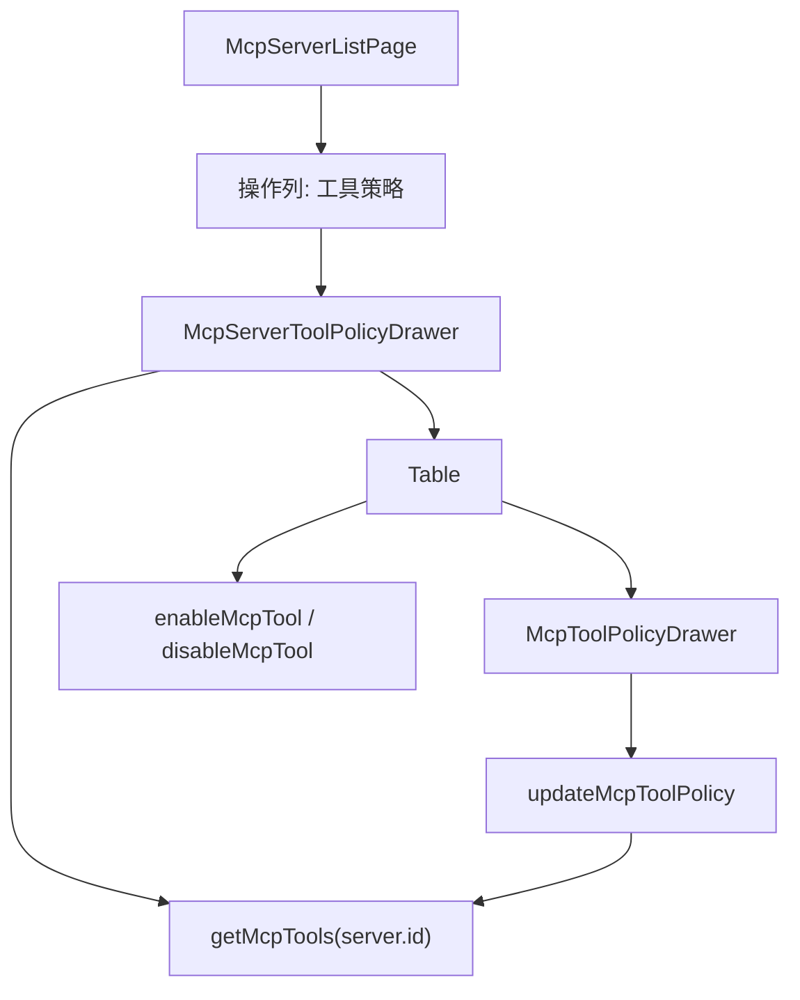

# MCP Tool Policy Drawer Design

**日期:** 2026-06-25

**目标:** 在 MCP 服务配置页为每个 MCP 服务增加“工具策略”操作入口。用户点击服务行操作按钮后，在弹出面板中查看该服务下的 MCP 工具策略，并可继续维护工具风险、只读、确认和启用状态。该入口减少用户在“服务配置”和“工具策略”两个菜单间来回切换的成本，同时复用现有工具策略能力。

**当前背景:** CyberMario 已有 MCP 服务配置页、MCP 工具策略页和 MCP 工具策略编辑抽屉。现有前端 MCP 管理位于 `fe/src/modules/agent/mcp/**`，服务页使用 `PageToolbar + Table + 操作按钮 + Drawer` 模式，工具策略页使用 `Table + Switch + Tag + McpToolPolicyDrawer` 模式。后端已经提供 `getMcpTools(serverId)`、`updateMcpToolPolicy(id, request)`、`enableMcpTool(id)` 和 `disableMcpTool(id)`，本设计不新增后端 API。

---

## 1. 已确认结论

- 入口放在 MCP 服务配置页的服务表格操作列。
- 新增操作按钮命名为“工具策略”。
- 点击按钮后展示弹出式内容，不新增单独页面。
- 弹出内容采用 Ant Design `Drawer + Table`，不采用 `Modal + List`。
- 工具策略数据按当前服务过滤，调用现有 `getMcpTools(server.id)`。
- 策略编辑继续复用现有 `McpToolPolicyDrawer` 的表单逻辑。
- 不改数据库、不改 MCP runtime、不改后端接口和权限模型。
- 不移除现有左侧菜单中的“MCP 工具策略”页面，原页面继续作为全局工具策略视图存在。

## 2. 用户场景

### 2.1 从服务视角查看工具

管理员进入 MCP 服务配置页，看到某个服务后点击“工具策略”。系统打开抽屉，只展示该服务发现到的工具。管理员可以快速判断该服务下有哪些工具、哪些工具可用、哪些策略阻止运行。

### 2.2 从服务视角维护策略

管理员在服务的工具策略抽屉内直接切换工具启用状态，或点击单个工具的“策略”按钮编辑风险等级、只读和需要确认配置。保存后只刷新当前服务的工具列表，不影响服务配置表格的当前浏览状态。

### 2.3 保留全局策略管理

当管理员需要跨服务筛选或统一巡检所有 MCP 工具时，仍然使用原“MCP 工具策略”菜单。服务页弹出层只解决“从某个服务出发查看和维护其工具”的局部工作流。

## 3. 推荐方案

推荐方案是新增一个 `McpServerToolPolicyDrawer` 组件，由 `McpServerListPage` 持有打开状态和当前服务。

选择 `Drawer + Table` 的原因:

- 当前项目后台页已大量使用 `PageToolbar + Table + Drawer/Modal`，新增交互应保持一致。
- 工具策略是结构化数据，包含状态、风险、开关和行级操作，`Table` 比 `List` 更适合扫描和维护。
- `Drawer` 适合从当前服务行展开上下文详情，不打断用户在服务配置页的任务流。
- `Modal` 更适合短确认或小表单；这里存在表格、展开详情和二级编辑，空间不足。

## 4. 组件设计

### 4.1 `McpServerListPage`

新增状态:

- `policyServer: McpServerResponse | null`
- `policyOpen: boolean`

新增操作按钮:

- 图标建议使用 `ToolOutlined` 或 `SettingOutlined`。
- 文案为“工具策略”。
- 按钮显示条件复用工具策略权限。只要用户具备 `mcpButtonCodes.tool.editPolicy` 或 `mcpButtonCodes.tool.toggle` 任一权限，就显示入口；如果后续需要纯查看权限，再扩展权限码。

操作列宽需要按按钮数量小幅增加，避免按钮换行或挤压。当前已有“编辑 / 测试 / 发现 / 删除”，增加“工具策略”后可保留 `Space wrap`，或适度增加列宽。实现时优先减少布局抖动，不把按钮折叠成下拉菜单，除非实际宽度验证证明必须折叠。

### 4.2 `McpServerToolPolicyDrawer`

新增组件位置:

`fe/src/modules/agent/mcp/McpServerToolPolicyDrawer.tsx`

组件职责:

- 接收 `open`、`server`、`onClose`。
- 在 `open && server` 时调用 `getMcpTools(server.id)`。
- 展示该服务下的工具策略表格。
- 处理工具启用/禁用。
- 打开并承载 `McpToolPolicyDrawer`。
- 保存策略后刷新当前服务工具列表。

组件不负责:

- 不加载服务列表。
- 不修改服务配置。
- 不处理工具发现。工具发现仍由服务页现有“发现”按钮触发。
- 不实现跨服务筛选。

## 5. 表格内容

抽屉内表格列建议复用全局工具策略页的核心列:

| 列 | 说明 |
|---|---|
| Tool Key | 固定左侧，支持复制和 tooltip ellipsis |
| 工具名 | 展示 `toolName` |
| 风险 | `riskLevel`，复用现有颜色规则 |
| 只读 | `readonly`，使用是/否 Tag |
| 确认 | `requireConfirm`，使用是/否 Tag |
| 运行状态 | `runtimeStatus`，复用现有颜色规则 |
| 启用 | `Switch`，受 `mcpButtonCodes.tool.toggle` 控制 |
| 最近发现 | `DateTimeText` |
| 操作 | “策略”按钮，受 `mcpButtonCodes.tool.editPolicy` 控制 |

展开行继续展示工具描述和 input schema，复用 `McpToolListPage` 现有 `expandedRowRender` 逻辑。第一版可以复制提取为共享渲染函数，避免新增复杂抽象。

## 6. 权限和安全

本设计不新增后端权限和菜单。

前端按钮控制:

- “工具策略”入口: 用户具备工具策略编辑或工具启用权限时显示。
- 启用 Switch: 继续由 `mcpButtonCodes.tool.toggle` 控制。
- “策略”按钮: 继续由 `mcpButtonCodes.tool.editPolicy` 控制。

后端仍然是最终权限边界。前端隐藏按钮只改善体验，不作为安全依据。所有策略更新和启停请求继续走现有接口和后端鉴权。

## 7. 数据流和错误处理

打开抽屉:

1. 用户点击服务行“工具策略”。
2. `McpServerListPage` 设置当前服务并打开抽屉。
3. `McpServerToolPolicyDrawer` 调用 `getMcpTools(server.id)`。
4. 加载成功后展示工具表格；加载失败时调用 `reportGlobalError`，表格保持空数据或上一次当前服务数据清空后的状态。

切换工具启用:

1. 用户点击工具启用 Switch。
2. 根据目标状态调用 `enableMcpTool(id)` 或 `disableMcpTool(id)`。
3. 成功后提示“工具已启用”或“工具已禁用”。
4. 刷新当前服务工具列表。
5. 失败时调用 `reportGlobalError`，并由刷新后的服务端状态或原状态恢复展示。

编辑策略:

1. 用户点击工具行“策略”。
2. 打开现有 `McpToolPolicyDrawer`。
3. 保存后调用 `updateMcpToolPolicy(id, request)`。
4. 成功后提示“策略已保存”，关闭策略编辑抽屉，并刷新当前服务工具列表。

## 8. UI 和交互细节

- 抽屉标题: `工具策略：{server.serverName}`，副标题或描述可展示 `{server.serverCode}`。
- 抽屉宽度: 建议 `960` 或 `min(960px, calc(100vw - 48px))` 对应的响应式写法；实现时按项目现有 Drawer 写法处理。
- 抽屉顶部操作: 可提供“刷新”按钮，调用当前服务的 `loadTools`。
- 空状态: 当前服务尚未发现工具时，展示 Ant Design `Empty` 默认空态或表格空态，并提示用户回到服务行点击“发现”。
- 表格分页: 第一版保持 `pagination={false}`，和现有工具策略页一致。若未来单服务工具数量明显增长，再引入前端分页或后端分页。
- 表格滚动: 配置 `scroll={{x: ...}}`，避免抽屉内列挤压。
- 二级抽屉: `McpToolPolicyDrawer` 可以从服务工具策略抽屉内打开。保存后只刷新服务工具策略抽屉内的数据。

## 9. 设计模式取舍

本次不引入 Strategy、Factory、Command 等额外设计模式。

原因:

- 变化点是页面组合和局部状态管理，不是复杂业务规则分派。
- 现有服务页、工具页和策略编辑抽屉已经提供清晰边界。
- 直接新增一个专用 Drawer 组件，并复用现有 service 函数和权限码，复杂度最低。

可接受的小型复用:

- 如果实现时发现 `riskLevelColor`、`runtimeStatusColor`、`formatJson` 等渲染函数需要在两个页面共享，可以提取到 `mcpToolView.tsx` 或同目录轻量 helper。
- 只有当重复明显影响维护时才提取；不要为了形式统一提前拆出多层抽象。

## 10. 不做范围

- 不新增或删除左侧菜单项。
- 不把全局“MCP 工具策略”页面改成弹出层。
- 不新增后端接口、DTO、数据库字段或 Flyway migration。
- 不修改 MCP 服务发现、运行时刷新、Agent 工具暴露逻辑。
- 不改变 `requireConfirm=true` 工具在第一阶段不暴露给 ReactAgent 的安全限制。
- 不引入 ProComponents、ProTable、ProList 或新的组件库依赖。
- 不启动项目运行时；实现后由用户自行启动验收。

## 11. 验证建议

实现计划阶段应覆盖:

- TypeScript 编译或前端 build。
- `McpServerListPage` 相关测试: 操作列出现“工具策略”按钮，并按权限显示。
- 新 Drawer 组件测试: 打开时按 `server.id` 调用 `getMcpTools`，关闭后不继续误刷新。
- 策略保存测试: 保存后刷新当前服务工具列表。
- 启停测试: Switch 调用正确接口并刷新列表。
- 回归测试: 原“MCP 工具策略”页面仍可按全部服务或指定服务查看和编辑。

## 12. 后续扩展

如果后续要把服务配置页变成更完整的 MCP 服务工作台，可以继续扩展:

- 在 Drawer 内增加“发现工具”入口，但仍调用现有服务发现接口。
- 加入工具数量、可用数量、策略阻止数量的摘要。
- 当单服务工具数量很大时，引入搜索、前端分页或后端分页。
- 如果操作列继续膨胀，再统一引入“更多”菜单，但第一版不预先复杂化。
