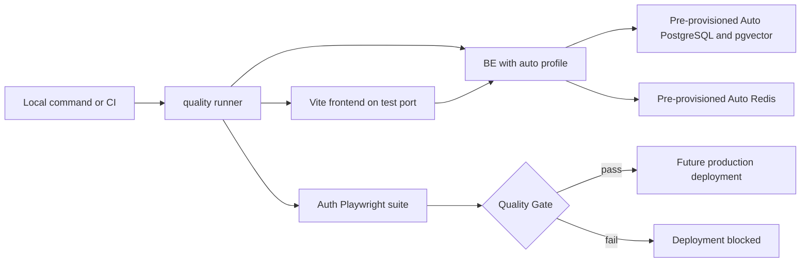

# Playwright Auto Quality Gate Design

Date: 2026-07-14
Status: Approved
Author: design session

## 1. Decision Summary

CyberMario will add a root-level `quality/` project beside `be/` and `fe/`.
The project will use Playwright to exercise the real browser authentication
flow against the existing frontend and a backend running with the Spring
`auto` profile.

The first delivery is deliberately limited to registration and login. It
establishes the project structure, environment contract, test-data lifecycle,
local commands, diagnostics, and CI quality gate needed for broader browser
regression coverage later. It does not attempt to implement full regression
coverage now.

The selected architecture has these properties:

- Playwright starts only the backend and frontend processes.
- PostgreSQL with pgvector and Redis are pre-provisioned external Auto
  resources; Playwright does not start them with Docker.
- The backend uses the existing PostgreSQL Flyway migration chain. SQLite is
  not used.
- The same Playwright test code and core command run locally and in CI.
- Every run exclusively owns its configured local or CI PostgreSQL lane schema
  while active, together with a dedicated Redis database lane, a unique
  `runId`, and its test users.
- The runner cleans Auto state before and after the suite, including on test
  failure.
- The initial gate covers backend checks, frontend checks, and the Auth
  Playwright suite. A future production deployment job must depend on the
  stable `Quality Gate` result for the exact commit being deployed.

## 2. Current Project Context

The repository currently contains `be/` and `fe/` but no project-owned
Playwright configuration or `.github/workflows` CI definition.

The frontend uses Bun, Vite, React, and Ant Design. It exposes `/register` and
`/login`, and successful registration or login redirects to `/chat`. The
browser authentication path is not a plain form POST. It obtains the password
transport public key, encrypts the password, initializes CSRF state, sends the
browser-client marker, and receives access and refresh tokens through HttpOnly
cookies.

The backend uses PostgreSQL, pgvector, Flyway, and Redis. The production
migration history includes PostgreSQL-specific behavior and is the
authoritative schema path. Registration creates a user, grants the default
roles, persists refresh-token state, populates Redis-backed authentication and
permission state, and writes audit records.

The repository does not currently use an MQ product. MQ remains part of the
future external-component contract only after the backend adopts a specific
MQ implementation.

## 3. Goals

1. Create a maintainable `quality/` Playwright project at the repository root.
2. Run real registration and login flows through the existing frontend and
   backend without mocking `/api/auth/**`.
3. Support local headless, headed, UI, and debug workflows with the same test
   implementation used by CI.
4. Add a Spring `auto` profile that connects only to dedicated Auto
   PostgreSQL and Redis resources.
5. Ensure every test run can prepare and clean its data without adding a
   production-accessible test cleanup API.
6. Produce actionable reports, traces, screenshots, network failure details,
   and frontend/backend logs.
7. Establish a stable CI quality-gate contract that can block future
   production deployment.
8. Make later domain suites additive without building those suites now.

## 4. Non-Goals

- No SQLite support.
- No Docker Compose, Testcontainers, or CI service-container provisioning.
- No Playwright tests for Account, RBAC, Agent, RAG, Clocktower, Nutrition, or
  other business modules in this delivery.
- No MQ dependency or speculative MQ configuration.
- No network mocking for authentication APIs.
- No public or production-accessible test-data cleanup endpoint.
- No change to authentication business behavior, token contracts, or RBAC
  semantics.
- No modification of any existing Flyway migration.
- No production deployment implementation while the repository has no
  deployment workflow or packaging contract.
- No release-branch model.
- No Firefox or WebKit gate in the first delivery.

## 5. Approaches Considered

### 5.1 Extensible quality project with an Auth-first suite - selected

Build the durable Playwright project, Auto environment contract, fixtures,
page objects, cleanup runner, and CI gate now, while limiting implemented
browser scenarios to registration and login.

Advantages:

- satisfies the immediate authentication-testing need
- local and CI execution share one implementation
- creates clear extension points for later domain suites
- avoids rewriting a one-off script when regression coverage grows
- keeps the current implementation scope bounded

Trade-off: the first change includes foundational files beyond the individual
Auth specs.

### 5.2 One standalone login script - rejected

A single script would be faster to create, but it would mix selectors,
identity generation, process startup, cleanup, assertions, and diagnostics.
The next user workflow would either duplicate that logic or require an
immediate restructure.

### 5.3 Build the complete regression framework and suite now - rejected

Creating abstractions and test modules for domains that do not yet have
Playwright scenarios would be speculative. The selected design establishes
only the shared mechanisms required by the Auth suite and lets later feature
work introduce domain-specific fixtures when real use cases exist.

### 5.4 Disposable PostgreSQL and Redis containers - rejected by requirement

Per-run containers would provide strong infrastructure isolation, but the
approved environment model uses pre-provisioned Auto services configured
through Spring and CI variables. Playwright must not pull or start external
components.

## 6. System Architecture



Ownership boundaries:

- `quality/` owns browser tests, page objects, test fixtures, external-state
  preparation and cleanup, process orchestration, and reports.
- `be/` owns the `auto` Spring configuration and the guard that prevents Auto
  cleanup from targeting a non-Auto database.
- `fe/` remains the application under test. It does not receive a separate
  test implementation or alternate authentication code path.
- PostgreSQL and Redis are managed outside Playwright. The runner verifies
  connectivity and manages only its approved Auto namespace.
- CI owns ordering and the stable gate result. A deployment workflow, when it
  exists, must deploy the same commit SHA that passed the gate.

## 7. Repository Structure

The initial implementation should add this structure:

```text
quality/
|-- package.json
|-- bun.lock
|-- tsconfig.json
|-- playwright.config.ts
|-- README.md
|-- .gitignore
|-- scripts/
|   `-- run-quality.ts
|-- fixtures/
|   `-- auth.fixture.ts
|-- models/
|   `-- test-identity.ts
|-- pages/
|   |-- LoginPage.ts
|   |-- RegisterPage.ts
|   `-- AdminShell.ts
`-- tests/
    `-- auth/
        |-- register.spec.ts
        |-- login.spec.ts
        `-- session.spec.ts
```

The backend adds `be/src/main/resources/application-auto.yaml` and a narrowly
scoped Auto environment guard under the existing configuration package. The
CI integration adds a repository workflow with a stable `Quality Gate` job
name. Test outputs are ignored inside `quality/.gitignore`; the root
`.gitignore` does not need unrelated churn.

## 8. Auto Spring Profile

### 8.1 Database

`application-auto.yaml` keeps the PostgreSQL driver and the existing Flyway
locations:

- `classpath:db/migration`
- `classpath:db/postgresql`

It accepts an Auto database URL, username, password, and schema. Flyway's
default schema and Hibernate's default schema must resolve to the same value.
The JDBC search path must include the run schema and the shared schema needed
for database-level extensions such as pgvector.

The pre-provisioned Auto database must have pgvector available. The Auto
database principal must be allowed to create and drop approved Auto schemas,
run Flyway, and use the extension. It must have no privileges on development
or production databases.

### 8.2 Redis

The profile accepts a dedicated Auto Redis host, port, password, and database
index. Local and CI runs use different Redis database lanes so that a local
cleanup cannot clear CI state. The initial CI suite is serialized because one
CI lane is shared across workflow runs.

### 8.3 Browser authentication

The Auto profile sets browser-cookie `secure=false` because the local and CI
Vite servers use HTTP. Cookie names, paths, SameSite behavior, CSRF handling,
token TTLs, and browser-client detection remain the production code paths.

### 8.4 External configuration

The environment contract includes:

```text
AUTO_DB_URL
AUTO_DB_USERNAME
AUTO_DB_PASSWORD
AUTO_DB_SCHEMA
AUTO_REDIS_HOST
AUTO_REDIS_PORT
AUTO_REDIS_PASSWORD
AUTO_REDIS_DATABASE
AUTO_JWT_SECRET
```

Spring configuration may provide safe local Auto defaults for host, port,
database name, schema, and Redis index. Passwords and other secrets must be
supplied through ignored local environment files or CI secrets.

### 8.5 Fail-closed environment guard

An `auto`-profile-only startup guard validates at least these invariants:

- the JDBC database name explicitly identifies an Auto database
- the schema matches the approved `auto_` naming convention and is not
  `public`
- the Redis database is the configured Auto lane and not the normal
  development lane
- browser cookies are not marked Secure for the HTTP test origin

The backend must refuse startup when an invariant fails. The runner repeats
the destructive-target checks before preparing or cleaning external state.
Configuration checks are intentionally duplicated at the two destructive
boundaries rather than delegated to a test convention.

## 9. Local and CI Execution

The same core command runs the same specs in both environments:

```text
bun run test:auth
```

Local developer commands:

```text
bun run test:auth
bun run test:auth:headed
bun run test:auth:ui
bun run test:auth:debug
bun run report
```

The runner accepts Playwright mode arguments but does not fork separate test
logic. Headed, UI, and debug modes change browser presentation and debugging
only.

Playwright uses a `webServer` array to start:

1. the backend with `SPRING_PROFILES_ACTIVE=auto` on the dedicated backend
   test port
2. the existing Vite frontend on the dedicated frontend test port with its
   proxy pointing to the Auto backend

The backend readiness endpoint and the frontend `/login` route are the startup
conditions. Existing development servers are not reused. An occupied test
port is a failure because silently connecting to an unknown process would
invalidate the gate.

Initial defaults are backend port `28081` and frontend port `5174`, both
overridable for an approved local Auto lane.

CI uses headless Chromium. Local runs may use headless Chromium or the
developer modes above. Retries default to zero in both environments so a
flaky authentication flow cannot pass the release gate through retry.

## 10. Test Data Lifecycle

### 10.1 Run ownership

Every invocation creates a unique `runId`. Generated account numbers,
usernames, email addresses, report metadata, and log correlation contain the
run identifier and a case identifier. The password and other non-sensitive
profile values are fixed constants in test code; they are Auto-only test data,
not credentials for an existing account.

### 10.2 Environment preparation

Before Playwright starts the backend, `run-quality.ts`:

1. validates that the configured database, schema, and Redis database are
   approved Auto targets
2. recreates the selected local or CI PostgreSQL schema
3. clears the selected Auto Redis database
4. creates the run metadata used by fixtures and reports

Backend startup then runs the real Flyway chain into the clean schema and
performs the normal RBAC resource/bootstrap work required by registration.

### 10.3 Cleanup

After Playwright exits, the runner executes cleanup in a `finally` path:

1. stop the frontend and backend through Playwright's managed lifecycle
2. drop the approved run schema with cascade
3. clear the approved Redis database
4. preserve reports and process logs but never persist passwords, token values,
   Cookie values, or the database contents as artifacts

Cleanup runs after both success and failure. Cleanup failure changes the final
command result to failure. The next run also performs pre-cleaning so a killed
previous process cannot permanently poison the Auto lane.

The design does not use the existing administrator delete-user endpoint. That
operation is a soft delete, cannot be used by a user on itself, and does not
remove all refresh-token, audit, cache, or future domain state. Schema-level
cleanup is the authoritative deletion boundary.

### 10.4 Concurrency

CI uses a workflow concurrency group with `cancel-in-progress: false`, ensuring
that only one job resets the CI Auto lane at a time. Local runs use a different
schema and Redis database. The first implementation uses one Playwright worker
and rejects a second local run targeting the same lane.

Per-worker schemas and Redis key namespaces are deferred until regression
volume justifies parallel sharding.

## 11. Auth Test Design

Each login scenario prepares its own account through the real registration
page, closes that authenticated browser context, and performs login in a new
context. Tests do not depend on an earlier test's success and do not use a
serial suite with one shared account.

### 11.1 Registration scenarios

| Scenario | Action | Required assertions |
|---|---|---|
| Client validation failure | Submit missing required values and mismatched passwords | Visible field errors; no registration request |
| Registration success | Fill all required fields with a unique identity | Successful API envelope; redirect to `/chat`; authenticated user visible; HttpOnly auth cookies present |
| Duplicate registration | Register the same account again from a fresh context | Duplicate-account business code; visible error; no authenticated session |

### 11.2 Login and session scenarios

| Scenario | Action | Required assertions |
|---|---|---|
| Wrong password | Register a unique user, open a fresh context, and submit an invalid password | `AUTH_INVALID_CREDENTIALS`; remain on `/login`; visible error; no auth cookies |
| Login success | Register a unique user, open a fresh context, and submit the valid password | Successful API envelope; redirect to `/chat`; current user visible; `CM_ACCESS_TOKEN` and `CM_REFRESH_TOKEN` present and HttpOnly |
| Session restoration | Reload after successful login and navigate to a protected route | `/api/auth/me` restores the user; protected route remains accessible |
| Logout | Use the application user menu to log out, then request a protected route | Auth cookies cleared; redirect to `/login` |

The browser must perform the real password-key, encryption, CSRF, Cookie,
PostgreSQL, and Redis flows. `/api/auth/**` must not be mocked.

## 12. Test Code Boundaries

### 12.1 Page Objects

`RegisterPage`, `LoginPage`, and `AdminShell` expose user-level actions and
stable page facts. Locators prefer accessible roles, labels, and names over CSS
class selectors. A `data-testid` is added to application code only if no stable
accessible locator exists and the element is genuinely part of the test
contract.

Page Objects do not contain scenario assertions, generate identities, clean
the database, or decide expected business codes.

### 12.2 Fixtures

The Auth fixture owns unique identity creation, browser-context lifecycle, and
the reusable operation that registers a user through the UI. It returns the
identity and relevant non-secret facts to the spec. It does not bypass the UI
with direct database inserts or API setup.

### 12.3 Specs

Specs retain the scenario sequence and assertions. They verify both the
user-visible result and the relevant API envelope or Cookie property. This
prevents a URL-only assertion from reporting success when authentication or
session persistence failed.

### 12.4 Pattern decision

The design uses the Page Object pattern and Playwright fixtures because they
remove real selector and lifecycle duplication. Strategy, Factory, handler
chains, and a custom test DSL are rejected for the current single-domain
suite. They would add indirection without a demonstrated variation point.

## 13. Diagnostics and Error Handling

The runner separates failures into environment startup, test assertion, and
cleanup phases and reports all applicable failures without hiding the primary
test result.

Required diagnostics:

- HTML Playwright report locally and in CI
- JUnit output in CI
- trace retained on failure
- screenshot on failure
- failed-request summary without authorization headers or token values
- backend and frontend process logs
- explicit readiness, Flyway, database, Redis, and cleanup errors

CI uploads diagnostics with `if: always()` and a bounded retention period. It
must not upload database dumps, Redis dumps, `.env` files, passwords, JWTs, or
Cookie values.

External-component unavailability, Flyway failure, backend or frontend startup
failure, test failure, and cleanup failure all fail closed. No condition may
convert those failures into a skipped or successful release gate.

## 14. CI Quality Gate

Add a repository workflow with these jobs:

1. `backend-check`: run the complete Maven test command without build-cache
   reuse that could hide current results
2. `frontend-check`: install with the committed Bun lockfile, then run lint,
   typecheck, unit tests, and build
3. `auth-playwright`: after both checks pass, install the quality dependencies
   and Chromium, connect to the configured Auto resources, and run
   `bun run test:auth`
4. `Quality Gate`: an always-evaluated aggregation job that succeeds only when
   all three checks succeeded

The workflow supports pull requests, pushes to the main development branch,
and manual execution. Secrets and variables provide the Auto PostgreSQL,
Redis, and JWT settings. It does not provision those services.

The repository currently has no production deployment workflow. When one is
introduced, its deployment job must:

- depend on the same `Quality Gate` contract
- deploy the exact tested commit SHA
- refuse deployment when any check is skipped, cancelled, or failed
- avoid rerouting deployment around the gate through a separate manual path

Until a deployment job or external deployment integration is connected, the
workflow establishes the required status but cannot by itself prove that all
external production operators honor it.

## 15. Future Regression Growth

Future user workflows add domain-owned specs without replacing the foundation:

```text
quality/tests/
|-- auth/
|-- account/
|-- rbac/
|-- agent/
|-- rag/
|-- clocktower/
`-- nutrition/
```

Evolution rules:

- a new or changed user-visible workflow adds or updates its Playwright
  scenario in the same delivery task
- shared browser behavior goes into a Page Object only after real reuse exists
- each domain owns its data fixture and cleanup registration
- `test:auth` remains a focused command
- a future `test:regression` aggregates mature domain suites and becomes the
  production-deployment predecessor
- coverage is tracked by critical user workflow, failure path, permission
  boundary, and data side effect rather than raw test count
- additional browsers and parallel sharding are later capacity decisions

## 16. Safety and Compatibility

- Existing development and production profiles remain unchanged.
- Existing Flyway migrations are never edited, renamed, reformatted, or
  bypassed.
- Auto cleanup credentials have privileges only inside the Auto database and
  Redis lane.
- The runner refuses `public`, development, or production cleanup targets.
- Authentication secrets and test credentials are not logged.
- Tests use the existing browser authentication contract and therefore detect
  regressions in encryption, CSRF, Cookie, refresh-session bootstrap, RBAC
  response assembly, PostgreSQL persistence, and Redis token/cache behavior.
- A failure of shared Auto infrastructure blocks the gate by design. The Auto
  database and Redis therefore require monitoring and capacity management once
  the gate controls production deployment.

## 17. Validation Plan

Implementation validation should cover these layers without starting the
project outside the explicit Playwright commands:

1. quality project typecheck and Playwright test discovery
2. focused frontend Auth unit tests
3. focused backend Auth/security tests
4. full frontend lint, typecheck, test, and build
5. full backend Maven tests
6. local `bun run test:auth` against the configured Auto PostgreSQL and Redis
7. a deliberate wrong-password run that proves the failure assertions
8. a deliberate test failure that proves reports are retained and cleanup
   still executes
9. an invalid Auto database/schema configuration that proves the guard fails
   before destructive work
10. CI workflow syntax and a manual workflow run when Auto secrets are
    available

The implementation agent must not automatically leave application processes
running after validation. The user remains responsible for any additional
interactive runtime testing.

## 18. Acceptance Criteria

The design is implemented when all of the following are true:

1. `quality/` exists beside `be/` and `fe/` with its own Bun lockfile and
   Playwright configuration.
2. `bun run test:auth` runs the same Auth specs locally and in CI.
3. Local headed, UI, and debug commands reuse the same specs.
4. Playwright starts and stops only `be` and `fe`; no Docker or external
   component provisioning occurs.
5. The backend starts with `auto`, connects to the configured PostgreSQL and
   Redis resources, and rejects unsafe targets.
6. Registration validation, registration success, duplicate registration,
   wrong-password login, successful login, session restoration, and logout are
   independently reported.
7. Test users are created through the registration UI and all Auth APIs remain
   real.
8. PostgreSQL schema and Redis cleanup execute before and after every run and
   fail the command when cleanup fails.
9. Reports contain sufficient diagnostics without exposing secrets or token
   values.
10. Backend, frontend, and Auth Playwright checks feed one stable `Quality
    Gate` result.
11. No existing Flyway migration is modified.
12. No non-Auth business suite, MQ integration, SQLite support, release branch,
    or production deployment implementation is added as part of this scope.
