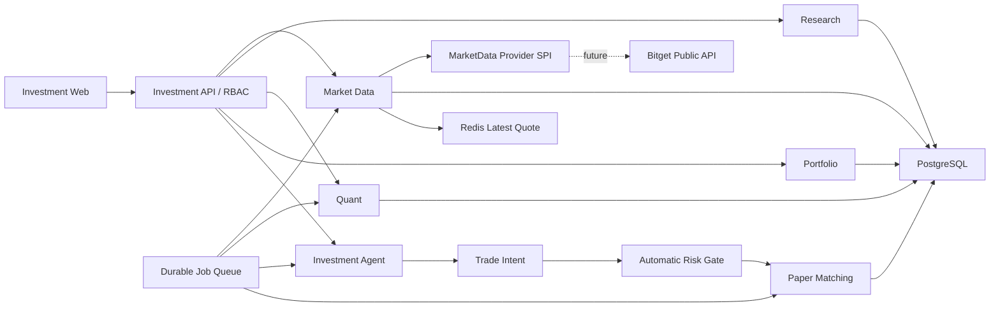
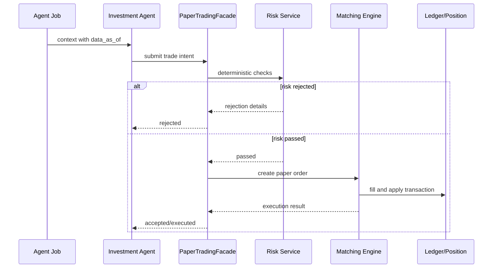
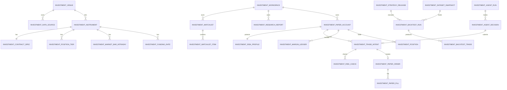

# Investment 合约分析、量化与 Agent 模拟交易设计

Date: 2026-07-16

Status: Confirmed product direction, pending final spec review

Author: design session

## 1. 背景

本设计在现有 CyberMario 仓库内新增 `investment` 业务模块，覆盖三条主线：

1. 合约行情、K 线、技术分析和报告。
2. 后端代码策略、数据快照和量化回测。
3. Agent 分析和自动模拟合约交易。

模块当前只做模拟盘，不接 Bitget 私有交易接口，不产生任何真实订单。Bitget
公开接口仅作为未来数据源，首轮实现应先完成内部领域模型、数据契约、持久化边界和
可替换适配层。

平台行情数据在系统内共享；工作区、自选、报告、回测、模拟账户、仓位和 Agent
运行数据属于用户私有数据。

本设计是完整架构蓝图，不是单个实现任务。后续实现应拆成可独立验证和提交的阶段。

## 2. 已确认产品决策

以下决策来自本轮设计确认，后续实现不得擅自改变：

- 模块代码和路由前缀统一使用 `investment`。
- 资产范围为加密货币合约，不做现货。
- V1 不接实盘，只做分析、回测和模拟盘。
- 外部数据源预留 Bitget API，当前不实际对接。
- 前端使用 React、Ant Design、Ant Design Charts 和 TradingView
  Lightweight Charts。
- 后端使用现有 Java 21、Spring Boot、WebFlux、JPA、Flyway、PostgreSQL 和
  Redis 技术栈。
- 策略逻辑在后端 Java 代码中实现和注册，不允许前端上传、拼装或传入策略定义。
- 数据接入范围在代码层控制，不提供前端数据订阅配置，也不要求接入 Bitget 的全部
  交易对或全部数据类型。
- Agent 生成的模拟交易意图不需要逐单人工确认；通过自动风险检查后直接进入模拟撮合。
- 模拟市价单使用下一根已关闭 1 分钟 K 线开盘价，并叠加手续费和滑点。
- 日 K 永久保存；已选标的 1 分钟 K 默认保存两年；不保存完整 Tick 历史。
- 只提供 Web 页面，不生成 PDF 或 Excel 报告。

## 3. V1 默认合约边界

用户已确认做合约，但没有进一步指定 Bitget 产品线。为保证本设计可执行，V1 使用
以下显式默认值：

- 产品类型：`USDT-FUTURES`。
- 合约类型：USDT 本位永续合约 `PERPETUAL`。
- 结算和保证金币种：`USDT`。
- 持仓模式：单向持仓 `ONE_WAY`。
- 保证金模式：逐仓 `ISOLATED`。
- 支持方向：做多和做空。
- 支持订单：市价单、限价单。
- 不支持交割合约、USDC 本位、币本位、全仓和双向持仓。

数据模型保留 `product_type`、`contract_type`、`margin_mode` 和
`position_mode`，以后扩展上述范围时不需要重建核心表。

如果最终目标不是 USDT 本位永续合约，应在实现前修改本节；本节是当前设计中唯一由
上下文推定、而非用户逐字确认的范围。

## 4. 目标

1. 在 CyberMario 中增加独立、低耦合的 `investment` 领域。
2. 以统一标的模型保存合约元数据、行情、标记价、资金费率和仓位档位。
3. 支持由代码明确选择的数据接入范围，并保证拉取、补数、修订和质量检查可追踪。
4. 提供行情列表、K 线、技术指标、传统分析和可追溯报告。
5. 让所有量化策略由 Java 代码注册，回测结果可通过策略版本和数据快照复现。
6. 支持 USDT 永续合约的模拟开仓、平仓、手续费、资金费、保证金、强平、仓位和净值。
7. 让 Agent 能读取受控行情和私人账户信息，自动提交模拟交易意图。
8. 用确定性风控和模拟撮合约束 Agent，而不是让 LLM 直接修改订单、成交或仓位。
9. 复用现有 Agent 运行、模型调用审计、RBAC、统一响应和前端基础设施。
10. 在 PostgreSQL 内满足首版数据规模，同时保留后续 Python Worker 和归档能力。

## 5. 非目标

- 不调用 Bitget 下单、撤单、账户、仓位或资产私有接口。
- 不保存 Bitget API Key、Secret 或 Passphrase。
- 不设计真实 Broker/Exchange 订单路由。
- 不对用户承诺收益，不提供个人财务建议。
- 不实现策略商城、策略分享、前端策略编辑器或脚本运行器。
- 不允许前端传入 Java、Python、表达式树或任意策略配置。
- 不接入全部 Bitget 交易对、全部周期、全部盘口或全部历史数据。
- 不保存逐 Tick 行情、完整订单簿或逐笔成交历史。
- 不在 V1 引入 Kafka、ClickHouse、TimescaleDB、Flink 或独立微服务。
- 不在 V1 常驻运行 Python 量化服务。
- 不实现组合保证金、全仓、多资产保证金、双向持仓或 ADL。
- 不自动启动前后端服务。

## 6. 仓库集成

### 6.1 后端目录

```text
be/src/main/java/top/egon/mario/investment
  bootstrap
  common
  marketdata
    provider
    provider/model
    ingest
    query
    quality
    po
    repository
    service
    web
  research
    indicator
    report
    po
    repository
    service
    web
  quant
    strategy
    strategy/impl
    engine
    dataset
    backtest
    po
    repository
    service
    web
  portfolio
    risk
    margin
    po
    repository
    service
    web
  trading
    matching
    order
    ledger
    po
    repository
    service
    web
  agent
    tool
    service
    po
    repository
    web
```

包按领域拆分，不能把所有 Controller、PO、Repository 和 Service 平铺到一个目录。
领域之间通过 Service/Facade 调用，不直接跨域写 Repository。

### 6.2 前端目录

```text
fe/src/modules/investment
  InvestmentWorkspaceLayout.tsx
  overview
  market
  instrument
  research
  quant
  portfolio
  agent
  platform
  components
  hooks
  services
  types
```

### 6.3 复用能力

模块复用：

- `ApiResponse<T>` 和现有异常处理。
- WebFlux Controller 与阻塞调用隔离惯例。
- Spring Data JPA 处理普通业务表。
- Flyway 处理所有结构变更。
- Redis 保存最新行情热副本。
- CyberMario RBAC Resource Provider。
- 现有 Agent Runtime、模型调用、工具调用和运行审计。
- React Router、Ant Design、Ant Design Charts 和公共前端组件。

模块不得复用 Clocktower、Nutrition 或 IM 的业务表，只复用它们验证过的基础模式。

## 7. 总体架构



### 7.1 架构形态

V1 是模块化单体：

- 一个后端应用。
- 一个前端应用。
- 一个 PostgreSQL。
- 一个 Redis。
- 数据拉取、报告、回测、Agent 和撮合通过持久任务队列异步运行。

模块内部预留引擎和数据源 SPI，但不提前拆进程。只有当 Python 研究能力、计算资源隔离
或任务吞吐成为真实瓶颈时，才增加独立 Worker。

### 7.2 事实源

- PostgreSQL 是标的、K 线、资金费率、报告、回测、模拟订单、账本和仓位的事实源。
- Redis 只保存最新行情、短期查询缓存和轻量通知状态，丢失后必须可由 PostgreSQL 或
  数据源重建。
- Java 策略代码是策略逻辑和默认参数的事实源。
- Java 数据订阅代码是“接入哪些标的和数据类型”的事实源。
- LLM 输出是建议和交易意图，不是账户资金、订单、成交或仓位事实源。

## 8. 核心不变量

1. 平台行情可被 Investment 用户共享读取，私人数据必须通过 `workspace_id` 或
   `account_id` 校验所有权。
2. 外部 Provider DTO 不能直接进入 Controller、领域服务或数据库实体。
3. 未被代码订阅策略允许的 symbol、周期、价型和数据能力不能进入拉取任务。
4. 前端不能通过请求参数扩大数据订阅范围。
5. 前端只能选择已注册策略代码，不能传入策略逻辑或策略参数。
6. 每次分析、回测和 Agent 运行都必须记录 `data_as_of`。
7. 回测和策略决策只能读取 `data_as_of` 之前已经关闭的数据。
8. Agent 可以自动产生模拟订单，但不能直接写订单、成交、账本或仓位 Repository。
9. 所有 Agent 和代码策略订单都必须经过同一套风险检查。
10. 模拟成交、费用、资金费、强平和资金变化必须产生追加式账本记录。
11. 任何必需数据缺失或过期时，系统必须拒绝运行，不能静默使用零值或未来数据。
12. 实盘交易接口、真实交易凭证和真实订单状态不能出现在 V1 代码路径中。

## 9. 设计模式决策

### 9.1 采用的模式

**Adapter**

`BitgetMarketDataAdapter` 将 Bitget product type、symbol、字符串数值、时间戳、
错误码和限频转换成内部模型。未来更换数据源时不改变领域服务。

**Strategy**

用于以下真实变化点：

- `InvestmentStrategy`：代码策略。
- `BacktestEngine`：Java/Ta4j 与未来 Python Worker。
- `MatchingModel`：市价和限价模拟撮合。
- `SlippageModel`：固定基点或后续成交量模型。
- `FeeModel`：Maker、Taker 和强平费用。
- `MarginModel`：逐仓保证金和后续其他模式。
- `LiquidationModel`：仓位档位和维持保证金计算。
- `InvestmentMarketSubscriptionProvider`：代码层数据接入范围。

**Template Method**

行情任务统一执行：

```text
claim job
  -> validate code subscription
  -> fetch provider data
  -> normalize
  -> validate
  -> batch upsert
  -> update cursor
  -> create quality issues
  -> finish job
```

**Facade / Domain Service**

`PaperTradingFacade` 是创建交易意图、风控、订单、撮合、账本和仓位变更的唯一入口。
Agent、代码策略和人工模拟订单共用该入口。

### 9.2 不采用的模式

- 不使用微服务，因为当前领域和团队规模不需要分布式所有权。
- 不使用 CQRS/Event Sourcing；追加式资金账本已经提供必要审计，完整事件溯源会增加成本。
- 不使用 Drools；V1 风控规则固定、数量有限，直接 Java 规则更容易测试。
- 不使用通用工作流引擎；任务状态由持久任务队列即可表达。
- 不使用正式 State Pattern 类层级；订单和任务状态由集中式转换服务和显式转换表校验。
- 不使用 Repository 直接暴露给 Agent 工具，避免绕过领域约束。

## 10. 代码控制的数据接入范围

### 10.1 订阅契约

数据接入选择必须存在于 Java 代码，而不是数据库配置或前端请求：

```java
public interface InvestmentMarketSubscriptionProvider {
    Collection<MarketSubscription> subscriptions();
}

public record MarketSubscription(
        String sourceCode,
        ProductType productType,
        String symbol,
        Set<BarInterval> intervals,
        Set<PriceType> priceTypes,
        Set<DataCapability> capabilities,
        SubscriptionSchedule schedule,
        RetentionPolicy retentionPolicy
) {
}
```

V1 实现示例：

```text
BitgetUsdtFuturesSubscriptionProvider
```

该类使用 `List.of(...)` 或其他明确代码结构返回允许接入的交易对和数据能力。后续变更
订阅范围需要改代码、测试、审核和发布。

### 10.2 可选择维度

- `productType`：V1 固定 `USDT_FUTURES`。
- `symbol`：只允许代码列表中的交易对。
- `intervals`：例如 `M1`、`H1`、`D1`。
- `priceTypes`：`MARKET`、`MARK`、`INDEX`。
- `capabilities`：合约配置、行情、K 线、资金费率、仓位档位等。
- `schedule`：每种数据能力的同步频率和补数策略。
- `retentionPolicy`：代码指定的周期保留时长；V1 日 K 永久、1 分钟 K 默认两年。

数据库不增加 `investment_subscription_config` 一类可变配置表。平台页面可以只读展示
当前代码注册结果和实际数据状态，但不能编辑。

### 10.3 数据能力枚举

```text
CONTRACT_METADATA
MARKET_CANDLE
MARK_CANDLE
INDEX_CANDLE
LATEST_TICKER
FUNDING_RATE
POSITION_TIER
OPEN_INTEREST
```

V1 基础分析最低需要 `CONTRACT_METADATA`、`MARKET_CANDLE` 和
`LATEST_TICKER`。

V1 精确合约回测和模拟盘最低需要：

- `CONTRACT_METADATA`
- `MARKET_CANDLE`
- `MARK_CANDLE`
- `LATEST_TICKER`
- `FUNDING_RATE`
- `POSITION_TIER`

`INDEX_CANDLE` 和 `OPEN_INTEREST` 是可选分析能力。未选择可选数据时，对应页面和指标
显示“数据未接入”，不能伪造或回退为其他价格。

## 11. 外部行情 Provider SPI

```java
public interface ContractMetadataProvider {
    List<ExternalContract> contracts(ProductType productType, Set<String> symbols);
}

public interface ContractTickerProvider {
    List<ExternalContractTicker> tickers(ProductType productType, Set<String> symbols);
}

public interface ContractCandleProvider {
    List<ExternalCandle> candles(CandleQuery query);
}

public interface FundingRateProvider {
    List<ExternalFundingRate> fundingRates(FundingRateQuery query);
}

public interface PositionTierProvider {
    List<ExternalPositionTier> positionTiers(ProductType productType, String symbol);
}
```

Provider 接口按能力拆分，避免一个大型 Client 迫使所有数据源实现全部功能。

未来 Bitget 目录建议：

```text
marketdata/provider/bitget
  BitgetMarketDataAdapter
  BitgetContractClient
  BitgetTickerClient
  BitgetCandleClient
  BitgetFundingRateClient
  BitgetPositionTierClient
  BitgetRateLimiter
  BitgetMarketDataMapper
  BitgetProviderExceptionMapper
```

### 11.1 标准化要求

- Provider 字符串金额立即转换为 `BigDecimal`。
- Unix 毫秒立即转换为 `Instant`。
- Bitget `USDT-FUTURES` 转换为内部 `USDT_FUTURES`。
- Bitget `market`、`mark`、`index` 转换为内部 `PriceType`。
- 原始响应只允许保存在受控审计 JSON 中，不能作为核心查询字段。
- 所有外部错误必须映射为可重试、不可重试、限频或数据错误四类。

## 12. 行情拉取与数据质量

### 12.1 任务类型

```text
CONTRACT_SYNC
POSITION_TIER_SYNC
BAR_BACKFILL
BAR_INCREMENTAL
QUOTE_REFRESH
FUNDING_RATE_BACKFILL
FUNDING_RATE_INCREMENTAL
DATA_QUALITY_CHECK
REPORT_BUILD
BACKTEST_RUN
PAPER_MATCH
PAPER_FUNDING_SETTLE
PAPER_MARGIN_CHECK
AGENT_ANALYSIS
```

### 12.2 持久任务队列

`investment_job` 是任务事实源：

- worker 使用 `FOR UPDATE SKIP LOCKED` 抢占。
- 任务带 `idempotency_key`。
- 失败按错误类型和指数退避重试。
- 超过最大重试次数进入 `FAILED`。
- worker 崩溃后，超时锁可以被回收。
- 任何任务输入必须再次通过代码订阅策略校验。

内存定时器只负责创建幂等任务，不能直接承载任务状态。

### 12.3 入库规则

- K 线使用批量 JDBC `INSERT ... ON CONFLICT DO UPDATE`。
- 单批建议 500 至 2000 行，实施时通过基准测试确认。
- 同一主键内容不变时不增加 revision。
- 已关闭 K 线被上游修订时更新值、增加 revision 并创建质量记录。
- 未关闭 K 线可以更新，但回测、报告和 Agent 不允许使用。
- 合约规格在当前表中更新 revision；每次回测把完整规格复制进数据快照。
- 仓位档位完整集合的 hash 未变化时只更新最新快照的 `last_seen_at`；hash 变化时才
  增加一个新的 `observed_at` 档位集合。
- `source_time`、`received_at` 和 `ingested_at` 分开保存。

### 12.4 质量规则

```text
GAP
DUPLICATE
OHLC_INVALID
NEGATIVE_VOLUME
UNEXPECTED_REVISION
STALE_QUOTE
MISSING_MARK_PRICE
MISSING_FUNDING_RATE
MISSING_POSITION_TIER
OUT_OF_SUBSCRIPTION
```

硬校验：

- `low <= open/close <= high`。
- 价格和成交量不能为负。
- 时间必须按周期对齐。
- 已关闭 K 线不能无审计地改变。
- 标记价和仓位档位缺失时，合约回测和自动模拟交易必须阻断。

## 13. 传统分析和报告

### 13.1 页面能力

- 合约市场列表。
- 最新价、标记价、指数价、资金费率、持仓量和 24 小时指标。
- TradingView Lightweight Charts K 线。
- 成交价、标记价和指数价切换。
- 成交量、均线、EMA、RSI、MACD、布林带和 ATR。
- 资金费率时间序列。
- 合约规格、杠杆范围和仓位档位。
- 用户自选和备注。
- 标的、策略、账户和市场报告。

只有已由代码接入的数据才显示指标。指标所需数据缺失时返回明确能力状态。

### 13.2 指标计算

- 前端只负责绘制，不作为最终指标事实源。
- 后端 `InvestmentIndicatorService` 使用关闭 K 线计算可复用指标。
- Ta4j 可作为 Java 指标实现，但通过模块内部 Adapter 隔离。
- 报告保存 `data_as_of`、指标输入范围、数据 revision/hash 和证据记录。
- 同一个报告版本不能在后台被新行情静默改变。

### 13.3 报告类型

```text
MARKET_OVERVIEW
INSTRUMENT_ANALYSIS
STRATEGY_ANALYSIS
BACKTEST_REPORT
PORTFOLIO_REPORT
AGENT_ANALYSIS
```

报告正文可使用 Markdown，固定查询字段和核心指标必须关系化。Agent 可以生成解释文字，
但收益、回撤、仓位、手续费和强平结果必须来自确定性服务。

## 14. 代码策略与注册表

### 14.1 策略接口

```java
public interface InvestmentStrategy {
    StrategyDescriptor descriptor();

    StrategyDecision evaluate(StrategyContext context);
}
```

`StrategyDescriptor` 至少包含：

- `strategyCode`
- `strategyVersion`
- `displayName`
- `description`
- `engineType`
- `requiredCapabilities`
- `supportedIntervals`
- `evaluationSchedule`
- `positionSizingPolicy`
- `defaultLeverage`

策略实现放在：

```text
quant/strategy/impl
```

### 14.2 注册规则

`InvestmentStrategyRegistry` 在应用启动时收集所有 `InvestmentStrategy` Bean：

- `strategyCode + strategyVersion` 必须唯一。
- 策略描述必须完整。
- 默认杠杆不能超过代码风控上限。
- 必需数据能力必须由至少一个代码订阅满足。
- 注册失败时阻断 Investment 策略调度，不允许静默跳过。

策略定义是应用级代码资产，不属于任一 workspace，也不提供公开策略市场。用户私人边界
落在回测运行、报告、模拟账户、仓位和 Agent 使用记录上。如果以后需要不同用户可见不同
代码策略，应新增代码实现的 `StrategyAvailabilityPolicy`，而不是允许前端创建策略定义。

### 14.3 前端边界

前端允许：

- 查看已注册策略。
- 选择策略执行回测。
- 选择已接入标的和回测时间范围。
- 查看策略说明、固定参数、信号、交易和指标。

前端不允许：

- 传入策略代码。
- 传入规则表达式。
- 修改均线周期等策略参数。
- 修改仓位算法和默认杠杆。
- 上传 Java/Python 文件。
- 修改 Agent 交易 Prompt 或工具权限。

策略逻辑和参数发生变化时必须修改代码，并增加 `strategyVersion`。

### 14.4 策略发布快照

数据库中的 `investment_strategy_release` 不是策略配置表。它只保存代码注册结果的不可变
审计快照，用于回答“某次回测实际运行了哪一版代码”。该表不得提供增删改 API。

## 15. 数据快照与回测

### 15.1 回测提交

回测请求只接收：

- `workspaceId`
- `strategyCode`
- `instrumentIds`
- `startTime`
- `endTime`

后端从代码注册表解析策略版本、固定参数、周期、杠杆、手续费、滑点和所需数据能力。
任何额外策略字段应被请求 DTO 拒绝。

### 15.2 数据快照

回测创建时固定：

- 数据源。
- 标的集合。
- 周期和价型。
- 起止时间。
- `data_as_of`。
- 每类数据的行数、首尾时间、revision 和 hash。
- 合约规格和仓位档位版本。
- 资金费率数据范围。

`dataset_snapshot` 是逻辑快照。V1 可以引用 PostgreSQL 中按 revision/hash 固定的数据，
不必立即复制全部 K 线。未来 Python Worker 可以把快照导出到 Parquet。

### 15.3 防未来数据

- 信号在第 N 根关闭 K 线后生成。
- 市价订单最早在第 N+1 根 K 线开盘成交。
- 回测不能读取 `data_as_of` 之后的 revision。
- 资金费只在实际结算时间发生。
- 强平使用标记价，不使用成交价替代。
- 同一分钟同时触发普通限价成交和强平时，采用保守顺序：先检查强平，再处理普通订单。

### 15.4 引擎 SPI

```java
public interface BacktestEngine {
    EngineType type();

    BacktestResult run(BacktestCommand command);
}
```

V1：

- `JavaBacktestEngine`
- 内部可使用 `Ta4jIndicatorAdapter`

后续：

- `PythonBacktestEngineAdapter`
- Python 使用 Polars、DuckDB、Parquet 或 vectorbt。
- Worker 只能读取不可变任务输入，不能直接写业务仓位。

## 16. 模拟合约账户

### 16.1 账户模型

每个模拟账户属于一个私人工作区，V1 固定：

- margin asset：USDT。
- margin mode：ISOLATED。
- position mode：ONE_WAY。
- 初始资金由创建账户请求指定。
- 可同时持有多个代码允许的合约。
- 支持 Long 和 Short，但一个账户的同一合约只保留一个净方向仓位。

账户提供两个独立开关：

- `trading_enabled`：关闭后所有新模拟订单被拒绝。
- `agent_auto_trade_enabled`：关闭后 Agent 只能分析，不能提交交易意图。

这两个开关是紧急停止能力，不是逐单人工确认。

### 16.2 订单语义

```text
order_type: MARKET | LIMIT
position_action: OPEN | CLOSE | REDUCE
position_side: LONG | SHORT
time_in_force: GTC
reduce_only: true | false
```

V1 不实现：

- 条件单。
- 止盈止损委托。
- 追踪止损。
- IOC/FOK/Post-only。
- 手动追加逐仓保证金。
- 部分成交模型。

表结构允许一张订单关联多笔 Fill，以便以后扩展。

### 16.3 撮合模型

**市价单**

- 信号或订单意图在关闭 K 线后产生。
- 使用下一根市场价 1 分钟 K 的开盘价。
- 买入成交价 = 开盘价 × `(1 + slippageBps / 10000)`。
- 卖出成交价 = 开盘价 × `(1 - slippageBps / 10000)`。
- 使用 Taker 费率。

**买入限价单**

- 下一根 K 开盘价小于等于限价：按开盘价成交。
- 否则当最低价小于等于限价：按限价成交。

**卖出限价单**

- 下一根 K 开盘价大于等于限价：按开盘价成交。
- 否则当最高价大于等于限价：按限价成交。

限价单使用 Maker 费率。V1 整单成交，不按 K 线成交量模拟部分成交。

### 16.4 保证金与损益

USDT 线性合约 V1 统一使用 `BigDecimal`：

```text
notional = quantity * markPrice * contractMultiplier
initialMargin = abs(notional) / leverage

longUnrealizedPnl = (markPrice - entryPrice) * quantity * contractMultiplier
shortUnrealizedPnl = (entryPrice - markPrice) * quantity * contractMultiplier

maintenanceMargin = abs(notional) * maintenanceMarginRate
```

仓位档位根据当前名义价值选择。订单杠杆不能超过合约配置、仓位档位、账户风险配置和
代码策略限制中的最小值。

### 16.5 资金费

在资金费结算时间：

```text
fundingAmount = abs(positionNotionalAtFunding) * fundingRate
```

- 正资金费率：Long 支付，Short 收取。
- 负资金费率：Long 收取，Short 支付。
- 资金费产生独立账本事件。
- 没有对应资金费数据时不能把费率默认为零。

### 16.6 强平

逐仓仓位按标记价检查：

```text
positionMargin + unrealizedPnl
    <= maintenanceMargin + estimatedCloseFee
```

满足条件时：

1. 取消该合约未成交的非 reduce-only 订单。
2. 生成来源为 `LIQUIDATION` 的系统平仓订单。
3. 按保守滑点模型成交。
4. 写成交、手续费、已实现损益和保证金释放账本。
5. 清零仓位。
6. 在账户快照和审计事件中标记强平。

V1 不模拟 Bitget 保险基金、ADL 或分级部分强平，但必须保存实际使用的仓位档位和维持
保证金率，保证结果可解释。

## 17. 自动风险检查

Agent 不需要用户确认，因此风险检查是强制同步边界。

### 17.1 风险规则

至少实现：

```text
TRADING_SWITCH_ENABLED
AGENT_AUTO_TRADE_ENABLED
INSTRUMENT_SUBSCRIBED
INSTRUMENT_TRADABLE
MARKET_DATA_FRESH
MARK_PRICE_AVAILABLE
POSITION_TIER_AVAILABLE
FUNDING_DATA_AVAILABLE
ORDER_NOTIONAL_LIMIT
POSITION_NOTIONAL_LIMIT
GROSS_EXPOSURE_LIMIT
MAX_LEVERAGE_LIMIT
MAX_OPEN_POSITIONS_LIMIT
DAILY_LOSS_LIMIT
MAX_DRAWDOWN_LIMIT
ORDER_RATE_LIMIT
COOLDOWN_LIMIT
AVAILABLE_MARGIN_LIMIT
REDUCE_ONLY_VALIDATION
```

### 17.2 风险结果

每条规则保存独立结果：

- `rule_code`
- `passed`
- `observed_value`
- `limit_value`
- `message`
- `details_json`
- `checked_at`

任一硬规则失败，交易意图进入 `RISK_REJECTED`，不能创建模拟订单。

### 17.3 风险配置边界

账户风险配置属于后端持久化业务数据，可以通过受权限保护的账户设置页面维护；它不是
策略逻辑。策略可以提出更保守的限制，但不能放宽账户风险上限。

## 18. Agent 分析与自动模拟交易

### 18.1 复用和隔离

复用现有通用 Agent：

- Agent Runtime。
- 模型调用。
- 工具审计。
- Run audit。
- 通用对话和记忆能力。

Investment 只新增领域运行、决策、报告和交易意图记录，不复制通用 Agent 表。

### 18.2 Agent 工具

只读工具：

```text
get_investment_market_snapshot
get_investment_candles
get_investment_indicators
get_investment_funding_rates
get_investment_position_tiers
get_investment_portfolio
get_investment_risk_state
get_investment_backtest
```

写入工具：

```text
submit_paper_trade_intent
```

`submit_paper_trade_intent` 只创建结构化交易意图并调用
`PaperTradingFacade.submitIntent(...)`。它不能直接保存订单或成交。

### 18.3 自动执行链路



不出现人工确认状态。账户开关打开且风险全部通过后，Agent 订单自动进入撮合。

### 18.4 Agent 决策输出

Agent 必须返回结构化决策：

```text
HOLD
OPEN_LONG
OPEN_SHORT
CLOSE
REDUCE
```

字段至少包含：

- instrument id。
- action。
- confidence。
- horizon。
- thesis。
- risks。
- invalidation conditions。
- requested quantity/notional。
- leverage。
- order type and limit price。
- `data_as_of`。

Agent 输出需要 Schema 校验。非法、超范围、未知标的或缺少字段的输出只记录失败，不能
进入风险引擎。

### 18.5 幂等与并发

- 同一账户、Agent preset、策略周期和 `data_as_of` 只能有一个有效运行。
- 交易意图幂等键包含 account、agent run、decision 和 instrument。
- 同一账户的订单成交、资金和仓位变更在单个数据库事务内串行化。
- 使用账户行或仓位行悲观锁，避免多个 Agent 任务并发超配保证金。

## 19. 数据库通用约定

### 19.1 字段类型

- 主业务 ID：`BIGSERIAL` / Java `Long`。
- 时间：`TIMESTAMPTZ` / Java `Instant`，统一 UTC。
- 日线日期：`DATE`。
- 价格、数量、金额：`NUMERIC(38,18)` / `BigDecimal`。
- 比率和指标：`NUMERIC(24,12)`。
- 状态和枚举：`VARCHAR`，使用 Java enum 和约束，不创建 PostgreSQL enum type。
- 扩展配置和快照：`JSONB`。

### 19.2 审计形态

普通可变业务表按项目惯例包含：

```text
id
created_at
updated_at
created_by
updated_by
version
deleted
```

以下表不继承通用软删除/乐观锁实体：

- 日 K、分钟 K。
- 最新行情。
- 资金费率。
- 持久任务。
- 资金账本。
- 回测权益点。

这些表使用与数据语义相符的主键、时间、revision 和状态字段。

### 19.3 JSONB 边界

可以放入 JSONB：

- Provider 原始元数据。
- 报告指标快照。
- 任务 input/result/error details。
- Agent 输入/输出快照。
- 风控解释细节。
- 引擎和数据能力快照。

不能只放在 JSONB：

- workspace/account/instrument id。
- symbol、状态、时间、周期、价型。
- OHLCV、资金费率、订单数量、成交价格、仓位和损益。
- 回测汇总核心指标。

## 20. 数据库表设计

完整逻辑模型分五组。实现时按阶段创建，不要求单次提交全部表。

### 20.1 平台数据与行情表

#### `investment_venue`

交易场所主表。

字段：

- `id BIGSERIAL`
- `code VARCHAR(64)`，如 `BITGET`
- `name VARCHAR(128)`
- `timezone VARCHAR(64)`，固定 `UTC`
- `status VARCHAR(32)`
- `metadata_json JSONB`
- 标准审计字段

约束和索引：

- unique `(code)` where `deleted = false`

#### `investment_data_source`

逻辑行情源，不保存任何密钥。

字段：

- `id`
- `venue_id`
- `code`，如 `BITGET_V2_MIX_PUBLIC`
- `provider_type`
- `api_family`
- `product_type`
- `capabilities_json`
- `rate_limit_per_second`
- `status`
- `settings_json`
- 标准审计字段

约束和索引：

- unique `(code)` where `deleted = false`
- index `(venue_id, status)`

#### `investment_instrument`

平台内部合约标的。

字段：

- `id`
- `venue_id`
- `market_type`，V1 为 `FUTURES`
- `product_type`，V1 为 `USDT_FUTURES`
- `contract_type`，V1 为 `PERPETUAL`
- `symbol`
- `base_asset`
- `quote_asset`
- `settlement_asset`
- `margin_asset`
- `status`
- `launch_time`
- `delivery_start_time`
- `delivery_time`
- `off_time`
- 标准审计字段

约束和索引：

- unique `(venue_id, product_type, symbol)` where `deleted = false`
- index `(product_type, status, quote_asset)`

#### `investment_instrument_source`

内部标的和外部 Provider symbol 的映射与原始元数据。

字段：

- `id`
- `instrument_id`
- `source_id`
- `external_symbol`
- `external_product_type`
- `source_status`
- `raw_metadata_json`
- `last_synced_at`
- 标准审计字段

约束和索引：

- unique `(source_id, external_product_type, external_symbol)` where `deleted = false`
- unique `(instrument_id, source_id)` where `deleted = false`

#### `investment_contract_spec`

合约精度、限制、费率和杠杆配置。与 instrument 一对一保存当前有效配置。

字段：

- `instrument_id`，主键和外键
- `price_precision`
- `quantity_precision`
- `price_end_step`
- `quantity_step`
- `contract_multiplier`
- `min_trade_quantity`
- `min_trade_notional`
- `max_market_order_quantity`
- `max_limit_order_quantity`
- `maker_fee_rate`
- `taker_fee_rate`
- `min_leverage`
- `max_leverage`
- `funding_interval_hours`
- `buy_limit_price_ratio`
- `sell_limit_price_ratio`
- `source_updated_at`
- `ingested_at`
- `revision`
- `raw_metadata_json`

#### `investment_position_tier`

仓位价值档位、最大杠杆和维持保证金率的历史快照。

字段：

- `id`
- `source_id`
- `instrument_id`
- `observed_at`
- `tier_level`
- `start_notional`
- `end_notional`
- `max_leverage`
- `maintenance_margin_rate`
- `source_hash`
- `ingested_at`
- `last_seen_at`

约束和索引：

- unique `(source_id, instrument_id, observed_at, tier_level)`
- index `(instrument_id, observed_at desc, tier_level)`

#### `investment_market_bar_daily`

日 K。`price_type` 支持成交、标记和指数价。

字段：

- `source_id`
- `instrument_id`
- `price_type`
- `bar_date`
- `open_price`
- `high_price`
- `low_price`
- `close_price`
- `base_volume`
- `quote_volume`
- `is_closed`
- `source_updated_at`
- `ingested_at`
- `revision`
- `checksum`

主键：

- `(source_id, instrument_id, price_type, bar_date)`

索引：

- `(instrument_id, price_type, bar_date desc)`

#### `investment_market_bar_intraday`

分钟和小时 K。

字段：

- `source_id`
- `instrument_id`
- `price_type`
- `interval_code`
- `open_time`
- `close_time`
- OHLCV 字段
- `is_closed`
- `source_updated_at`
- `ingested_at`
- `revision`
- `checksum`

主键：

- `(source_id, instrument_id, price_type, interval_code, open_time)`

索引：

- `(instrument_id, price_type, interval_code, open_time desc)`

#### `investment_contract_quote_latest`

每个数据源和标的一行最新合约行情。

字段：

- `source_id`
- `instrument_id`
- `last_price`
- `mark_price`
- `index_price`
- `bid_price`
- `ask_price`
- `bid_quantity`
- `ask_quantity`
- `open_24h`
- `high_24h`
- `low_24h`
- `base_volume_24h`
- `quote_volume_24h`
- `change_24h`
- `funding_rate`
- `next_funding_time`
- `open_interest`
- `source_time`
- `received_at`
- `version`

主键：

- `(source_id, instrument_id)`

Redis key：

```text
investment:quote:{sourceId}:{instrumentId}
```

#### `investment_funding_rate`

历史资金费率。

字段：

- `source_id`
- `instrument_id`
- `funding_time`
- `funding_rate`
- `ingested_at`
- `revision`

主键：

- `(source_id, instrument_id, funding_time)`

索引：

- `(instrument_id, funding_time desc)`

#### `investment_ingest_cursor`

字段：

- `id`
- `source_id`
- `instrument_id`
- `data_type`
- `price_type`
- `interval_code`
- `next_start_time`
- `last_success_time`
- `last_checksum`
- `status`
- `last_error`
- `updated_at`
- `version`

唯一键：

- `(source_id, instrument_id, data_type, price_type, interval_code)`

#### `investment_job`

字段：

- `id`
- `workspace_id` nullable
- `job_type`
- `status`
- `priority`
- `available_at`
- `locked_at`
- `locked_by`
- `attempts`
- `max_attempts`
- `idempotency_key`
- `input_json`
- `result_json`
- `last_error_code`
- `last_error_message`
- `started_at`
- `finished_at`
- `created_at`
- `updated_at`

索引：

- unique `(idempotency_key)`
- `(status, available_at, priority, id)` where `status = 'PENDING'`
- `(workspace_id, created_at desc)`

#### `investment_data_quality_issue`

字段：

- `id`
- `job_id`
- `source_id`
- `instrument_id`
- `data_type`
- `price_type`
- `interval_code`
- `point_time`
- `issue_code`
- `severity`
- `details_json`
- `resolution_status`
- `resolved_at`
- 标准审计字段

索引：

- `(resolution_status, severity, created_at)`
- `(instrument_id, point_time desc)`

### 20.2 私人工作区和报告表

#### `investment_workspace`

- `id`
- `owner_user_id`
- `name`
- `base_currency`，V1 为 USDT
- `timezone`，默认 UTC
- `status`
- `settings_json`
- 标准审计字段

唯一键：

- `(owner_user_id, name)` where `deleted = false`

#### `investment_watchlist`

- `id`
- `workspace_id`
- `name`
- `description`
- `sort_no`
- 标准审计字段

#### `investment_watchlist_item`

- `id`
- `watchlist_id`
- `instrument_id`
- `sort_no`
- `note`
- 标准审计字段

唯一键：

- `(watchlist_id, instrument_id)` where `deleted = false`

#### `investment_research_report`

- `id`
- `workspace_id`
- `instrument_id` nullable
- `report_type`
- `source_type`：USER、SYSTEM、STRATEGY、AGENT
- `source_reference_id` nullable
- `title`
- `summary`
- `content_markdown`
- `metrics_json`
- `data_as_of`
- `status`
- `report_version`
- 标准审计字段

索引：

- `(workspace_id, created_at desc)`
- `(instrument_id, data_as_of desc)`

#### `investment_report_evidence`

- `id`
- `report_id`
- `evidence_type`
- `source_id`
- `instrument_id` nullable
- `data_start_time`
- `data_end_time`
- `data_as_of`
- `source_reference`
- `payload_hash`
- `metadata_json`
- `created_at`

### 20.3 量化回测表

#### `investment_strategy_release`

代码策略发布快照，只能由启动同步服务写入。

- `id`
- `strategy_code`
- `strategy_version`
- `display_name`
- `description`
- `implementation_class`
- `engine_type`
- `build_revision`
- `source_hash`
- `required_capabilities_json`
- `descriptor_snapshot_json`
- `active`
- `registered_at`

唯一键：

- `(strategy_code, strategy_version)`

不提供 CRUD API，不使用标准软删除。

#### `investment_dataset_snapshot`

- `id`
- `workspace_id`
- `source_id`
- `start_time`
- `end_time`
- `data_as_of`
- `intervals_json`
- `price_types_json`
- `contract_spec_hash`
- `position_tier_hash`
- `funding_data_hash`
- `contract_spec_snapshot_json`
- `position_tier_snapshot_json`
- `fee_model_snapshot_json`
- `slippage_model_snapshot_json`
- `dataset_hash`
- `quality_status`
- `artifact_uri` nullable
- `created_at`
- `created_by`

#### `investment_dataset_snapshot_item`

- `id`
- `snapshot_id`
- `instrument_id`
- `data_type`
- `price_type`
- `interval_code`
- `first_time`
- `last_time`
- `row_count`
- `max_revision`
- `data_hash`

唯一键：

- `(snapshot_id, instrument_id, data_type, price_type, interval_code)`

#### `investment_backtest_run`

- `id`
- `workspace_id`
- `job_id`
- `strategy_release_id`
- `dataset_snapshot_id`
- `status`
- `initial_equity`
- `base_currency`
- `margin_mode`
- `position_mode`
- `fee_model_code`
- `slippage_model_code`
- `matching_model_code`
- `started_at`
- `finished_at`
- `error_code`
- `error_message`
- `total_return`
- `annualized_return`
- `max_drawdown`
- `sharpe_ratio`
- `sortino_ratio`
- `win_rate`
- `profit_factor`
- `turnover`
- `trade_count`
- `total_fee`
- `total_funding`
- `liquidation_count`
- `extra_metrics_json`
- 标准审计字段

索引：

- `(workspace_id, created_at desc)`
- `(strategy_release_id, created_at desc)`

#### `investment_backtest_trade`

- `id`
- `run_id`
- `instrument_id`
- `position_side`
- `entry_time`
- `exit_time`
- `entry_price`
- `exit_price`
- `quantity`
- `leverage`
- `gross_pnl`
- `fee_amount`
- `funding_amount`
- `net_pnl`
- `exit_reason`
- `created_at`

索引：

- `(run_id, entry_time)`
- `(run_id, instrument_id, entry_time)`

#### `investment_backtest_event`

保存 FILL、FEE、FUNDING、RISK_REJECTED、MARGIN_CHANGE 和 LIQUIDATION 等事件。

- `id`
- `run_id`
- `instrument_id` nullable
- `event_type`
- `event_time`
- `amount` nullable
- `balance_after` nullable
- `details_json`
- `sequence_no`

唯一键：

- `(run_id, sequence_no)`

#### `investment_backtest_equity_point`

- `run_id`
- `point_time`
- `wallet_balance`
- `used_margin`
- `unrealized_pnl`
- `equity`
- `drawdown`
- `gross_exposure`

主键：

- `(run_id, point_time)`

### 20.4 模拟账户和交易表

#### `investment_paper_account`

- `id`
- `workspace_id`
- `name`
- `margin_asset`
- `initial_equity`
- `wallet_balance`
- `margin_mode`
- `position_mode`
- `trading_enabled`
- `agent_auto_trade_enabled`
- `status`
- `opened_at`
- 标准审计字段

唯一键：

- `(workspace_id, name)` where `deleted = false`

#### `investment_risk_profile`

V1 与账户一对一。

- `id`
- `account_id`
- `max_leverage`
- `max_order_notional`
- `max_position_notional`
- `max_gross_exposure`
- `max_open_positions`
- `max_daily_loss`
- `max_drawdown`
- `max_orders_per_hour`
- `cooldown_seconds`
- `max_market_data_age_seconds`
- `max_slippage_bps`
- `settings_json`
- 标准审计字段

唯一键：

- `(account_id)` where `deleted = false`

#### `investment_trade_intent`

用户、代码策略或 Agent 的结构化交易意图，不包含人工确认状态。

- `id`
- `workspace_id`
- `account_id`
- `instrument_id`
- `source_type`：USER、STRATEGY、AGENT、SYSTEM
- `source_reference_id`
- `idempotency_key`
- `position_action`
- `position_side`
- `order_type`
- `quantity`
- `requested_notional`
- `leverage`
- `limit_price`
- `reduce_only`
- `reason`
- `data_as_of`
- `status`：RECEIVED、RISK_REJECTED、ACCEPTED、EXPIRED、FAILED
- `risk_checked_at`
- `accepted_at`
- `expires_at`
- 标准审计字段

约束和索引：

- unique `(idempotency_key)`
- `(account_id, created_at desc)`
- `(source_type, source_reference_id)`

#### `investment_risk_check`

- `id`
- `intent_id`
- `rule_code`
- `passed`
- `observed_value`
- `limit_value`
- `message`
- `details_json`
- `checked_at`

索引：

- `(intent_id, id)`
- `(rule_code, passed, checked_at desc)`

#### `investment_paper_order`

- `id`
- `workspace_id`
- `account_id`
- `intent_id`
- `client_order_id`
- `instrument_id`
- `order_origin`：USER、STRATEGY、AGENT、LIQUIDATION
- `position_action`
- `position_side`
- `order_type`
- `time_in_force`
- `quantity`
- `remaining_quantity`
- `leverage`
- `limit_price`
- `reduce_only`
- `status`
- `submitted_at`
- `matched_at`
- `cancelled_at`
- `rejection_code`
- `rejection_message`
- 标准审计字段

约束和索引：

- unique `(client_order_id)`
- `(account_id, status, submitted_at)`
- `(instrument_id, status, submitted_at)`

#### `investment_paper_fill`

- `id`
- `order_id`
- `fill_no`
- `instrument_id`
- `position_action`
- `position_side`
- `fill_price`
- `quantity`
- `notional`
- `fee_rate`
- `fee_amount`
- `fee_asset`
- `liquidity_role`
- `filled_at`
- `market_bar_open_time`
- `created_at`

唯一键：

- `(order_id, fill_no)`

#### `investment_margin_ledger`

追加式账户资金账本。

- `id`
- `account_id`
- `sequence_no`
- `event_type`：DEPOSIT、MARGIN_RESERVE、MARGIN_RELEASE、FEE、FUNDING、
  REALIZED_PNL、LIQUIDATION
- `asset_code`
- `amount`
- `balance_after`
- `instrument_id` nullable
- `reference_type`
- `reference_id`
- `occurred_at`
- `details_json`

约束和索引：

- unique `(account_id, sequence_no)`
- `(account_id, occurred_at desc)`

账本行不可修改或软删除。纠错只能增加反向调整事件。

#### `investment_position`

- `id`
- `account_id`
- `instrument_id`
- `position_side`
- `quantity`
- `entry_price`
- `leverage`
- `isolated_margin`
- `maintenance_margin_rate`
- `maintenance_margin`
- `liquidation_price`
- `realized_pnl`
- `funding_pnl`
- `last_fill_at`
- `last_margin_check_at`
- `version`
- `created_at`
- `updated_at`

唯一键：

- `(account_id, instrument_id)`

`unrealized_pnl` 不作为仓位事实字段；查询时使用最新标记价计算。

#### `investment_account_snapshot`

- `account_id`
- `snapshot_time`
- `wallet_balance`
- `used_margin`
- `maintenance_margin`
- `unrealized_pnl`
- `equity`
- `available_margin`
- `gross_exposure`
- `total_return`
- `drawdown`
- `position_count`
- `created_at`

主键：

- `(account_id, snapshot_time)`

### 20.5 Agent 领域表

#### `investment_agent_run`

- `id`
- `workspace_id`
- `account_id` nullable
- `agent_preset_code`
- `generic_agent_run_audit_id`
- `run_type`：MARKET_ANALYSIS、INSTRUMENT_ANALYSIS、STRATEGY_REVIEW、
  PORTFOLIO_REVIEW、AUTO_TRADE
- `status`
- `data_as_of`
- `input_snapshot_json`
- `report_id` nullable
- `started_at`
- `finished_at`
- `error_code`
- `error_message`
- 标准审计字段

唯一键建议：

- `(account_id, agent_preset_code, run_type, data_as_of)` for active/success runs

#### `investment_agent_decision`

- `id`
- `run_id`
- `instrument_id` nullable
- `action`
- `confidence`
- `horizon`
- `thesis`
- `risks_json`
- `invalidation_json`
- `requested_quantity`
- `requested_notional`
- `requested_leverage`
- `order_type`
- `limit_price`
- `intent_id` nullable
- `data_as_of`
- `expires_at`
- `status`
- `created_at`

索引：

- `(run_id, id)`
- `(instrument_id, data_as_of desc)`
- `(intent_id)`

## 21. 表关系摘要



## 22. PostgreSQL 性能设计

### 22.1 K 线表拆分

日 K 和分钟 K 分表，原因：

- 日 K 永久保存、行数较小、查询跨度较长。
- 分钟 K 保存期有限、写入频率高、可能需要后续分区和归档。
- 两类数据的维护、索引和保留策略不同。

### 22.2 索引原则

- K 线主查询使用 `(instrument_id, price_type, interval_code, time desc)`。
- 不为每个价格或指标字段创建索引。
- 任务只给 Pending 队列创建部分索引。
- 私人列表以 `(workspace_id, created_at desc)` 为主。
- 订单列表以 `(account_id, status, submitted_at)` 为主。
- 所有索引必须对应 API 或 worker 查询。

### 22.3 分区

V1 不使用原生分区，原因：

- 数据接入标的由代码控制，不是全市场分钟数据。
- H2 测试只加载通用 migration。
- 过早分区会扩大迁移和测试边界。

当分钟 K 达到约 5000 万至 1 亿行，或单表数十 GB 并出现 vacuum、删除和索引维护
压力时，再增加 PostgreSQL 专用迁移，将分钟表按 `open_time` 月度 RANGE 分区。

该阈值是运维参考，不是硬编码业务规则。实施前必须通过 `pg_stat_user_tables`、索引大小、
查询计划和实际磁盘使用确认。

### 22.4 BRIN

只有当分钟数据物理顺序与 `open_time` 高度相关且表足够大时才增加 BRIN。标的、价型、
周期和时间查询仍保留 B-tree，不能用 BRIN 替代全部查询索引。

### 22.5 保留和归档

- 日 K：永久。
- 1 分钟 K：默认两年。
- 其他周期：由代码订阅声明保存策略。
- 最新行情：每标的一行，不保留 200ms Tick 历史。
- 大型回测中间矩阵：未来保存到 Parquet。
- 回测交易、事件、权益点和汇总指标保留在 PostgreSQL。

删除过期分钟数据初期使用分批删除；采用分区后通过 detach/drop 分区处理。

## 23. API 设计

所有 API 使用 `/api/investment` 前缀。

### 23.1 市场与分析

```text
GET  /api/investment/market/instruments
GET  /api/investment/market/instruments/{instrumentId}
GET  /api/investment/market/instruments/{instrumentId}/quote
GET  /api/investment/market/instruments/{instrumentId}/candles
GET  /api/investment/market/instruments/{instrumentId}/funding-rates
GET  /api/investment/market/instruments/{instrumentId}/position-tiers
GET  /api/investment/market/instruments/{instrumentId}/indicators
```

K 线参数只允许内部 instrument id、已注册周期、价型和时间范围。不能接受外部 symbol
并临时触发未配置数据拉取。

### 23.2 自选与报告

```text
GET/POST       /api/investment/workspaces
GET/POST       /api/investment/workspaces/{workspaceId}/watchlists
POST/DELETE    /api/investment/watchlists/{watchlistId}/items
GET/POST       /api/investment/workspaces/{workspaceId}/reports
GET            /api/investment/reports/{reportId}
```

### 23.3 策略与回测

```text
GET  /api/investment/strategies
GET  /api/investment/strategies/{strategyCode}
POST /api/investment/workspaces/{workspaceId}/backtests
GET  /api/investment/workspaces/{workspaceId}/backtests
GET  /api/investment/backtests/{runId}
GET  /api/investment/backtests/{runId}/trades
GET  /api/investment/backtests/{runId}/equity
```

不提供策略创建、修改、删除和参数保存 API。

### 23.4 模拟账户

```text
GET/POST  /api/investment/workspaces/{workspaceId}/paper-accounts
GET       /api/investment/paper-accounts/{accountId}
PATCH     /api/investment/paper-accounts/{accountId}/switches
GET/PUT   /api/investment/paper-accounts/{accountId}/risk-profile
POST      /api/investment/paper-accounts/{accountId}/trade-intents
GET       /api/investment/paper-accounts/{accountId}/orders
POST      /api/investment/paper-orders/{orderId}/cancel
GET       /api/investment/paper-accounts/{accountId}/fills
GET       /api/investment/paper-accounts/{accountId}/positions
GET       /api/investment/paper-accounts/{accountId}/ledger
GET       /api/investment/paper-accounts/{accountId}/equity
```

人工模拟订单也提交 trade intent，不能绕过风险服务直接创建 order。

### 23.5 Agent

```text
POST /api/investment/workspaces/{workspaceId}/agent-runs
GET  /api/investment/workspaces/{workspaceId}/agent-runs
GET  /api/investment/agent-runs/{runId}
GET  /api/investment/agent-runs/{runId}/decisions
```

无逐单确认 API。关闭账户 `agent_auto_trade_enabled` 后，Agent 分析仍可运行，但交易
意图必须被风控拒绝。

### 23.6 平台管理

```text
GET  /api/investment/platform/subscriptions
GET  /api/investment/platform/jobs
POST /api/investment/platform/jobs/{jobId}/retry
GET  /api/investment/platform/data-quality-issues
POST /api/investment/platform/data-quality-issues/{issueId}/resolve
```

`subscriptions` 是代码注册结果的只读视图，不提供写 API。

## 24. 前端信息架构

### 24.1 工作区路由

```text
/investment/overview
/investment/market
/investment/instruments/:instrumentId
/investment/research
/investment/quant
/investment/portfolio
/investment/agent
/investment/platform
```

`/investment/platform` 只对平台管理员可见，其余页面放在统一
`InvestmentWorkspaceLayout` Tabs 中。

### 24.2 页面职责

**Overview**

- 最新行情摘要。
- 私人模拟账户权益。
- 当前仓位和风险状态。
- 最近回测和 Agent 运行。
- 数据过期、风险拒绝和强平提醒。

**Market**

- 只展示代码接入的合约。
- 最新价、标记价、指数价、资金费率、成交量和涨跌幅。
- 筛选、排序和加入自选。

**Instrument Detail**

- TradingView Lightweight Charts。
- 成交/标记/指数价切换。
- 技术指标和成交量。
- 资金费率、合约规格和仓位档位。
- 传统分析和 Agent 报告。

**Research**

- 报告列表、详情和版本。
- `data_as_of` 和数据证据展示。
- 标的、策略、账户和 Agent 报告分类。

**Quant**

- 只读策略注册表。
- 选择策略、标的和回测时间范围。
- 不显示策略编辑器和参数表单。
- 展示回测指标、权益、回撤、交易和资金费事件。

**Portfolio**

- 模拟账户、风险配置和开关。
- 钱包余额、可用保证金、权益、风险率和回撤。
- Long/Short 仓位、杠杆、标记价、强平价、已实现/未实现损益。
- 订单、成交、账本和净值曲线。

**Agent**

- Agent 运行历史和自动交易开关。
- 结构化决策、依据、风险和失效条件。
- 自动接受、风险拒绝、成交和失败状态。
- 无逐单确认按钮或确认抽屉。

**Platform**

- 代码注册的数据订阅读取视图。
- 合约同步状态、任务、游标和质量问题。
- 不提供修改 symbol、周期或价型的 UI。

### 24.3 图表职责

- TradingView Lightweight Charts：K 线、成交量、买卖和强平标记。
- Ant Design Charts：权益、回撤、收益、资金费、仓位和分布图。
- Ant Design Table：行情、订单、成交、账本、任务和质量问题。

前端不能自行计算账户事实值；所有保证金、损益、强平价和风险状态由后端返回。

## 25. RBAC 与数据隔离

### 25.1 角色

```text
INVESTMENT_USER
INVESTMENT_PLATFORM_ADMIN
```

### 25.2 权限边界

`INVESTMENT_USER`：

- 读取平台行情。
- 管理自己的 workspace、自选和报告。
- 使用代码注册策略执行私人回测。
- 管理自己的模拟账户和风险配置。
- 查看自己的 Agent 运行和自动模拟交易。

`INVESTMENT_PLATFORM_ADMIN`：

- 查看全部平台行情同步任务和质量问题。
- 重试失败任务、解决质量问题。
- 查看代码订阅状态。
- 不因平台管理员身份自动获得用户私人策略结果、仓位和 Agent 内容；如需支持排障，
  必须增加显式审计接口和理由，V1 不默认开放。

### 25.3 访问服务

所有私人 Service 先调用 `InvestmentAccessService`：

- `requireWorkspaceOwner(workspaceId, actorId)`
- `requireAccountOwner(accountId, actorId)`
- `requireBacktestOwner(runId, actorId)`
- `requireAgentRunOwner(runId, actorId)`

Repository 查询条件仍包含 workspace/account 边界，不能只依赖 Controller 校验。

## 26. 事务和一致性

### 26.1 模拟成交事务

一次成交在单事务中完成：

1. 锁定 account。
2. 锁定或创建 position。
3. 再次检查订单状态和保证金。
4. 写 fill。
5. 写 margin ledger。
6. 更新 wallet balance。
7. 更新 position。
8. 更新 order 状态。
9. 必要时写 account snapshot。

任何步骤失败全部回滚。

### 26.2 幂等

- Job：`idempotency_key`。
- Trade intent：`idempotency_key`。
- Order：`client_order_id`。
- Fill：`order_id + fill_no`。
- Funding：账户、仓位、instrument、funding time 组成引用幂等键。
- Agent：account、preset、run type、data_as_of。

### 26.3 读模型

V1 不创建独立 CQRS 读库。复杂页面通过专用 Query Service、投影 DTO 和必要的 SQL
聚合读取，不能为了复用实体而产生 N+1 查询。

## 27. 可观测性

指标建议：

```text
investment_job_pending_total
investment_job_duration_seconds
investment_provider_request_total
investment_provider_rate_limited_total
investment_market_data_lag_seconds
investment_bar_upsert_rows_total
investment_data_quality_issue_total
investment_backtest_duration_seconds
investment_agent_run_total
investment_trade_intent_total
investment_risk_rejection_total
investment_paper_fill_total
investment_liquidation_total
```

日志必须包含：

- request/job/run id。
- source、instrument、data type 和时间范围。
- workspace/account id，但不输出私人报告全文。
- strategy code/version。
- risk rule code。
- order/intent id。

不得记录任何未来可能加入的真实交易密钥。

## 28. Flyway 与迁移策略

已有 Flyway migration 不得修改、重命名、格式化或重排。

设计时观察到通用 migration 最新为：

```text
be/src/main/resources/db/migration/V39__clocktower_agent_decision.sql
```

实现前必须重新检查版本。建议数据库变更按实施阶段拆分，每个阶段作为一次数据库变更，
只新增一个 versioned migration：

1. 行情、工作区和报告基础表。
2. 量化回测表。
3. 模拟账户、交易和 Agent 领域表。

如果用户后续要求一次性实现整个模块，则该次数据库变更只新增一个 migration 文件，
不允许为了按表分类而创建多个同阶段 migration。

PostgreSQL 专属分区和 BRIN 不进入初始通用 migration。以后确有数据规模依据时，作为
独立数据库优化变更新增一个 PostgreSQL 专属 migration。

## 29. 验证计划

### 29.1 后端单元测试

- 代码订阅注册唯一性和能力校验。
- 未订阅 symbol/周期/价型拒绝。
- Provider DTO 标准化和异常分类。
- OHLC、时间对齐和 revision 质量校验。
- 指标计算和只读取关闭 K 线。
- 策略注册唯一性和版本校验。
- 前端请求不能注入策略逻辑或参数。
- 数据快照 hash 和 `data_as_of`。
- 市价单下一根 K 开盘成交。
- 限价单穿越规则。
- Long/Short 盈亏。
- Maker/Taker 手续费。
- 正负资金费。
- 仓位档位和最大杠杆。
- 逐仓维持保证金和强平。
- 同 K 强平优先的保守处理。
- 账本、余额和仓位事务一致性。
- 所有自动 Agent 订单必须经过风险规则。
- trading/agent 开关关闭后的拒绝。
- stale mark price 和缺少仓位档位时阻断。

### 29.2 后端集成测试

- Flyway 通用 migration 在 H2 PostgreSQL mode 执行。
- JPA schema validation。
- PostgreSQL `ON CONFLICT` 批量入库。
- PostgreSQL `FOR UPDATE SKIP LOCKED` 并发任务抢占。
- 同账户并发意图不会超配保证金。
- 幂等任务、意图、订单、成交和资金费。
- workspace/account 数据越权拒绝。
- Agent run audit 与 Investment run 关联。

PostgreSQL 专属行为不能只依赖 H2，需要项目现有可用的 PostgreSQL 测试方式或
Testcontainers/临时实例验证；不得声称 H2 等价覆盖。

### 29.3 前端测试

- Investment 路由、菜单和 RBAC 可见性。
- Platform 页面只读，无订阅修改入口。
- Market 只展示后端返回的已接入标的。
- Lightweight Charts 数据和价型切换。
- Quant 页面无策略编辑和参数输入。
- Agent 页面无逐单确认动作。
- 自动交易开关、风险拒绝和强平状态。
- 私人 workspace/account 切换不串数据。
- 订单、成交、仓位、账本和净值展示。

### 29.4 最终验证

每个实现任务先运行目标测试，再运行相关模块编译、前端 typecheck、lint 和 build。
除非用户明确要求，不启动本地服务或浏览器。

## 30. 分阶段实施建议

### Phase 1：模块骨架与传统分析

- `investment` 后端和前端模块骨架。
- RBAC、workspace 和访问服务。
- 代码数据订阅注册表。
- Provider SPI 和空/测试 Provider。
- 合约、合约规格、仓位档位和行情表。
- 任务队列、游标和数据质量。
- 市场、自选、K 线、指标和报告页面。
- Platform 只读订阅、任务和质量页面。

### Phase 2：代码策略与量化回测

- Strategy SPI、Registry 和发布快照。
- 至少一个代码策略作为端到端样例。
- 数据快照。
- Java 回测引擎。
- 合约手续费、资金费、杠杆和逐仓强平。
- 回测交易、事件、权益、回撤和报告。
- Quant 页面。

### Phase 3：模拟盘

- 模拟账户和风险配置。
- Trade intent、风险检查、订单、成交和账本。
- Long/Short 仓位和逐仓保证金。
- 自动撮合、资金费结算、强平和账户快照。
- Portfolio 页面。

### Phase 4：Investment Agent

- Investment Agent 上下文和只读工具。
- 结构化决策 Schema。
- `submit_paper_trade_intent`。
- Agent 自动风险检查和模拟成交。
- Agent 运行、决策、报告和审计页面。
- 并发、幂等和自动交易开关验证。

### Phase 5：可选 Python Worker

只有 Java 回测或数据分析出现真实瓶颈后才执行：

- 不可变任务契约。
- Parquet 数据快照。
- Python engine adapter。
- 进程隔离、超时、资源限额和结果校验。

## 31. 验收标准

### 31.1 数据和分析

- 只有 Java 订阅代码允许的数据会进入任务和数据库。
- 前端无法扩大数据范围。
- 合约 K 线可以按成交价、标记价和指数价能力展示。
- K 线重复拉取不产生重复行。
- 缺口、修订和过期行情可见。
- 报告记录数据截止时间和证据。

### 31.2 量化

- 策略只能来自 Java Registry。
- API 不接收策略定义和策略参数。
- 同一策略版本和数据快照重复回测结果可复现。
- 市价成交不使用信号当根 K 线。
- 手续费、资金费、杠杆、保证金和强平进入结果和审计。

### 31.3 模拟盘

- Long 和 Short 都能开仓、减仓和平仓。
- 资金账本、钱包余额和仓位在单事务内一致。
- 标记价驱动未实现盈亏和强平检查。
- 风险失败不会创建订单。
- 数据过期或必需能力缺失会阻断交易。

### 31.4 Agent

- Agent 订单无需人工逐单确认。
- 所有 Agent 意图自动经过风险检查。
- 风险通过后可以自动进入模拟撮合。
- Agent 不能直接写订单、成交、账本和仓位。
- 关闭 `agent_auto_trade_enabled` 后，Agent 仍可分析但不能交易。
- 每个决策可以追溯数据截止时间、原因、风险、意图、订单和成交。

### 31.5 安全边界

- 系统中不存在真实交易凭证和真实交易接口。
- 平台数据共享，私人 workspace/account/run 数据隔离。
- 平台管理员不默认读取私人投资内容。
- 所有 Flyway 变化只新增 migration，不修改历史文件。

## 32. 风险与后续决策

### 32.1 当前唯一待最终确认的业务默认

本设计按 `USDT-FUTURES + PERPETUAL + ISOLATED + ONE_WAY` 编写。若需要全仓、
双向持仓、币本位、USDC 本位或交割合约，必须在实施前修订对应范围和验收标准。

### 32.2 模拟精度风险

1 分钟 OHLC 无法还原分钟内真实价格路径、订单簿排队和部分成交。因此本设计使用明确、
可复现且偏保守的撮合顺序，并在页面标记为“Bar 模拟结果”，不能宣称等同交易所成交。

### 32.3 数据选择风险

用户不接入全部数据是明确要求。每个策略和功能必须声明 Required Capabilities；缺少数据
时拒绝运行。不能为了让结果跑通而把资金费设为零、用成交价冒充标记价或用当前仓位档位
冒充历史档位。

### 32.4 Agent 自动交易风险

虽然只操作模拟盘，Agent 仍可能高频或异常下单，因此紧急开关、最大订单频率、最大杠杆、
最大损失、数据新鲜度、幂等和账户串行化是 V1 必做项，不得降级为后续优化。

## 33. 官方接口依据

- Bitget Futures 产品类型：
  https://www.bitget.com/api-doc/contract/intro
- Bitget 合约配置：
  https://www.bitget.com/api-doc/contract/market/Get-All-Symbols-Contracts
- Bitget 合约 K 线及 market/mark/index 价型：
  https://www.bitget.com/api-doc/classic/contract/market/Get-Candle-Data
- Bitget 最新成交价、指数价和标记价：
  https://www.bitget.com/api-doc/contract/market/Get-Symbol-Price
- Bitget 历史资金费率：
  https://www.bitget.com/api-doc/classic/contract/market/Get-History-Funding-Rate
- Bitget 仓位档位、最大杠杆和维持保证金率：
  https://www.bitget.com/api-doc/contract/position/Get-Query-Position-Lever
- PostgreSQL 表分区：
  https://www.postgresql.org/docs/current/ddl-partitioning.html
- PostgreSQL BRIN：
  https://www.postgresql.org/docs/current/brin.html
- PostgreSQL Numeric：
  https://www.postgresql.org/docs/current/datatype-numeric.html
