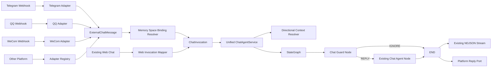
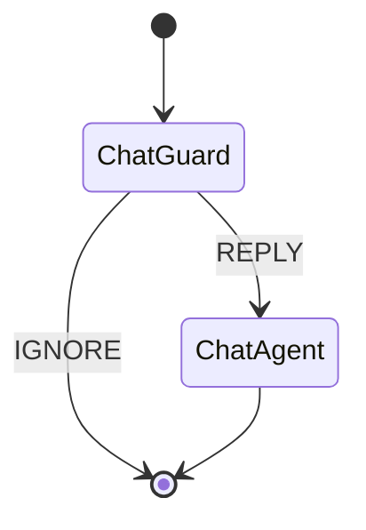
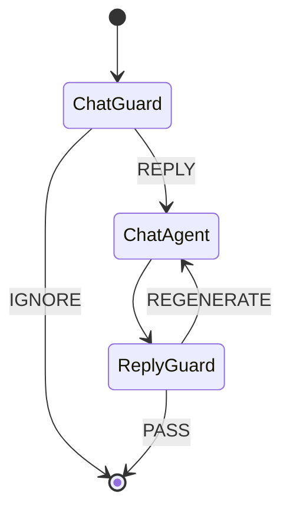

# External IM Chat Guard Agent Design

**日期:** 2026-07-20

**状态:** 已确认，等待用户复核正式文档

**目标:** 在不改变现有 Web Chat 对外行为的前提下，为 Telegram、QQ、WeCom
和后续其他外部 IM 平台提供统一接入层。所有请求进入同一个
`ChatAgentService` 和同一套 Agentic Flow；群聊先由 Chat Guard 判断是否回复，
需要回复时再进入现有 Chat Agent。外部 IM 的 Context 和 Memory 按
`memorySpaceId` 跨平台共享，Web 可以选择并读取一个 IM Memory Space，但 Web
产生的 Context 和 Memory 不得反向暴露给外部 IM。

---

## 1. 已确认决策

1. 不增加独立的 `ChannelChatService`，不增加另一套 Channel Chat 执行链。
2. Web、Telegram、QQ、WeCom 和其他外部入口最终都进入统一
   `ChatAgentService`。
3. 现有 Web Chat 的接口、默认 Context、流式响应、工具能力、SoulMD、Memory
   和审计行为保持不变。
4. CyberMario 自有 `im` 模块不接入本功能；本期只考虑外部 IM 系统。
5. Agentic Flow 第一版只有两个节点：
   - Chat Guard
   - Chat Agent
6. Web Chat 和外部 IM 都属于 `AGENT_CHAT`。调用来源和记忆隔离通过
   `ChatSource`、`MemoryDomain` 和 `memorySpaceId` 表达，不新增
   `CHANNEL_CHAT` Entry Type。
7. 外部 IM 使用显式 `memorySpaceId` 作为共享边界：
   - 绑定到同一 Space 的平台、机器人账号、群聊或私聊共享 IM Context 和
     Memory。
   - 未绑定到同一 Space 的会话完全隔离。
8. Context 共享方向固定为：
   - Web 可以读取 Web 私有 Context 和选中的 IM Shared Context。
   - 外部 IM 只能读取对应 IM Shared Context。
   - Web 写入永远不能进入 IM Shared Context。
9. 同一 IM Memory Space 内，Chat Agent 在群聊生成回复时仍可以看到私聊
   Context。本期不通过隐藏私聊 Memory 来防止泄露。
10. 后续增加生成后的 Reply Guard：审核候选回复，如果存在私聊信息泄露则重新
    生成。本期只记录演进方向并保留来源/受众元数据，不实现 Reply Guard 或重试
    环。
11. 后置 Reply Guard 上线前，群聊泄露私聊信息只能通过系统提示降低概率，无法
    提供强制安全保证。这是本期明确接受的剩余风险。
12. 外部人类群消息即使被 Chat Guard 判定为 `IGNORE`，仍作为 observation
    写入 IM Shared Context，供后续对话使用。
13. 外部 IM 第一版不启用现有默认工具。后续只能通过显式安全白名单开放工具。

---

## 2. 当前实现与调研结论

### 2.1 CyberMario 当前边界

当前 Web Chat 调用链为：

```text
ChatController
  -> ChatAgentService
  -> ReactAgentChatService
  -> AgentMemorySessionService
  -> AgentMemoryContextService
  -> AgentContextAssemblyService
  -> ReactAgent.stream(...)
```

关键现状：

- `ChatRequest` 当前包含 `message`、`threadId`、`sessionId` 和
  `memoryContextEnabled`。
- `ReactAgentChatService` 统一处理 Web 主 Chat 和 Agent Debug，但通过
  `AGENT_CHAT` / `AGENT_DEBUG` 区分运行行为。
- `AgentMemorySessionPo` 当前按 `sessionId` 和 `userId` 管理会话。
- `AgentMemoryMessagePo` 是可审计消息事实源。
- `AgentMemoryContextServiceImpl` 当前按 session 装配最近会话，并按 user
  读取一份 `USER_AGENT` 长期 Markdown Memory。
- `AgentContextAssemblyServiceImpl` 当前按 Safety、SoulMD、Long-term Memory
  和 Recent Turns 组装主 Agent Context。
- `AgentMemoryMessagesHook` 在模型调用前注入已经组装好的 Context。
- ReactAgent 使用 `RunnableConfig.threadId(...)` 隔离 Graph checkpoint。
- `memoryContextEnabled=false` 只关闭长期 Memory 注入，不关闭会话消息持久化
  或最近会话连续性。

本设计涉及的主要现有接点：

- `be/src/main/java/top/egon/mario/web/ChatController.java`
- `be/src/main/java/top/egon/mario/agent/service/ChatAgentService.java`
- `be/src/main/java/top/egon/mario/agent/service/impl/ReactAgentChatService.java`
- `be/src/main/java/top/egon/mario/agent/memory/service/impl/AgentMemoryContextServiceImpl.java`
- `be/src/main/java/top/egon/mario/agent/context/service/impl/AgentContextAssemblyServiceImpl.java`
- `be/src/main/java/top/egon/mario/agent/memory/hook/AgentMemoryMessagesHook.java`

### 2.2 Spring AI Alibaba Graph 取舍

项目当前使用的 Spring AI Alibaba Graph 已具备本需求所需的核心能力：

- `StateGraph` 定义节点和状态。
- Conditional Edge 根据 Guard 结果进入 Chat Agent 或结束。
- ReactAgent 可以作为 Graph 工作流中的 Agent 节点。
- Graph 支持流式执行和 `RunnableConfig.threadId`。

本设计使用一个最小 StateGraph，不引入多 Agent 协作、Supervisor、Planning、
并行分支、人工审批或其他工作流。

参考：

- [Spring AI Alibaba Graph Core](https://java2ai.com/docs/frameworks/graph-core/core/core-library/)
- [Spring AI Alibaba Agent Workflow](https://java2ai.com/en/docs/frameworks/agent-framework/advanced/workflow/)
- [Spring AI Alibaba Repository](https://github.com/alibaba/spring-ai-alibaba)

---

## 3. 范围

### 3.1 本期实现

- 外部 IM Adapter SPI 和 Telegram、QQ、WeCom 的适配边界。
- 可扩展的平台 Adapter Registry。
- 外部 IM Connector、Conversation 与 `memorySpaceId` 的绑定能力。
- Web 和外部 IM 共用的内部 `ChatInvocation`。
- 统一 ChatService 执行链。
- 两节点 StateGraph：Chat Guard -> Chat Agent / END。
- 群聊回复决策和 Guard 审计。
- 外部 IM 消息幂等、按 Memory Space 串行、最终回复投递。
- `WEB_PRIVATE` 和 `IM_SHARED` 两个 Memory Domain。
- Web 单向读取选中 IM Memory Space。
- IM Shared observation timeline 和 IM Shared 长期 Memory。
- 来源、会话类型和受众标签。
- 现有 Web Chat 的兼容性测试。

### 3.2 明确不实现

- CyberMario 自有 `im` 模块接入。
- 生成后的 Reply Guard。
- Reply Guard 审核失败后的重新生成。
- 私聊内容在群聊 Context 中的读取过滤。
- 新的 Web IM 或 Connector 管理页面。
- 图片、语音、视频、文件、表情卡片等非文本消息。
- 外部 IM 工具调用。
- 多 Agent、Supervisor、Planning、RAG 或其他 Graph 节点。
- 跨节点消息中间件或新的 MQ。
- 多节点分布式 Memory Space 调度；第一版先保证单实例正确性，并给多节点升级
  留下数据库协调边界。
- 启动项目或执行真实外部平台联调。

---

## 4. 核心模型

### 4.1 Chat Source

```java
enum ChatSource {
    WEB,
    EXTERNAL_IM
}
```

`ChatSource` 只表示调用来源，用于选择 Context、运行权限和输出方式，不创建第二
套 Chat 业务逻辑。

### 4.2 Memory Domain

```java
enum AgentMemoryDomain {
    WEB_PRIVATE,
    IM_SHARED
}
```

- `WEB_PRIVATE`：现有 Web session、`USER_AGENT` 长期 Memory 和 SoulMD。
- `IM_SHARED`：由一个 `memorySpaceId` 标识，包含绑定的所有外部 IM
  observation、Agent 回复和 IM 长期 Memory。

### 4.3 Memory Space

一个 Memory Space 是跨平台共享的逻辑 Context 容器，不等同于平台群号、QQ
账号、Telegram Chat ID 或 Web session。

逻辑键：

```text
memorySpaceId
ownerUserId
```

- `memorySpaceId` 是稳定、不可从平台 ID 推导的内部 ID。
- `ownerUserId` 是拥有该 Agent 和 Space 的 CyberMario 内部用户。
- 外部发送者不是 `ownerUserId`，也不能转换成 `RbacPrincipal`。
- 一个 Space 可以绑定多个平台 Connector 和多个外部 Conversation。
- 一个外部 Conversation 第一版只能绑定到一个有效 Space。

### 4.4 Conversation Audience

```java
enum ExternalConversationType {
    DIRECT,
    GROUP
}
```

每条 IM observation 必须保留：

- 来源平台。
- 来源 Conversation。
- `DIRECT` 或 `GROUP`。
- `audienceKey`。
- 外部发送者。

这些字段本期用于 Context 标签、审计和问题排查，后续用于 Reply Guard 判断回复
是否跨受众泄露信息。

---

## 5. 目标架构



分层职责：

| 层 | 职责 |
|---|---|
| External Adapter | 平台签名、事件解析、ACK、格式转换、回复格式和平台 API |
| Binding Resolver | 将平台 Connector / Conversation 绑定解析为 owner 和 Memory Space |
| Chat Invocation Mapper | 将 Web 或外部消息转换为统一内部命令 |
| ChatAgentService | 统一编排 Context、Graph、Memory、审计和错误处理 |
| Context Resolver | 按 Source 和 Memory Space 装配方向性 Context |
| Chat Guard Node | 判断当前请求是否需要回复 |
| Chat Agent Node | 复用现有 ReactAgent 执行生命周期 |
| Reply Port | 将最终文本发送到指定外部平台 |

---

## 6. Adapter 层设计

### 6.1 平台 Adapter 责任

每个平台 Adapter 只处理协议差异：

1. 校验平台签名、Token 或平台规定的鉴权信息。
2. 解析平台 Webhook / Event。
3. 识别事件 ID 和消息 ID。
4. 识别私聊、群聊、发送者、Bot/System 消息。
5. 识别明确 `@Agent` 和回复 Agent 消息。
6. 将平台文本转换为规范文本。
7. 按平台要求尽快返回 ACK。
8. 将最终 Agent 回复转换成平台支持的格式并发送。
9. 按平台文本上限拆分回复，但不得改变回复语义或重复调用 Chat Agent。

Adapter 不负责：

- Guard Prompt。
- Memory 查询。
- Agent Context 组装。
- Agent Runtime。
- 长期 Memory 提取。
- 跨平台共享策略。

### 6.2 规范化外部消息

```java
record ExternalChatMessage(
        String eventId,
        String messageId,
        ExternalChatPlatform platform,
        String connectorId,
        String conversationId,
        ExternalConversationType conversationType,
        String audienceKey,
        String senderId,
        String senderDisplayName,
        ExternalSenderType senderType,
        ExternalMessageType messageType,
        String text,
        boolean mentionedAgent,
        boolean repliedToAgentMessage,
        Instant occurredAt
) {}
```

第一版：

- `ExternalMessageType` 只支持 `TEXT`。
- `ExternalSenderType` 至少包含 `HUMAN`、`BOT`、`SYSTEM`。
- `audienceKey` 是稳定的受众标识，不要求可展示。
- Adapter 必须清理仅用于触发的 Agent mention，但保留自然语言正文。

以下内容不得进入 `ExternalChatMessage`：

- Bot Token、Secret、签名密钥。
- 原始 Authorization Header。
- 完整原始 Header。
- 完整原始 Webhook Payload。
- 平台 SDK 对象。
- 内部 `RbacPrincipal`。

必要的原始事件只允许在 Adapter 审计中以脱敏、限长形式保存。

### 6.3 Adapter SPI

建议拆成入站 Adapter 和出站 Port，避免平台接收逻辑与 ChatService 互相依赖：

```java
interface ExternalChatInboundAdapter {
    ExternalChatPlatform platform();
    ExternalChatMessage verifyAndNormalize(ExternalWebhookRequest request);
}

interface ExternalChatReplyPort {
    ExternalChatPlatform platform();
    ExternalReplyResult send(ExternalReplyCommand command);
}
```

使用 Strategy Registry 按 `ExternalChatPlatform` 解析对应实现。新增平台只新增
Adapter，不修改 Graph 或 ChatService 条件分支。

### 6.4 Connector 和 Conversation Binding

绑定键：

```text
platform
connectorId
conversationId
```

绑定结果：

```text
ownerUserId
memorySpaceId
conversationType
audienceKey
enabled
```

约束：

- 一个启用中的外部 Conversation 只能绑定一个 Space。
- 一个 Space 可以绑定多个 Conversation。
- Binding 中的 `conversationType` 必须和平台事件解析结果一致；不一致时拒绝
  处理并记录审计。
- 未绑定或已禁用的 Conversation 不调用 Guard 或 Chat Agent。
- Connector 凭证由平台配置层管理，不写入 Binding 或统一消息。

### 6.5 入站幂等和 ACK

入站幂等键：

```text
platform + connectorId + eventId
```

如果平台没有稳定 `eventId`，Adapter 使用平台规定的稳定消息键；不得使用当前
时间或随机 UUID 代替幂等键。

处理语义：

1. 验签。
2. 规范化。
3. 持久化幂等接收状态。
4. 返回平台 ACK。
5. 异步进入按 Memory Space 串行的 Chat 执行 lane。

第一版不引入 MQ，但 ACK 前必须完成持久化接收，避免 ACK 成功后进程异常导致
消息永久丢失。

---

## 7. 统一 ChatService 入口

### 7.1 内部命令

```java
record ChatInvocation(
        ChatSource source,
        String message,
        Long ownerUserId,
        String webSessionId,
        String memorySpaceId,
        ExternalChatPlatform platform,
        String connectorId,
        String conversationId,
        ExternalConversationType conversationType,
        String audienceKey,
        ExternalSender sender,
        boolean mentionedAgent,
        boolean repliedToAgentMessage,
        String eventId,
        String messageId,
        Instant occurredAt
) {}
```

约束：

- Web 请求必须有登录用户，`ownerUserId` 来自真实 `RbacPrincipal`。
- 外部 IM 的 `ownerUserId` 和 `memorySpaceId` 只能来自可信 Binding，不能来自
  Webhook 字段。
- Web 请求可以不传 `memorySpaceId`；此时行为与当前完全一致。
- Web 指定 `memorySpaceId` 时必须校验 Space 属于当前用户。
- 外部 IM 必须有 `memorySpaceId`。

### 7.2 保持 Web API 兼容

现有：

```java
Flux<ChatResponse> chat(ChatRequest request, RbacPrincipal principal);
```

继续保留。内部将 Web 请求映射为 `ChatInvocation`。

`ChatRequest` 只增加可选 `memorySpaceId`，并保留现有四参数 Java 构造兼容入口；
旧前端、旧 API 请求和现有测试不传该字段时行为不变。

不新增第二个 Web Chat 页面，不改变现有 NDJSON chunk 类型。

### 7.3 统一执行顺序

```text
validate invocation
  -> resolve memory view
  -> accept/persist current observation
  -> assemble prior context excluding current event
  -> run StateGraph
      -> Chat Guard
      -> Chat Agent or END
  -> persist assistant result when present
  -> finish audit
  -> return source-specific output
```

Web 和外部 IM 共享这一执行模板。差异由策略对象解析，不在 Controller 或
ChatService 中复制整段流程。

---

## 8. Context 和 Memory 设计

### 8.1 方向性读取矩阵

| 调用来源 | 短期 Context | 长期 Memory | SoulMD | 写入域 |
|---|---|---|---|---|
| Web，未选 Space | 当前 Web session | `USER_AGENT` | 现有 Web SoulMD | `WEB_PRIVATE` |
| Web，选择 Space | 当前 Web session + 选中 IM timeline | `USER_AGENT` + 对应 IM Shared Memory | 现有 Web SoulMD | 仅 `WEB_PRIVATE` |
| 外部 IM 私聊 | 对应 IM timeline | 对应 IM Shared Memory | 不注入 Web SoulMD | `IM_SHARED` |
| 外部 IM 群聊 | 对应 IM timeline，包括 Space 内私聊 | 对应 IM Shared Memory | 不注入 Web SoulMD | `IM_SHARED` |

禁止以下路径：

```text
WEB_PRIVATE -> EXTERNAL_IM
Web SoulMD -> EXTERNAL_IM
USER_AGENT Long-term Memory -> EXTERNAL_IM
Web session checkpoint -> EXTERNAL_IM
```

允许：

```text
IM_SHARED -> selected Web request
IM_SHARED -> any bound external IM request
```

### 8.2 读取投影，不复制消息

Web 选择 IM Space 时，由 Context Resolver 在请求时读取两个 Domain：

```text
WEB_PRIVATE + IM_SHARED(memorySpaceId)
```

不得：

- 把 IM 消息复制成 Web session 消息。
- 把 Web 消息同步到 IM session。
- 使用双写保持两个 session 一致。

这样避免重复消息、异步同步延迟、删除不一致和审计来源丢失。

### 8.3 IM Observation Timeline

现有 Web Recent Turns 是 user/assistant 成对的会话窗口，不足以表达“Agent
没有回复但已经观察到”的群消息。

IM Shared Context 需要新增 timeline projection，按时间顺序读取：

- Human observation。
- Agent 最终回复。
- 来源平台。
- `DIRECT` / `GROUP`。
- 受众和发送者标签。

示例：

```text
[Telegram][DIRECT][Alice]
用户：我的身份证号是……

[QQ][GROUP][开发群][Bob]
用户：大家看一下今晚的部署安排。

[Agent -> QQ][GROUP][开发群]
助手：……
```

当前事件已经写入接收记录时，Timeline 查询必须通过事件 ID 或顺序边界排除当前
事件；当前消息只作为本轮输入加入一次。

Timeline 使用独立的事件数量和 Token Budget，不无限注入整个 Space 历史。长期
稳定信息由 IM Shared Long-term Memory 承担。

### 8.4 私聊 Context 对群聊 Agent 可见

当当前请求来自群聊时，Chat Agent 仍读取同一个 Space 的私聊 Context。

注入时必须保留来源和受众标签，并增加系统级保密说明：

```text
以下 Context 可能来自不同外部会话和不同受众。
你可以使用私聊内容理解用户，但不得主动向群聊受众披露私聊中的身份信息、
联系方式、凭证、私密事实或其他仅面向原私聊受众的信息。
```

该提示不是强制数据隔离，也不能代替未来 Reply Guard。

### 8.5 Long-term Memory

现有 `USER_AGENT` 长期 Memory 保持不变。

新增逻辑范围：

```text
IM_SHARED(memorySpaceId)
```

逻辑唯一键：

```text
ownerUserId + scopeType + memorySpaceId
```

规则：

- 只有 `IM_SHARED` 消息可以提取或合并到对应 Space 的长期 Memory。
- 第一版只有成功完成的 `REPLY` turn 可以触发 IM Shared 长期提取。
- 被 Guard `IGNORE` 的 observation 保留在短期 Timeline，但不单独触发长期
  提取，避免普通群聊噪声直接固化为长期 Memory。
- Web 可以读取选中 Space 的 IM Shared Memory。
- Web 对话不能成为 IM Shared Memory 的提取来源。
- 外部 IM 不读取 `USER_AGENT`。
- IM Shared Memory 合并必须保存来源 session/event/message ID 和版本记录。

### 8.6 Checkpoint

```text
Web checkpoint threadId = existing memorySession.sessionId
IM checkpoint threadId  = __external_im__:{memorySpaceId}
```

- Web 和 IM 绝不共用 checkpoint。
- Web checkpoint key 保持当前实现不变，避免既有 Web session 在升级后丢失
  checkpoint 连续性。
- `__external_im__:` 是内部保留前缀；Web 请求不得创建使用该前缀的 session ID。
- 同一 IM Space 的不同平台和 Conversation 共用 IM checkpoint。
- Checkpoint 只承担 ReactAgent Graph 运行连续性。
- `agent_memory_message` / IM timeline 仍是审计和 Context 投影事实源。
- Context Resolver 不能只依赖 checkpoint 过滤来源，因为 checkpoint 内部状态可能
  绕过 Web -> IM 的可见性规则。

---

## 9. Agentic Flow

### 9.1 StateGraph



外层 StateGraph 第一版不配置额外 checkpoint。业务会话连续性继续由内部
ReactAgent checkpoint 和规范化 Memory 事实源承担。

建议 Graph State 只包含：

- `ChatInvocation`
- Context descriptor / prompt fragments
- Guard decision
- Guard reason
- Guard confidence
- Agent session / thread ID
- 最终状态或错误码

不得放入：

- Connector Token。
- 原始 Webhook。
- 完整 HTTP Header。
- 未脱敏平台凭证。

### 9.2 Chat Guard Node

硬规则优先于模型：

| 场景 | 决策 |
|---|---|
| Web Chat | `REPLY` |
| 外部 IM 私聊 | `REPLY` |
| 群聊明确 `@Agent` | `REPLY` |
| 群聊回复 Agent 消息 | `REPLY` |
| Bot/System/空消息/不支持类型 | `IGNORE`，且不进入 Agent Memory |
| 普通人类群消息 | 调用 Guard 模型 |

Guard 模型约束：

- 使用独立轻量模型配置。
- 无工具。
- 无长期 Memory。
- 不读取跨平台私聊 Context。
- 只接收当前消息、平台/群信息、触发信号和少量当前群聊窗口。
- 严格结构化输出。

输出：

```json
{
  "decision": "REPLY",
  "confidence": 0.92,
  "reason": "The group is asking the agent a direct technical question."
}
```

校验：

- `decision` 只能为 `REPLY` 或 `IGNORE`。
- `confidence` 必须在 `[0, 1]`。
- 普通群消息默认阈值为 `0.85`，配置化。
- 超时、异常、空输出、非法 JSON、未知 decision 或低于阈值时默认
  `IGNORE`。

Guard 决策必须记录 request ID、trace ID、Space、Conversation、decision、
confidence、reason、model 和 duration，但不记录凭证。

### 9.3 Chat Agent Node

Chat Agent Node 只在 Guard 返回 `REPLY` 时运行。

它必须复用现有 ReactAgent 生命周期：

- Runtime Spec 解析。
- Model 审计。
- Graph checkpoint。
- 流式 chunk。
- Memory 持久化。
- 运行审计。
- 错误处理。

为了避免第二套 Chat 逻辑，建议把当前 `ReactAgentChatService` 的私有执行核心提取
为可复用的 `AgentChatExecutor`。统一 ChatService 负责运行 Graph，
`ChatAgentNode` 只委托 `AgentChatExecutor`，不重新实现 ReactAgent。

不能直接用一个裸 `ReactAgent.asNode()` 替换当前服务生命周期，否则容易绕过现有
Memory、审计、错误处理和流式输出。

### 9.4 流式输出

- Web：继续返回当前 `Flux<ChatResponse>` NDJSON 流，不允许为了 Graph 编排而
  缓冲成单个最终字符串。
- 外部 IM：Reply Adapter 聚合最终 `message` 内容，只发送最终可见回复。
- `think`、Graph snapshot、tool event、内部错误和 Guard reason 不发送到外部
  平台。

实现计划必须先用 focused test 证明外层 Graph 能转发嵌套 Chat Agent 的流式
输出，再调整现有 ChatService；如果框架节点桥接不能保留 token stream，则使用
薄的 streaming node adapter，而不是改变 Web 对外协议。

---

## 10. Observation、回复和持久化

### 10.1 Human Observation

外部人类消息接收成功后，即使 Guard 最终 `IGNORE`，仍写入 `IM_SHARED`：

```text
received human message
  -> persist observation
  -> run Guard
      -> IGNORE: no assistant message
      -> REPLY: run Chat Agent and persist assistant reply
```

这样后续 `@Agent` 可以理解 Agent 没有参与回复的群内讨论。

### 10.2 不进入 Memory 的事件

- Agent 自己的回显。
- 其他 Bot 消息。
- System 消息。
- 空文本。
- 不支持的非文本消息。
- 已成功处理的重复事件。
- 验签失败事件。

这些事件可以进入脱敏接入审计，但不能污染 Agent Context。

### 10.3 失败消息

- Guard 失败：保留 Human observation，决策为 `IGNORE`，记录失败原因。
- Chat Agent 失败：保留 Human observation，按当前 Memory 失败语义记录
  Assistant failure，不作为长期 Memory 提取来源。
- 外部平台发送失败：不得重新运行 Chat Agent；使用同一候选回复和幂等键重试
  发送。

---

## 11. Runtime、工具和身份安全

### 11.1 Web

Web Chat 继续使用：

- 当前用户真实 `RbacPrincipal`。
- 当前默认 Runtime Spec。
- 当前工具配置。
- 当前 Web SoulMD。
- 当前 `USER_AGENT` Memory。

### 11.2 外部 IM

外部 IM 使用：

- Binding 对应的 `ownerUserId` 作为 Memory 所有者。
- 独立的内部 execution subject，不伪造外部发送者为 `RbacPrincipal`。
- 默认 Agent base prompt。
- 对应 IM Shared Context 和 Long-term Memory。
- 空工具集合。
- 不注入 Web SoulMD。
- 不触发现有 Web SoulMD 自动演化，避免外部群成员改变 Web 私有 Agent Identity。

外部群成员不能因为向 Agent 发消息而继承 Agent 所有者的 RBAC 权限或工具权限。

后续若开放工具，必须满足：

- 显式按 Memory Space 配置。
- 默认拒绝。
- 第一批只允许无副作用只读工具。
- 工具调用仍执行参数校验、审计和平台来源标记。
- 有副作用工具另行设计确认，不属于本期。

---

## 12. 并发和幂等

### 12.1 Memory Space 执行顺序

同一 Space 可能同时收到多个平台事件，必须按 `memorySpaceId` 串行：

```text
lane key = memorySpaceId
```

- 同一 Space：按接收顺序执行 Guard 和 Chat Agent。
- 不同 Space：允许并行。
- Web 私有 session：不进入 IM lane。

原因：

- 保证 Timeline 顺序。
- 保证 ReactAgent checkpoint 顺序。
- 避免当前 `nextTurnNo` 类逻辑并发竞争。
- 避免两个平台同时根据旧 Context 生成互相冲突的回复。

第一版单实例可以使用 keyed execution lane，但持久化状态必须能检测未完成事件。
多实例部署前必须升级为数据库锁、数据库任务领取或外部队列，不能假定 JVM 锁跨
实例生效。

### 12.2 幂等键

入站：

```text
platform + connectorId + eventId
```

出站：

```text
platform + connectorId + sourceMessageId + replyVersion
```

规则：

- 重复入站不重复写 observation、不重复运行 Guard、不重复调用 Chat Agent。
- 平台发送超时后允许查询或使用同一幂等键重试。
- 出站重试不增加 Memory turn。

---

## 13. 错误处理

| 错误 | 行为 |
|---|---|
| Webhook 验签失败 | Adapter 拒绝，不进入统一消息或 Memory |
| 消息格式非法 | ACK 策略按平台要求处理，记录脱敏错误，不调用 Agent |
| Binding 不存在/禁用 | 不调用 Guard/Agent，记录配置错误 |
| Space 不属于 owner | 拒绝执行并记录安全审计 |
| 重复事件 | 返回幂等成功，不重复处理 |
| Guard 超时/异常/非法输出 | 群聊 `IGNORE` |
| Chat Agent 失败 | Web 保持现有错误；外部群不发送内部错误详情 |
| 外部私聊 Chat 失败 | 可发送统一简短失败提示 |
| Reply Port 失败 | 有限重试发送，不重新生成 |
| Context 查询失败 | Fail closed；外部 IM 不降级读取 Web Memory |

任何降级都不能突破 `WEB_PRIVATE -> EXTERNAL_IM` 禁止边界。

---

## 14. 数据持久化设计

实现阶段通过恰好一个新的 Flyway migration 增量完成，不修改、重命名或格式化
任何已有 migration。执行前重新检查当前最新版本号。

### 14.1 建议新增表

#### `agent_memory_space`

- `id`
- `space_id`
- `owner_user_id`
- `name`
- `status`
- `created_at`
- `updated_at`
- `version`
- `deleted`

唯一约束：

```text
space_id
```

#### `agent_external_chat_binding`

- `id`
- `space_id`
- `platform`
- `connector_id`
- `external_conversation_id`
- `conversation_type`
- `audience_key`
- `enabled`
- 审计字段

唯一约束：

```text
platform + connector_id + external_conversation_id
```

#### `agent_external_chat_event`

用于 durable accept、幂等和处理状态：

- `id`
- `platform`
- `connector_id`
- `external_event_id`
- `external_message_id`
- `space_id`
- `owner_user_id`
- `normalized_message_json`
- `processing_status`
- `guard_decision`
- `reply_status`
- `assistant_message_id`
- `request_id`
- `trace_id`
- `received_at`
- `processed_at`
- `error_code`
- `error_message`
- `metadata_json`
- 审计字段

唯一约束：

```text
platform + connector_id + external_event_id
```

不保存 Token 或完整原始 Webhook。

`normalized_message_json` 只保存 `ExternalChatMessage` 的规范化安全字段和文本，不
保存 Header、Token 或平台原始 Payload。它用于 ACK 后进程异常时重新领取并恢复
处理；`assistant_message_id` 指向规范化 Memory 消息，Reply Port 重试从该消息
读取同一候选回复，不重新运行 Chat Agent。

### 14.2 建议扩展现有表

`agent_memory_session`：

- `memory_domain`
- `memory_space_id`，Web session 为 `NULL`

`agent_memory_message`：

- `memory_domain`
- `memory_space_id`
- `source_platform`
- `source_connector_id`
- `source_conversation_id`
- `source_conversation_type`
- `audience_key`
- `external_event_id`
- `external_message_id`
- `external_sender_id`
- `external_sender_display_name`
- `observed_only`

`agent_long_term_memory`：

- 新增 IM Shared scope。
- 新增可空 `memory_space_id`。
- 逻辑唯一键从 `userId + scopeType` 扩展为
  `userId + scopeType + memorySpaceId`。

具体索引表达需要在实现计划中同时验证 PostgreSQL 和项目测试使用的 H2 兼容性。

---

## 15. 设计模式决策

### 15.1 采用

**Adapter**

- 解决 Telegram、QQ、WeCom 等协议、鉴权和回复格式差异。
- ChatService 不依赖平台 SDK。

**Strategy Registry**

- 按 Platform 选择 Inbound Adapter 和 Reply Port。
- 新平台不修改现有平台分支。

**Policy / Specification**

- `ContextVisibilityPolicy` 根据 Source、Domain 和 Space 决定可读取 Context。
- `RuntimeAccessPolicy` 决定 SoulMD、Memory 和工具权限。
- 这些规则是明确变化点，直接散落 `if` 会增加泄露风险。

**StateGraph Conditional Edge**

- Guard 的 `REPLY` / `IGNORE` 正好对应条件边。
- 后续可以在不推翻当前 Flow 的情况下增加 Reply Guard。

### 15.2 不采用

- 不创建 `ChannelChatService` 子类。
- 不创建平台专用 Chat Agent。
- 不使用复杂责任链处理两个节点。
- 不增加 Supervisor 或多 Agent 框架。
- 不使用事件溯源或 CQRS。
- 不把现有 CyberMario IM Facade 复用于外部平台接入。

---

## 16. 未来 Reply Guard 扩展

未来 Graph：



未来 Reply Guard 输入至少包含：

- 候选回复。
- 当前平台、Conversation Type 和 Audience。
- 本轮读取的 Context 来源标签。
- 私聊来源标识。
- 已重试次数。

输出：

- `PASS`
- `REGENERATE`
- 最终无法安全生成时可扩展 `BLOCK`

必须设置最大重试次数，避免无限循环。重新生成时需要把 Guard 发现的问题作为安全
约束加入下一次生成，但不能把完整私聊内容发送到最终受众。

本期不会：

- 创建 Reply Guard Node。
- 增加 Reply Guard Model。
- 修改 Graph 为循环图。
- 增加候选回复审核表。
- 实现重新生成。

本期保存的平台、Conversation、Audience 和来源元数据是未来实现 Reply Guard 的
必要基础，同时也服务当前 Context 标签和审计，因此不是无用途的提前抽象。

---

## 17. 测试和验收

### 17.1 Web 回归

- 旧 `ChatRequest` 不传 `memorySpaceId` 时行为不变。
- Web NDJSON 流式 chunk 类型和顺序不变。
- Web 现有 session、SoulMD、长期 Memory 和工具行为不变。
- Web `memoryContextEnabled` 语义不变。

### 17.2 Context 隔离

- Web 未选择 Space 时不读取 IM Shared。
- Web 选择自己 Space 时读取 Web Private + IM Shared。
- Web 不能选择其他用户的 Space。
- 外部 IM 可以读取同一 Space 的跨平台 observation。
- 外部 IM 读取不到任何 Web session、`USER_AGENT` 或 Web SoulMD。
- 不同 Space 之间完全隔离。
- IM Shared extraction 不读取 Web 消息。

### 17.3 Guard

- Web 直接 `REPLY`。
- 外部私聊直接 `REPLY`。
- 群聊明确 mention 直接 `REPLY`。
- 群聊 reply-to-agent 直接 `REPLY`。
- 普通群消息按模型结构化决策。
- Guard 超时、异常、非法 JSON、低置信度均 `IGNORE`。
- Guard 不使用工具或长期 Memory。

### 17.4 Observation

- 被 `IGNORE` 的人类群消息仍进入 IM timeline。
- Bot/System/空消息/不支持类型不进入 Agent Memory。
- 当前事件不会在 Context 和当前输入中重复。
- observation 能保留平台、Conversation Type、Audience 和 Sender 标签。

### 17.5 幂等和顺序

- 重复 Webhook 只处理一次。
- 同一 Space 的跨平台并发按接收顺序执行。
- 不同 Space 可以并行。
- Reply Port 重试不重新运行 Chat Agent。
- 进程在 ACK 后异常时，durable event 可以重新领取。

### 17.6 Runtime 安全

- 外部 IM 工具集合为空。
- 外部发送者不会成为内部 `RbacPrincipal`。
- 外部错误响应不泄露堆栈、Prompt、Token 或内部工具信息。

### 17.7 明确不验收

- Reply Guard。
- 私聊泄露自动检测。
- 审核失败重新生成。
- CyberMario 自有 IM 接入。
- 真实 Telegram、QQ、WeCom 生产账号 E2E。

---

## 18. 完成标准

本设计对应的实现完成，需要同时满足：

1. 现有 Web Chat 回归通过。
2. 至少一个外部平台 Adapter 能通过统一契约测试；Telegram、QQ、WeCom 的平台
   特有实现可以按独立任务逐个交付，但不得改变统一契约。
3. 所有入口调用同一 ChatService 和同一 Guard -> Chat Agent Graph。
4. 普通群消息不会默认触发 Chat Agent 回复。
5. 同一 Memory Space 的外部平台共享 Context 和 Memory。
6. 外部 IM 无法读取 Web 私有 Context、长期 Memory、SoulMD 或 checkpoint。
7. Web 可以显式选择并读取自己拥有的 IM Memory Space。
8. 被忽略的人类群消息仍能成为后续 IM Context。
9. 外部 IM 不能调用现有默认工具。
10. 入站幂等和 Space 内顺序得到测试证明。
11. Reply Guard 被清晰记录为后续能力，没有混入本期实现。
12. 数据库变更只使用一个新的 Flyway migration，既有 migration 未修改。
